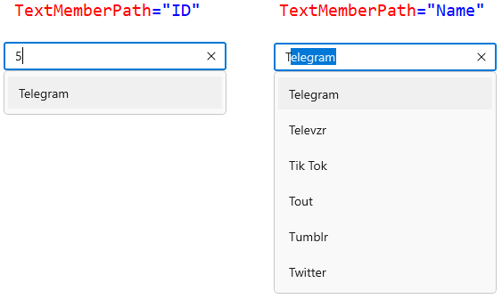
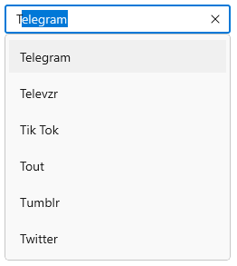
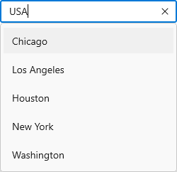
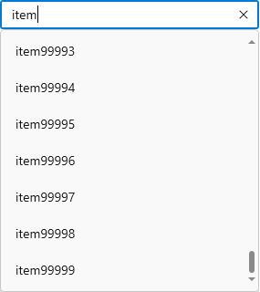

# Searching and Filtering in WinUI AutoComplete (SfAutoComplete)

The [AutoComplete](https://help.syncfusion.com/cr/winui/Syncfusion.UI.Xaml.Editors.SfAutoComplete.html) control provides rich text searching and filtering functionality.

## Searching based on member path

The `TextMemberPath` and `DisplayMemberPath` properties of AutoComplete control specify the property path, by which the searching must be done when a custom data is bound to the `ItemsSource` property.

[TextMemberPath](https://help.syncfusion.com/cr/winui/Syncfusion.UI.Xaml.Editors.SfDropDownListBase.html#Syncfusion_UI_Xaml_Editors_SfDropDownListBase_TextMemberPath) - Specifies the property path whose value is used to perform searching based on user input received in the selection box portion of the `AutoComplete` control. The default value is `string.Empty`. When `TextMemberPath` is `null` or `string.Empty`, searching will be performed based on `DisplayMemberPath`. 

[DisplayMemberPath](https://help.syncfusion.com/cr/winui/Syncfusion.UI.Xaml.Editors.SfDropDownListBase.html#Syncfusion_UI_Xaml_Editors_SfDropDownListBase_DisplayMemberPath) - Specifies the property path whose value is displayed as text in the drop-down. The default value is `string.Empty`.

N> `DisplayMemberPath` and `TextMemberPath` will be effective for the collection item that holds two or more properties in it.

N> When both the `TextMemberPath` and `DisplayMemberPath` properties have a `null` or `string.Empty` value, searching will be performed based on the class name with namespace of the item.

### Searching based on TextMemberPath

Searching will be performed based on the `TextMemberPath` property while entering the text into the selection box. If `TextMemberPath` is `null` or `string.Empty`, searching will be performed based on `DisplayMemberPath`. 




//Model.cs
public class SocialMedia
{
    public string Name { get; set; }
    public int ID { get; set; }
}

//ViewModel.cs
public class SocialMediaViewModel
{
    public ObservableCollection<SocialMedia> SocialMedias { get; set; }
    public SocialMediaViewModel()
    {
        this.SocialMedias = new ObservableCollection<SocialMedia>();
        this.SocialMedias.Add(new SocialMedia() { Name = "Facebook", ID = 0 });
        this.SocialMedias.Add(new SocialMedia() { Name = "Google Plus", ID = 1 });
        this.SocialMedias.Add(new SocialMedia() { Name = "Instagram", ID = 2 });
        this.SocialMedias.Add(new SocialMedia() { Name = "LinkedIn", ID = 3 });
        this.SocialMedias.Add(new SocialMedia() { Name = "Skype", ID = 4 });
        this.SocialMedias.Add(new SocialMedia() { Name = "Telegram", ID = 5 });
        this.SocialMedias.Add(new SocialMedia() { Name = "Televzr", ID = 6 });
        this.SocialMedias.Add(new SocialMedia() { Name = "Tik Tok", ID = 7 });
        this.SocialMedias.Add(new SocialMedia() { Name = "Tout", ID = 8 });
        this.SocialMedias.Add(new SocialMedia() { Name = "Tumblr", ID = 9 });
        this.SocialMedias.Add(new SocialMedia() { Name = "Twitter", ID = 10 });
        this.SocialMedias.Add(new SocialMedia() { Name = "Vimeo", ID = 11 });
        this.SocialMedias.Add(new SocialMedia() { Name = "WhatsApp", ID = 12 });
        this.SocialMedias.Add(new SocialMedia() { Name = "YouTube", ID = 13 });
    }
}







<editors:SfAutoComplete
    ItemsSource="{Binding SocialMedias}"
    TextMemberPath="ID"
    DisplayMemberPath="Name" 
    Width="250"
    x:Name="autoComplete"/>





autoComplete.TextMemberPath = "ID";




For e.g. After typing `5` in selection box.

### Searching based on DisplayMemberPath

Searching will be performed based on the `DisplayMemberPath` property while entering the text into the selection box when `TextMemberPath` is `null` or `string.Empty`. 




<editors:SfAutoComplete ItemsSource="{Binding SocialMedias}"
                        DisplayMemberPath="Name" />





autoComplete.DisplayMemberPath = "Name";




For e.g. After typing `T` in selection box, social medias which have starting letter `T` will be listed in dropdown.

N> `DisplayMemberPath` cannot be used when `ItemTemplate` is specified.

## Filtering Mode

The [TextSearchMode](https://help.syncfusion.com/cr/winui/Syncfusion.UI.Xaml.Editors.SfAutoComplete.html#Syncfusion_UI_Xaml_Editors_SfAutoComplete_SelectionMode) property of the `AutoComplete` can be used to regulate how the control behaves when it receives user input. The default text filtering type is `StartsWith`, ignoring accent and it is case insensitive. The available text filter modes are,

* StartsWith
* Contains

### Filter with beginning text

To filter the matching items based on the starting text, set the `TextSearchMode` property value is `StartWith`. The first item which fits the user input in the drop-down list, will be highlighted. 




<editors:SfAutoComplete 
    TextSearchMode="StartsWith"
    ItemsSource="{Binding SocialMedias}"
    DisplayMemberPath="Name"
    TextMemberPath="Name"
    Width="250"
    x:Name="autoComplete">
</editors:SfAutoComplete>





autoComplete.TextSearchMode = AutoCompleteTextSearchMode.StartsWith;




### Filter with contains text

To filter the matching items based on the containing specific text, set the `TextSearchMode` property value is `Contains`. The first item which fits the user input in the drop-down list, will be highlighted. 




<editors:SfAutoComplete 
    TextSearchMode="Contains"
    ItemsSource="{Binding SocialMedias}"
    DisplayMemberPath="Name"
    TextMemberPath="Name"
    Width="250"
    x:Name="autoComplete">
</editors:SfAutoComplete>





autoComplete.TextSearchMode = AutoCompleteTextSearchMode.Contains;




### Custom filtering

The `AutoComplete` control provides support to apply your own custom filter logic to suggests the items based on your filter criteria by using the [FilterBehavior](https://help.syncfusion.com/cr/winui/Syncfusion.UI.Xaml.Editors.SfAutoComplete.html#Syncfusion_UI_Xaml_Editors_SfAutoComplete_FilterBehavior) and [SearchBehavior](https://help.syncfusion.com/cr/winui/Syncfusion.UI.Xaml.Editors.SfAutoComplete.html#Syncfusion_UI_Xaml_Editors_SfAutoComplete_SearchBehavior) property. The default value of `FilterBehavior` and `SearchBehavior` is `null`. 

Now, let's create a custom filtering class to apply your filter logic to `AutoComplete` control by following steps.

**Step 1:** Create a class that derives from the [IAutoCompleteFilterBehavior](https://help.syncfusion.com/cr/winui/Syncfusion.UI.Xaml.Editors.AutoCompleteFilterBehavior.html) interface.




/// 

/// Represents a custom filtering behavior for `AutoComplete` control. 
/// 

public class CityFilteringBehavior : IAutoCompleteFilterBehavior
{

}




**Step 2:** Then, implement the [GetMatchingIndexes](https://help.syncfusion.com/cr/winui/Syncfusion.UI.Xaml.Editors.AutoCompleteFilterBehavior.html#Syncfusion_UI_Xaml_Editors_AutoCompleteFilterBehavior_GetMatchingItemsAsync_Syncfusion_UI_Xaml_Editors_SfAutoComplete_Syncfusion_UI_Xaml_Editors_AutoCompleteFilterInfo_) method of `IAutoCompleteFilterBehavior` interface to create your own suggestion list (containing the indices of the filtered items) based on the text entered in the `AutoComplete` control that needs to be shown in drop-down. The `GetMatchingIndexes` method contains following arguments.

* [source](https://help.syncfusion.com/cr/winui/Syncfusion.UI.Xaml.Editors.SfAutoComplete.html) - The owner of the filter behavior, which holds information about `ItemsSource`, `Items` properties, and so on.
* [filterInfo](https://help.syncfusion.com/cr/winui/Syncfusion.UI.Xaml.Editors.AutoCompleteFilterInfo.html) - Contains details about the text entered in `AutoComplete` control. Using this text, you can prepare suggestion list which gets displayed in drop down list. 

The following gif shows how to display cities in a drop-down based on the country name entered in the `AutoComplete` control.




public class CustomFilter : IAutoCompleteFilterBehavior
{
    public async Task<object> GetMatchingItemsAsync(SfAutoComplete source, AutoCompleteFilterInfo filterInfo)
    {
         IEnumerable itemssource = source.ItemsSource as IEnumerable;
         var filteredItems = (from CityInfo item in itemssource
                                 where item.CountryName.StartsWith(filterInfo.Text, StringComparison.CurrentCultureIgnoreCase) ||
                                       item.CityName.StartsWith(filterInfo.Text, StringComparison.CurrentCultureIgnoreCase)
                                 select item);
         return await Task.FromResult(filteredItems);  
    }
}




**Step 3:** Applying custom filtering to the `AutoComplete` control by using the `FilterBehavior` property.




<editors:SfAutoComplete 
    TextMemberPath="CityName"
    DisplayMemberPath="CityName"
    ItemsSource="{Binding Cities}">
    <editors:SfAutoComplete.FilterBehavior>
        <local:CityFilteringBehavior/>
    </editors:SfAutoComplete.FilterBehavior>
</editors:SfAutoComplete>




The following gif demonstrates displaying the cities in drop-down based on the country name entered in the `AutoComplete` control.

### Choose default item to select

When searching, the first item in the drop-down will be highlighted by default. Using the [SearchBehavior](https://help.syncfusion.com/cr/winui/Syncfusion.UI.Xaml.Editors.SfAutoComplete.html#Syncfusion_UI_Xaml_Editors_SfAutoComplete_SearchBehavior) property, you can customize the default highlighting behavior by using your custom selection logic to select the items based on your search criteria. The default value of `SearchBehavior` is `null`. 

**Step 1:** Create a class that derives from the [IAutoCompleteSearchBehavior](https://help.syncfusion.com/cr/winui/Syncfusion.UI.Xaml.Editors.AutoCompleteSearchBehavior.html) interface.




/// 

/// Represents a custom searching behavior for `AutoComplete` control. 
/// 

public class CapitalCitySearchingBehavior : IAutoCompleteSearchBehavior
{

}




**Step 2:** Then, implement the [GetHighlightIndex](https://help.syncfusion.com/cr/winui/Syncfusion.UI.Xaml.Editors.AutoCompleteSearchBehavior.html#Syncfusion_UI_Xaml_Editors_AutoCompleteSearchBehavior_GetHighlightIndex_Syncfusion_UI_Xaml_Editors_SfAutoComplete_Syncfusion_UI_Xaml_Editors_AutoCompleteSearchInfo_) method of the `IAutoCompleteSearchBehavior` interface to initially select any item from the filtered list in the `AutoComplete` control drop-down. The `GetHighlightIndex` method contains the following arguments.

* [source](https://help.syncfusion.com/cr/winui/Syncfusion.UI.Xaml.Editors.SfAutoComplete.html) - The owner of the search behavior, which holds information about `ItemsSource`, `Items` properties, and so on.
* [searchInfo](https://help.syncfusion.com/cr/winui/Syncfusion.UI.Xaml.Editors.AutoCompleteSearchInfo.html) - Contains details about the filtered items based on the text entered in `AutoComplete` control. Using this list, you can selected item which is displayed in drop down list. 

The following code demonstrates initially which item to be selected from the filtered list of drop-down in the `AutoComplete` control. Here, the capital cities will be selected while entering its country name.




public class CapitalCitySearchingBehavior : IAutoCompleteSearchBehavior
{
    public int GetHighlightIndex(SfAutoComplete source, AutoCompleteSearchInfo searchInfo)
    {
         var filteredCapitals = from CityInfo cityInfo in searchInfo.FilteredItems
                where cityInfo.IsCapital
                select searchInfo.FilteredItems.IndexOf(cityInfo);
            if (filteredCapitals.Count() > 0)
                return filteredCapitals.FirstOrDefault();

            return 0;
    }
}




**Step 3:** Applying custom searching to `AutoComplete` control by using the `SearchBehavior` property. 




<editors:SfAutoComplete 
    TextMemberPath="CityName"
    DisplayMemberPath="CityName"
    ItemsSource="{Binding Cities}">    
    <editors:SfAutoComplete.SearchBehavior>
        <local:CapitalCitySearchingBehavior/>
    </editors:SfAutoComplete.SearchBehavior>
    <editors:SfAutoComplete.FilterBehavior>
        <local:CityFilteringBehavior/>
    </editors:SfAutoComplete.FilterBehavior>
</editors:SfAutoComplete>




The following gif demonstrates selecting the capital city in the drop-down based on the country name entered in the `AutoComplete` control.

## Load asynchronous items

Load the data dynamically at runtime based on typed input. This dynamic loading can be done while performing custom filtering using `CustomFilter` property.

`GetMatchingItemsAsync` method of `IAutoCompleteFilterBehavior` helps to perform filtering operation on different threads without blocking the current thread by using `await Task.Run()`.

**Step 1:** Create a class that derives from the `IAutoCompleteFilterBehavior` interface and add your custom filter logic in `GetMatchingItemsAsync` method to load the run time items based on typed input.




public class CustomAsyncFilter : IAutoCompleteFilterBehavior
{
    /// 

    /// Gets the cancellation token source.
    /// 

    CancellationTokenSource cancellationTokenSource;

    public async Task<object> GetMatchingItemsAsync(SfAutoComplete source, AutoCompleteFilterInfo filterInfo)
    {
        if (this.cancellationTokenSource != null)
        {
            this.cancellationTokenSource.Cancel();
            this.cancellationTokenSource.Dispose();
        }

        this.cancellationTokenSource = new CancellationTokenSource();
        CancellationToken token = this.cancellationTokenSource.Token;

        return await Task.Run(() =>
        {
            List<string> list = new List<string>();
            for (int i = 0; i < 100000; i++)
            {
                list.Add(filterInfo.Text + i);
            }

            return list;
        }, token);
    }
}




**Step 2:** Applying `CustomAsyncFilter` to `AutoComplete` control by using the `FilterBehavior` property. 




<editors:SfAutoComplete
    TextSearchMode="Contains"
    SelectionMode="Multiple"
    x:Name="autoComplete">
    <editors:SfAutoComplete.FilterBehavior>
        <local:CustomAsyncFilter/>
    </editors:SfAutoComplete.FilterBehavior>
</editors:SfAutoComplete>




The image below shows 1 lakh of data being loaded asynchronously in a drop-down at runtime based on typed input.

