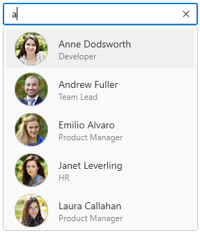
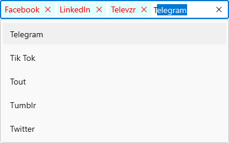
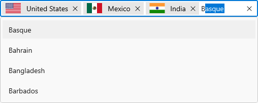
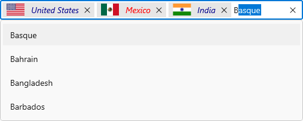

# UI Customization in WinUI AutoComplete (SfAutoComplete)

This section explains different UI customization available in the [AutoComplete](https://help.syncfusion.com/cr/winui/Syncfusion.UI.Xaml.Editors.SfAutoComplete.html) control.

## Header for AutoComplete

The `AutoComplete` control header can be changed by using the [Header](https://help.syncfusion.com/cr/winui/Syncfusion.UI.Xaml.Editors.DropDownListBase.html#Syncfusion_UI_Xaml_Editors_DropDownListBase_Header) or [HeaderTemplate](https://help.syncfusion.com/cr/winui/Syncfusion.UI.Xaml.Editors.DropDownListBase.html#Syncfusion_UI_Xaml_Editors_DropDownListBase_HeaderTemplate) properties. The default value of `HeaderTemplate` is `null` and `Header` is `null`.




<editors:SfAutoComplete
    Header="Favourite Social Media"
    ItemsSource="{Binding SocialMedias}"
    DisplayMemberPath="Name"
    TextMemberPath="Name"
    Width="250"
    x:Name="autoComplete">
    <editors:SfAutoComplete.HeaderTemplate>
        <DataTemplate>
            <TextBlock
                Foreground="Red"
                FontWeight="SemiBold"
                FontSize="16"
                Text="{Binding}" />
        </DataTemplate>
    </editors:SfAutoComplete.HeaderTemplate>
</editors:SfAutoComplete>




autoComplete.Header = "Favourite Social Media";




## Description for AutoComplete

The `AutoComplete` control description can be changed by using the [Description](https://help.syncfusion.com/cr/winui/Syncfusion.UI.Xaml.Editors.DropDownListBase.html#Syncfusion_UI_Xaml_Editors_DropDownListBase_Description) property. The default value of `Description` is `null`.




<editors:SfAutoComplete
    Description="This will be added to your profile."
    Header="Favourite Social Media"
    ItemsSource="{Binding SocialMedias}"
    DisplayMemberPath="Name"
    TextMemberPath="Name"
    Width="250"
    x:Name="autoComplete"/>




autoComplete.Description = "This will be added to your profile.";
autoComplete.Header = "Favourite Social Media";




## Placeholder text

You can prompt the user with any information by using the [PlaceholderText](https://help.syncfusion.com/cr/winui/Syncfusion.UI.Xaml.Editors.DropDownListBase.html#Syncfusion_UI_Xaml_Editors_DropDownListBase_PlaceholderText) property. This text will be displayed only when no item is selected or edit text is empty. The default value of `PlaceholderText` property is `string.Empty` (No string will be displayed).




<editors:SfAutoComplete
    PlaceholderText="Select a social media"
    ItemsSource="{Binding SocialMedias}"
    DisplayMemberPath="Name"
    TextMemberPath="Name"
    Width="250"
    x:Name="autoComplete"/>




autoComplete.PlaceholderText = "Select a social media";




### Change foreground of placeholder text

The placeholder texts’ foreground can be changed by using the [PlaceholderForeground](https://help.syncfusion.com/cr/winui/Syncfusion.UI.Xaml.Editors.DropDownListBase.html#Syncfusion_UI_Xaml_Editors_DropDownListBase_PlaceholderForeground) property. The default value of `PlaceholderForeground` property is `null`.




<editors:SfAutoComplete
    PlaceholderForeground="Red"
    PlaceholderText="Select a social media"
    ItemsSource="{Binding SocialMedias}"
    DisplayMemberPath="Name"
    TextMemberPath="Name"
    Width="250"
    x:Name="autoComplete"/>




autoComplete.PlaceholderForeground = new SolidColorBrush(Colors.Red);




## Customize the editing TextBox

The appearance of the editing textbox in `AutoComplete` control can be customized by using the [TextBoxStyle](https://help.syncfusion.com/cr/winui/Syncfusion.UI.Xaml.Editors.DropDownListBase.html#Syncfusion_UI_Xaml_Editors_DropDownListBase_TextBoxStyle) property. The default value of `TextBoxStyle` is `null`.

N> `TextBoxStyle` will only have an effect in single selection mode.




<editors:SfAutoComplete
    SelectionMode="Single"
    ItemsSource="{Binding SocialMedias}"
    DisplayMemberPath="Name"
    TextMemberPath="Name"
    ShowClearButton="False"    
    Width="250"
    x:Name="autoComplete">
   <editors:SfAutoComplete.TextBoxStyle>
        
    </editors:SfAutoComplete.TextBoxStyle>
</editors:SfAutoComplete>




## Customize the Dropdown (suggestion) item 

The [ItemTemplate](https://help.syncfusion.com/cr/winui/Syncfusion.UI.Xaml.Editors.DropDownListBase.html#Syncfusion_UI_Xaml_Editors_DropDownListBase_ItemTemplate) property helps you to decorate drop-down items using the custom templates. The default value of `ItemTemplate` is `null`. The following example shows how to customize drop-down items using templates.




//Model.cs
public class Employee
{
    public string Name { get; set; }
    public BitmapImage ProfilePicture { get; set; }
    public string Designation { get; set; }
}

//ViewModel.cs
public class EmployeeViewModel
{
    public ObservableCollection<Employee> Employees { get; set; }
    public EmployeeViewModel()
    {
        this.Employees = new ObservableCollection<Employee>();
        this.Employees.Add(new Employee
        {
            Name = "Anne Dodsworth",
            ProfilePicture = new BitmapImage(new Uri(@"ms-appx:///Assets/AutoComplete/Employees/Employee1.png", UriKind.RelativeOrAbsolute)),
            Designation= "Developer",
            ID="E001",
            Country= "USA",
        });
        this.Employees.Add(new Employee
        {
            Name = "Andrew Fuller",
            ProfilePicture = new BitmapImage(new Uri(@"ms-appx:///Assets/AutoComplete/Employees/Employee7.png", UriKind.RelativeOrAbsolute)),
            Designation = "Team Lead",
            ID = "E002",
            Country = "England",
        });
        this.Employees.Add(new Employee
        {
            Name = "Emilio Alvaro",
            ProfilePicture = new BitmapImage(new Uri(@"ms-appx:///Assets/AutoComplete/Employees/Employee5.png", UriKind.RelativeOrAbsolute)),
            Designation = "Product Manager",
            ID = "E003",
            Country = "England",
        });
        this.Employees.Add(new Employee
        {
            Name = "Janet Leverling",
            ProfilePicture = new BitmapImage(new Uri(@"ms-appx:///Assets/AutoComplete/Employees/Employee3.png", UriKind.RelativeOrAbsolute)),
            Designation = "HR",
            ID = "E004",
            Country = "USA",
        });
        this.Employees.Add(new Employee
        {
            Name = "Laura Callahan",
            ProfilePicture = new BitmapImage(new Uri(@"ms-appx:///Assets/AutoComplete/Employees/Employee2.png", UriKind.RelativeOrAbsolute)),
            Designation = "Product Manager",
            ID = "E005",
            Country = "USA",
        });
        this.Employees.Add(new Employee
        {
            Name = "Margaret Peacock",
            ProfilePicture = new BitmapImage(new Uri(@"ms-appx:///Assets/AutoComplete/Employees/Employee6.png", UriKind.RelativeOrAbsolute)),
            Designation = "Developer",
            ID = "E006",
            Country = "USA",
        });
        this.Employees.Add(new Employee
        {
            Name = "Michael Suyama",
            ProfilePicture = new BitmapImage(new Uri(@"ms-appx:///Assets/AutoComplete/Employees/Employee9.png", UriKind.RelativeOrAbsolute)),
            Designation = "Team Lead",
            ID = "E007",
            Country = "USA",
        });
        this.Employees.Add(new Employee
        {
            Name = "Nancy Davolio",
            ProfilePicture = new BitmapImage(new Uri(@"ms-appx:///Assets/AutoComplete/Employees/Employee4.png", UriKind.RelativeOrAbsolute)),
            Designation = "Developer",
            ID = "E008",
            Country = "USA",
        });
        this.Employees.Add(new Employee
        {
            Name = "Robert King",
            ProfilePicture = new BitmapImage(new Uri(@"ms-appx:///Assets/AutoComplete/Employees/Employee8.png", UriKind.RelativeOrAbsolute)),
            Designation = "Developer",
            ID = "E009",
            Country = "England",
        });
        this.Employees.Add(new Employee
        {
            Name = "Steven Buchanan",
            ProfilePicture = new BitmapImage(new Uri(@"ms-appx:///Assets/AutoComplete/Employees/Employee10.png", UriKind.RelativeOrAbsolute)),
            Designation = "CEO",
            ID = "E010",
            Country = "England",
        });
    }
}







<editors:SfAutoComplete
    TextMemberPath="Name"
    DisplayMemberPath="Name"
    ItemsSource="{Binding Employees}"
    Width="250"
    x:Name="autoComplete">
    <editors:SfAutoComplete.DataContext>
        <local:EmployeeViewModel/>
    </editors:SfAutoComplete.DataContext>
    <editors:SfAutoComplete.ItemTemplate>
        <DataTemplate>
            <Grid
                Margin="0,5"
                HorizontalAlignment="Stretch"
                VerticalAlignment="Stretch">
                <Grid.ColumnDefinitions>
                    <ColumnDefinition Width="48"/>
                    <ColumnDefinition Width="*"/>
                </Grid.ColumnDefinitions>
                <Image 
                    Grid.Column="0"
                    HorizontalAlignment="Center"
                    VerticalAlignment="Center" 
                    Source="{Binding ProfilePicture}" 
                    Stretch="Uniform"/>
                <StackPanel
                    Grid.Column="1"
                    Margin="15,0,0,0"
                    HorizontalAlignment="Left"
                    VerticalAlignment="Center">
                    <TextBlock 
                        Opacity="0.87"
                        FontSize="14"
                        Text="{Binding Name}"/>
                    <TextBlock 
                        Opacity="0.54"
                        FontSize="12"
                        Text="{Binding Designation}"/>
                </StackPanel>
            </Grid>
        </DataTemplate>
    </editors:SfAutoComplete.ItemTemplate>
</editors:SfAutoComplete>




### Customize Dropdown (suggestion) items based on condition

The [ItemTemplateSelector](https://help.syncfusion.com/cr/winui/Syncfusion.UI.Xaml.Editors.DropDownListBase.html#Syncfusion_UI_Xaml_Editors_DropDownListBase_ItemTemplateSelector) property helps you to decorate drop-down items conditionally based on its content using the custom templates. The default value of `ItemTemplateSelector` is `null`.




public class EmployeeTemplateSelector : DataTemplateSelector
{
    public DataTemplate EmployeeTemplate1 { get; set; }
    public DataTemplate EmployeeTemplate2 { get; set; }
    
    protected override DataTemplate SelectTemplateCore(object item, DependencyObject container)
    {
        var employeeName = (item as Employee).Name;
        if (employeeName.ToString() == "Anne Dodsworth" || employeeName.ToString() == "Emilia Alvaro" ||
            employeeName.ToString() == "Laura Callahan")
        {
            return EmployeeTemplate1;
        }
        else
        {
            return EmployeeTemplate2;
        }
    }
}







<Grid>
    <Grid.Resources>
        <DataTemplate x:Key="employeeTemplate1">
            <Grid Margin="0,5">
                <Grid.ColumnDefinitions>
                    <ColumnDefinition Width="48"/>
                    <ColumnDefinition Width="*"/>
                </Grid.ColumnDefinitions>
                <Image 
                    Grid.Column="0"
                    Source="{Binding ProfilePicture}" 
                    Stretch="Uniform"/>
                <StackPanel
                    Grid.Column="1"
                    Margin="15,0,0,0">
                    <TextBlock 
                        Foreground="Blue"
                        Opacity="0.87"
                        FontSize="14"
                        Text="{Binding Name}"/>
                    <TextBlock 
                        Foreground="Coral"
                        Opacity="0.54"
                        FontSize="12"
                        Text="{Binding Designation}"/>
                </StackPanel>
            </Grid>
        </DataTemplate>
        
        <DataTemplate x:Key="employeeTemplate2">
            <Grid Margin="0,5">
                <Grid.ColumnDefinitions>
                    <ColumnDefinition Width="48"/>
                    <ColumnDefinition Width="*"/>
                </Grid.ColumnDefinitions>
                <Image 
                    Grid.Column="0" 
                    Source="{Binding ProfilePicture}" 
                    Stretch="Uniform"/>
                <StackPanel
                    Grid.Column="1"
                    Margin="15,0,0,0">
                    <TextBlock
                        Foreground="Red"
                        Opacity="0.87"
                        FontSize="14"
                        Text="{Binding Name}"/>
                    <TextBlock 
                        Foreground="Green"
                        Opacity="0.54"
                        FontSize="12"
                        Text="{Binding Designation}"/>
                </StackPanel>
            </Grid>
        </DataTemplate>

        <local:EmployeeTemplateSelector
            x:Key="employeeTemplateSelector"
            EmployeeTemplate1="{StaticResource employeeTemplate1}"
            EmployeeTemplate2="{StaticResource employeeTemplate2}"/>
    </Grid.Resources>
    
    <editors:SfAutoComplete 
        TextMemberPath="Name"
        ItemsSource="{Binding Employees}"
        ItemTemplateSelector="{StaticResource employeeTemplateSelector}"        
        Width="250" 
        x:Name="autoComplete">
        <editors:SfAutoComplete.DataContext>
            <local:EmployeeViewModel/>
        </editors:SfAutoComplete.DataContext>
    </editors:SfAutoComplete>
</Grid>




## Styling AutoCompleteTokenItem

The `AutoComplete` control allows you to customize the style of [AutoCompleteTokenItem](https://help.syncfusion.com/cr/winui/Syncfusion.UI.Xaml.Editors.AutoCompleteTokenItem.html), generated in selection area by using the `TokenItemStyle` property. The default value of [TokenItemStyle](https://help.syncfusion.com/cr/winui/Syncfusion.UI.Xaml.Editors.DropDownListBase.html#Syncfusion_UI_Xaml_Editors_DropDownListBase_TokenItemStyle) is `null`. 




<editors:SfAutoComplete 
    SelectionMode="Multiple"
    ItemsSource="{Binding SocialMedias}"
    DisplayMemberPath="Name"
    TextMemberPath="Name">
    <editors:SfAutoComplete.TokenItemStyle>
        
    </editors:SfAutoComplete.TokenItemStyle>
</editors:SfAutoComplete>




### Style AutoCompleteTokenItem based on condition   

The `AutoComplete` control allows you to customize the style of `AutoCompleteTokenItem` conditionally based on its content by using the [TokenItemStyleSelector](https://help.syncfusion.com/cr/winui/Syncfusion.UI.Xaml.Editors.DropDownListBase.html#Syncfusion_UI_Xaml_Editors_DropDownListBase_TokenItemStyleSelector) property. The default value of `TokenItemStyleSelector` is `null`. 




public class SocialMediaStyleSelector : StyleSelector
{
    public Style MediaStyle1 { get; set; }
    public Style MediaStyle2 { get; set; }
    public Style DefaultStyle { get; set; }
    protected override Style SelectStyleCore(object item, DependencyObject container)
    {
        if (item is SocialMedia)
        {
            var mediaItem = (item as SocialMedia).Name;
            if (mediaItem.ToString() == "Facebook" || mediaItem.ToString() == "Instagram" ||
                mediaItem.ToString() == "Twitter" || mediaItem.ToString() == "WhatsApp" ||
                mediaItem.ToString() == "Skype")
            {
                return MediaStyle1;
            }
            else
            {
                return MediaStyle2;
            }
        }
        return DefaultStyle;
    }
}







<Grid>
    <Grid.Resources>
        
        
        <local:SocialMediaStyleSelector 
            x:Key="socialMediaStyleSelector" 
            MediaStyle1="{StaticResource MediaStyle1}"
            MediaStyle2="{StaticResource MediaStyle2}"/>
    </Grid.Resources>
    <editors:SfAutoComplete 
        SelectionMode="Multiple"
        ItemsSource="{Binding SocialMedias}"
        TokenItemStyleSelector="{StaticResource socialMediaStyleSelector}"
        DisplayMemberPath="Name"
        TextMemberPath="Name" />
</Grid>




## Customize AutoCompleteTokenItem 

The [TokenItemTemplate](https://help.syncfusion.com/cr/winui/Syncfusion.UI.Xaml.Editors.DropDownListBase.html#Syncfusion_UI_Xaml_Editors_DropDownListBase_TokenItemTemplate) property helps you to decorate token items using the custom templates. The default value of `TokenItemTemplate` is `null`. The following example shows how to add image or custom control in token items using templates.




//Model.cs
public class CountryInfo
{
    public string CountryName { get; set; }
    public BitmapImage FlagImage { get; set; }
}

//ViewModel.cs
public class CountryViewModel
{
    public ObservableCollection<CountryInfo> Countries { get; set; }
    public EmployeeViewModel()
    {
        this.Countries = new ObservableCollection<CountryInfo>();
        this.Countries.Add(new CountryInfo
        {
            FlagImage = new BitmapImage(new Uri(@"ms-appx:///Flags/UnitedStates.png", UriKind.RelativeOrAbsolute)),
            CountryName = "United States"
        });       

        this.Countries.Add(new CountryInfo
        {
            FlagImage = new BitmapImage(new Uri(@"ms-appx:///Flags/turkey.png", UriKind.RelativeOrAbsolute)),
            CountryName = "Turkey"
        });

        this.Countries.Add(new CountryInfo
        {
            FlagImage = new BitmapImage(new Uri(@"ms-appx:///Flags/Mexico.png", UriKind.RelativeOrAbsolute)),
            CountryName = "Mexico"
        });

        this.Countries.Add(new CountryInfo
        {
            FlagImage = new BitmapImage(new Uri(@"ms-appx:///Flags/Basque.png", UriKind.RelativeOrAbsolute)),
            CountryName = "Basque"
        });

        this.Countries.Add(new CountryInfo
        {
            FlagImage = new BitmapImage(new Uri(@"ms-appx:///Flags/India.png", UriKind.RelativeOrAbsolute)),
            CountryName = "India"
        });

        this.Countries.Add(new CountryInfo
        {
            FlagImage = new BitmapImage(new Uri(@"ms-appx:///Flags/Portugal.png", UriKind.RelativeOrAbsolute)),
            CountryName = "Portugal"
        });

        this.Countries.Add(new CountryInfo
        {
            FlagImage = new BitmapImage(new Uri(@"ms-appx:///Flags/UnitedKingdom.png", UriKind.RelativeOrAbsolute)),
            CountryName = "United Kingdom"
        });

        this.Countries.Add(new CountryInfo
        {
            FlagImage = new BitmapImage(new Uri(@"ms-appx:///Flags/france.png", UriKind.RelativeOrAbsolute)),
            CountryName = "France"
        });
    }
}







<editors:SfAutoComplete 
    SelectionMode="Multiple"
    PlaceholderText="Select countries"
    DisplayMemberPath="CountryName"
    ItemsSource="{Binding Countries}">
    <editors:SfAutoComplete.DataContext>
        <local:CountryViewModel/>
    </editors:SfAutoComplete.DataContext>
    <editors:SfAutoComplete.TokenItemTemplate>
        <DataTemplate>
            <Grid HorizontalAlignment="Center"
                  VerticalAlignment="Center">
                <Grid.ColumnDefinitions>
                    <ColumnDefinition Width="auto"/>
                    <ColumnDefinition Width="*"/>
                </Grid.ColumnDefinitions>
                <Image 
                    Grid.Column="0"    
                    HorizontalAlignment="Center"
                    VerticalAlignment="Center" 
                    Source="{Binding FlagImage}" 
                    Width="36" Height="20"
                    Stretch="Uniform"/>

                <TextBlock  
                    Margin="8,0,0,0"
                    Grid.Column="1" 
                    TextAlignment="Center"
                    HorizontalAlignment="Left"
                    VerticalAlignment="Center" 
                    Text="{Binding CountryName}"/>
                </Grid>
            </DataTemplate>
        </editors:SfAutoComplete.TokenItemTemplate>
</editors:SfAutoComplete>




### Customize AutoCompleteTokenItem based on condition

The [TokenItemTemplateSelector](https://help.syncfusion.com/cr/winui/Syncfusion.UI.Xaml.Editors.DropDownListBase.html#Syncfusion_UI_Xaml_Editors_DropDownListBase_TokenItemTemplateSelector) property helps you to decorate token items conditionally based on its content using the custom templates. The default value of `TokenItemTemplateSelector` is `null`.




public class CountryTemplateSelector : DataTemplateSelector
{
    public DataTemplate CountryTemplate1 { get; set; }
    public DataTemplate CountryTemplate2 { get; set; }
    
    protected override DataTemplate SelectTemplateCore(object item, DependencyObject container)
    {
        var countryName = (item as CountryInfo).CountryName;
        if (countryName.ToString() == "United States" || countryName.ToString() == "Basque" ||
            countryName.ToString() == "India" || countryName.ToString() == "United Kingdom")
        {
            return CountryTemplate1;
        }
        else
        {
            return CountryTemplate2;
        }
    }
}







<Grid>
    <Grid.DataContext>
        <local:CountryViewModel/>
    </Grid.DataContext> 
    <Grid.Resources>
        <DataTemplate x:Key="countryTemplate1">
            <Grid HorizontalAlignment="Center"
                  VerticalAlignment="Center">
                <Grid.ColumnDefinitions>
                    <ColumnDefinition Width="auto"/>
                    <ColumnDefinition Width="*"/>
                </Grid.ColumnDefinitions>
                <Image 
                    Grid.Column="0"    
                    HorizontalAlignment="Center"
                    VerticalAlignment="Center" 
                    Source="{Binding FlagImage}" 
                    Width="36" Height="20"
                    Stretch="Uniform"/>

                <TextBlock  
                    Margin="8,0,0,0"
                    Grid.Column="1" 
                    Foreground="DarkBlue"
                    FontStyle="Italic"
                    TextAlignment="Center"
                    HorizontalAlignment="Left"
                    VerticalAlignment="Center" 
                    Text="{Binding CountryName}"/>
            </Grid>
        </DataTemplate>
        
        <DataTemplate x:Key="countryTemplate2">
            <Grid HorizontalAlignment="Center"
                  VerticalAlignment="Center">
                <Grid.ColumnDefinitions>
                    <ColumnDefinition Width="auto"/>
                    <ColumnDefinition Width="*"/>
                </Grid.ColumnDefinitions>
                <Image 
                    Grid.Column="0"    
                    HorizontalAlignment="Center"
                    VerticalAlignment="Center" 
                    Source="{Binding FlagImage}" 
                    Width="36" Height="20"
                    Stretch="Uniform"/>

                <TextBlock 
                    Margin="8,0,0,0"
                    Grid.Column="1" 
                    Foreground="Red"
                    FontStyle="Italic"
                    TextAlignment="Center"
                    HorizontalAlignment="Left"
                    VerticalAlignment="Center" 
                    Text="{Binding CountryName}"/>
            </Grid>
        </DataTemplate>

        <local:CountryTemplateSelector
            x:Key="countryTemplateSelector"
            CountryTemplate1="{StaticResource countryTemplate1}"
            CountryTemplate2="{StaticResource countryTemplate2}"/>
    </Grid.Resources>
    
    <editors:SfAutoComplete 
        SelectionMode="Multiple"
        DisplayMemberPath="CountryName"
        TokenItemTemplateSelector="{StaticResource countryTemplateSelector}"
        ItemsSource="{Binding Countries}" />
</Grid>




## How to change DropDown MaxHeight

The maximum height of the drop-down can be changed by using the [MaxDropDownHeight](https://help.syncfusion.com/cr/winui/Syncfusion.UI.Xaml.Editors.DropDownListBase.html#Syncfusion_UI_Xaml_Editors_DropDownListBase_MaxDropDownHeight) property of `AutoComplete` control. The default value of `MaxDropDownHeight` property is `288`. 

 N> If the `MaxDropDownHeight` is too small compared to the populated items, scroll viewer will be automatically shown to navigate the hidden items.




<editors:SfAutoComplete 
    MaxDropDownHeight="530"
    ItemsSource="{Binding Employees}"
    ItemTemplateSelector="{StaticResource employeeTemplateSelector}"
    DisplayMemberPath="Name"
    TextMemberPath="Name"  
    Width="250"  
    x:Name="autoComplete">
    <editors:SfAutoComplete.DataContext>
        <local:EmployeeViewModel/>
    </editors:SfAutoComplete.DataContext>
</editors:SfAutoComplete>




autoComplete.MaxDropDownHeight = 530;




