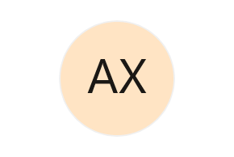

# Customization in WinUI AvatarView 

The `AvatarView` control offers a range of customization options, including the ability to modify its border, background, and more.

## Border

Customize the border of AvatarView control by using the `BorderBrush` and `BorderThickness` properties to achieve the desired look.

**BorderBrush**

You can customize the thickness of the AvatarView control by using the `BorderBrush` property.




<syncfusion:SfAvatarView  ContentType="AvatarCharacter" 
                          AvatarCharacter="Avatar16"
                          AvatarSize="ExtraLarge"
                          BorderBrush="Red">
</syncfusion:SfAvatarView>




SfAvatarView avatarView = new SfAvatarView();
avatarView.ContentType = AvatarContentType.AvatarCharacter;
avatarView.AvatarSize = AvatarSize.ExtraLarge;
avatarView.AvatarCharacter = AvatarCharacter.Avatar16;
avatarView.BorderBrush = new SolidColorBrush(Colors.Red);




**BorderThickness**

You can customize the thickness of the AvatarView control by using the `BorderThickness` property.




<syncfusion:SfAvatarView   AvatarShape="Custom"
                           AvatarSize="ExtraLarge"
                           BorderBrush="Black" 
                           BorderThickness="4">
</syncfusion:SfAvatarView>




SfAvatarView avatarView = new SfAvatarView();
avatarView.AvatarShape = AvatarShape.Custom;
avatarView.AvatarSize = AvatarSize.ExtraLarge;
avatarView.BorderThickness = new Thickness(4);
avatarView.BorderBrush = new SolidColorBrush(Colors.Black);




## Background

You can customize the background of the AvatarView control by using the `Background` property.




<syncfusion:SfAvatarView ContentType="Initials"
                         AvatarSize="ExtraLarge"
                         AvatarName="Alex"
                         InitialsType="DoubleCharacter"
                         Background="Bisque">
</syncfusion:SfAvatarView>



          
SfAvatarView avatarView = new SfAvatarView();
avatarView.AvatarName = "Alex";
avatarView.ContentType = AvatarContentType.Initials;
avatarView.AvatarSize = AvatarSize.ExtraLarge;
avatarView.InitialsType = AvatarInitialsType.DoubleCharacter;
avatarView.Background = new SolidColorBrush(Colors.Bisque);




## Gradients

You can use the `LinearGradientBrush` or `RadialGradientBrush` in the `Background` property to specify a range of colors for your AvatarView, as shown in the following code example.




<syncfusion:SfAvatarView  ContentType="Initials" 
                          AvatarName="Alex"
                          AvatarSize="ExtraLarge"
                          InitialsType="DoubleCharacter">
            <syncfusion:SfAvatarView.Background>
                <LinearGradientBrush StartPoint="0,0"
                                     EndPoint="1,0">
                    <GradientStop Color="#2F9BDF" Offset="0"/>
                    <GradientStop Color="#51F1F2" Offset="1"/>
                </LinearGradientBrush>
            </syncfusion:SfAvatarView.Background>
</syncfusion:SfAvatarView>
  




SfAvatarView avatarView = new SfAvatarView();
avatarView.AvatarShape = AvatarShape.Circle;
avatarView.ContentType = AvatarContentType.Initials;
avatarView.AvatarSize = AvatarSize.ExtraLarge;
avatarView.InitialsType = AvatarInitialsType.DoubleCharacter;
avatarView.AvatarName = "Alex";
avatarView.Background = new LinearGradientBrush()
{
    StartPoint = new Point(0, 0),
    EndPoint = new Point(1, 0),
    GradientStops = new GradientStopCollection()
    {
        new GradientStop() { Color =  Color.FromArgb(255, 47, 155, 223), Offset = 0 },
        new GradientStop() { Color = Color.FromArgb(255, 81, 241, 242), Offset = 1 }
    }
};




