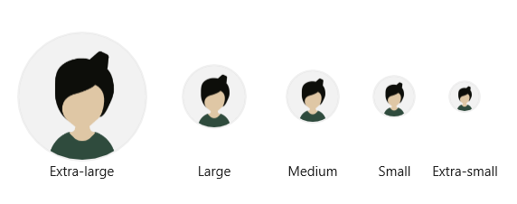

# Visual Styles in WinUI AvatarView

The `AvatarView` control provides support for various built-in visual styles. You can configure the visual style of your AvatarView by using the `AvatarShape` property and select from the available options, such as:

* Custom
* Circle
* Square

## Custom

Custom type allows you to customize the AvatarView control with height, width, font and corner radius.




<syncfusion:SfAvatarView  AvatarShape="Custom"
                          Height="60"
                          Width="75"
                          AvatarName="Alex"
                          FontSize="35"
                          CornerRadius="0,23,0,23">
</syncfusion:SfAvatarView>




SfAvatarView avatarView = new SfAvatarView();
avatarView.AvatarShape = AvatarShape.Custom;
avatarView.Height = 60;
avatarView.Width = 75;  
avatarView.AvatarName = "Alex";
avatarView.FontSize = 35;
avatarView.CornerRadius = new CornerRadius(0,23,0,23);




## Circle

For the circle style, you can use the `AvatarSize` property to set the avatar's pre-defined circle size, which includes the following values:

* Extra-large
* Large
* Medium
* Small
* Extra-small

The following code sample illustrates how to set the visual styles of AvatarView to `Circle`.

N> The default `AvatarShape` is Circle.




<Page.Resources>
    <ResourceDictionary>
        
    </ResourceDictionary>
</Page.Resources>

<Page.Content>
    <StackPanel Orientation="Vertical" HorizontalAlignment="Stretch" VerticalAlignment="Stretch">
        <Grid>
            <Grid.RowDefinitions>
                <RowDefinition Height="*"/>
                <RowDefinition Height="*"/>
            </Grid.RowDefinitions>
            <Grid.ColumnDefinitions>
                <ColumnDefinition Width="*"/>
                <ColumnDefinition Width="*"/>
                <ColumnDefinition Width="*"/>
                <ColumnDefinition Width="*"/>
                <ColumnDefinition Width="*"/>
            </Grid.ColumnDefinitions>

            <syncfusion:SfAvatarView AvatarShape="Circle" AvatarSize="ExtraLarge" Grid.Row="0" Grid.Column="0" Style="{StaticResource AvatarViewStyle}"/>
            <TextBlock Text="Extra-small" Grid.Row="1" TextAlignment="Center" Grid.Column="4" FontSize="10"/>
            <syncfusion:SfAvatarView AvatarShape="Circle" AvatarSize="Large" Grid.Row="0" Grid.Column="1" Style="{StaticResource AvatarViewStyle}"/>
            <TextBlock Text="Small" Grid.Row="1" TextAlignment="Center" Grid.Column="3" FontSize="10"/>
            <syncfusion:SfAvatarView AvatarShape="Circle" AvatarSize="Medium" Grid.Row="0" Grid.Column="2" Style="{StaticResource AvatarViewStyle}"/>
            <TextBlock Text="Medium" Grid.Row="1" TextAlignment="Center" Grid.Column="2" FontSize="10"/>
            <syncfusion:SfAvatarView AvatarShape="Circle" AvatarSize="Small" Grid.Row="0" Grid.Column="3" Style="{StaticResource AvatarViewStyle}"/>
            <TextBlock Text="Large" Grid.Row="1" TextAlignment="Center" Grid.Column="1" FontSize="10"/>
            <syncfusion:SfAvatarView AvatarShape="Circle" AvatarSize="ExtraSmall" Grid.Row="0" Grid.Column="4" Style="{StaticResource AvatarViewStyle}"/>
            <TextBlock Text="Extra-large" Grid.Row="1"  TextAlignment="Center" Grid.Column="0" FontSize="10"/>
        </Grid>
    </StackPanel>
</Page.Content>




StackPanel stack = new StackPanel();
stack.Orientation = Orientation.Vertical;
stack.HorizontalAlignment = HorizontalAlignment.Stretch;
stack.VerticalAlignment = VerticalAlignment.Stretch;

Grid mainGrid = new Grid();
mainGrid.RowDefinitions.Add(new RowDefinition { Height = new GridLength(1, GridUnitType.Star) });
mainGrid.RowDefinitions.Add(new RowDefinition { Height = new GridLength(1, GridUnitType.Star) });

mainGrid.ColumnDefinitions.Add(new ColumnDefinition { Width = new GridLength(1, GridUnitType.Star) });
mainGrid.ColumnDefinitions.Add(new ColumnDefinition { Width = new GridLength(1, GridUnitType.Star) });
mainGrid.ColumnDefinitions.Add(new ColumnDefinition { Width = new GridLength(1, GridUnitType.Star) });
mainGrid.ColumnDefinitions.Add(new ColumnDefinition { Width = new GridLength(1, GridUnitType.Star) });
mainGrid.ColumnDefinitions.Add(new ColumnDefinition { Width = new GridLength(1, GridUnitType.Star) });

TextBlock XLargeCircleTextBlock = new TextBlock();
XLargeCircleTextBlock.Text = "Extra-large";
XLargeCircleTextBlock.FontSize = 12;
XLargeCircleTextBlock.TextAlignment = TextAlignment.Center;
XLargeCircleTextBlock.FontSize = 10;

SfAvatarView avatarView1 = new SfAvatarView();
avatarView1.AvatarShape = AvatarShape.Circle;
avatarView1.AvatarSize = AvatarSize.ExtraLarge;
avatarView1.ContentType = AvatarContentType.AvatarCharacter;
avatarView1.AvatarCharacter = AvatarCharacter.Avatar13;

TextBlock LargeCircleTextBlock = new TextBlock();
LargeCircleTextBlock.Text = "Large";
LargeCircleTextBlock.FontSize = 12;
LargeCircleTextBlock.TextAlignment = TextAlignment.Center;
LargeCircleTextBlock.FontSize = 10;

SfAvatarView avatarView2 = new SfAvatarView();
avatarView2.AvatarShape = AvatarShape.Circle;
avatarView2.AvatarSize = AvatarSize.Large;
avatarView2.ContentType = AvatarContentType.AvatarCharacter;
avatarView2.AvatarCharacter = AvatarCharacter.Avatar13;

TextBlock MediumCircleTextBlock = new TextBlock();
MediumCircleTextBlock.Text = "Medium";
MediumCircleTextBlock.FontSize = 12;
MediumCircleTextBlock.TextAlignment = TextAlignment.Center;
MediumCircleTextBlock.FontSize = 10;

SfAvatarView avatarView3 = new SfAvatarView();
avatarView3.AvatarShape = AvatarShape.Circle;
avatarView3.AvatarSize = AvatarSize.Medium;
avatarView3.ContentType = AvatarContentType.AvatarCharacter;
avatarView3.AvatarCharacter = AvatarCharacter.Avatar13;

TextBlock SmallCircleTextBlock = new TextBlock();
SmallCircleTextBlock.Text = "Small";
SmallCircleTextBlock.FontSize = 12;
SmallCircleTextBlock.TextAlignment = TextAlignment.Center;
SmallCircleTextBlock.FontSize = 10;

SfAvatarView avatarView4 = new SfAvatarView();
avatarView4.AvatarShape = AvatarShape.Circle;
avatarView4.AvatarSize = AvatarSize.Small;
avatarView4.ContentType = AvatarContentType.AvatarCharacter;
avatarView4.AvatarCharacter = AvatarCharacter.Avatar13;

TextBlock XSmallCircleTextBlock = new TextBlock();
XSmallCircleTextBlock.Text = "Extra-small";
XSmallCircleTextBlock.FontSize = 12;
XSmallCircleTextBlock.TextAlignment = TextAlignment.Center;
XSmallCircleTextBlock.FontSize = 10;

SfAvatarView avatarView5 = new SfAvatarView();
avatarView5.AvatarShape = AvatarShape.Circle;
avatarView5.AvatarCharacter = AvatarCharacter.Avatar13;
avatarView5.AvatarSize = AvatarSize.ExtraSmall;
avatarView5.ContentType = AvatarContentType.AvatarCharacter;

mainGrid.Children.Add(XLargeCircleTextBlock);
mainGrid.Children.Add(avatarView1);
mainGrid.Children.Add(LargeCircleTextBlock);
mainGrid.Children.Add(avatarView2);
mainGrid.Children.Add(MediumCircleTextBlock);
mainGrid.Children.Add(avatarView3);
mainGrid.Children.Add(SmallCircleTextBlock);
mainGrid.Children.Add(avatarView4);
mainGrid.Children.Add(XSmallCircleTextBlock);
mainGrid.Children.Add(avatarView5);

Grid.SetRow(avatarView5, 0);
Grid.SetRow(avatarView4, 0);
Grid.SetRow(avatarView3, 0);
Grid.SetRow(avatarView2, 0);
Grid.SetRow(avatarView1, 0);

Grid.SetColumn(avatarView5, 4);
Grid.SetColumn(avatarView4, 3);
Grid.SetColumn(avatarView3, 2);
Grid.SetColumn(avatarView2, 1);
Grid.SetColumn(avatarView1, 0);

Grid.SetRow(XSmallCircleTextBlock, 1);
Grid.SetRow(SmallCircleTextBlock, 1);
Grid.SetRow(MediumCircleTextBlock, 1);
Grid.SetRow(LargeCircleTextBlock, 1);
Grid.SetRow(XLargeCircleTextBlock, 1);

Grid.SetColumn(XSmallCircleTextBlock, 4);
Grid.SetColumn(SmallCircleTextBlock, 3);
Grid.SetColumn(MediumCircleTextBlock, 2);
Grid.SetColumn(LargeCircleTextBlock, 1);
Grid.SetColumn(XLargeCircleTextBlock, 0);
stack.Children.Add(mainGrid);




## Square

For the square style, you can use the `AvatarSize` property to set the avatar's pre-defined square size, which includes the following values:

* Extra-large
* Large
* Medium
* Small
* Extra-small

The following code sample illustrates how to set the visual styles of AvatarView to `Square`.




<Page.Resources>
    <ResourceDictionary>
        
    </ResourceDictionary>
</Page.Resources>

<Page.Content>
    <StackPanel Orientation="Vertical" HorizontalAlignment="Stretch" VerticalAlignment="Stretch">
        <Grid>
            <Grid.RowDefinitions>
                <RowDefinition Height="*"/>
                <RowDefinition Height="*"/>
            </Grid.RowDefinitions>
            <Grid.ColumnDefinitions>
                <ColumnDefinition Width="*"/>
                <ColumnDefinition Width="*"/>
                <ColumnDefinition Width="*"/>
                <ColumnDefinition Width="*"/>
                <ColumnDefinition Width="*"/>
            </Grid.ColumnDefinitions>

            <syncfusion:SfAvatarView AvatarShape="Square" AvatarSize="ExtraLarge" Grid.Row="0" Grid.Column="0" Style="{StaticResource AvatarViewStyle}"/>
            <TextBlock Text="Extra-small" Grid.Row="1" TextAlignment="Center" Grid.Column="4" FontSize="10"/>
            <syncfusion:SfAvatarView AvatarShape="Square" AvatarSize="Large" Grid.Row="0" Grid.Column="1" Style="{StaticResource AvatarViewStyle}"/>
            <TextBlock Text="Small" Grid.Row="1" TextAlignment="Center" Grid.Column="3" FontSize="10"/>
            <syncfusion:SfAvatarView AvatarShape="Square" AvatarSize="Medium" Grid.Row="0" Grid.Column="2" Style="{StaticResource AvatarViewStyle}"/>
            <TextBlock Text="Medium" Grid.Row="1" TextAlignment="Center" Grid.Column="2" FontSize="10"/>
            <syncfusion:SfAvatarView AvatarShape="Square" AvatarSize="Small" Grid.Row="0" Grid.Column="3" Style="{StaticResource AvatarViewStyle}"/>
            <TextBlock Text="large" Grid.Row="1" TextAlignment="Center" Grid.Column="1" FontSize="10"/>
            <syncfusion:SfAvatarView AvatarShape="Square" AvatarSize="ExtraSmall" Grid.Row="0" Grid.Column="4" Style="{StaticResource AvatarViewStyle}"/>
            <TextBlock Text="Extra-large" Grid.Row="1" TextAlignment="Center" Grid.Column="0" FontSize="10"/>
        </Grid>
    </StackPanel>
</Page.Content>




StackPanel stack = new StackPanel();
stack.Orientation = Orientation.Vertical;
stack.HorizontalAlignment = HorizontalAlignment.Stretch;
stack.VerticalAlignment = VerticalAlignment.Stretch;

Grid mainGrid = new Grid();
mainGrid.RowDefinitions.Add(new RowDefinition { Height = new GridLength(1, GridUnitType.Star) });
mainGrid.RowDefinitions.Add(new RowDefinition { Height = new GridLength(1, GridUnitType.Star) });

mainGrid.ColumnDefinitions.Add(new ColumnDefinition { Width = new GridLength(1, GridUnitType.Star) });
mainGrid.ColumnDefinitions.Add(new ColumnDefinition { Width = new GridLength(1, GridUnitType.Star) });
mainGrid.ColumnDefinitions.Add(new ColumnDefinition { Width = new GridLength(1, GridUnitType.Star) });
mainGrid.ColumnDefinitions.Add(new ColumnDefinition { Width = new GridLength(1, GridUnitType.Star) });
mainGrid.ColumnDefinitions.Add(new ColumnDefinition { Width = new GridLength(1, GridUnitType.Star) });

TextBlock XLargeSquareTextBlock = new TextBlock();
XLargeSquareTextBlock.Text = "Extra-large";
XLargeSquareTextBlock.FontSize = 12;
XLargeSquareTextBlock.TextAlignment = TextAlignment.Center;
XLargeSquareTextBlock.FontSize = 10;

SfAvatarView avatarView1 = new SfAvatarView();
avatarView1.AvatarShape = AvatarShape.Square;
avatarView1.AvatarSize = AvatarSize.ExtraLarge;
avatarView1.ContentType = AvatarContentType.AvatarCharacter;
avatarView1.AvatarCharacter = AvatarCharacter.Avatar13;

TextBlock LargeSquareTextBlock = new TextBlock();
LargeSquareTextBlock.Text = "Large";
LargeSquareTextBlock.FontSize = 12;
LargeSquareTextBlock.TextAlignment = TextAlignment.Center;
LargeSquareTextBlock.FontSize = 10;

SfAvatarView avatarView2 = new SfAvatarView();
avatarView2.AvatarShape = AvatarShape.Square;
avatarView2.AvatarSize = AvatarSize.Large;
avatarView2.ContentType = AvatarContentType.AvatarCharacter;
avatarView2.AvatarCharacter = AvatarCharacter.Avatar13;

TextBlock MediumSquareTextBlock = new TextBlock();
MediumSquareTextBlock.Text = "Medium";
MediumSquareTextBlock.FontSize = 12;
MediumSquareTextBlock.TextAlignment = TextAlignment.Center;
MediumSquareTextBlock.FontSize = 10;

SfAvatarView avatarView3 = new SfAvatarView();
avatarView3.AvatarShape = AvatarShape.Square;
avatarView3.AvatarSize = AvatarSize.Medium;
avatarView3.ContentType = AvatarContentType.AvatarCharacter;
avatarView3.AvatarCharacter = AvatarCharacter.Avatar13;

TextBlock SmallSquareTextBlock = new TextBlock();
SmallSquareTextBlock.Text = "Small";
SmallSquareTextBlock.FontSize = 12;
SmallSquareTextBlock.TextAlignment = TextAlignment.Center;
SmallSquareTextBlock.FontSize = 10;

SfAvatarView avatarView4 = new SfAvatarView();
avatarView4.AvatarShape = AvatarShape.Square;
avatarView4.AvatarSize = AvatarSize.Small;
avatarView4.ContentType = AvatarContentType.AvatarCharacter;
avatarView4.AvatarCharacter = AvatarCharacter.Avatar13;

TextBlock XSmallSquareTextBlock = new TextBlock();
XSmallSquareTextBlock.Text = "Extra-small";
XSmallSquareTextBlock.FontSize = 12;
XSmallSquareTextBlock.TextAlignment = TextAlignment.Center;
XSmallSquareTextBlock.FontSize = 10;

SfAvatarView avatarView5 = new SfAvatarView();
avatarView5.AvatarShape = AvatarShape.Square;
avatarView5.AvatarCharacter = AvatarCharacter.Avatar13;
avatarView5.AvatarSize = AvatarSize.ExtraSmall;
avatarView5.ContentType = AvatarContentType.AvatarCharacter;

mainGrid.Children.Add(XLargeSquareTextBlock);
mainGrid.Children.Add(avatarView1);
mainGrid.Children.Add(LargeSquareTextBlock);
mainGrid.Children.Add(avatarView2);
mainGrid.Children.Add(MediumSquareTextBlock);
mainGrid.Children.Add(avatarView3);
mainGrid.Children.Add(SmallSquareTextBlock);
mainGrid.Children.Add(avatarView4);
mainGrid.Children.Add(XSmallSquareTextBlock);
mainGrid.Children.Add(avatarView5);

Grid.SetRow(avatarView5, 0);
Grid.SetRow(avatarView4, 0);
Grid.SetRow(avatarView3, 0);
Grid.SetRow(avatarView2, 0);
Grid.SetRow(avatarView1, 0);

Grid.SetColumn(avatarView5, 4);
Grid.SetColumn(avatarView4, 3);
Grid.SetColumn(avatarView3, 2);
Grid.SetColumn(avatarView2, 1);
Grid.SetColumn(avatarView1, 0);

Grid.SetRow(XSmallSquareTextBlock, 1);
Grid.SetRow(SmallSquareTextBlock, 1);
Grid.SetRow(MediumSquareTextBlock, 1);
Grid.SetRow(LargeSquareTextBlock, 1);
Grid.SetRow(XLargeSquareTextBlock, 1);

Grid.SetColumn(XSmallSquareTextBlock, 4);
Grid.SetColumn(SmallSquareTextBlock, 3);
Grid.SetColumn(MediumSquareTextBlock, 2);
Grid.SetColumn(LargeSquareTextBlock, 1);
Grid.SetColumn(XLargeSquareTextBlock, 0);
stack.Children.Add(mainGrid);




