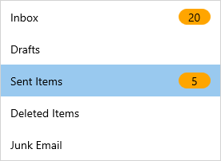
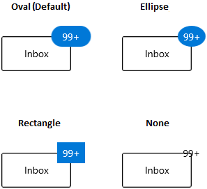

# Getting started with WinUI Badge (SfBadge)

This section explains the steps required to add the [Badge](https://help.syncfusion.com/cr/winui/Syncfusion.UI.Xaml.Notifications.SfBadge.html) control and its elements such as shapes, alignment and predefined colors. This section covers only basic features needed to get started with Syncfusion `Badge` control.

## Structure of Badge control

## Creating an application with WinUI Badge

1. Create a simple project using the instructions given in the [Getting Started with your first WinUI app](https://docs.microsoft.com/en-us/windows/apps/winui/winui3/get-started-winui3-for-uwp) documentation.

2. Add reference to [Syncfusion.Notifications.WinUI](https://www.nuget.org/packages/Syncfusion.Notifications.WinUI) NuGet. 

3. Import the control namespace `Syncfusion.UI.Xaml.Notifications`  in XAML or C# code.

4. Initialize the `SfBadge` control.



<Page
    x:Class="GettingStarted.MainPage"
    xmlns="http://schemas.microsoft.com/winfx/2006/xaml/presentation"
    xmlns:x="http://schemas.microsoft.com/winfx/2006/xaml"
    xmlns:local="using:GettingStarted"
    xmlns:d="http://schemas.microsoft.com/expression/blend/2008"
    xmlns:mc="http://schemas.openxmlformats.org/markup-compatibility/2006"
    xmlns:syncfusion="using:Syncfusion.UI.Xaml.Notifications"
    mc:Ignorable="d"
    Background="{ThemeResource ApplicationPageBackgroundThemeBrush}">
    <Grid>
        <syncfusion:SfBadge Name="badge"
                            Height="30"
                            Width="30"/>
    </Grid>
</Page>






using Syncfusion.UI.Xaml.Notifications;

namespace GettingStarted
{
    /// 

    /// An empty page that can be used on its own or navigated to within a Frame.
    /// 

    public sealed partial class MainPage : Page
    {
        public MainPage()
        {
            this.InitializeComponent();
            // Creating an instance of the Badge control
            SfBadge badge = new SfBadge();

            // Setting height and width to Badge control
            badge.Height = 30;
            badge.Width = 30;
            grid.Children.Add(badge);
        }
    }
}




## Adding badge for a Button

If you want to assign `Badge` for any objects, create the `Badge` and assign the badge to the `BadgeContainer.Badge` property. Before that you need to create a `BadgeContainer` and add that object to the `BadgeContainer.Content` property.

Here, `Badge` control added for the `Button` control.




<syncfusion:BadgeContainer Name="badgeContainer"  >
    <syncfusion:BadgeContainer.Badge>
        <syncfusion:SfBadge Name="badge" 
                            Content="10"/>
    </syncfusion:BadgeContainer.Badge>
    <syncfusion:BadgeContainer.Content>
        <Button Content="Inbox">
        </Button>
    </syncfusion:BadgeContainer.Content>
</syncfusion:BadgeContainer>




//Creating Badge control
SfBadge badge = new SfBadge();
badge.Content = "10";

BadgeContainer badgeContainer = new BadgeContainer();
badgeContainer.Content = new Button(){ Content="Inbox" };

//Assigning Badge control to the content of BadgeContainer
badgeContainer.Badge = badge;




N> Download demo application from [GitHub](https://github.com/SyncfusionExamples/syncfusion-winui-badge-control-examples/blob/master/Samples/Getting_Started)

## Adding badge without BadgeContainer

You can directly add the `Badge` to any objects without using the `BadgeContainer`.




public class ListItem {
    public string ItemName { get; set; }
    public int? UnreadMessageCount { get; set; }
}

public class ViewModel {
    public List<ListItem> MailItems { get; set; }

    public ViewModel() {
        MailItems = new List<ListItem>();
        MailItems.Add(new ListItem() { ItemName = "Inbox", 
            UnreadMessageCount = 20 });
        MailItems.Add(new ListItem() { ItemName = "Drafts", 
            UnreadMessageCount = null });
        MailItems.Add(new ListItem() { ItemName = "Sent Items", 
            UnreadMessageCount = 5 });
        MailItems.Add(new ListItem() { ItemName = "Deleted Items",
            UnreadMessageCount = null });
        MailItems.Add(new ListItem() { ItemName = "Junk Email",
            UnreadMessageCount = null });
    }
}







<Page.DataContext>
    <local:ViewModel/>
</Page.DataContext>
<Grid>
    <ListView BorderThickness="1"
              BorderBrush="LightGray"
              ItemsSource="{Binding MailItems}" 
              SelectedIndex="0"
              VerticalAlignment="Center" 
              HorizontalAlignment="Center">
        <ListView.ItemTemplate>
            <DataTemplate>
                <Grid>
                    <Grid.ColumnDefinitions>
                        <ColumnDefinition Width="150"/>
                        <ColumnDefinition Width="100"/>
                    </Grid.ColumnDefinitions>
                    <ContentPresenter 
                                      Grid.Column="0" 
                                      Content="{Binding ItemName}" 
                                      VerticalAlignment="Center"/>
                    <syncfusion:SfBadge 
                                      x:Name="badge4"
                                      Grid.Column="1" 
                                      Height="20" 
                                      Width="40" 
                                      Content="{Binding UnreadMessageCount}"
                                      Shape="Oval"
                                      Fill="Warning">
                    </syncfusion:SfBadge>
                </Grid>
            </DataTemplate>
        </ListView.ItemTemplate>
    </ListView>
</Grid>




N> Download demo application from [GitHub](https://github.com/SyncfusionExamples/syncfusion-winui-badge-control-examples/blob/master/Samples/Badge_without_BadgeContainer)

## Setting Badge display content

If you want to set or change the display content of the `Badge`, use the `Content` property. The default value of `Content` property is `null`.




<syncfusion:BadgeContainer Name="badgeContainer"  >
    <syncfusion:BadgeContainer.Badge>
        <syncfusion:SfBadge  Name="badge" 
                             Content="99+"/>
    </syncfusion:BadgeContainer.Badge>
    <syncfusion:BadgeContainer.Content>
        <Button Content="Inbox">
        </Button>
    </syncfusion:BadgeContainer.Content>
</syncfusion:BadgeContainer>




SfBadge badge = new SfBadge();
//Setting Badge display content
badge.Content = "99+";

BadgeContainer badgeContainer = new BadgeContainer();
badgeContainer.Content = new Button(){ Content="Inbox" };

//Assigning Badge control to the content of BadgeContainer
badgeContainer.Badge = badge;




N> Download demo application from [GitHub](https://github.com/SyncfusionExamples/syncfusion-winui-badge-control-examples/blob/master/Samples/Content_CustomUI)

## Alignment of Badge

you can align the `Badge` either horizontally or vertically by using the `Badge.HorizontalAlignment` or `VerticalAlignment` properties. The default value of `HorizontalAlignment` property is `Right` and `VerticalAlignment` property is `Top`.

<table>

<tr>
<td class="invisible" ></td>
<th style="text-align:center" colspan = "4">HorizontalAlignment</th>
</tr>

<tr>
<th>VerticalAlignment</th>
<td>Left</td>
<td>Center</td>
<td>Right</td>
<td>Stretch</td>
</tr>

<tr>
<td>Top</td>
<td></td>
<td></td>
<td></td>
<td></td>
</tr>

<tr>
<td>Center</td>
<td></td>
<td></td>
<td></td>
<td></td>
</tr>

<tr>
<td>Bottom</td>
<td></td>
<td></td>
<td></td>
<td></td>
</tr>

<tr>
<td>Stretch</td>
<td></td>
<td></td>
<td></td>
<td></td>
</tr>
</table>




<syncfusion:BadgeContainer Name="badgeContainer"  >
    <syncfusion:BadgeContainer.Badge>
        <syncfusion:SfBadge HorizontalAlignment="Left"
                            VerticalAlignment="Center"
                            Content="99+"
                            Name="badge"/>
    </syncfusion:BadgeContainer.Badge>
    <syncfusion:BadgeContainer.Content>
        <Button Content="Inbox">
        </Button>
    </syncfusion:BadgeContainer.Content>
</syncfusion:BadgeContainer>




badge.HorizontalAlignment = HorizontalAlignment.Left;
badge.VerticalAlignment = VerticalAlignment.Center;
badge.Content = "99+";




N> Download demo application from [GitHub](https://github.com/SyncfusionExamples/syncfusion-winui-badge-control-examples/blob/master/Samples/Badge_Features)

## Positioning of Badge

You can change the horizontal or vertical position of the `Badge` either inside, outside or in the middle by using the [HorizontalAnchor](https://help.syncfusion.com/cr/winui/Syncfusion.UI.Xaml.Notifications.SfBadge.html#Syncfusion_UI_Xaml_Notifications_SfBadge_HorizontalAnchor) and [VerticalAnchor](https://help.syncfusion.com/cr/winui/Syncfusion.UI.Xaml.Notifications.SfBadge.html#Syncfusion_UI_Xaml_Notifications_SfBadge_VerticalAnchor) properties. The default value of `HorizontalAnchor` and `VerticalAnchor` properties is `Center`.




<syncfusion:BadgeContainer Name="badgeContainer"  >
    <syncfusion:BadgeContainer.Badge>
        <syncfusion:SfBadge HorizontalAnchor="Outside"
                            VerticalAnchor="Center"
                            Content="99+"
                            Name="badge"/>
    </syncfusion:BadgeContainer.Badge>
    <syncfusion:BadgeContainer.Content>
        <Button Content="Inbox">
        </Button>
    </syncfusion:BadgeContainer.Content>
</syncfusion:BadgeContainer>




badge.HorizontalAnchor = BadgeAnchor.Outside;
badge.VerticalAnchor = BadgeAnchor.Center;
badge.Content = "99+";




N> Download demo application from [GitHub](https://github.com/SyncfusionExamples/syncfusion-winui-badge-control-examples/blob/master/Samples/Badge_Features)

## Predefined colors for displaying the badges

You can change background color of the `Badge` by using the [Fill](https://help.syncfusion.com/cr/winui/Syncfusion.UI.Xaml.Notifications.SfBadge.html#Syncfusion_UI_Xaml_Notifications_SfBadge_Fill) property. Based on the value of `Fill` property, respective background color will be applied to the `Badge`. The default value of `Fill` property is `Accent`.

The `Badge` supports the following different essential states :

* Accent - RoyalBlue background will be applied

* Alt - DarkSlateGray background will be applied

* Default - Lavender background will be applied

* Error - OrangeRed background will be applied

* Information - LightSeaGreen background will be applied

* Success - Green background will be applied

* Warning - Orange background will be applied




<syncfusion:BadgeContainer Name="badgeContainer"  >
    <syncfusion:BadgeContainer.Badge>
        <syncfusion:SfBadge Fill="Success"
                            Content="99+"
                            Name="badge"/>
    </syncfusion:BadgeContainer.Badge>
    <syncfusion:BadgeContainer.Content>
        <Button Content="Inbox">
        </Button>
    </syncfusion:BadgeContainer.Content>
</syncfusion:BadgeContainer>




badge.Fill = BadgeFill.Success;
badge.Content = "99+";




N> Download demo application from [GitHub](https://github.com/SyncfusionExamples/syncfusion-winui-badge-control-examples/blob/master/Samples/Badge_Features)

## Custom colors for displaying the badges

If you want to change the background color of the `Badge` other than the default `Fill` colors, use the `Background` property. You can also change foreground of the `Badge` by using the `Foreground` property. The default value of `Background` and `Foreground` properties is `null`. 




<syncfusion:BadgeContainer Name="badgeContainer"  >
    <syncfusion:BadgeContainer.Badge>
        <syncfusion:SfBadge Background="Black"
                            Foreground="Yellow"
                            Content="99+"
                            Name="badge"/>
    </syncfusion:BadgeContainer.Badge>
    <syncfusion:BadgeContainer.Content>
        <Button Content="Inbox">
        </Button>
    </syncfusion:BadgeContainer.Content>
</syncfusion:BadgeContainer>




badge.Background = new SolidColorBrush(Colors.Black);
badge.Foreground = new SolidColorBrush(Colors.Yellow);
badge.Content = "99+";




N> Download demo application from [GitHub](https://github.com/SyncfusionExamples/syncfusion-winui-badge-control-examples/blob/master/Samples/Badge_Control)

## Predefined shapes for displaying the Badge

You can change the default shape to either `Rectangle`, `Oval` or `Ellipse` by using [Shape](https://help.syncfusion.com/cr/winui/Syncfusion.UI.Xaml.Notifications.SfBadge.html#Syncfusion_UI_Xaml_Notifications_SfBadge_Shape) property. If you want to display the `Badge` content without any default shapes , use the `Shape` property value as `None`. The default value of `Shape` property is `Ellipse`.




<syncfusion:BadgeContainer Name="badgeContainer"  >
    <syncfusion:BadgeContainer.Badge>
        <syncfusion:SfBadge Shape="Oval"
                            Content="99+"
                            Name="badge"/>
    </syncfusion:BadgeContainer.Badge>
    <syncfusion:BadgeContainer.Content>
        <Button Content="Inbox">
        </Button>
    </syncfusion:BadgeContainer.Content>
</syncfusion:BadgeContainer>




badge.Shape = BadgeShape.Oval;
badge.Content = "99+";




N> Download demo application from [GitHub](https://github.com/SyncfusionExamples/syncfusion-winui-badge-control-examples/blob/master/Samples/Badge_Features)

## Custom shape for displaying the Badge

If you want to change the shape of the `Badge` other than the default shapes, use the [CustomShape](https://help.syncfusion.com/cr/winui/Syncfusion.UI.Xaml.Notifications.SfBadge.html#Syncfusion_UI_Xaml_Notifications_SfBadge_CustomShape) property. You can enable the custom shapes by setting the `Shape` property value as `Custom`.




<syncfusion:BadgeContainer Name="badgeContainer"  >
    <syncfusion:BadgeContainer.Badge>
        <syncfusion:SfBadge Shape="Custom" 
                            CustomShape="M16,0C17.300003,0.49999999 18.399994,1.6000063 19.199997,3.3000189 19.300003,3.3000189 19.5,3.1999823 19.600006,3.1999823 19.800003,3.3999945 20,3.4999703 20.199997,3.8000194 21.5,2.9999701 22.800003,2.6000067 24,2.8000189 24.600006,3.6000069 25,4.6000072 25,5.8000194 25.5,5.8000194 25.899994,5.899995 26.300003,6.1000076 26.399994,6.3999954 26.5,6.6000076 26.600006,6.8999954 28.199997,6.8000198 29.600006,7.1999832 30.5,7.8999959 30.699997,9.1999837 30.199997,10.699984 29.100006,12.199985L29.399994,12.499972C29.399994,12.800021 29.300003,12.999972 29.199997,13.300021 30.600006,13.999972 31.600006,14.999973 32,15.999973 31.600006,16.899998 30.899994,17.699986 29.800003,18.399998 30,18.800022 30.100006,19.199986 30.199997,19.60001 30,19.800022 29.800003,19.999973 29.600006,20.199986 30.399994,21.499975 30.800003,22.800024 30.600006,23.999975 29.5,24.800024 27.899994,25.199988 26,24.999975 26,25.100012 25.899994,25.300024 25.899994,25.4 25.600006,25.499975 25.399994,25.600012 25.100006,25.600012 25.199997,26.999975 24.800003,28.300024 24.100006,29.199989 23.100006,29.400002 22,29.100014 20.800003,28.499975 20.5,28.900002 20.199997,29.199989 19.899994,29.400002 19.600006,29.400002 19.300003,29.300026 19,29.199989 18.300003,30.499977 17.199997,31.499977 16.100006,31.900002 14.800003,31.400002 13.699997,30.199989 12.899994,28.600012 12.800003,28.600012 12.600006,28.699988 12.5,28.699988 12.300003,28.499975 12.100006,28.4 11.899994,28.100012 10.5,28.999977 9.1999969,29.400002 8,29.199989 7.3999939,28.4 7,27.4 7,26.199988 6.5,26.199988 6.1000061,26.100012 5.6999969,25.9 5.6000061,25.600012 5.5,25.4 5.3999939,25.100012 3.8000031,25.199988 2.3999939,24.800024 1.5,24.100012 1.3000031,22.800024 1.8000031,21.300024 2.8999939,19.800022L2.6000061,19.499973C2.6000061,19.199986 2.6999969,18.999973 2.8000031,18.699986 1.3999939,17.999973 0.3999939,16.999973 0,15.999973 0.3999939,15.10001 1.1000061,14.300021 2.1999969,13.600009 2,13.199985 1.8999939,12.800021 1.8000031,12.399997 2,12.199985 2.1999969,11.999972 2.5,11.800021 1.6999969,10.499971 1.3000031,9.1999837 1.5,7.9999715 2.5,7.1999832 4.1000061,6.8000198 6,6.999971 6,6.8999954 6.1000061,6.6999832 6.1000061,6.6000076 6.3999939,6.499971 6.6999969,6.3999954 7,6.3999954 6.8999939,4.899995 7.3000031,3.6999825 8,2.8000189 9,2.6000067 10.100006,2.8999945 11.300003,3.4999705 11.600006,3.1000067 11.899994,2.8000189 12.199997,2.6000067 12.5,2.6000067 12.800003,2.6999823 13.100006,2.8000189 13.800003,1.3999941 14.800003,0.39999388 16,0z"                                        
                            Content="10"
                            Width="50" Height="30"
                            Name="badge"/>
    </syncfusion:BadgeContainer.Badge>
    <syncfusion:BadgeContainer.Content>
        <Button Content="Inbox">
        </Button>
    </syncfusion:BadgeContainer.Content>
</syncfusion:BadgeContainer>




N> Download demo application from [GitHub](https://github.com/SyncfusionExamples/syncfusion-winui-badge-control-examples/blob/master/Samples/Badge_Features)

## Animate when content changes

You can enable the `Scale` or `Opacity` based animation for displaying the `Badge` text by using [AnimationType](https://help.syncfusion.com/cr/winui/Syncfusion.UI.Xaml.Notifications.SfBadge.html#Syncfusion_UI_Xaml_Notifications_SfBadge_AnimationType) property. You can only see the animation when you change the text of the `Badge`. The default value of `AnimationType` property is `None`.




<syncfusion:BadgeContainer Name="badgeContainer"  >
    <syncfusion:BadgeContainer.Badge>
        <syncfusion:SfBadge AnimationType="Scale"
                            Background="Red"
                            Content="1"
                            Name="badge"/>
    </syncfusion:BadgeContainer.Badge>
    <syncfusion:BadgeContainer.Content>
        <Button Content="Inbox">
        </Button>
    </syncfusion:BadgeContainer.Content>
</syncfusion:BadgeContainer>




badge.AnimationType = AnimationType.Scale;
badge.Content = "1";




### Scaling based animation

### Opacity based animation

N> Download demo application from [GitHub](https://github.com/SyncfusionExamples/syncfusion-winui-badge-control-examples/blob/master/Samples/Badge_Features)

## Display number formatting

You can format the numbers which are displayed in the `Badge` content by using the converters. For example, you can display the number as `99+` which is greater than or equal to `100`.




public class CustomNumberConverter : IValueConverter {
    public object Convert(object value, Type targetType, object parameter, string language)
    {
        if (int.TryParse(value.ToString(), out int number)) {
            if (number <= 99) {
                return value;
            }
            else if (number <= 999) {
                return "99+";
            }
            else if (number < 99999) {
                return (number / 1000).ToString("0.#") + "K";
            }
            else if (number < 999999) {
                return (number / 1000).ToString("#,0K");
            }
            else if (number < 9999999) {
                return (number / 1000000).ToString("0.#") + "M";
            }
            else {
                return (number / 1000000).ToString("#,0M");
            }
        }
        return value;
    }

    public object ConvertBack(object value, Type targetType, object parameter, string language) {
        throw new NotImplementedException();
    }
}







<Page.Resources>
    <local:CustomNumberConverter x:Key="customNumberConverter"/>
</Page.Resources>

<Grid>
    <Grid.ColumnDefinitions>
        <ColumnDefinition/>
        <ColumnDefinition/>
    </Grid.ColumnDefinitions>
    
    <syncfusion:BadgeContainer Name="badgeContainer">
        <syncfusion:BadgeContainer.Badge>
            <syncfusion:SfBadge  Name="badge"
                                 Background="Red"
                                 Content="{x:Bind badgeContent.Text, 
                                                Mode=OneWay, 
                                                Converter={StaticResource 
                                                customNumberConverter}}"/>
        </syncfusion:BadgeContainer.Badge>
        <syncfusion:BadgeContainer.Content>
            <Button Content="Inbox">
            </Button>
        </syncfusion:BadgeContainer.Content>
    </syncfusion:BadgeContainer>

    <Grid Grid.Column="1">
        <muxc:NumberBox x:Name="badgeContent"
                        Header="BadgeContent"
                        Value="99"
                        SpinButtonPlacementMode="Compact"
                        Minimum="0"
                        Maximum="100000000"/>
    </Grid>
</Grid>




N> Download demo application from [GitHub](https://github.com/SyncfusionExamples/syncfusion-winui-badge-control-examples/blob/master/Samples/Content_CustomUI)
