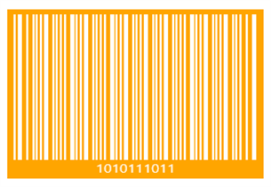

# Barcode Customization

## Bar Customization

The color of the Barcode can be customized by using the properties of [Background](https://docs.microsoft.com/en-us/dotnet/api/system.windows.controls.control.background?view=netcore-3.1#System_Windows_Controls_Control_Background) and [Foreground](https://docs.microsoft.com/en-us/dotnet/api/system.windows.controls.control.foreground?view=netcore-3.1#System_Windows_Controls_Control_Foreground) in [Barcode](https://help.syncfusion.com/cr/winui/Syncfusion.UI.Xaml.Controls.Barcode.SfBarcode.html) control.

The Background represents the color of the dark bar (Black color by default) and the Foreground represents the color of the gap between two adjacent black bars (White color by default).




<syncfusion:SfBarcode x:Name="barcode" Background="Orange" Foreground="White" Value="48625310" Height="150" />


 

## Module

 The width ratio of the wide and narrow bars can be customized using [Module](https://help.syncfusion.com/cr/winui/Syncfusion.UI.Xaml.Controls.Barcode.SfBarcode.html#Syncfusion_UI_Xaml_Controls_Barcode_SfBarcode_Module) property. The following code snippet explains that how the [Module](https://help.syncfusion.com/cr/winui/Syncfusion.UI.Xaml.Controls.Barcode.SfBarcode.html#Syncfusion_UI_Xaml_Controls_Barcode_SfBarcode_Module) property is used,




<syncfusion:SfBarcode x:Name="barcode" Module="1" Value="48625310" ShowValue="False" Height="150" />




