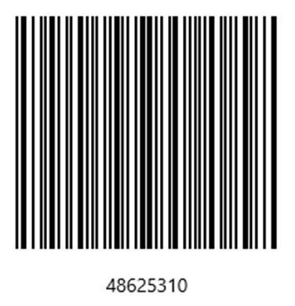
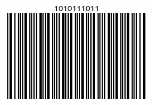
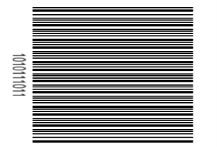

# Getting Started with WinUI Barcode

This section provides a quick overview of how to get started with the [WinUI Barcode](https://www.syncfusion.com/winui-controls/barcode). Walk-through the entire process of creating a real-world of this control.

## Creating an application with WinUI Barcode

1. Create a [WinUI 3 desktop app for C# and .NET 5](https://docs.microsoft.com/en-us/windows/apps/winui/winui3/get-started-winui3-for-desktop).
2. Add reference to [Syncfusion.Barcode.WinUI](https://www.nuget.org/packages/Syncfusion.Barcode.WinUI) NuGet. 
3. Import the control namespace `using Syncfusion.UI.Xaml.Barcode` in XAML or C# code.
4. Initialize the `SfBarCode` control.





<Page x:Class="syncfusion.barcodedemos.winui.GettingStartedPage"
      xmlns="http://schemas.microsoft.com/winfx/2006/xaml/presentation"
      xmlns:x="http://schemas.microsoft.com/winfx/2006/xaml"
      xmlns:d="http://schemas.microsoft.com/expression/blend/2008"
      xmlns:mc="http://schemas.openxmlformats.org/markup-compatibility/2006"
      xmlns:syncfusion="using:Syncfusion.UI.Xaml.Barcode"
      xmlns:local="using:syncfusion.barcodedemos.winui"
      Background="{ThemeResource ApplicationPageBackgroundThemeBrush}"
      NavigationCacheMode="Disabled">
    <Grid>
        <syncfusion:SfBarcode x:Name="barcode" Value="48625310">
            <syncfusion:SfBarcode.Symbology>
                <syncfusion:CodabarBarcode />
            </syncfusion:SfBarcode.Symbology>
        </syncfusion:SfBarcode>
    </Grid>
</Page>



 

using Microsoft.UI.Xaml.Controls;
using Syncfusion.UI.Xaml.Barcode;

public sealed partial class GettingStartedPage : Page
{
    /// 

    /// Interaction logic for GettingStartedPage.xaml
    /// 

    public GettingStartedPage()
    {
        this.InitializeComponent();
        SfBarcode barcode = new SfBarcode();
        CodabarBarcode codabarBarcode = new CodabarBarcode();
        barcode.Symbology = codabarBarcode;
        barcode.Value = "48625310";
        Root_Grid.Children.Add(barcode);
    }
}


 

{{ codesnippet1 | OrderList_Indent_Level_1 }}

## Symbology

You can set the required symbology to the Barcode based on input value by initializing the respective symbology instance using [Symbology](https://help.syncfusion.com/cr/winui/Syncfusion.UI.Xaml.Barcode.SfBarcode.html#Syncfusion_UI_Xaml_Barcode_SfBarcode_Symbology) property. In the following code sample, the QR code has been set as the barcode symbology.

N> [Supported Symbology types in SfBarcode](https://help.syncfusion.com/winui/barcode/symbology-types)




<Page xmlns:syncfusion="using:Syncfusion.UI.Xaml.Barcode">
    <Grid>
        <syncfusion:SfBarcode x:Name="barcode" Value="http://www.syncfusion.com">
            <syncfusion:SfBarcode.Symbology>
                <syncfusion:QRBarcode />
            </syncfusion:SfBarcode.Symbology>
        </syncfusion:SfBarcode>
    </Grid>
</Page>




## Text customization

The Barcode text can be customized by using the following properties:

### Value

The text to be encoded can be set using the [Value](https://help.syncfusion.com/cr/winui/Syncfusion.UI.Xaml.Barcode.SfBarcode.html#Syncfusion_UI_Xaml_Barcode_SfBarcode_Value) property. By default, this original text will be displayed at the bottom of the bar code. 




<syncfusion:SfBarcode x:Name="barcode" Value="48625310" Height="150">
    <syncfusion:SfBarcode.Symbology>  
        <syncfusion:CodabarBarcode />  
    </syncfusion:SfBarcode.Symbology>  
</syncfusion:SfBarcode>




### Text spacing

The space between barcode and text can be increased or decreased by using the [TextSpacing](https://help.syncfusion.com/cr/winui/Syncfusion.UI.Xaml.Barcode.SfBarcode.html#Syncfusion_UI_Xaml_Barcode_SfBarcode_TextSpacing) property. 




<syncfusion:SfBarcode x:Name="barcode" Value="10110111" Height="150" TextSpacing="7">  
    <syncfusion:SfBarcode.Symbology>  
        <syncfusion:CodabarBarcode />  
    </syncfusion:SfBarcode.Symbology>  
</syncfusion:SfBarcode>




### Display value

The visibility of the Barcode text can be changed using the [ShowValue](https://help.syncfusion.com/cr/winui/Syncfusion.UI.Xaml.Barcode.SfBarcode.html#Syncfusion_UI_Xaml_Barcode_SfBarcode_ShowValue) property in Barcode. 




<syncfusion:SfBarcode x:Name="barcode" Value="10110111" Height="150" ShowValue="False">  
    <syncfusion:SfBarcode.Symbology>  
        <syncfusion:CodabarBarcode />  
    </syncfusion:SfBarcode.Symbology>  
</syncfusion:SfBarcode>




### HorizontalTextAlignment

The horizontal alignment of the Barcode text can be changed using the [HorizontalTextAlignment](https://help.syncfusion.com/cr/winui/Syncfusion.UI.Xaml.Barcode.SfBarcode.html#Syncfusion_UI_Xaml_Barcode_SfBarcode_HorizontalTextAlignment) property in Barcode.




<syncfusion:SfBarcode x:Name="barcode" Value="10110111" Height="150" HorizontalTextAlignment="Right">  
    <syncfusion:SfBarcode.Symbology>  
        <syncfusion:CodabarBarcode />  
    </syncfusion:SfBarcode.Symbology>  
</syncfusion:SfBarcode>




### VerticalTextAlignment

The vertical alignment of the Barcode text can be changed using the [VerticalTextAlignment](https://help.syncfusion.com/cr/winui/Syncfusion.UI.Xaml.Barcode.SfBarcode.html#Syncfusion_UI_Xaml_Barcode_SfBarcode_VerticalTextAlignment) property in Barcode.




<syncfusion:SfBarcode x:Name="barcode" Value="10110111" Height="150" VerticalTextAlignment="Top">  
    <syncfusion:SfBarcode.Symbology>  
        <syncfusion:CodabarBarcode />  
    </syncfusion:SfBarcode.Symbology>  
</syncfusion:SfBarcode>




## Customization

The Barcode can be customized using the following properties:

### Background
The Barcode background can be changed using the [Background](https://docs.microsoft.com/en-us/dotnet/api/system.windows.controls.control.background?view=netcore-3.1#System_Windows_Controls_Control_Background) property.




<syncfusion:SfBarcode x:Name="barcode" Background="Orange" Value="1010111011" Height="150" Width="250">  
    <syncfusion:SfBarcode.Symbology>  
        <syncfusion:CodabarBarcode />  
    </syncfusion:SfBarcode.Symbology>  
</syncfusion:SfBarcode>


 

### Foreground
The Barcode foreground can be changed using the [Foreground](https://docs.microsoft.com/en-us/dotnet/api/system.windows.controls.control.foreground?view=netcore-3.1#System_Windows_Controls_Control_Foreground) property.




<syncfusion:SfBarcode x:Name="barcode" Foreground="White" Value="1010111011" Height="150" Width="250">  
    <syncfusion:SfBarcode.Symbology>  
        <syncfusion:CodabarBarcode />  
    </syncfusion:SfBarcode.Symbology>  
</syncfusion:SfBarcode>


 

### Module
The width ratio of the wide and narrow bars can be changed using the [Module](https://help.syncfusion.com/cr/winui/Syncfusion.UI.Xaml.Barcode.SfBarcode.html#Syncfusion_UI_Xaml_Barcode_SfBarcode_Module) property. 




<syncfusion:SfBarcode x:Name="barcode" Module="1" Value="48625310" ShowValue="False" Height="150">  
    <syncfusion:SfBarcode.Symbology>  
        <syncfusion:CodabarBarcode />  
    </syncfusion:SfBarcode.Symbology>  
</syncfusion:SfBarcode>




### AutoModule
The size of [QRBarcode](https://help.syncfusion.com/cr/winui/Syncfusion.UI.Xaml.Barcode.QRBarcode.html) and [DataMatrixBarcode](https://help.syncfusion.com/cr/winui/Syncfusion.UI.Xaml.Barcode.DataMatrixBarcode.html) can be changed using the [AutoModule](https://help.syncfusion.com/cr/winui/Syncfusion.UI.Xaml.Barcode.SfBarcode.html#Syncfusion_UI_Xaml_Barcode_SfBarcode_AutoModule) Property.




<syncfusion:SfBarcode x:Name="barcode" Width="400" Height="400" AutoModule="True" ShowValue="False" Value="QRBarcode">
    <syncfusion:SfBarcode.Symbology>   
        <syncfusion:QRBarcode />   
    </syncfusion:SfBarcode.Symbology>   
</syncfusion:SfBarcode>                      




### Rotation angle
The Barcode can be rotated in various angles by using the [RotationAngle](https://help.syncfusion.com/cr/winui/Syncfusion.UI.Xaml.Barcode.SfBarcode.html#Syncfusion_UI_Xaml_Barcode_SfBarcode_RotationAngle) property.




<syncfusion:SfBarcode x:Name="barcode" RotationAngle="Angle90" Value="1010111011" Height="150" Width="250">  
    <syncfusion:SfBarcode.Symbology>  
        <syncfusion:CodabarBarcode />  
    </syncfusion:SfBarcode.Symbology>  
</syncfusion:SfBarcode>




N> [View sample in GitHub](https://github.com/SyncfusionExamples/syncfusion-winui-barcode-examples)
