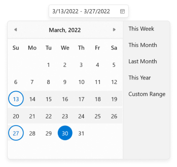

# Show preset items in dropdown calendar of Calendar DateRange Picker

## Show preset items in dropdown

You can show collection of preset items in dropdown of `Calendar DateRange Picker` control using [`Preset`](https://help.syncfusion.com/cr/winui/Syncfusion.UI.Xaml.Calendar.SfCalendarDateRangePicker.html#Syncfusion_UI_Xaml_Calendar_SfCalendarDateRangePicker_Preset) and [`PresetTemplate`](https://help.syncfusion.com/cr/winui/Syncfusion.UI.Xaml.Calendar.SfCalendarDateRangePicker.html#Syncfusion_UI_Xaml_Calendar_SfCalendarDateRangePicker_PresetTemplate) properties. Bind the collection of preset items to be displayed in `Preset` property and set the required template in `PresetTemplate` property.




//ViewModel class
class ViewModel
    {
        public ObservableCollection<string> PresetCollection { get; set; }
        public ViewModel()
        {
            PresetCollection = new ObservableCollection<string>();
            PresetCollection.Add("This Week");
            PresetCollection.Add("This Month");
            PresetCollection.Add("Last Month");
            PresetCollection.Add("This Year");
            PresetCollection.Add("Custom Range");
        }
    }




Add the `Syncfusion.UI.Xaml.Calendar` namespace reference in code-behind.




<Grid>
    <Grid.DataContext>
        <local:ViewModel x:Name="viewModel" />
    </Grid.DataContext>
    <calendar:SfCalendarDateRangePicker  x:Name="sfCalendarDateRangePicker" Height="35" Width="200"
                                        Preset="{x:Bind viewModel.PresetCollection, Mode=TwoWay}" >
        <calendar:SfCalendarDateRangePicker.PresetTemplate>
            <DataTemplate>
                <ListBox ItemsSource="{Binding}" SelectionChanged="ListBox_SelectionChanged" />
            </DataTemplate>
        </calendar:SfCalendarDateRangePicker.PresetTemplate>
    </calendar:SfCalendarDateRangePicker>
</Grid>




private void ListBox_SelectionChanged(object sender, SelectionChangedEventArgs e)
{
    ListBox listBox = sender as ListBox;
    DateTimeOffset todayDate = DateTimeOffset.Now;

    if (listBox.SelectedItem.ToString() == "This Week")
    {
        DateTimeOffset startdate = DateTimeOffset startdate = todayDate.AddDays(-(todayDate.DayOfWeek - (DayOfWeek)sfCalendarDateRangePicker.FirstDayOfWeek));
        sfCalendarDateRangePicker.SelectedRange = new DateTimeOffsetRange(startdate, startdate.AddDays(6));
    }
    else if (listBox.SelectedItem.ToString() == "This Month")
    {
        DateTimeOffset startdate = todayDate.AddDays(-(todayDate.Date.Day - 1));
        int daysToAdd = DateTime.DaysInMonth(startdate.Year, startdate.Month) - 1;
        DateTimeOffset lastDateInMonth = startdate.AddDays(daysToAdd);
        sfCalendarDateRangePicker.SelectedRange = new DateTimeOffsetRange(startdate, lastDateInMonth);
    }
    else if (listBox.SelectedItem.ToString() == "Last Month")
    {
        DateTimeOffset startdate = todayDate.AddMonths(-1).AddDays(-(todayDate.Date.Day - 1));
        int daysToAdd = DateTime.DaysInMonth(startdate.Year, startdate.Month) - 1;
        DateTimeOffset lastDateInMonth = startdate.AddDays(daysToAdd);
        sfCalendarDateRangePicker.SelectedRange = new DateTimeOffsetRange(startdate, lastDateInMonth);
    }
    else if (listBox.SelectedItem.ToString() == "This Year")
    {
        DateTimeOffset startdate = todayDate.AddMonths(-(todayDate.Month - 1)).AddDays(-(todayDate.Date.Day - 1));
        int daysToAdd = DateTime.DaysInMonth(startdate.Year, startdate.Month) - 1;
        DateTimeOffset lastDateInLastMonth = startdate.AddMonths(11).AddDays(daysToAdd);
        sfCalendarDateRangePicker.SelectedRange = new DateTimeOffsetRange(startdate, lastDateInLastMonth);
    }
    else
    {
        sfCalendarDateRangePicker.SelectedRange = null;
    }
}




## Hide calendar on selecting a preset item

You can hide calendar in the dropdown when user selects any preset items in dropdown other than **CustomRange** using `ShowCalendar` property. When user wants to selects a custom range of dates, upon selection of **CustomRange** preset item, calendar is added in dropdown of `Calendar DateRange Picker` control. By default, the value of `ShowCalendar` property is `true`.




privateprivate void ListBox_SelectionChanged(object sender, SelectionChangedEventArgs e)
{
    ListBox listBox = sender as ListBox;
    sfCalendarDateRangePicker.ShowCalendar = false;
    DateTimeOffset todayDate = DateTimeOffset.Now;

    if (listBox.SelectedItem.ToString() == "This Week")
    {
        DateTimeOffset startdate = todayDate.AddDays(-(todayDate.DayOfWeek - sfCalendarDateRangePicker.FirstDayOfWeek));
        sfCalendarDateRangePicker.SelectedRange = new DateTimeOffsetRange(startdate, startdate.AddDays(6));
    }
    else if (listBox.SelectedItem.ToString() == "This Month")
    {
        DateTimeOffset startdate = todayDate.AddDays(-(todayDate.Date.Day - 1));
        int daysToAdd = DateTime.DaysInMonth(startdate.Year, startdate.Month) - 1;
        DateTimeOffset lastDateInMonth = startdate.AddDays(daysToAdd);
        sfCalendarDateRangePicker.SelectedRange = new DateTimeOffsetRange(startdate, lastDateInMonth);
    }
    else if (listBox.SelectedItem.ToString() == "Last Month")
    {
        DateTimeOffset startdate = todayDate.AddMonths(-1).AddDays(-(todayDate.Date.Day - 1));
        int daysToAdd = DateTime.DaysInMonth(startdate.Year, startdate.Month) - 1;
        DateTimeOffset lastDateInMonth = startdate.AddDays(daysToAdd);
        sfCalendarDateRangePicker.SelectedRange = new DateTimeOffsetRange(startdate, lastDateInMonth);
    }
    else if (listBox.SelectedItem.ToString() == "This Year")
    {
        DateTimeOffset startdate = todayDate.AddMonths(-(todayDate.Month - 1)).AddDays(-(todayDate.Date.Day - 1));
        int daysToAdd = DateTime.DaysInMonth(startdate.Year, startdate.Month) - 1;
        DateTimeOffset lastDateInLastMonth = startdate.AddMonths(11).AddDays(daysToAdd);
        sfCalendarDateRangePicker.SelectedRange = new DateTimeOffsetRange(startdate, lastDateInLastMonth);
    }
    else
    {
        sfCalendarDateRangePicker.SelectedRange = null;
        sfCalendarDateRangePicker.ShowCalendar = true;
    }
}




N> Download demo from [GitHub](https://github.com/SyncfusionExamples/syncfusion-winui-tools-calendar-daterange-picker-examples/tree/main/Samples/PresetItems)