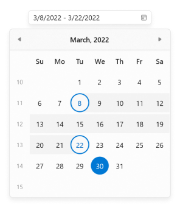
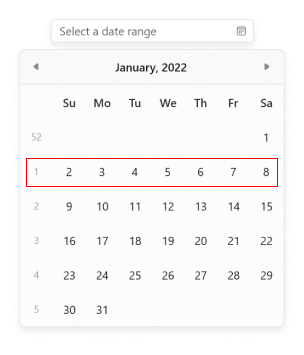

# Week number of the WinUI Calendar DateRange Picker

This section describes about the week number in [Calendar DateRange Picker](https://help.syncfusion.com/cr/winui/Syncfusion.UI.Xaml.Calendar.SfCalendarDateRangePicker.html) control.

## Enable week numbers

You can show week numbers for each week in the dropdown calendar of [Calendar DateRange Picker](https://help.syncfusion.com/cr/winui/Syncfusion.UI.Xaml.Calendar.SfCalendarDateRangePicker.html) control by setting the value of[ShowWeekNumbers](https://help.syncfusion.com/cr/winui/Syncfusion.UI.Xaml.Calendar.SfCalendarDateRangePicker.html#Syncfusion_UI_Xaml_Calendar_SfCalendarDateRangePicker_ShowWeekNumbers) property as **true**. By default, the value of `ShowWeekNumber` property is **false**.

N> You can change the value of [WeekNumberRule](https://help.syncfusion.com/cr/winui/Syncfusion.UI.Xaml.Calendar.SfCalendarDateRangePicker.html#Syncfusion_UI_Xaml_Calendar_SfCalendarDateRangePicker_WeekNumberRule) property with the [CalendarWeekRule](https://docs.microsoft.com/en-us/dotnet/api/system.globalization.calendarweekrule?view=net-5.0) and you can also add any prefix or suffix characters to **#** for `WeekNumberFormat` property.




<calendar:SfCalendarDateRangePicker HorizontalAlignment="Center" VerticalAlignment="Center"
                     ShowWeekNumbers="True"
                     />




SfCalendarDateRangePicker sfCalendarDateRangePicker = new SfCalendarDateRangePicker();
sfCalendarDateRangePicker.ShowWeekNumbers = true;




## Week rule

You can change the rule for determining the first week of the year in the dropdown calendar of the [Calendar DateRange Picker](https://help.syncfusion.com/cr/winui/Syncfusion.UI.Xaml.Calendar.SfCalendarDateRangePicker.html) control using the [WeekNumberRule](https://help.syncfusion.com/cr/winui/Syncfusion.UI.Xaml.Calendar.SfCalendarDateRangePicker.html#Syncfusion_UI_Xaml_Calendar_SfCalendarDateRangePicker_WeekNumberRule) property. The default value of the `WeekNumberRule` property is **FirstDay**. You can apply any one of the below rules to the `WeekNumberRule` property.

* **FirstDay** - Indicates that the first week of the year begins on the first day of the year and ends before the following designated first day of the week.

* **FirstFourDayWeek** - Indicates that the first week of the year is the first week with four or more days before the designated first day of the week.

* **FirstFullWeek** - Indicates that the first week of the year begins on the first occurrence of the designated first day of the week on or after the first day of the year.




<calendar:SfCalendarDateRangePicker HorizontalAlignment="Center" VerticalAlignment="Center"
                     ShowWeekNumbers="True" WeekNumberRule="FirstFullWeek"
                     />




SfCalendarDateRangePicker sfCalendarDateRangePicker = new SfCalendarDateRangePicker();
sfCalendarDateRangePicker.ShowWeekNumbers = true;
sfCalendarDateRangePicker.WeekNumberRule = CalendarWeekRule.FirstFullWeek;




## Format week numbers

You can customize the format in which week numbers are displayed in the dropdown calendar of [Calendar DateRange Picker](https://help.syncfusion.com/cr/winui/Syncfusion.UI.Xaml.Calendar.SfCalendarDateRangePicker.html) control using [WeekNumberFormat](https://help.syncfusion.com/cr/winui/Syncfusion.UI.Xaml.Calendar.SfCalendarDateRangePicker.html#Syncfusion_UI_Xaml_Calendar_SfCalendarDateRangePicker_WeekNumberFormat) property. The default value of `WeekNumberFormat` property is **#**.

N> You can add any prefix or suffix characters to **#** in `WeekNumberFormat` property to apply different custom formats.




<calendar:SfCalendarDateRangePicker HorizontalAlignment="Center" VerticalAlignment="Center"
                                    ShowWeekNumbers="True" WeekNumberRule="FirstFullWeek"
                                    WeekNumberFormat = "W #" />




SfCalendarDateRangePicker sfCalendarDateRangePicker = new SfCalendarDateRangePicker();
sfCalendarDateRangePicker.ShowWeekNumbers = true;
sfCalendarDateRangePicker.WeekNumberRule = CalendarWeekRule.FirstFullWeek;
sfCalendarDateRangePicker.WeekNumberFormat = "W #";




## Customize the week number and name of days of the week appearance

[Calendar DateRange Picker](https://help.syncfusion.com/cr/winui/Syncfusion.UI.Xaml.Calendar.SfCalendarDateRangePicker.html) control allows you to customize the template of the week numbers using [WeekNumberTemplate](https://help.syncfusion.com/cr/winui/Syncfusion.UI.Xaml.Calendar.CalendarItemTemplateSelector.html#Syncfusion_UI_Xaml_Calendar_CalendarItemTemplateSelector_WeekNumberTemplate) property and the template of name of days of the week using [WeekNameTemplate](https://help.syncfusion.com/cr/winui/Syncfusion.UI.Xaml.Calendar.CalendarItemTemplateSelector.html#Syncfusion_UI_Xaml_Calendar_CalendarItemTemplateSelector_WeekNameTemplate) property in the `CalendarItemTemplateSelector` class. 

In below codes we have created a `DataTemplate` for both `WeekNumberTemplate` and `WeekNameTemplate` properties in `CalendarItemTemplateSelector` class.




<Grid>
    <Grid.Resources>
        <DataTemplate x:Key="WeekNameAndNumberTemplate">
            <Viewbox >
                <Grid>
                    <Ellipse Width="30" 
                                Height="30" 
                                Fill="White"
                                HorizontalAlignment="Center" VerticalAlignment="Center"
                                Margin="1" />
                    <TextBlock Text="{Binding DisplayText}" 
                                HorizontalAlignment="Center"
                                VerticalAlignment="Center" 
                                Foreground="DeepSkyBlue"/>
                </Grid>
            </Viewbox>
        </DataTemplate>
    </Grid.Resources>
    <calendar:SfCalendarDateRangePicker x:Name="sfCalendarDateRangePicker"
                                        HorizontalAlignment="Center" VerticalAlignment="Center" ShowWeekNumbers="True"
                                        WeekNumberRule="FirstFullWeek"
                                        >
        <FlyoutBase.AttachedFlyout>
            <editors:DropDownFlyout>
                <calendar:SfCalendar ShowWeekNumbers="{x:Bind sfCalendarDateRangePicker.ShowWeekNumbers,Mode=TwoWay}" >
                    <calendar:SfCalendar.Resources>
                        
                    </calendar:SfCalendar.Resources>
                </calendar:SfCalendar>
            </editors:DropDownFlyout>
        </FlyoutBase.AttachedFlyout>
    </calendar:SfCalendarDateRangePicker>
</Grid>


