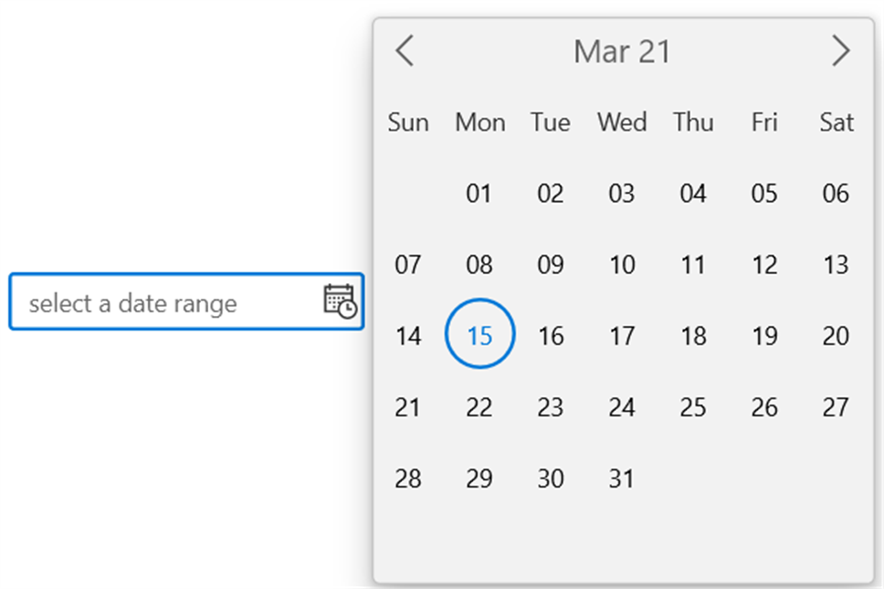
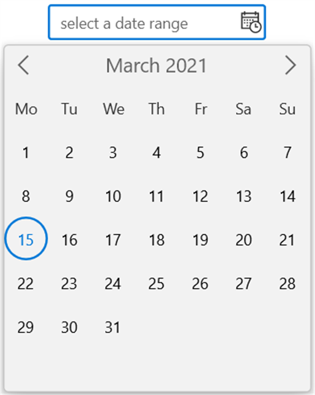

# Dropdown Calendar in WinUI Calendar DateRangePicker

This section describes how to select a date range from dropdown calendar and customization options available in `Calendar DateRangePicker` control.

## Change dropdown alignment

You can change the alignment of the dropdown calendar as full, center, left, right, top or bottom edge by using the `DropDownPlacement` property. The default value of `DropDownPlacement` property is `Auto`.

N> If you change the dropdown alignment by using `DropDownPlacement` property and there is not sufficient space, then `Calendar DateRangePicker` smartly shifts the dropdown calendar alignment.




<calendar:SfCalendarDateRangePicker DropDownPlacement="Right" 
                             x:Name="sfCalendarDateRangePicker"/>




SfCalendarDateRangePicker sfCalendarDateRangePicker = new SfCalendarDateRangePicker();
sfCalendarDateRangePicker.DropDownPlacement = FlyoutPlacementMode.Right;




## Hide the dropdown button

You can hide the dropdown button in `Calendar DateRangePicker` by setting the `ShowDropDownButton` property value as `false`. The default value of `ShowDropDownButton` property is `true`.

N> When the dropdown button is hidden, you can still open the dropdown calendar use `ALT + down` keyboard shortcut.




<calendar:SfCalendarDateRangePicker ShowDropDownButton="False" 
                               x:Name="sfCalendarDateRangePicker"/>




SfCalendarDateRangePicker sfCalendarDateRangePicker = new SfCalendarDateRangePicker();
sfCalendarDateRangePicker.ShowDropDownButton = false;




## Show the submit buttons

You can show the submit buttons in `Calendar DateRangePicker` by setting the `ShowSubmitButtons` property value as `true`. The default value of `ShowSubmitButtons` property is `false`.

N> When the submit buttons are hidden, you can change the `SelectedDate` property value by simply selecting the date.




<calendar:SfCalendarDateRangePicker ShowSubmitButtons="True" 
                               x:Name="sfCalendarDateRangePicker"/>




SfCalendarDateRangePicker sfCalendarDateRangePicker = new SfCalendarDateRangePicker();
sfCalendarDateRangePicker.ShowSubmitButtons = true;




## First day of week

By default, Sunday is shown as the first day of the week in a dropdown calendar of `Calendar DateRangePicker` control. You can change the first day of week, by changing the `FirstDayOfWeek` property value. The default value of `FirstDayOfWeek` property is `Sunday`.




<calendar:SfCalendarDateRangePicker x:Name="sfCalendarDateRangePicker" 
                               FirstDayOfWeek="Monday"/>




SfCalendarDateRangePicker sfCalendarDateRangePicker = new SfCalendarDateRangePicker();
sfCalendarDateRangePicker.FirstDayOfWeek = DayOfWeek.Monday;




## Showing preset items in dropdown

You can show collection of preset items in dropdown of `Calendar DateRangePicker` control using `Preset` and `PresetTemplate` properties. Bind the collection of preset items to be displayed in `Preset` property and set the required template in `PresetTemplate` property.




//ViewModel class
class ViewModel
    {
        public ObservableCollection<string> PresetCollection { get; set; }
        public ViewModel()
        {
            PresetCollection = new ObservableCollection<string>();
            PresetCollection.Add("This Week");
            PresetCollection.Add("This Month");
            PresetCollection.Add("Last Month");
            PresetCollection.Add("This Year");
            PresetCollection.Add("Custom Range");
        }
    }




Add the `Syncfusion.UI.Xaml.Calendar` namespace reference in code-behind.




<Page
    x:Class="Calendar_WinUI_FT.MainPage"
    xmlns="http://schemas.microsoft.com/winfx/2006/xaml/presentation"
    xmlns:x="http://schemas.microsoft.com/winfx/2006/xaml"
    xmlns:local="using:Calendar_WinUI_FT"
    xmlns:d="http://schemas.microsoft.com/expression/blend/2008"
    xmlns:mc="http://schemas.openxmlformats.org/markup-compatibility/2006" xmlns:calendar="using:Syncfusion.UI.Xaml.Calendar"
    mc:Ignorable="d"
    Background="{ThemeResource ApplicationPageBackgroundThemeBrush}">
    <Page.DataContext>
        <local:ViewModel x:Name="viewModel" />
    </Page.DataContext>
    <Grid>
        <calendar:SfCalendarDateRangePicker  x:Name="sfCalendar" Height="35" Width="200"
                                            Preset="{x:Bind viewModel.PresetCollection, Mode=TwoWay}" >
            <calendar:SfCalendarDateRangePicker.PresetTemplate>
                <DataTemplate>
                    <ListBox ItemsSource="{Binding}" SelectionChanged="ListBox_SelectionChanged" />
                </DataTemplate>
            </calendar:SfCalendarDateRangePicker.PresetTemplate>
        </calendar:SfCalendarDateRangePicker>
    </Grid>
</Page>




 private void ListBox_SelectionChanged(object sender, SelectionChangedEventArgs e)
 {
    ListBox listBox = sender as ListBox;
    this.sfCalendarDateRangePicker.ShowCalendar = false;
    if (listBox.SelectedItem.ToString() == "This Week")
    {
        DateTimeOffset startdate = DateTimeOffset.Now.AddDays(-(DateTimeOffset.Now.DayOfWeek - sfCalendarDateRangePicker.FirstDayOfWeek));
        this.sfCalendarDateRangePicker.SelectedRange = new DateTimeOffsetRange(startdate, startdate.AddDays(6));
    }
    else if (listBox.SelectedItem.ToString() == "This Month")
    {
        DateTimeOffset startdate = DateTimeOffset.Now.AddDays(-(DateTimeOffset.Now.Date.Day - 1));
        this.sfCalendarDateRangePicker.SelectedRange = new DateTimeOffsetRange(startdate, startdate.AddDays(DateTime.DaysInMonth(startdate.Year, startdate.Month) - 1));
    }
    else if (listBox.SelectedItem.ToString() == "Last Month")
    {
        DateTimeOffset startdate = DateTimeOffset.Now.AddMonths(1).AddDays(-(DateTimeOffset.Now.Date.Day - 1));
        this.sfCalendarDateRangePicker.SelectedRange = new DateTimeOffsetRange(startdate, startdate.AddDays(DateTime.DaysInMonth(startdate.Year, startdate.Month) - 1));
    }
    else if (listBox.SelectedItem.ToString() == "This Year")
    {
        DateTimeOffset startdate = DateTimeOffset.Now.AddMonths(-(DateTimeOffset.Now.Month - 1)).AddDays(-(DateTimeOffset.Now.Date.Day - 1));
        this.sfCalendarDateRangePicker.SelectedRange = new DateTimeOffsetRange(startdate, startdate.AddMonths(11).AddDays(DateTime.DaysInMonth(startdate.Year, startdate.Month) - 1));
    }
    else
    {
        this.sfCalendarDateRangePicker.SelectedRange = null;
        this.sfCalendarDateRangePicker.ShowCalendar = true;
    }
 }




## Change dropdown size

You can change the size of dropdown calendar in `Calendar DateRangePicker` by using `DropDownHeight` property. The default value of `DropDownHeight` property is `NaN`.

N> The dropdown size will be automatically resized based on the calendar and preset items hosted in it.




<calendar:SfCalendarDateRangePicker DropDownHeight="500"
                               x:Name="sfCalendarDateRangePicker"/>




SfCalendarDateRangePicker sfCalendarDateRangePicker = new SfCalendarDateRangePicker();
sfCalendarDateRangePicker.DropDownHeight = 500;




## Change flow direction

By default, flow direction is changed automatically based on selected `CalendarIdentifier` value in `Calendar DateRangePicker` control. However you can override it by explicitly specifying the `FlowDirection` property value. The default value of `FlowDirection` property is `LeftToRight`.

N> When `CalendarIdentifier` and `FlowDirection` properties are set, `FlowDirection` property is given higher precedence.




<calendar:SfCalendarDateRangePicker FlowDirection="RightToLeft" 
                               x:Name="sfCalendarDateRangePicker"/>




SfCalendarDateRangePicker sfCalendarDateRangePicker = new SfCalendarDateRangePicker();
sfCalendarDateRangePicker.FlowDirection = FlowDirection.RightToLeft;




## Customize individual items in Calendar

You can change the UI of specific cells in `Calendar DateRangePicker` dropdown calendar by using the [AttachedFlyout](https://docs.microsoft.com/en-us/uwp/api/windows.ui.xaml.controls.primitives.flyoutbase.attachedflyout?view=winrt-19041) and `DropDownFlyout` properties.




public class CustomCalendarItemTemplateSelector : DataTemplateSelector
{
     public CustomCalendarItemTemplateSelector()
    {
            SpecialDates = new Dictionary<DateTimeOffset, string>();
            SpecialDates.Add(DateTimeOffset.Now.AddMonths(-1).AddDays(1), "SingleEvent_1");
            SpecialDates.Add(DateTimeOffset.Now.AddMonths(-1).AddDays(5), "DoubleEvent_1");
            SpecialDates.Add(DateTimeOffset.Now.AddMonths(-1).AddDays(-2), "TripleEvent_2");
            SpecialDates.Add(DateTimeOffset.Now.AddDays(1), "TripleEvent_1");
            SpecialDates.Add(DateTimeOffset.Now.AddDays(5), "SingleEvent_2");
            SpecialDates.Add(DateTimeOffset.Now.AddDays(7), "DoubleEvent_2");
            SpecialDates.Add(DateTimeOffset.Now.AddDays(9), "SingleEvent_1");
            SpecialDates.Add(DateTimeOffset.Now.AddDays(12), "TripleEvent_2");
            SpecialDates.Add(DateTimeOffset.Now.AddDays(-4), "DoubleEvent_1");
            SpecialDates.Add(DateTimeOffset.Now.AddMonths(1).AddDays(1), "DoubleEvent_3");
            SpecialDates.Add(DateTimeOffset.Now.AddMonths(1).AddDays(3), "SingleEvent_2");
            SpecialDates.Add(DateTimeOffset.Now.AddMonths(1).AddDays(-5), "DoubleEvent_2");
    }

    private Dictionary<DateTimeOffset, string> SpecialDates { get; set; }

    public DataTemplate DefaultTemplate { get; set; }
    public DataTemplate SingleEventTemplate_1 { get; set; }
    public DataTemplate SingleEventTemplate_2 { get; set; }
    public DataTemplate DoubleEventTemplate_1 { get; set; }
    public DataTemplate DoubleEventTemplate_2 { get; set; }
    public DataTemplate DoubleEventTemplate_3 { get; set; }
    public DataTemplate TripleEventTemplate_1 { get; set; }
    public DataTemplate TripleEventTemplate_2 { get; set; }

    protected override DataTemplate SelectTemplateCore(object item, DependencyObject container)
    {
        if (item != null)
        {
            DateTimeOffset calendarItem = (DateTimeOffset)item;
            DateTimeOffset dateTimeOffset = SpecialDates.Keys.FirstOrDefault(x => x.Date == calendarItem.Date);

            if (dateTimeOffset != DateTimeOffset.MinValue)
            {
                string template = this.SpecialDates[dateTimeOffset];

                switch (template)
                {
                    case "SingleEvent_1":
                        return SingleEventTemplate_1;
                    case "SingleEvent_2":
                        return SingleEventTemplate_2;
                    case "DoubleEvent_1":
                        return DoubleEventTemplate_1;
                    case "DoubleEvent_2":
                        return DoubleEventTemplate_2;
                    case "DoubleEvent_3":
                        return DoubleEventTemplate_3;
                    case "TripleEvent_1":
                        return TripleEventTemplate_1;
                    case "TripleEvent_2":
                        return TripleEventTemplate_2;
                }
            }

            return DefaultTemplate;
        }

        return base.SelectTemplateCore(item, container);
    }
}







<Page.Resources>
    <DataTemplate x:Key="defaultTemplate">
    </DataTemplate>
    <DataTemplate x:Key="singleEventTemplate_1">
        <StackPanel Orientation="Horizontal">
            <Ellipse MinWidth="4" MinHeight="4" Fill="DeepPink" Margin="2"/>
        </StackPanel>
    </DataTemplate>
    <DataTemplate x:Key="singleEventTemplate_2">
        <StackPanel Orientation="Horizontal">
            <Ellipse MinWidth="4" MinHeight="4" Fill="Cyan" Margin="2"/>
        </StackPanel>
    </DataTemplate>
    <DataTemplate x:Key="doubleEventTemplate_1">
        <StackPanel Orientation="Horizontal">
            <Ellipse MinWidth="4" MinHeight="4" Fill="Violet" Margin="2"/>
            <Ellipse MinWidth="4" MinHeight="4" Fill="Orange" Margin="2"/>
        </StackPanel>
    </DataTemplate>
    <DataTemplate x:Key="doubleEventTemplate_2">
        <StackPanel Orientation="Horizontal">
            <Ellipse MinWidth="4" MinHeight="4" Fill="Gold" Margin="2"/>
            <Ellipse MinWidth="4" MinHeight="4" Fill="Green" Margin="2"/>
        </StackPanel>
    </DataTemplate>
    <DataTemplate x:Key="doubleEventTemplate_3">
        <StackPanel Orientation="Horizontal">
            <Ellipse MinWidth="4" MinHeight="4" Fill="Brown" Margin="2"/>
            <Ellipse MinWidth="4" MinHeight="4" Fill="Blue" Margin="2"/>
        </StackPanel>
    </DataTemplate>
    <DataTemplate x:Key="tripleEventTemplate_1">
        <StackPanel Orientation="Horizontal">
            <Ellipse MinWidth="4" MinHeight="4" Fill="Green" Margin="2"/>
            <Ellipse MinWidth="4" MinHeight="4" Fill="DeepSkyBlue" Margin="2"/>
            <Ellipse MinWidth="4" MinHeight="4" Fill="Orange" Margin="2"/>
        </StackPanel>
    </DataTemplate>
     <DataTemplate x:Key="tripleEventTemplate_2">
        <StackPanel Orientation="Horizontal">
            <Ellipse MinWidth="4" MinHeight="4" Fill="Red" Margin="2"/>
            <Ellipse MinWidth="4" MinHeight="4" Fill="Green" Margin="2"/>
            <Ellipse MinWidth="4" MinHeight="4" Fill="Gold" Margin="2"/>
        </StackPanel>
    </DataTemplate>
</Page.Resources>
<Grid>
    <calendar:SfCalendarDateRangePicker
                        x:Name="calendarDateRangePicker"
                        MinWidth="180"
                        HorizontalAlignment="Center"
                        VerticalAlignment="Center">
        <FlyoutBase.AttachedFlyout>
            <editor:DropDownFlyout>
                    <calendar:SfCalendar SelectionMode="Range" 
                                         SelectedRange="{x:Bind calendarDateRangePicker.SelectedRange, Mode=TwoWay}" >
                        <calendar:SfCalendar.Resources>
                            <ResourceDictionary>
                                <!--  Resources and color keys for Calendar Control  -->
                                <SolidColorBrush x:Key="SyncfusionCalendarItemOutOfScopeForeground"
                                                 Color="SlateGray" Opacity="0.5" />
                                <SolidColorBrush x:Key="SyncfusionCalendarWeekItemForeground"
                                                 Color="{ThemeResource SystemBaseMediumLowColor}" />
                                <x:Double x:Key="SyncfusionSubtitleAltFontSize">16</x:Double>
                                <Thickness x:Key="SyncfusionCalendarItemMargin">1</Thickness>
                                <x:Double x:Key="SyncfusionBodyFontSize">13</x:Double>

                                <local:CustomCalendarItemTemplateSelector x:Key="selector"
                                    SingleEventTemplate_1="{StaticResource singleEventTemplate_1}"
                                    SingleEventTemplate_2="{StaticResource singleEventTemplate_2}"
                                    DoubleEventTemplate_1="{StaticResource doubleEventTemplate_1}"
                                    DoubleEventTemplate_2="{StaticResource doubleEventTemplate_2}"                                                                     
                                    DoubleEventTemplate_3="{StaticResource doubleEventTemplate_3}"
                                    TripleEventTemplate_1="{StaticResource tripleEventTemplate_1}"
                                    TripleEventTemplate_2="{StaticResource tripleEventTemplate_2}"
                                    DefaultTemplate="{StaticResource defaultTemplate}"/>
                                
                            </ResourceDictionary>
                        </calendar:SfCalendar.Resources>
                    </calendar:SfCalendar>
            </editor:DropDownFlyout>
        </FlyoutBase.AttachedFlyout>
    </calendar:SfCalendarDateRangePicker>
</Grid>




