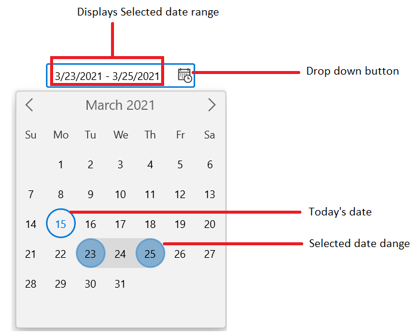
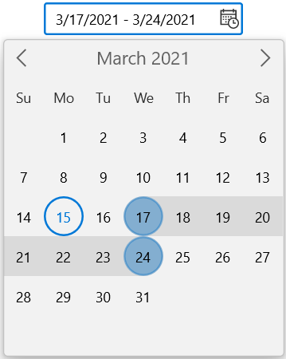

# Getting Started with WinUI Calendar DateRangePicker

This section explains the steps required to add the `Calendar DateRangePicker` control and its date range selection options. 

## Structure of Calendar DateRangePicker control

## Creating an application with WinUI Calendar DateRangePicker

1. Create a [WinUI 3 desktop app for C# and .NET 5](https://docs.microsoft.com/en-us/windows/apps/winui/winui3/get-started-winui3-for-desktop) or [WinUI 3 app in UWP for C#](https://docs.microsoft.com/en-us/windows/apps/winui/winui3/get-started-winui3-for-uwp).
2. Add reference to [Syncfusion.Calendar.WinUI](https://www.nuget.org/packages/Syncfusion.Calendar.WinUI) NuGet. 
3. Import the control namespace `Syncfusion.UI.Xaml.Calendar` in XAML or C# code.
4. Initialize the `Calendar DateRangePicker` control.




<Page
    x:Class="GettingStarted.MainPage"
    xmlns="http://schemas.microsoft.com/winfx/2006/xaml/presentation"
    xmlns:x="http://schemas.microsoft.com/winfx/2006/xaml"
    xmlns:local="using:GettingStarted"
    xmlns:d="http://schemas.microsoft.com/expression/blend/2008"
    xmlns:mc="http://schemas.openxmlformats.org/markup-compatibility/2006"
    xmlns:calendar="using:Syncfusion.UI.Xaml.Calendar"
    mc:Ignorable="d"
    Background="{ThemeResource ApplicationPageBackgroundThemeBrush}">
    <Grid Name="grid">
        <!--Adding CalendarDateRangePicker control -->
        <calendar:SfCalendarDateRangePicker Name="sfCalendarDateRangePicker"/>
    </Grid>
</Page>




using Syncfusion.UI.Xaml.Calendar;

namespace GettingStarted
{
    /// 

    /// An empty page that can be used on its own or navigated to within a Frame.
    /// 

    public sealed partial class MainPage : Page
    {
        public MainPage()
        {
            this.InitializeComponent();
            // Creating an instance of the Calendar control
            SfCalendarDateRangePicker sfCalendarDateRangePicker = new SfCalendarDateRangePicker();

            grid.Children.Add(sfCalendarDateRangePicker);
        }
    }
}




## Select the date range programmatically

You can set or change the selected date range programmatically by using `SelectedRange` property. By default, the `SelectedRange` property value is `null`.




SfCalendarDateRangePicker sfCalendarDateRangePicker= new SfCalendarDateRangePicker();
sfCalendarDateRangePicker.SelectedRange = new DateTimeOffsetRange(new DateTimeOffset(new DateTime(2021, 03,10)), new DateTimeOffset(new DateTime(2021, 03, 22)));




## Select date range interactively

You can change the selected date range interactively by selecting from drop down calendar. You can get the selected date range from the `SelectedRange` property.




<calendar:SfCalendarDateRangePicker Name="sfCalendarDateRangePicker" />




SfCalendarDateRangePicker sfCalendarDateRangePicker= new SfCalendarDateRangePicker();




## Setting watermark text

You can prompt the user with any information by using the `PlaceHolderText` property. This watermark text will be displayed only when the `SelectedRange` property value is `null`. 




<calendar:SfCalendarDateRangePicker PlaceHolderText="Select the Date"
                               SelectedRange="{x:Null}"
                               Name="sfCalendarDateRangePicker" />




SfCalendarDateRangePicker sfCalendarDateRangePicker= new SfCalendarDateRangePicker();
sfCalendarDateRangePicker.PlaceHolderText = "Select the Date";
sfCalendarDateRangePicker.SelectedRange = null;




## Selected range changed notification

You will be notified when selected range changed in `Calendar DateRangePicker` by using `SelectedDateRangeChanged` event. The `SelectedDateRangeChanged` event contains the old and new start value of range in `RangeStartNewValue` and `RangeStartOldValue` properties and old and new end value of range in `RangeEndNewValue` and `RangeEndOldValue` properties.

* `RangeStartOldValue` - Gets a date which is previously selected as start value in range.
* `RangeStartNewValue` - Gets a date which is currently selected as start value in range.
* `RangeEndOldValue` - Gets a date which is previously selected as end value in range.
* `RangeEndNewValue` - Gets a date which is currently selected as end value in range.




<calendar:SfCalendarDateRangePicker SelectedDateChanged="SfCalendarDateRangePicker_SelectedDateChanged" 
                               Name="sfCalendarDateRangePicker"/>




SfCalendarDateRangePicker sfCalendarDateRangePicker = new SfCalendarDateRangePicker();
sfCalendarDateRangePicker.SelectedDateChanged += SfCalendarDateRangePicker_SelectedDateChanged;




You can handle the event as shown below.




private void SfCalendarDateRangePicker_SelectedDateChanged(object sender, SelectedDateChangedEventArgs e)
{
    var StartOldValue = e.RangeStartOldValue;
    var StartNewValue = e.RangeStartNewValue;
    var EndOldValue = e.RangeEndOldValue;
    var EndNewValue = e.RangeEndNewValue;
}



