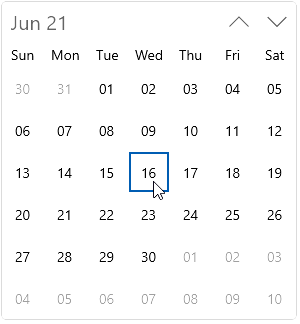

# Change display format in WinUI Calendar

This section describes about how to customize the date, month and year format displayed in [Calendar](https://help.syncfusion.com/cr/winui/Syncfusion.UI.Xaml.Calendar.SfCalendar.html) control.

## Date formatting

You can use different date formats such as abbreviated or full name for a day, month, week names or header name of month and year by using the [DateFormat](https://help.syncfusion.com/cr/winui/Syncfusion.UI.Xaml.Calendar.SfCalendar.html#Syncfusion_UI_Xaml_Calendar_SfCalendar_DateFormat), [MonthFormat](https://help.syncfusion.com/cr/winui/Syncfusion.UI.Xaml.Calendar.SfCalendar.html#Syncfusion_UI_Xaml_Calendar_SfCalendar_MonthFormat), [DayOfWeekFormat](https://help.syncfusion.com/cr/winui/Syncfusion.UI.Xaml.Calendar.SfCalendar.html#Syncfusion_UI_Xaml_Calendar_SfCalendar_DayOfWeekFormat) and [MonthHeaderFormat](https://help.syncfusion.com/cr/winui/Syncfusion.UI.Xaml.Calendar.SfCalendar.html#Syncfusion_UI_Xaml_Calendar_SfCalendar_MonthHeaderFormat) properties.

N> Refer [DateTimeFormatter](https://docs.microsoft.com/en-us/uwp/api/windows.globalization.datetimeformatting.datetimeformatter?view=winrt-19041) page to get more date formatting.




<calendar:SfCalendar DateFormat="{}{day.integer(2)}"
                     MonthFormat="{}{month.full}"
                     DayOfWeekFormat="{}{dayofweek.abbreviated(3)}"
                     MonthHeaderFormat="{}{month.abbreviated} {year.abbreviated}‎"
                     x:Name="sfCalendar"/>




SfCalendar sfCalendar = new SfCalendar();
sfCalendar.DateFormat = "{day.integer(2)}";
sfCalendar.MonthFormat = "{month.full}";
sfCalendar.DayOfWeekFormat = "{dayofweek.abbreviated(3)}";
sfCalendar.MonthHeaderFormat = "{month.abbreviated} {year.abbreviated}‎";




N> Download demo application from [GitHub](https://github.com/SyncfusionExamples/syncfusion-winui-tools-calendar-examples/blob/main/Samples/Formatting)

## Custom UI for specific cell in Calendar

You can change the UI of specific cells in `Calendar` by using the [CalendarItem.ContentTemplate](https://help.syncfusion.com/cr/winui/Syncfusion.UI.Xaml.Calendar.CalendarItem.html) property. The `DataContext` of `CalendarItem.ContentTemplate` is `Calendar`. 




public class CustomCalendarItemTemplateSelector : DataTemplateSelector
{
     public CustomCalendarItemTemplateSelector()
    {
            SpecialDates = new Dictionary<DateTimeOffset, string>();
            SpecialDates.Add(DateTimeOffset.Now.AddMonths(-1).AddDays(1), "SingleEvent_1");
            SpecialDates.Add(DateTimeOffset.Now.AddMonths(-1).AddDays(5), "DoubleEvent_1");
            SpecialDates.Add(DateTimeOffset.Now.AddMonths(-1).AddDays(-2), "TripleEvent_2");
            SpecialDates.Add(DateTimeOffset.Now.AddDays(1), "TripleEvent_1");
            SpecialDates.Add(DateTimeOffset.Now.AddDays(5), "SingleEvent_2");
            SpecialDates.Add(DateTimeOffset.Now.AddDays(7), "DoubleEvent_2");
            SpecialDates.Add(DateTimeOffset.Now.AddDays(9), "SingleEvent_1");
            SpecialDates.Add(DateTimeOffset.Now.AddDays(12), "TripleEvent_2");
            SpecialDates.Add(DateTimeOffset.Now.AddDays(-4), "DoubleEvent_1");
            SpecialDates.Add(DateTimeOffset.Now.AddMonths(1).AddDays(1), "DoubleEvent_3");
            SpecialDates.Add(DateTimeOffset.Now.AddMonths(1).AddDays(3), "SingleEvent_2");
            SpecialDates.Add(DateTimeOffset.Now.AddMonths(1).AddDays(-5), "DoubleEvent_2");
    }

    private Dictionary<DateTimeOffset, string> SpecialDates { get; set; }

    public DataTemplate DefaultTemplate { get; set; }
    public DataTemplate SingleEventTemplate_1 { get; set; }
    public DataTemplate SingleEventTemplate_2 { get; set; }
    public DataTemplate DoubleEventTemplate_1 { get; set; }
    public DataTemplate DoubleEventTemplate_2 { get; set; }
    public DataTemplate DoubleEventTemplate_3 { get; set; }
    public DataTemplate TripleEventTemplate_1 { get; set; }
    public DataTemplate TripleEventTemplate_2 { get; set; }

    protected override DataTemplate SelectTemplateCore(object item, DependencyObject container)
    {
        if (item != null)
        {
            DateTimeOffset calendarItem = (DateTimeOffset)item;
            DateTimeOffset dateTimeOffset = SpecialDates.Keys.FirstOrDefault(x => x.Date == calendarItem.Date);

            if (dateTimeOffset != DateTimeOffset.MinValue)
            {
                string template = this.SpecialDates[dateTimeOffset];

                switch (template)
                {
                    case "SingleEvent_1":
                        return SingleEventTemplate_1;
                    case "SingleEvent_2":
                        return SingleEventTemplate_2;
                    case "DoubleEvent_1":
                        return DoubleEventTemplate_1;
                    case "DoubleEvent_2":
                        return DoubleEventTemplate_2;
                    case "DoubleEvent_3":
                        return DoubleEventTemplate_3;
                    case "TripleEvent_1":
                        return TripleEventTemplate_1;
                    case "TripleEvent_2":
                        return TripleEventTemplate_2;
                }
            }

            return DefaultTemplate;
        }

        return base.SelectTemplateCore(item, container);
    }
}







<Page.Resources>
    <DataTemplate x:Key="defaultTemplate">
    </DataTemplate>
    <DataTemplate x:Key="singleEventTemplate_1">
        <StackPanel Orientation="Horizontal">
            <Ellipse MinWidth="4" MinHeight="4" Fill="DeepPink" Margin="2"/>
        </StackPanel>
    </DataTemplate>
    <DataTemplate x:Key="singleEventTemplate_2">
        <StackPanel Orientation="Horizontal">
            <Ellipse MinWidth="4" MinHeight="4" Fill="Cyan" Margin="2"/>
        </StackPanel>
    </DataTemplate>
    <DataTemplate x:Key="doubleEventTemplate_1">
        <StackPanel Orientation="Horizontal">
            <Ellipse MinWidth="4" MinHeight="4" Fill="Violet" Margin="2"/>
            <Ellipse MinWidth="4" MinHeight="4" Fill="Orange" Margin="2"/>
        </StackPanel>
    </DataTemplate>
    <DataTemplate x:Key="doubleEventTemplate_2">
        <StackPanel Orientation="Horizontal">
            <Ellipse MinWidth="4" MinHeight="4" Fill="Gold" Margin="2"/>
            <Ellipse MinWidth="4" MinHeight="4" Fill="Green" Margin="2"/>
        </StackPanel>
    </DataTemplate>
    <DataTemplate x:Key="doubleEventTemplate_3">
        <StackPanel Orientation="Horizontal">
            <Ellipse MinWidth="4" MinHeight="4" Fill="Brown" Margin="2"/>
            <Ellipse MinWidth="4" MinHeight="4" Fill="Blue" Margin="2"/>
        </StackPanel>
    </DataTemplate>
    <DataTemplate x:Key="tripleEventTemplate_1">
        <StackPanel Orientation="Horizontal">
            <Ellipse MinWidth="4" MinHeight="4" Fill="Green" Margin="2"/>
            <Ellipse MinWidth="4" MinHeight="4" Fill="DeepSkyBlue" Margin="2"/>
            <Ellipse MinWidth="4" MinHeight="4" Fill="Orange" Margin="2"/>
        </StackPanel>
    </DataTemplate>
     <DataTemplate x:Key="tripleEventTemplate_2">
        <StackPanel Orientation="Horizontal">
            <Ellipse MinWidth="4" MinHeight="4" Fill="Red" Margin="2"/>
            <Ellipse MinWidth="4" MinHeight="4" Fill="Green" Margin="2"/>
            <Ellipse MinWidth="4" MinHeight="4" Fill="Gold" Margin="2"/>
        </StackPanel>
    </DataTemplate>
</Page.Resources>
 <Grid>
    <calendar:SfCalendar
                    CornerRadius="14"
                    DayOfWeekFormat="{}{dayofweek.abbreviated(3)}">
            <calendar:SfCalendar.Resources>
                <ResourceDictionary>
                    <!--  Resources and color keys for Calendar Control  -->
                    <SolidColorBrush x:Key="SyncfusionCalendarItemOutOfScopeForeground"
                                                 Color="SlateGray" Opacity="0.5" />
                    <SolidColorBrush x:Key="SyncfusionCalendarWeekItemForeground"
                                                 Color="{ThemeResource SystemBaseMediumLowColor}" />
                    <x:Double x:Key="SyncfusionSubtitleAltFontSize">16</x:Double>
                    <Thickness x:Key="SyncfusionCalendarItemMargin">1</Thickness>
                    <x:Double x:Key="SyncfusionBodyFontSize">13</x:Double>
                    <local:CustomCalendarItemTemplateSelector x:Key="selector"
                                    SingleEventTemplate_1="{StaticResource singleEventTemplate_1}"
                                    SingleEventTemplate_2="{StaticResource singleEventTemplate_2}"
                                    DoubleEventTemplate_1="{StaticResource doubleEventTemplate_1}"
                                    DoubleEventTemplate_2="{StaticResource doubleEventTemplate_2}"                                                                     
                                    DoubleEventTemplate_3="{StaticResource doubleEventTemplate_3}"
                                    TripleEventTemplate_1="{StaticResource tripleEventTemplate_1}"
                                    TripleEventTemplate_2="{StaticResource tripleEventTemplate_2}"
                                    DefaultTemplate="{StaticResource defaultTemplate}"/>
                    
                </ResourceDictionary>
            </calendar:SfCalendar.Resources>
    </calendar:SfCalendar>
</Grid>




N> Download demo application from [GitHub](https://github.com/SyncfusionExamples/syncfusion-winui-tools-calendar-examples/blob/main/Samples/CustomUI)
