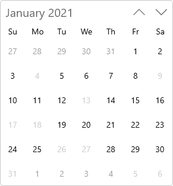
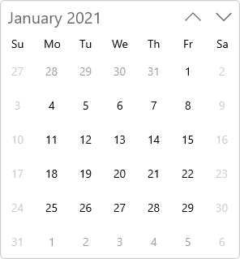
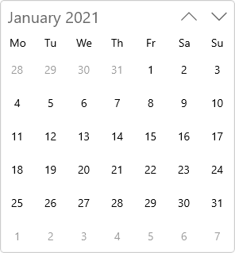
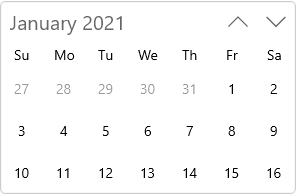
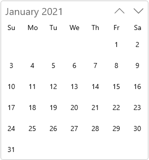

# Getting Started with WinUI Calendar

This section explains the steps required to add the [Calendar](https://help.syncfusion.com/cr/winui/Syncfusion.UI.Xaml.Calendar.SfCalendar.html) control and its date selection options. This section covers only basic features needed to get started with Syncfusion `Calendar` control.

## Structure of Calendar control

## Creating an application with WinUI Calendar

1. Create a [WinUI 3 desktop app for C# and .NET 5](https://docs.microsoft.com/en-us/windows/apps/winui/winui3/get-started-winui3-for-desktop) or [WinUI 3 app in UWP for C#](https://docs.microsoft.com/en-us/windows/apps/winui/winui3/get-started-winui3-for-uwp).
2. Add reference to [Syncfusion.Calendar.WinUI](https://www.nuget.org/packages/Syncfusion.Calendar.WinUI) NuGet. 
3. Import the control namespace `Syncfusion.UI.Xaml.Calendar` in XAML or C# code.
4. Initialize the `SfCalendar` control.




<Page
    x:Class="GettingStarted.MainPage"
    xmlns="http://schemas.microsoft.com/winfx/2006/xaml/presentation"
    xmlns:x="http://schemas.microsoft.com/winfx/2006/xaml"
    xmlns:local="using:GettingStarted"
    xmlns:d="http://schemas.microsoft.com/expression/blend/2008"
    xmlns:mc="http://schemas.openxmlformats.org/markup-compatibility/2006"
    xmlns:calendar="using:Syncfusion.UI.Xaml.Calendar"
    mc:Ignorable="d"
    Background="{ThemeResource ApplicationPageBackgroundThemeBrush}">
    <Grid Name="grid">
        <!--Adding Calendar control -->
        <calendar:SfCalendar Name="sfCalendar"/>
    </Grid>
</Page>




using Syncfusion.UI.Xaml.Calendar;

namespace GettingStarted
{
    /// 

    /// An empty page that can be used on its own or navigated to within a Frame.
    /// 

    public sealed partial class MainPage : Page
    {
        public MainPage()
        {
            this.InitializeComponent();
            // Creating an instance of the Calendar control
            SfCalendar sfCalendar = new SfCalendar();

            grid.Children.Add(sfCalendar);
        }
    }
}




N> Download demo application from [GitHub](https://github.com/SyncfusionExamples/syncfusion-winui-tools-calendar-examples/blob/main/Samples/Getting_started)

## Select the date programmatically

You can set or change the selected date programmatically by using [SelectedDate](https://help.syncfusion.com/cr/winui/Syncfusion.UI.Xaml.Calendar.SfCalendar.html#Syncfusion_UI_Xaml_Calendar_SfCalendar_SelectedDate) property. If you not assign any value for the `SelectedDate` property, `Calendar` will automatically assign the current system date as `SelectedDate`.




SfCalendar sfCalendar= new SfCalendar();
sfCalendar.SelectedDate = new DateTimeOffset(new DateTime(2021, 01, 06));




N> Download demo application from [GitHub](https://github.com/SyncfusionExamples/syncfusion-winui-tools-calendar-examples/blob/main/Samples/Restriction)

## Select multiple dates

By default, `Calendar` control allows you to select single date at a time. If you want to select multiple dates from different month, year or decade or from century, use the [SelectionMode](https://help.syncfusion.com/cr/winui/Syncfusion.UI.Xaml.Calendar.SfCalendar.html#Syncfusion_UI_Xaml_Calendar_SfCalendar_SelectionMode) property value as `Multiple`. You can gets the selected dates from the [SelectedDates](https://help.syncfusion.com/cr/winui/Syncfusion.UI.Xaml.Calendar.SfCalendar.html#Syncfusion_UI_Xaml_Calendar_SfCalendar_SelectedDates) collection.

You can select required value for `SelectionMode` property from below values.

* **None** - Prevents from selecting a date.
* **Single** - Allows to select a single date.
* **Multiple** - Allows to select multiple dates.
* **Range** -  Allows to select range of dates.




<calendar:SfCalendar Name="sfCalendar" 
                     SelectionMode="Multiple" />




SfCalendar sfCalendar= new SfCalendar();
sfCalendar.SelectionMode = CalendarSelectionMode.Multiple;




N> Download demo application from [GitHub](https://github.com/SyncfusionExamples/syncfusion-winui-tools-calendar-examples/blob/main/Samples/Selection)

## Restrict date selection

You can restrict the users from selecting a date within the particular range by specifying [MinDate](https://help.syncfusion.com/cr/winui/Syncfusion.UI.Xaml.Calendar.SfCalendar.html#Syncfusion_UI_Xaml_Calendar_SfCalendar_MinDate) and [MaxDate](https://help.syncfusion.com/cr/winui/Syncfusion.UI.Xaml.Calendar.SfCalendar.html#Syncfusion_UI_Xaml_Calendar_SfCalendar_MaxDate) properties. The default value of `MinDate` property is `1/1/1920 12:00:00 AM +00:00` and `MaxDate` property is `12/31/2120 11:59:59 PM +00:00`.

N> Dates not within the minimum and maximum date range is updated with blackout dates appearance.




SfCalendar sfCalendar = new SfCalendar();
sfCalendar.MinDate = new DateTimeOffset(new DateTime(2021, 03, 9));
sfCalendar.MaxDate = new DateTimeOffset(new DateTime(2021, 01, 23));




N> Download demo application from [GitHub](https://github.com/SyncfusionExamples/syncfusion-winui-tools-calendar-examples/blob/main/Samples/Restriction)

## Block dates using BlackoutDates

If you want to block particular dates from the date selection, add that dates into the [BlackoutDates](https://help.syncfusion.com/cr/winui/Syncfusion.UI.Xaml.Calendar.SfCalendar.html#Syncfusion_UI_Xaml_Calendar_SfCalendar_BlackoutDates) collection. You can add more block out dates to the `BlackoutDates` collection. The default value of `BlackoutDates` property is `null`.




public class ViewModel
{       
    public DateTimeOffsetCollection BlockedDates { get; set; }
    public ViewModel()
    {
        BlockedDates = new DateTimeOffsetCollection();
        BlockedDates.Add(new DateTimeOffset(new DateTime(2021, 1, 17)));
        BlockedDates.Add(new DateTimeOffset(new DateTime(2021, 1, 4)));
        BlockedDates.Add(new DateTimeOffset(new DateTime(2021, 2, 5)));
        BlockedDates.Add(new DateTimeOffset(new DateTime(2021, 2, 6)));
        BlockedDates.Add(new DateTimeOffset(new DateTime(2021, 1, 9)));
        BlockedDates.Add(new DateTimeOffset(new DateTime(2021, 3, 11)));
        BlockedDates.Add(new DateTimeOffset(new DateTime(2021, 1, 13)));
        BlockedDates.Add(new DateTimeOffset(new DateTime(2021, 4, 14)));
        BlockedDates.Add(new DateTimeOffset(new DateTime(2021, 1, 18)));
        BlockedDates.Add(new DateTimeOffset(new DateTime(2021, 5, 19)));
        BlockedDates.Add(new DateTimeOffset(new DateTime(2021, 1, 26)));
        BlockedDates.Add(new DateTimeOffset(new DateTime(2021, 6, 29)));
        BlockedDates.Add(new DateTimeOffset(new DateTime(2021, 1, 31)));
        BlockedDates.Add(new DateTimeOffset(new DateTime(2021, 1, 27)));
    }
}







<calendar:SfCalendar BlackoutDates="{Binding BlockedDates}" 
                     x:Name="sfCalendar">
    <calendar:SfCalendar.DataContext>
        <local:ViewModel/>
    </calendar:SfCalendar.DataContext>
</calendar:SfCalendar>




sfCalendar.DataContext = new ViewModel();
sfCalendar.BlackoutDates = (sfCalendar.DataContext as ViewModel).BlockedDates;




N> Download demo application from [GitHub](https://github.com/SyncfusionExamples/syncfusion-winui-tools-calendar-examples/blob/main/Samples/BlockedDates)

## Disable/block all weekends

You can prevent the users from selecting weekend days or any other dates by handling the [ItemPrepared](https://help.syncfusion.com/cr/winui/Syncfusion.UI.Xaml.Calendar.SfCalendar.html#Syncfusion_UI_Xaml_Calendar_SfCalendar_ItemPrepared) event and setting [ItemInfo.IsBlackout](https://help.syncfusion.com/cr/winui/Syncfusion.UI.Xaml.Calendar.CalendarItemPreparedEventArgs.html#Syncfusion_UI_Xaml_Calendar_CalendarItemPreparedEventArgs_ItemInfo) property value as `true` for that specific dates.




<calendar:SfCalendar x:Name="sfCalendar" ItemPrepared="SfCalendar_ItemPrepared"/>




SfCalendar sfCalendar = new SfCalendar();
sfCalendar.ItemPrepared += SfCalendar_ItemPrepared;




You can handle the event as follows:




private void SfCalendar_ItemPrepared(object sender, CalendarItemPreparedEventArgs e)
{
    //Block all weekend days
    if (e.ItemInfo.ItemType == CalendarItemType.Day &&
        (e.ItemInfo.Date.DayOfWeek == DayOfWeek.Saturday ||
        e.ItemInfo.Date.DayOfWeek == DayOfWeek.Sunday))
    {
        e.ItemInfo.IsBlackout = true;
    }
}




N> Download demo application from [GitHub](https://github.com/SyncfusionExamples/syncfusion-winui-tools-calendar-examples/blob/main/Samples/Formatting)

## Custom UI for specific cell in Calendar

You can change the UI of specific cells in `Calendar` by using the [CalendarItem.ContentTemplate](https://help.syncfusion.com/cr/winui/Syncfusion.UI.Xaml.Calendar.CalendarItem.html) property. The `DataContext` of `CalendarItem.ContentTemplate` is `Calendar`. 




public class CustomCalendarItemTemplateSelector : DataTemplateSelector
{
     public CustomCalendarItemTemplateSelector()
    {
            SpecialDates = new Dictionary<DateTimeOffset, string>();
            SpecialDates.Add(DateTimeOffset.Now.AddMonths(-1).AddDays(1), "SingleEvent_1");
            SpecialDates.Add(DateTimeOffset.Now.AddMonths(-1).AddDays(5), "DoubleEvent_1");
            SpecialDates.Add(DateTimeOffset.Now.AddMonths(-1).AddDays(-2), "TripleEvent_2");
            SpecialDates.Add(DateTimeOffset.Now.AddDays(1), "TripleEvent_1");
            SpecialDates.Add(DateTimeOffset.Now.AddDays(5), "SingleEvent_2");
            SpecialDates.Add(DateTimeOffset.Now.AddDays(7), "DoubleEvent_2");
            SpecialDates.Add(DateTimeOffset.Now.AddDays(9), "SingleEvent_1");
            SpecialDates.Add(DateTimeOffset.Now.AddDays(12), "TripleEvent_2");
            SpecialDates.Add(DateTimeOffset.Now.AddDays(-4), "DoubleEvent_1");
            SpecialDates.Add(DateTimeOffset.Now.AddMonths(1).AddDays(1), "DoubleEvent_3");
            SpecialDates.Add(DateTimeOffset.Now.AddMonths(1).AddDays(3), "SingleEvent_2");
            SpecialDates.Add(DateTimeOffset.Now.AddMonths(1).AddDays(-5), "DoubleEvent_2");
    }

    private Dictionary<DateTimeOffset, string> SpecialDates { get; set; }

    public DataTemplate DefaultTemplate { get; set; }
    public DataTemplate SingleEventTemplate_1 { get; set; }
    public DataTemplate SingleEventTemplate_2 { get; set; }
    public DataTemplate DoubleEventTemplate_1 { get; set; }
    public DataTemplate DoubleEventTemplate_2 { get; set; }
    public DataTemplate DoubleEventTemplate_3 { get; set; }
    public DataTemplate TripleEventTemplate_1 { get; set; }
    public DataTemplate TripleEventTemplate_2 { get; set; }

    protected override DataTemplate SelectTemplateCore(object item, DependencyObject container)
    {
        if (item != null)
        {
            DateTimeOffset calendarItem = (DateTimeOffset)item;
            DateTimeOffset dateTimeOffset = SpecialDates.Keys.FirstOrDefault(x => x.Date == calendarItem.Date);

            if (dateTimeOffset != DateTimeOffset.MinValue)
            {
                string template = this.SpecialDates[dateTimeOffset];

                switch (template)
                {
                    case "SingleEvent_1":
                        return SingleEventTemplate_1;
                    case "SingleEvent_2":
                        return SingleEventTemplate_2;
                    case "DoubleEvent_1":
                        return DoubleEventTemplate_1;
                    case "DoubleEvent_2":
                        return DoubleEventTemplate_2;
                    case "DoubleEvent_3":
                        return DoubleEventTemplate_3;
                    case "TripleEvent_1":
                        return TripleEventTemplate_1;
                    case "TripleEvent_2":
                        return TripleEventTemplate_2;
                }
            }

            return DefaultTemplate;
        }

        return base.SelectTemplateCore(item, container);
    }
}







<Page.Resources>
    <DataTemplate x:Key="defaultTemplate">
    </DataTemplate>
    <DataTemplate x:Key="singleEventTemplate_1">
        <StackPanel Orientation="Horizontal">
            <Ellipse MinWidth="4" MinHeight="4" Fill="DeepPink" Margin="2"/>
        </StackPanel>
    </DataTemplate>
    <DataTemplate x:Key="singleEventTemplate_2">
        <StackPanel Orientation="Horizontal">
            <Ellipse MinWidth="4" MinHeight="4" Fill="Cyan" Margin="2"/>
        </StackPanel>
    </DataTemplate>
    <DataTemplate x:Key="doubleEventTemplate_1">
        <StackPanel Orientation="Horizontal">
            <Ellipse MinWidth="4" MinHeight="4" Fill="Violet" Margin="2"/>
            <Ellipse MinWidth="4" MinHeight="4" Fill="Orange" Margin="2"/>
        </StackPanel>
    </DataTemplate>
    <DataTemplate x:Key="doubleEventTemplate_2">
        <StackPanel Orientation="Horizontal">
            <Ellipse MinWidth="4" MinHeight="4" Fill="Gold" Margin="2"/>
            <Ellipse MinWidth="4" MinHeight="4" Fill="Green" Margin="2"/>
        </StackPanel>
    </DataTemplate>
    <DataTemplate x:Key="doubleEventTemplate_3">
        <StackPanel Orientation="Horizontal">
            <Ellipse MinWidth="4" MinHeight="4" Fill="Brown" Margin="2"/>
            <Ellipse MinWidth="4" MinHeight="4" Fill="Blue" Margin="2"/>
        </StackPanel>
    </DataTemplate>
    <DataTemplate x:Key="tripleEventTemplate_1">
        <StackPanel Orientation="Horizontal">
            <Ellipse MinWidth="4" MinHeight="4" Fill="Green" Margin="2"/>
            <Ellipse MinWidth="4" MinHeight="4" Fill="DeepSkyBlue" Margin="2"/>
            <Ellipse MinWidth="4" MinHeight="4" Fill="Orange" Margin="2"/>
        </StackPanel>
    </DataTemplate>
     <DataTemplate x:Key="tripleEventTemplate_2">
        <StackPanel Orientation="Horizontal">
            <Ellipse MinWidth="4" MinHeight="4" Fill="Red" Margin="2"/>
            <Ellipse MinWidth="4" MinHeight="4" Fill="Green" Margin="2"/>
            <Ellipse MinWidth="4" MinHeight="4" Fill="Gold" Margin="2"/>
        </StackPanel>
    </DataTemplate>
</Page.Resources>
 <Grid>
    <calendar:SfCalendar
                    CornerRadius="14"
                    DayOfWeekFormat="{}{dayofweek.abbreviated(3)}">
            <calendar:SfCalendar.Resources>
                <ResourceDictionary>
                    <!--  Resources and color keys for Calendar Control  -->
                    <SolidColorBrush x:Key="SyncfusionCalendarItemOutOfScopeForeground"
                                                 Color="SlateGray" Opacity="0.5" />
                    <SolidColorBrush x:Key="SyncfusionCalendarWeekItemForeground"
                                                 Color="{ThemeResource SystemBaseMediumLowColor}" />
                    <x:Double x:Key="SyncfusionSubtitleAltFontSize">16</x:Double>
                    <Thickness x:Key="SyncfusionCalendarItemMargin">1</Thickness>
                    <x:Double x:Key="SyncfusionBodyFontSize">13</x:Double>
                    <local:CustomCalendarItemTemplateSelector x:Key="selector"
                                    SingleEventTemplate_1="{StaticResource singleEventTemplate_1}"
                                    SingleEventTemplate_2="{StaticResource singleEventTemplate_2}"
                                    DoubleEventTemplate_1="{StaticResource doubleEventTemplate_1}"
                                    DoubleEventTemplate_2="{StaticResource doubleEventTemplate_2}"                                                                     
                                    DoubleEventTemplate_3="{StaticResource doubleEventTemplate_3}"
                                    TripleEventTemplate_1="{StaticResource tripleEventTemplate_1}"
                                    TripleEventTemplate_2="{StaticResource tripleEventTemplate_2}"
                                    DefaultTemplate="{StaticResource defaultTemplate}"/>
                    
                </ResourceDictionary>
            </calendar:SfCalendar.Resources>
    </calendar:SfCalendar>
</Grid>




N> Download demo application from [GitHub](https://github.com/SyncfusionExamples/syncfusion-winui-tools-calendar-examples/blob/main/Samples/CustomUI)

## Selected date changed notification

You will be notified when selected date changed in `Calendar` by using [SelectedDateChanged](https://help.syncfusion.com/cr/winui/Syncfusion.UI.Xaml.Calendar.SfCalendar.html#Syncfusion_UI_Xaml_Calendar_SfCalendar_SelectedDateChanged) event. The [SelectedDateChanged](https://help.syncfusion.com/cr/winui/Syncfusion.UI.Xaml.Calendar.SelectedDateChangedEventArgs.html) event contains the old and newly selected date in the [OldDate](https://help.syncfusion.com/cr/winui/Syncfusion.UI.Xaml.Calendar.SelectedDateChangedEventArgs.html#Syncfusion_UI_Xaml_Calendar_SelectedDateChangedEventArgs_OldDate), [NewDate](https://help.syncfusion.com/cr/winui/Syncfusion.UI.Xaml.Calendar.SelectedDateChangedEventArgs.html#Syncfusion_UI_Xaml_Calendar_SelectedDateChangedEventArgs_NewDate) properties.

* `OldDate` - Gets a date which is previously selected.
* `NewDate` - Gets a date which is currently selected.




<calendar:SfCalendar SelectedDateChanged="SfCalendar_SelectedDateChanged" 
                     Name="sfCalendar"/>




SfCalendar sfCalendar = new SfCalendar();
sfCalendar.SelectedDateChanged += SfCalendar_SelectedDateChanged;




You can handle the event as follows:




private void SfCalendar_SelectedDateChanged(object sender, SelectedDateChangedEventArgs e)
{
    var oldDate = e.OldDate;
    var newDate = e.NewDate;
}




## Date formatting

You can use different date formats such as abbreviated or full name for a day, month, week names or header name of month and year by using the [DateFormat](https://help.syncfusion.com/cr/winui/Syncfusion.UI.Xaml.Calendar.SfCalendar.html#Syncfusion_UI_Xaml_Calendar_SfCalendar_DateFormat), [MonthFormat](https://help.syncfusion.com/cr/winui/Syncfusion.UI.Xaml.Calendar.SfCalendar.html#Syncfusion_UI_Xaml_Calendar_SfCalendar_MonthFormat), [DayOfWeekFormat](https://help.syncfusion.com/cr/winui/Syncfusion.UI.Xaml.Calendar.SfCalendar.html#Syncfusion_UI_Xaml_Calendar_SfCalendar_DayOfWeekFormat) and [HeaderFormatInMonthView](https://help.syncfusion.com/cr/winui/Syncfusion.UI.Xaml.Calendar.SfCalendar.html#Syncfusion_UI_Xaml_Calendar_SfCalendar_HeaderFormatInMonthView) properties.

N> Refer [DateTimeFormatter](https://docs.microsoft.com/en-us/uwp/api/windows.globalization.datetimeformatting.datetimeformatter?view=winrt-19041) page to get more date formatting.




<calendar:SfCalendar DateFormat="{}{day.integer(2)}"
                     MonthFormat="{}{month.full}"
                     DayOfWeekFormat="{}{dayofweek.abbreviated(3)}"
                     HeaderFormatInMonthView="{}{month.abbreviated} {year.abbreviated}‎"
                     x:Name="sfCalendar"/>




SfCalendar sfCalendar = new SfCalendar();
sfCalendar.DateFormat = "{day.integer(2)}";
sfCalendar.MonthFormat = "{month.full}";
sfCalendar.DayOfWeekFormat = "{dayofweek.abbreviated(3)}";
sfCalendar.HeaderFormatInMonthView = "{month.abbreviated} {year.abbreviated}‎";




N> Download demo application from [GitHub](https://github.com/SyncfusionExamples/syncfusion-winui-tools-calendar-examples/blob/main/Samples/Formatting)

## Navigate between views

You can easily navigate to the month, year, decade, or century views to select different dates by repeatedly clicking the header button. Initially month view is loaded. If you want to change the initial view, use [DisplayMode](https://help.syncfusion.com/cr/winui/Syncfusion.UI.Xaml.Calendar.SfCalendar.html#Syncfusion_UI_Xaml_Calendar_SfCalendar_DisplayMode) property.

You can restrict navigation within a minimum and maximum views by using [MinDisplayMode](https://help.syncfusion.com/cr/winui/Syncfusion.UI.Xaml.Calendar.SfCalendar.html#Syncfusion_UI_Xaml_Calendar_SfCalendar_MinDisplayMode) and [MaxDisplayMode](https://help.syncfusion.com/cr/winui/Syncfusion.UI.Xaml.Calendar.SfCalendar.html#Syncfusion_UI_Xaml_Calendar_SfCalendar_MaxDisplayMode) properties. This will be useful when your date range is smaller and you don’t want to show century view.




<calendar:SfCalendar x:Name="sfCalendar"
                     MinDisplayMode="Month"
                     MaxDisplayMode="Century"
                     DisplayMode="Month"/>




SfCalendar sfCalendar = new SfCalendar();
sfCalendar.MinDisplayMode = CalendarDisplayMode.Month;
sfCalendar.MaxDisplayMode = CalendarDisplayMode.Century;
sfCalendar.DisplayMode = CalendarDisplayMode.Month;




N> Download demo application from [GitHub](https://github.com/SyncfusionExamples/syncfusion-winui-tools-calendar-examples/blob/main/Samples/Restriction)

## First day of week

By default, Sunday is shown as the first day of the week. If you want to change the first day of week, use the [FirstDayOfWeek](https://help.syncfusion.com/cr/winui/Syncfusion.UI.Xaml.Calendar.SfCalendar.html#Syncfusion_UI_Xaml_Calendar_SfCalendar_FirstDayOfWeek) property value. The default value of `FirstDayOfWeek` property is `Sunday`.




<calendar:SfCalendar x:Name="sfCalendar" 
                     FirstDayOfWeek="Monday"/>




SfCalendar sfCalendar = new SfCalendar();
sfCalendar.FirstDayOfWeek = DayOfWeek.Monday;




N> Download demo application from [GitHub](https://github.com/SyncfusionExamples/syncfusion-winui-tools-calendar-examples/blob/main/Samples/Selection)

## Number of weeks in a view

If you want to increase or decrease the number of weeks shown in a month view, use the [NumberOfWeeksInView](https://help.syncfusion.com/cr/winui/Syncfusion.UI.Xaml.Calendar.SfCalendar.html#Syncfusion_UI_Xaml_Calendar_SfCalendar_NumberOfWeeksInView) property. The default value of `NumberOfWeeksInView` property is `6`.




<calendar:SfCalendar NumberOfWeeksInView="3"
                     x:Name="sfCalendar"/>




SfCalendar sfCalendar = new SfCalendar();
sfCalendar.NumberOfWeeksInView = 3;




N> Download demo application from [GitHub](https://github.com/SyncfusionExamples/syncfusion-winui-tools-calendar-examples/blob/main/Samples/Selection)

## Hide days that is out of scope

By default, out of scope days are disabled. If you want to hide the days that are out of the scope of current view, use the [OutOfScopeVisibility](https://help.syncfusion.com/cr/winui/Syncfusion.UI.Xaml.Calendar.SfCalendar.html#Syncfusion_UI_Xaml_Calendar_SfCalendar_OutOfScopeVisibility) property value as `Hidden`. The default value of `OutOfScopeVisibility` property is `Disabled`.




<calendar:SfCalendar OutOfScopeVisibility="Hidden"
                     x:Name="sfCalendar"/>




SfCalendar sfCalendar = new SfCalendar();
sfCalendar.OutOfScopeVisibility = OutOfScopeVisibility.Hidden;




N> Download demo application from [GitHub](https://github.com/SyncfusionExamples/syncfusion-winui-tools-calendar-examples/blob/main/Samples/Restriction)

## Calendar types

The `Calendar` control supports different type of calendars, such as Gregorian, Julian, Hebrew, etc. You can change the calendar type by using [CalendarIdentifier](https://help.syncfusion.com/cr/winui/Syncfusion.UI.Xaml.Calendar.SfCalendar.html#Syncfusion_UI_Xaml_Calendar_SfCalendar_CalendarIdentifier) property. The default value of `CalendarIdentifier` property is `GregorianCalendar`.

You can select the required `CalendarIdentifier` value from below types.
 * JulianCalendar
 * GregorianCalendar
 * HebrewCalendar
 * HijriCalendar
 * KoreanCalendar
 * TaiwanCalendar
 * ThaiCalendar
 * UmAlQuraCalendar
 * PersianCalendar




<calendar:SfCalendar CalendarIdentifier="HebrewCalendar"
                     x:Name="sfCalendar"/>




SfCalendar sfCalendar = new SfCalendar();
sfCalendar.CalendarIdentifier = "HebrewCalendar";




N> Download demo application from [GitHub](https://github.com/SyncfusionExamples/syncfusion-winui-tools-calendar-examples/blob/main/Samples/Formatting)

## Culture support

If you want to localize the calendar, use the `Language` property. The default value of `Language` property is `en-US`.




<calendar:SfCalendar Language="fr"
                     x:Name="sfCalendar"/>




SfCalendar sfCalendar = new SfCalendar();
sfCalendar.Language = "fr";




N> Download demo application from [GitHub](https://github.com/SyncfusionExamples/syncfusion-winui-tools-calendar-examples/blob/main/Samples/Formatting)

## Today and selected date highlighting

You can highlight the today and selected date with rectangle and circle shapes. You can customize the selected date cell shape using `SelectionShape` property and use the [SelectionHighlightMode](https://help.syncfusion.com/cr/winui/Syncfusion.UI.Xaml.Calendar.SfCalendar.html#Syncfusion_UI_Xaml_Calendar_SfCalendar_SelectionHighlightMode) property to update the background of the selected date. The default value of `SelectionShape` property is `Rectangle` and `SelectionHighlightMode` property is `Outline`.




<calendar:SfCalendar SelectionHighlightMode="Filled"
                     SelectionShape="Circle"
                     x:Name="sfCalendar"/>




SfCalendar sfCalendar = new SfCalendar();
sfCalendar.SelectionHighlightMode = SelectionHighlightMode.FilledCircle;
sfCalendar.SelectionShape = SelectionShape.Circle;




N> Download demo application from [GitHub](https://github.com/SyncfusionExamples/syncfusion-winui-tools-calendar-examples/blob/main/Samples/Selection)

## Change flow direction

You can change the flow direction of the `Calendar` layout from right to left by setting the `FlowDirection` property value as `RightToLeft`. The default value of `FlowDirection` property is `LeftToRight`.




<calendar:SfCalendar FlowDirection="RightToLeft" 
                     x:Name="sfCalendar"/>




SfCalendar sfCalendar = new SfCalendar();
sfCalendar.FlowDirection = FlowDirection.RightToLeft;




N> Download demo application from [GitHub](https://github.com/SyncfusionExamples/syncfusion-winui-tools-calendar-examples/blob/main/Samples/Formatting)

