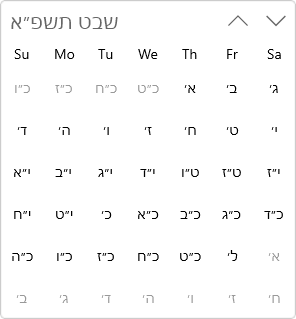
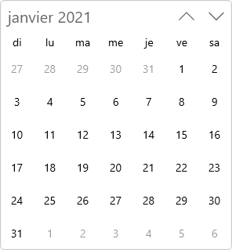

# Localize and change format in WinUI Calendar

This section describes how to localize [Calendar](https://help.syncfusion.com/cr/winui/Syncfusion.UI.Xaml.Calendar.SfCalendar.html) control using [`CalendarIdentifier`](https://help.syncfusion.com/cr/winui/Syncfusion.UI.Xaml.Calendar.SfCalendar.html#Syncfusion_UI_Xaml_Calendar_SfCalendar_CalendarIdentifier) and `Language` properties and to change the display formats.

## Types of Calendar

The `Calendar` control supports different type of calendars, such as Gregorian, Julian, Hebrew, etc. You can change the calendar type by using [CalendarIdentifier](https://help.syncfusion.com/cr/winui/Syncfusion.UI.Xaml.Calendar.SfCalendar.html#Syncfusion_UI_Xaml_Calendar_SfCalendar_CalendarIdentifier) property. The default value of `CalendarIdentifier` property is **GregorianCalendar**.

You can select the required `CalendarIdentifier` value from below types.
 * JulianCalendar
 * GregorianCalendar
 * HebrewCalendar
 * HijriCalendar
 * KoreanCalendar
 * TaiwanCalendar
 * ThaiCalendar
 * UmAlQuraCalendar
 * PersianCalendar

 N> When `CalendarIdentifier` and `FlowDirection` properties are set, FlowDirection property is given higher precedence.




<calendar:SfCalendar CalendarIdentifier="HebrewCalendar"
                     x:Name="sfCalendar"/>




SfCalendar sfCalendar = new SfCalendar();
sfCalendar.CalendarIdentifier = "HebrewCalendar";




N> Download demo application from [GitHub](https://github.com/SyncfusionExamples/syncfusion-winui-tools-calendar-examples/blob/main/Samples/Formatting)

## Change the language

You can localize the calendar using the `Language` property. The default value of `Language` property is **en-US**.




<calendar:SfCalendar Language="fr-FR"
                     x:Name="sfCalendar"/>




SfCalendar sfCalendar = new SfCalendar();
sfCalendar.Language = "fr";




N> Download demo application from [GitHub](https://github.com/SyncfusionExamples/syncfusion-winui-tools-calendar-examples/blob/main/Samples/Formatting)

## First day of week

By default, **Sunday** is shown as the first day of the week. If you want to change the first day of week, use the [FirstDayOfWeek](https://help.syncfusion.com/cr/winui/Syncfusion.UI.Xaml.Calendar.SfCalendar.html#Syncfusion_UI_Xaml_Calendar_SfCalendar_FirstDayOfWeek) property value.




<calendar:SfCalendar x:Name="sfCalendar" 
                     FirstDayOfWeek="Monday"/>




SfCalendar sfCalendar = new SfCalendar();
sfCalendar.FirstDayOfWeek = DayOfWeek.Monday;




N> Download demo application from [GitHub](https://github.com/SyncfusionExamples/syncfusion-winui-tools-calendar-examples/blob/main/Samples/Selection)

## Change flow direction

You can change the flow direction of the `Calendar` layout from right to left by setting the `FlowDirection` property value as `RightToLeft`. The default value of `FlowDirection` property is **LeftToRight**.

N> When `CalendarIdentifier` and `FlowDirection` properties are set, FlowDirection property is given higher precedence.




<calendar:SfCalendar FlowDirection="RightToLeft" 
                     x:Name="sfCalendar"/>




SfCalendar sfCalendar = new SfCalendar();
sfCalendar.FlowDirection = FlowDirection.RightToLeft;




N> Download demo application from [GitHub](https://github.com/SyncfusionExamples/syncfusion-winui-tools-calendar-examples/blob/main/Samples/Formatting)

## Change date display format

You can use different date formats such as abbreviated or full name for a day, month, week names or header name of month and year by using the [DateFormat](https://help.syncfusion.com/cr/winui/Syncfusion.UI.Xaml.Calendar.SfCalendar.html#Syncfusion_UI_Xaml_Calendar_SfCalendar_DateFormat), [MonthFormat](https://help.syncfusion.com/cr/winui/Syncfusion.UI.Xaml.Calendar.SfCalendar.html#Syncfusion_UI_Xaml_Calendar_SfCalendar_MonthFormat), [DayOfWeekFormat](https://help.syncfusion.com/cr/winui/Syncfusion.UI.Xaml.Calendar.SfCalendar.html#Syncfusion_UI_Xaml_Calendar_SfCalendar_DayOfWeekFormat) and [MonthHeaderFormat](https://help.syncfusion.com/cr/winui/Syncfusion.UI.Xaml.Calendar.SfCalendar.html#Syncfusion_UI_Xaml_Calendar_SfCalendar_MonthHeaderFormat) properties.

N> Refer [DateTimeFormatter](https://docs.microsoft.com/en-us/uwp/api/windows.globalization.datetimeformatting.datetimeformatter?view=winrt-19041) page to get more date formatting.




<calendar:SfCalendar DateFormat="{}{day.integer(2)}"
                     MonthFormat="{}{month.full}"
                     DayOfWeekFormat="{}{dayofweek.abbreviated(3)}"
                     MonthHeaderFormat="{}{month.abbreviated} {year.abbreviated}‎"
                     x:Name="sfCalendar"/>




SfCalendar sfCalendar = new SfCalendar();
sfCalendar.DateFormat = "{day.integer(2)}";
sfCalendar.MonthFormat = "{month.full}";
sfCalendar.DayOfWeekFormat = "{dayofweek.abbreviated(3)}";
sfCalendar.MonthHeaderFormat = "{month.abbreviated} {year.abbreviated}‎";




N> Download demo application from [GitHub](https://github.com/SyncfusionExamples/syncfusion-winui-tools-calendar-examples/blob/main/Samples/Formatting)

## Number of weeks in a view

If you want to increase or decrease the number of weeks shown in a month view, use the [NumberOfWeeksInView](https://help.syncfusion.com/cr/winui/Syncfusion.UI.Xaml.Calendar.SfCalendar.html#Syncfusion_UI_Xaml_Calendar_SfCalendar_NumberOfWeeksInView) property. The default value of `NumberOfWeeksInView` property is **6**.




<calendar:SfCalendar NumberOfWeeksInView="3"
                     x:Name="sfCalendar"/>




SfCalendar sfCalendar = new SfCalendar();
sfCalendar.NumberOfWeeksInView = 3;




N> Download demo application from [GitHub](https://github.com/SyncfusionExamples/syncfusion-winui-tools-calendar-examples/blob/main/Samples/Selection)

