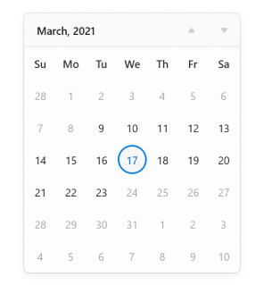
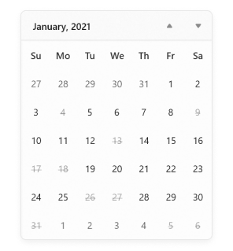
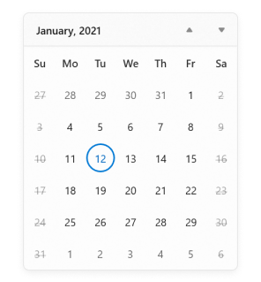
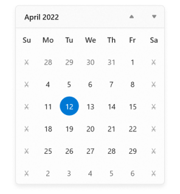

# Restrict date selection in WinUI Calendar (SfCalendar)

## Restrict selection

You can restrict the users from selecting a date within the particular range by specifying [MinDate](https://help.syncfusion.com/cr/winui/Syncfusion.UI.Xaml.Calendar.SfCalendar.html#Syncfusion_UI_Xaml_Calendar_SfCalendar_MinDate) and [MaxDate](https://help.syncfusion.com/cr/winui/Syncfusion.UI.Xaml.Calendar.SfCalendar.html#Syncfusion_UI_Xaml_Calendar_SfCalendar_MaxDate) properties. The default value of `MinDate` property is `1/1/1920` and `MaxDate` property is `12/31/2120`.

N> Dates that appear outside minimum and maximum date range will be disabled (blackout).




SfCalendar sfCalendar = new SfCalendar();
sfCalendar.MinDate = new DateTimeOffset(new DateTime(2021, 03, 9));
sfCalendar.MaxDate = new DateTimeOffset(new DateTime(2021, 03, 23));




N> Download demo application from [GitHub](https://github.com/SyncfusionExamples/syncfusion-winui-tools-calendar-examples/blob/main/Samples/Restriction)

## Disable dates using BlackoutDates

If you want to block particular dates from the selection, use [BlackoutDates](https://help.syncfusion.com/cr/winui/Syncfusion.UI.Xaml.Calendar.SfCalendar.html#Syncfusion_UI_Xaml_Calendar_SfCalendar_BlackoutDates) collection property. You can add more blackout dates to the `BlackoutDates` collection. The default value of `BlackoutDates` property is `null`.




public class ViewModel
{       
    public DateTimeOffsetCollection BlockedDates { get; set; }
    public ViewModel()
    {
        BlockedDates = new DateTimeOffsetCollection();
        BlockedDates.Add(new DateTimeOffset(new DateTime(2021, 1, 17)));
        BlockedDates.Add(new DateTimeOffset(new DateTime(2021, 1, 4)));
        BlockedDates.Add(new DateTimeOffset(new DateTime(2021, 2, 5)));
        BlockedDates.Add(new DateTimeOffset(new DateTime(2021, 2, 6)));
        BlockedDates.Add(new DateTimeOffset(new DateTime(2021, 1, 9)));
        BlockedDates.Add(new DateTimeOffset(new DateTime(2021, 3, 11)));
        BlockedDates.Add(new DateTimeOffset(new DateTime(2021, 1, 13)));
        BlockedDates.Add(new DateTimeOffset(new DateTime(2021, 4, 14)));
        BlockedDates.Add(new DateTimeOffset(new DateTime(2021, 1, 18)));
        BlockedDates.Add(new DateTimeOffset(new DateTime(2021, 5, 19)));
        BlockedDates.Add(new DateTimeOffset(new DateTime(2021, 1, 26)));
        BlockedDates.Add(new DateTimeOffset(new DateTime(2021, 6, 29)));
        BlockedDates.Add(new DateTimeOffset(new DateTime(2021, 1, 31)));
        BlockedDates.Add(new DateTimeOffset(new DateTime(2021, 1, 27)));
    }
}







<calendar:SfCalendar x:Name="sfCalendar" 
                     BlackoutDates="{Binding BlockedDates}">
    <calendar:SfCalendar.DataContext>
        <local:ViewModel/>
    </calendar:SfCalendar.DataContext>
</calendar:SfCalendar>




sfCalendar.DataContext = new ViewModel();
sfCalendar.BlackoutDates = (sfCalendar.DataContext as ViewModel).BlockedDates;




N> Download demo application from [GitHub](https://github.com/SyncfusionExamples/syncfusion-winui-tools-calendar-examples/tree/main/Samples/BlockedDates)

## Disable dates dynamically (All weekend days)

You can prevent the users from selecting any dates or days (example: all weekend days) by handling the [ItemPrepared](https://help.syncfusion.com/cr/winui/Syncfusion.UI.Xaml.Calendar.SfCalendar.html#Syncfusion_UI_Xaml_Calendar_SfCalendar_ItemPrepared) event and setting [ItemInfo.IsBlackout](https://help.syncfusion.com/cr/winui/Syncfusion.UI.Xaml.Calendar.CalendarItemPreparedEventArgs.html#Syncfusion_UI_Xaml_Calendar_CalendarItemPreparedEventArgs_ItemInfo) property value as **true** for that specific days or dates.




<calendar:SfCalendar x:Name="sfCalendar" 
                     ItemPrepared="SfCalendar_ItemPrepared">
</calendar:SfCalendar>




SfCalendar sfCalendar = new SfCalendar();
sfCalendar.ItemPrepared += SfCalendar_ItemPrepared;




You can handle the event as shown below.




private void SfCalendar_ItemPrepared(object sender, CalendarItemPreparedEventArgs e)
{
    //Block all weekend days
    if (e.ItemInfo.ItemType == CalendarItemType.Day &&
        (e.ItemInfo.Date.DayOfWeek == DayOfWeek.Saturday ||
        e.ItemInfo.Date.DayOfWeek == DayOfWeek.Sunday))
    {
        e.ItemInfo.IsBlackout = true;
    }
}




You can also change the text to be displayed for specific days or dates in `Calendar` using [ItemInfo.DisplayText](https://help.syncfusion.com/cr/winui/Syncfusion.UI.Xaml.Calendar.CalendarItemInfo.html#Syncfusion_UI_Xaml_Calendar_CalendarItemInfo_DisplayText) property. 




private void SfCalendar_ItemPrepared(object sender, CalendarItemPreparedEventArgs e)
{
    //Block all weekend days
    if (e.ItemInfo.ItemType == CalendarItemType.Day &&
        (e.ItemInfo.Date.DayOfWeek == DayOfWeek.Saturday ||
        e.ItemInfo.Date.DayOfWeek == DayOfWeek.Sunday))
    {
        e.ItemInfo.IsBlackout = true;
        e.ItemInfo.DisplayText = "X";
    }
}




N> Download demo application from [GitHub](https://github.com/SyncfusionExamples/syncfusion-winui-tools-calendar-examples/blob/main/Samples/Formatting)