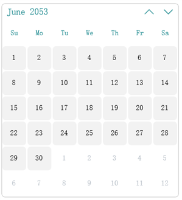

# UI customization of the WinUI Calendar (SfCalendar)

This section describes about the various customization options available in [Calendar](https://help.syncfusion.com/cr/winui/Syncfusion.UI.Xaml.Calendar.SfCalendar.html) control.

## Custom UI for specific cells in Calendar

You can change the UI of specific cells in `Calendar` by using the [CalendarItem.ContentTemplate](https://help.syncfusion.com/cr/winui/Syncfusion.UI.Xaml.Calendar.CalendarItem.html) property. The `DataContext` of `CalendarItem.ContentTemplate` is `Calendar`. 




public class EventDataConverter : IValueConverter
{
    Dictionary<DateTimeOffset, string> SpecialDates;
    public EventDataConverter()
    {
        SpecialDates = new Dictionary<DateTimeOffset, string>();
        SpecialDates.Add(DateTimeOffset.Now.AddMonths(-1).AddDays(1), "SingleEvent_1");
        SpecialDates.Add(DateTimeOffset.Now.AddMonths(-1).AddDays(5), "DoubleEvent_1");
        SpecialDates.Add(DateTimeOffset.Now.AddMonths(-1).AddDays(-2), "TripleEvent_2");
        SpecialDates.Add(DateTimeOffset.Now.AddDays(1), "TripleEvent_1");
        SpecialDates.Add(DateTimeOffset.Now.AddDays(5), "SingleEvent_2");
        SpecialDates.Add(DateTimeOffset.Now.AddDays(7), "DoubleEvent_2");
        SpecialDates.Add(DateTimeOffset.Now.AddDays(9), "SingleEvent_1");
        SpecialDates.Add(DateTimeOffset.Now.AddDays(12), "TripleEvent_2");
        SpecialDates.Add(DateTimeOffset.Now.AddDays(-4), "DoubleEvent_1");
        SpecialDates.Add(DateTimeOffset.Now.AddMonths(1).AddDays(1), "DoubleEvent_3");
        SpecialDates.Add(DateTimeOffset.Now.AddMonths(1).AddDays(3), "SingleEvent_2");
        SpecialDates.Add(DateTimeOffset.Now.AddMonths(1).AddDays(-5), "DoubleEvent_2");
    }
    public object Convert(object value, Type targetType, object parameter, string language)
    {
        DateTimeOffset dateTimeOffset = SpecialDates.Keys.FirstOrDefault(x => x.Date == (DateTime)value);

        if (dateTimeOffset != DateTimeOffset.MinValue)
        {
            string template = SpecialDates[dateTimeOffset];
            StackPanel stackPanel;
            switch (template)
            {
                case "SingleEvent_1":
                    return new List<Brush>() { new SolidColorBrush(Colors.DeepPink) };
                case "SingleEvent_2":
                    return new List<Brush>() { new SolidColorBrush(Colors.Cyan) };
                case "DoubleEvent_1":
                    return new List<Brush>() { new SolidColorBrush(Colors.Violet), new SolidColorBrush(Colors.Orange) };
                case "DoubleEvent_2":
                    return new List<Brush>() { new SolidColorBrush(Colors.Gold), new SolidColorBrush(Colors.Green) };
                case "DoubleEvent_3":
                    return new List<Brush>() { new SolidColorBrush(Colors.Brown), new SolidColorBrush(Colors.Blue) };
                case "TripleEvent_1":
                    return new List<Brush>() { new SolidColorBrush(Colors.Green), new SolidColorBrush(Colors.DeepSkyBlue), new SolidColorBrush(Colors.Orange) };
                case "TripleEvent_2":
                    return new List<Brush>() { new SolidColorBrush(Colors.Red), new SolidColorBrush(Colors.Green), new SolidColorBrush(Colors.Gold) };
            }
        }
        return null;
    }

    public object ConvertBack(object value, Type targetType, object parameter, string language)
    {
        return null;
    }
}







<Page.Resources>
    <local:EventDataConverter x:Key="EventDataConverterKey" />
    <DataTemplate x:Key="customTemplate">
        <ItemsControl ItemsSource="{Binding Path=Date, Converter={StaticResource EventDataConverterKey}}">
            <ItemsControl.ItemTemplate>
                <DataTemplate >
                    <Ellipse MinHeight="4" MinWidth="4" Margin="2" Fill="{Binding}"/>
                </DataTemplate>
            </ItemsControl.ItemTemplate>
            <ItemsControl.ItemsPanel>
                <ItemsPanelTemplate>
                    <StackPanel Orientation="Horizontal"/>
                </ItemsPanelTemplate>
            </ItemsControl.ItemsPanel>
        </ItemsControl>
    </DataTemplate>
</Page.Resources>
<Grid>
    <calendar:SfCalendar
                        CornerRadius="14"
                        DayOfWeekFormat="{}{dayofweek.abbreviated(3)}">
        <calendar:SfCalendar.Resources>
            <ResourceDictionary>
                <!--  Resources and color keys for Calendar Control  -->
                <SolidColorBrush x:Key="SyncfusionCalendarItemOutOfScopeForeground"
                                                 Color="SlateGray" Opacity="0.5" />
                <SolidColorBrush x:Key="SyncfusionCalendarWeekItemForeground"
                                                 Color="{ThemeResource SystemBaseMediumLowColor}" />
                <x:Double x:Key="SyncfusionSubtitleAltFontSize">16</x:Double>
                <Thickness x:Key="SyncfusionCalendarItemMargin">1</Thickness>
                <x:Double x:Key="SyncfusionBodyFontSize">13</x:Double>

                
            </ResourceDictionary>
        </calendar:SfCalendar.Resources>
    </calendar:SfCalendar>
</Grid>




N> Download demo application from [GitHub](https://github.com/SyncfusionExamples/syncfusion-winui-tools-calendar-examples/blob/main/Samples/CustomUI)

## Customize using theme keys

You can customize the colors of day names and headers of month, year, decade and century by changing the theme keys values in a `ResourceDictionary` used in the `Calendar` control.

<table>
<tr>
<th> Name of the key</th>
<th> Description </th>
</tr>
<tr>
<td>SyncfusionCalendarNavigationButtonForeground</td>
<td>Key to change the color of calendar navigation button foreground color.</td>
</tr>
<tr>
<td>SyncfusionCalendarWeekItemForeground</td>
<td>Key to change the color of calendar week days name foreground color.</td>
</tr>
<tr>
<td>SyncfusionCalendarTodayItemForeground</td>
<td>Key to change the color of calendar today date foreground color.</td>
</tr>
<tr>
<td>SyncfusionCalendarItemBackground</td>
<td>Key to change the color of calendar date cells background color except today date cell.</td>
</tr>
<tr>
<td>SyncfusionCalendarItemBorderBrush</td>
<td>Key to change the color of calendar date cells border brush.</td>
</tr>
<tr>
<td>SyncfusionCalendarTodayItemBackground</td>
<td>Key to change the color of calendar today date cell background color</td>
</tr>
<tr>
<td>SyncfusionCalendarTodayItemBorderBrush</td>
<td>Key to change the color of calendar today date cell border brush.</td>
</tr>
<tr>
<td>SyncfusionCalendarItemOutOfScopeForeground</td>
<td>Key to change the color of calendar date cells foreground color which are out of scope.</td>
</tr>
<tr>
<td>SyncfusionCalendarItemMargin</td>
<td>Key to change the margin of calendar item.</td>
</tr>
<tr>
<td>SyncfusionSubtitleAltFontSize</td>
<td>Key to change the font size of calendar header region.</td>
</tr>
<tr>
<td>SyncfusionBodyFontSize</td>
<td>Key to change the font size of calendar items region.</td>
</tr>
<table/>




<calendar:SfCalendar CornerRadius="6">
     <calendar:SfCalendar.Resources>
        <ResourceDictionary>
                    <!--Theme Key customization-->
            <SolidColorBrush x:Key="SyncfusionCalendarNavigationButtonForeground"
                                         Color="#FF248D92" />
            <SolidColorBrush x:Key="SyncfusionCalendarWeekItemForeground"
                                         Color="#FF248D92" />
            <SolidColorBrush x:Key="SyncfusionCalendarTodayItemForeground"
                                         Color="{ThemeResource SystemBaseHighColor}" />
            <SolidColorBrush x:Key="SyncfusionCalendarItemBackground"
                                         Color="{ThemeResource SystemChromeMediumLowColor}" />
            <SolidColorBrush x:Key="SyncfusionCalendarItemBorderBrush"
                                         Color="{ThemeResource SystemChromeMediumLowColor}"/>
            <SolidColorBrush x:Key="SyncfusionCalendarTodayItemBackground"
                                         Color="#FF9BC5ED" />
            <SolidColorBrush x:Key="SyncfusionCalendarTodayItemBorderBrush"
                                         Color="#FF9BC5ED" />
            <SolidColorBrush x:Key="SyncfusionCalendarItemOutOfScopeForeground"
                                         Color="SlateGray" Opacity="0.5" />
            <Thickness x:Key="SyncfusionCalendarItemMargin">1</Thickness>
            <x:Double x:Key="SyncfusionSubtitleAltFontSize">16</x:Double>
            <x:Double x:Key="SyncfusionBodyFontSize">13</x:Double>
            <FontFamily x:Key="SyncfusionControlThemeFontFamily">SimSun</FontFamily>
            
        </ResourceDictionary>
    </calendar:SfCalendar.Resources>
</calendar:SfCalendar>




## Hide days that is out of scope

You can hide the days that are out of the scope of current view by setting the [OutOfScopeVisibility](https://help.syncfusion.com/cr/winui/Syncfusion.UI.Xaml.Calendar.SfCalendar.html#Syncfusion_UI_Xaml_Calendar_SfCalendar_OutOfScopeVisibility) property value as **Hidden**. The default value of `OutOfScopeVisibility` property is **Disabled**.




<calendar:SfCalendar OutOfScopeVisibility="Hidden"
                     x:Name="sfCalendar"/>




SfCalendar sfCalendar = new SfCalendar();
sfCalendar.OutOfScopeVisibility = OutOfScopeVisibility.Hidden;




N> Download demo application from [GitHub](https://github.com/SyncfusionExamples/syncfusion-winui-tools-calendar-examples/blob/main/Samples/Restriction)

