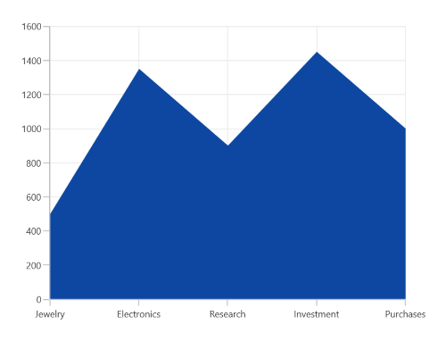
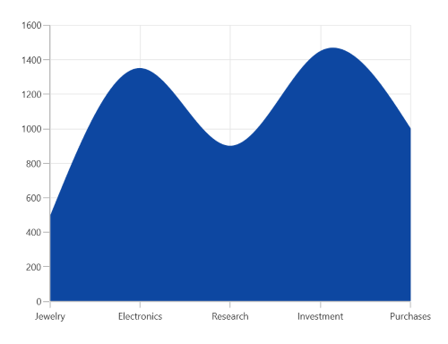

# Area Chart in WinUI Cartesian Charts (SfCartesianChart)

[AreaSeries]() is rendered using a collection of line segments connected to form a closed loop area, filled with the specified color.

The following code example initializes the AreaSeries:





<chart:SfCartesianChart>
. . .            
    <chart:SfCartesianChart.Series>
        <chart:AreaSeries ItemsSource="{Binding Data}" XBindingPath="Demand" YBindingPath="Year2010"/>  
    </chart:SfCartesianChart.Series>

</chart:SfCartesianChart>





SfCartesianChart chart = new SfCartesianChart();
. . .
AreaSeries series = new AreaSeries()
{
    ItemsSource = new ViewModel().Data,
    XBindingPath = "Demand",
    YBindingPath = "Year2010",
};

chart.Series.Add(series);
this.Content = chart;





## Spline Area 

[SplineAreaSeries]() connects a series of data points using smooth Bezier line curves, with the underlying areas filled.





<chart:SfCartesianChart>
. . .            
    <chart:SfCartesianChart.Series>
        <chart:SplineAreaSeries ItemsSource="{Binding Data}" XBindingPath="Demand" YBindingPath="Year2010"/>  
    </chart:SfCartesianChart.Series>

</chart:SfCartesianChart>





SfCartesianChart chart = new SfCartesianChart();
. . .
SplineAreaSeries series = new SplineAreaSeries()
{
    ItemsSource = new ViewModel().Data,
    XBindingPath = "Demand",
    YBindingPath = "Year2010",
};

chart.Series.Add(series);
this.Content = chart;





## StepArea 

[StepAreaSeries]() is similar to AreaSeries but it does not use the shortest distance to connect two data points using Bezier curves. Instead, this ChartSeries uses vertical and horizontal lines to connect the data points in a series forming a step-like progression.

The following code example initializes the StepAreaSeries:





SfCartesianChart chart = new SfCartesianChart();
. . .
<chart:SfCartesianChart>
. . .            
    <chart:SfCartesianChart.Series>
        <chart:StepAreaSeries XBindingPath="XValue" YBindingPath="YValue" ItemsSource="{Binding Data}"/> 
    </chart:SfCartesianChart.Series>

</chart:SfCartesianChart>





StepAreaSeries series = new StepAreaSeries()
{
    ItemsSource = new ViewModel().Data,
    XBindingPath = "XValue",
    YBindingPath = "YValue",
};

chart.Series.Add(series);
this.Content = chart;





