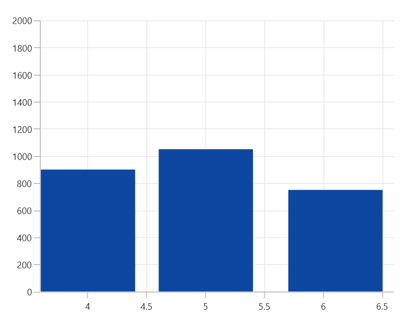

# Auto Scrolling in WinUI Chart (SfCartesianChart)

Auto scrolling feature using the live chart or bulk datapoint chart presentation of the selected range.

## AutoScrollingDelta

[AutoScrollingDelta](https://help.syncfusion.com/cr/winui/Syncfusion.UI.Xaml.Charts.ChartAxisBase2D.html#Syncfusion_UI_Xaml_Charts_ChartAxisBase2D_AutoScrollingDelta) is used to ensure whether the specified range of data is always visible in the Cartesian chart. It always shows the recently added data points at the end, and the scrolling will be reset to the end of the range whenever a new point is added. 

 



<chart:SfCartesianChart x:Name="chart" Palette="BlueChrome">
. . .
    <chart:SfCartesianChart.PrimaryAxis>
        <chart:NumericalAxis AutoScrollingDelta="3"/>
    </chart:SfCartesianChart.PrimaryAxis>

    <chart:SfCartesianChart.SecondaryAxis>
        <chart:NumericalAxis />
    </chart:SfCartesianChart.SecondaryAxis>

    <chart:SfCartesianChart.Behaviors>
        <chart:ChartZoomPanBehavior />
    </chart:SfCartesianChart.Behaviors>
. . .
</chart:SfCartesianChart>





SfCartesianChart chart = new SfCartesianChart();
chart.Palette = ChartColorPalette.BlueChrome;

chart.PrimaryAxis = new NumericalAxis()
{
    AutoScrollingDelta = 3,
};

chart.SecondaryAxis = new NumericalAxis();
ChartZoomPanBehavior zoomPanBehavior = new ChartZoomPanBehavior();
chart.Behaviors.Add(zoomPanBehavior);
. . .
this.Content = chart;





## AutoScrollingMode

The [AutoScrollingMode](https://help.syncfusion.com/cr/winui/Syncfusion.UI.Xaml.Charts.ChartAxisBase2D.html#Syncfusion_UI_Xaml_Charts_ChartAxisBase2D_AutoScrollingMode) property is used to determine whether the axis should be scrolled from the start position or end position. The default value of this property is [End](https://help.syncfusion.com/cr/winui/Syncfusion.UI.Xaml.Charts.ChartAutoScrollingMode.html#Syncfusion_UI_Xaml_Charts_ChartAutoScrollingMode_End).

 



<chart:SfCartesianChart x:Name="chart" Palette="BlueChrome">
. . .
    <chart:SfCartesianChart.PrimaryAxis>
        <chart:NumericalAxis AutoScrollingDelta="3" AutoScrollingMode="Start"/>
    </chart:SfCartesianChart.PrimaryAxis>

    <chart:SfCartesianChart.SecondaryAxis>
        <chart:NumericalAxis />
    </chart:SfCartesianChart.SecondaryAxis>

    <chart:SfCartesianChart.Behaviors>
        <chart:ChartZoomPanBehavior />
    </chart:SfCartesianChart.Behaviors>
. . .
</chart:SfCartesianChart>





SfCartesianChart chart = new SfCartesianChart();
chart.Palette = ChartColorPalette.BlueChrome;

chart.PrimaryAxis = new NumericalAxis()
{
    AutoScrollingDelta = 3,
    AutoScrollingMode = ChartAutoScrollingMode.Start
};

chart.SecondaryAxis = new NumericalAxis();
ChartZoomPanBehavior zoomPanBehavior = new ChartZoomPanBehavior();
chart.Behaviors.Add(zoomPanBehavior);
. . .
this.Content = chart;





## AutoScrollingDeltaType

In [DateTimeAxis](https://help.syncfusion.com/cr/winui/Syncfusion.UI.Xaml.Charts.DateTimeAxis.html), you can apply auto scrolling delta value in [Years](https://help.syncfusion.com/cr/winui/Syncfusion.UI.Xaml.Charts.DateTimeIntervalType.html#Syncfusion_UI_Xaml_Charts_DateTimeIntervalType_Years), [Months](https://help.syncfusion.com/cr/winui/Syncfusion.UI.Xaml.Charts.DateTimeIntervalType.html#Syncfusion_UI_Xaml_Charts_DateTimeIntervalType_Months), [Days](https://help.syncfusion.com/cr/winui/Syncfusion.UI.Xaml.Charts.DateTimeIntervalType.html#Syncfusion_UI_Xaml_Charts_DateTimeIntervalType_Days), [Hours](https://help.syncfusion.com/cr/winui/Syncfusion.UI.Xaml.Charts.DateTimeIntervalType.html#Syncfusion_UI_Xaml_Charts_DateTimeIntervalType_Hours), [Minutes](https://help.syncfusion.com/cr/winui/Syncfusion.UI.Xaml.Charts.DateTimeIntervalType.html#Syncfusion_UI_Xaml_Charts_DateTimeIntervalType_Minutes), [Seconds](https://help.syncfusion.com/cr/winui/Syncfusion.UI.Xaml.Charts.DateTimeIntervalType.html#Syncfusion_UI_Xaml_Charts_DateTimeIntervalType_Seconds) and [Milliseconds](https://help.syncfusion.com/cr/winui/Syncfusion.UI.Xaml.Charts.DateTimeIntervalType.html#Syncfusion_UI_Xaml_Charts_DateTimeIntervalType_Milliseconds) by setting the [AutoScrollingDeltaType](https://help.syncfusion.com/cr/winui/Syncfusion.UI.Xaml.Charts.DateTimeAxis.html#Syncfusion_UI_Xaml_Charts_DateTimeAxis_AutoScrollingDeltaType) property. The default value of this property is [Auto](https://help.syncfusion.com/cr/winui/Syncfusion.UI.Xaml.Charts.DateTimeIntervalType.html#Syncfusion_UI_Xaml_Charts_DateTimeIntervalType_Auto), and the delta will be calculated automatically based on range.

 



<chart:SfCartesianChart x:Name="chart" Palette="BlueChrome">
. . .
    <chart:SfCartesianChart.PrimaryAxis>
        <chart:DateTimeAxis AutoScrollingDelta = "4" LabelFormat="MMM-yy" AutoScrollingDeltaType = "Months"/>
    </chart:SfCartesianChart.PrimaryAxis>

    <chart:SfCartesianChart.SecondaryAxis>
        <chart:NumericalAxis />
    </chart:SfCartesianChart.SecondaryAxis>

    <chart:SfCartesianChart.Behaviors>
        <chart:ChartZoomPanBehavior />
    </chart:SfCartesianChart.Behaviors>
. . .
</chart:SfCartesianChart>





SfCartesianChart chart = new SfCartesianChart();
chart.Palette = ChartColorPalette.BlueChrome;

chart.PrimaryAxis = new DateTimeAxis()
{
    AutoScrollingDelta = 4,
    AutoScrollingDeltaType = DateTimeIntervalType.Months,
    LabelFormat = "MMM-yy"
};

chart.SecondaryAxis = new NumericalAxis();
ChartZoomPanBehavior zoomPanBehavior = new ChartZoomPanBehavior();
chart.Behaviors.Add(zoomPanBehavior);
. . .
this.Content = chart;





