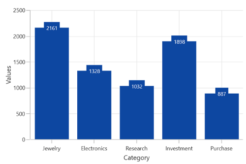
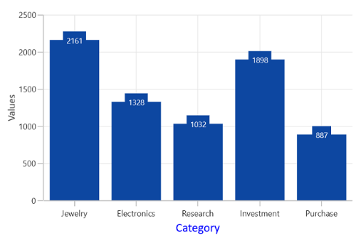

# Chart Axis Header in WinUI Cartesian Chart

## Header

The [Header]() property is used to set the title for the chart axis. It accepts any `UIElement` as content of axis title. 

The following code example demonstrates how to define header in both primary and secondary axis. 





<chart:SfCartesianChart.PrimaryAxis>
    <chart:CategoryAxis Header="Category"/>
</chart:SfCartesianChart.PrimaryAxis>
<chart:SfCartesianChart.SecondaryAxis>
    <chart:NumericalAxis Header="Values"/>
</chart:SfCartesianChart.SecondaryAxis>





chart.PrimaryAxis = new CategoryAxis() { Header = "Category" };
chart.SecondaryAxis = new NumericalAxis() { Header = "Values" };





## Style for header

The [HeaderStyle]() property is used to provide style for the axis header. The following code example explains header style customization.





<chart:CategoryAxis Header="Category">
    <chart:CategoryAxis.HeaderStyle>
        <chart:LabelStyle FontFamily="Algerian" FontSize="13" Foreground="Blue"/>
    </chart:CategoryAxis.HeaderStyle>
</chart:CategoryAxis>





chart.PrimaryAxis = new CategoryAxis() { Header = "Category" };
chart.PrimaryAxis.HeaderStyle = new LabelStyle()
{
    FontFamily = new FontFamily("Calibri"),
    FontSize = 13,
    Foreground = new SolidColorBrush(Colors.Blue),
};





## Customization of header by HeaderTemplate

The appearance of the header can be customized using the [HeaderTemplate]() property. The following code snippet demonstrates the header customization with `Border` and `TextBlock`.





<chart:SfCartesianChart.Resources>
    <DataTemplate x:Key="headerTemplate">
        <Border BorderBrush="Blue" CornerRadius="5" BorderThickness="1">
            <TextBlock Text="Category" FontSize="12" FontStyle="Italic" FontWeight="Bold" Margin="3"/>
        </Border>
    </DataTemplate>
</chart:SfCartesianChart.Resources>
. . .
<chart:SfCartesianChart.PrimaryAxis>
    <chart:CategoryAxis HeaderTemplate="{StaticResource headerTemplate}">
    </chart:CategoryAxis>
</chart:SfCartesianChart.PrimaryAxis>





chart.PrimaryAxis = new CategoryAxis()
{
    HeaderTemplate = chart.Resources["headerTemplate"] as DataTemplate
};





