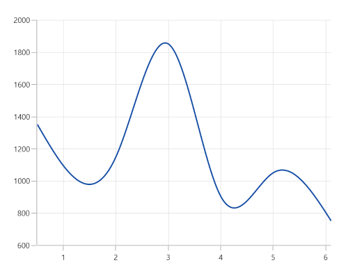
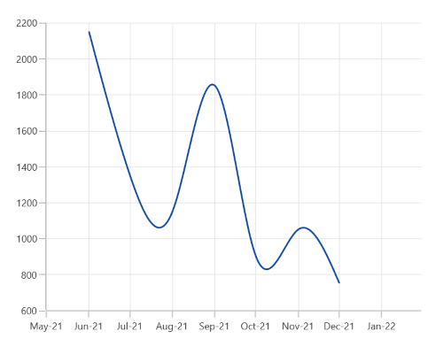
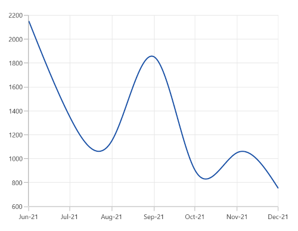
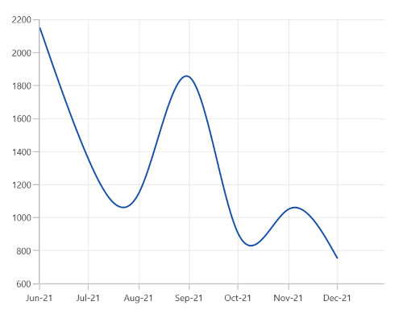

# Range padding in WinUI Chart (SfCartesianChart)

Padding can be applied to the minimum and maximum extremes of range by using the [RangePadding](https://help.syncfusion.com/cr/winui/Syncfusion.UI.Xaml.Charts.DateTimeAxis.html#Syncfusion_UI_Xaml_Charts_DateTimeAxis_RangePadding)  property. The [NumericalAxis](https://help.syncfusion.com/cr/winui/Syncfusion.UI.Xaml.Charts.NumericalAxis.html) and [DateTimeAxis](https://help.syncfusion.com/cr/winui/Syncfusion.UI.Xaml.Charts.DateTimeAxis.html) have a [RangePadding](https://help.syncfusion.com/cr/winui/Syncfusion.UI.Xaml.Charts.DateTimeAxis.html#Syncfusion_UI_Xaml_Charts_DateTimeAxis_RangePadding) property that can be used to add padding to the range of a chart’s axis.

## NumericalRangePadding

[RangePadding](https://help.syncfusion.com/cr/winui/Syncfusion.UI.Xaml.Charts.NumericalAxis.html#Syncfusion_UI_Xaml_Charts_NumericalAxis_RangePadding) is a technique for shifting a numeric range inside or outside of its bounds.

The following types are available for [NumericalAxis](https://help.syncfusion.com/cr/winui/Syncfusion.UI.Xaml.Charts.NumericalAxis.html):

* [Additional](https://help.syncfusion.com/cr/winui/Syncfusion.UI.Xaml.Charts.NumericalPadding.html#Syncfusion_UI_Xaml_Charts_NumericalPadding_Additional) - The visible start and end range will be added with an additional interval. 
* [None](https://help.syncfusion.com/cr/winui/Syncfusion.UI.Xaml.Charts.NumericalPadding.html#Syncfusion_UI_Xaml_Charts_NumericalPadding_None) - The visible range sets to exact minimum and maximum value of the items source.
* [Normal](https://help.syncfusion.com/cr/winui/Syncfusion.UI.Xaml.Charts.NumericalPadding.html#Syncfusion_UI_Xaml_Charts_NumericalPadding_Normal) - The visible range will be the actual range calculated from given items source and series types.
* [Auto](https://help.syncfusion.com/cr/winui/Syncfusion.UI.Xaml.Charts.NumericalPadding.html#Syncfusion_UI_Xaml_Charts_NumericalPadding_Auto) - Automatically chosen based on the orientation of the axis.
* [Round](https://help.syncfusion.com/cr/winui/Syncfusion.UI.Xaml.Charts.NumericalPadding.html#Syncfusion_UI_Xaml_Charts_NumericalPadding_Round) - The visible start and end range round to nearest interval value.
* [RoundStart](https://help.syncfusion.com/cr/winui/Syncfusion.UI.Xaml.Charts.NumericalPadding.html#Syncfusion_UI_Xaml_Charts_NumericalPadding_RoundStart) - The visible start range round to nearest interval value.
* [RoundEnd](https://help.syncfusion.com/cr/winui/Syncfusion.UI.Xaml.Charts.NumericalPadding.html#Syncfusion_UI_Xaml_Charts_NumericalPadding_RoundEnd) -  The visible end range round to nearest interval value. 
* [PrependInterval](https://help.syncfusion.com/cr/winui/Syncfusion.UI.Xaml.Charts.NumericalPadding.html#Syncfusion_UI_Xaml_Charts_NumericalPadding_PrependInterval) - The visible start range will be prepended with an additional interval.
* [AppendInterval](https://help.syncfusion.com/cr/winui/Syncfusion.UI.Xaml.Charts.NumericalPadding.html#Syncfusion_UI_Xaml_Charts_NumericalPadding_AppendInterval) - The visible end range will be appended with an additional interval.

By default, the default [RangePadding](https://help.syncfusion.com/cr/winui/Syncfusion.UI.Xaml.Charts.NumericalAxis.html#Syncfusion_UI_Xaml_Charts_NumericalAxis_RangePadding) value for [PrimaryAxis](https://help.syncfusion.com/cr/winui/Syncfusion.UI.Xaml.Charts.SfCartesianChart.html#Syncfusion_UI_Xaml_Charts_SfCartesianChart_PrimaryAxis) is [Auto](https://help.syncfusion.com/cr/winui/Syncfusion.UI.Xaml.Charts.NumericalPadding.html#Syncfusion_UI_Xaml_Charts_NumericalPadding_Auto) and for [SecondaryAxis](https://help.syncfusion.com/cr/winui/Syncfusion.UI.Xaml.Charts.SfCartesianChart.html#Syncfusion_UI_Xaml_Charts_SfCartesianChart_SecondaryAxis), the default value is [Round](https://help.syncfusion.com/cr/winui/Syncfusion.UI.Xaml.Charts.NumericalPadding.html#Syncfusion_UI_Xaml_Charts_NumericalPadding_Round).

**Additional**

The following code sample demonstrates [RangePadding](https://help.syncfusion.com/cr/winui/Syncfusion.UI.Xaml.Charts.NumericalAxis.html#Syncfusion_UI_Xaml_Charts_NumericalAxis_RangePadding) as [Additional](https://help.syncfusion.com/cr/winui/Syncfusion.UI.Xaml.Charts.NumericalPadding.html#Syncfusion_UI_Xaml_Charts_NumericalPadding_Additional).





<chart:SfCartesianChart Palette="BlueChrome">
. . .
    <chart:SfCartesianChart.PrimaryAxis>
        <chart:NumericalAxis  RangePadding="Additional"/>
    </chart:SfCartesianChart.PrimaryAxis>

    <chart:SfCartesianChart.SecondaryAxis>
        <chart:NumericalAxis />
    </chart:SfCartesianChart.SecondaryAxis>
. . .
</chart:SfCartesianChart>





SfCartesianChart chart = new SfCartesianChart();
chart.Palette = ChartColorPalette.BlueChrome;

chart.PrimaryAxis = new NumericalAxis()
{
    RangePadding = NumericalPadding.Additional,
};

chart.SecondaryAxis = new NumericalAxis();
. . .
this.Content = chart;





**None**

The following code sample demonstrates [RangePadding](https://help.syncfusion.com/cr/winui/Syncfusion.UI.Xaml.Charts.NumericalAxis.html#Syncfusion_UI_Xaml_Charts_NumericalAxis_RangePadding) as [None](https://help.syncfusion.com/cr/winui/Syncfusion.UI.Xaml.Charts.NumericalPadding.html#Syncfusion_UI_Xaml_Charts_NumericalPadding_None).





<chart:SfCartesianChart Palette="BlueChrome">
. . .
    <chart:SfCartesianChart.PrimaryAxis>
        <chart:NumericalAxis RangePadding="None"/>
    </chart:SfCartesianChart.PrimaryAxis>

    <chart:SfCartesianChart.SecondaryAxis>
        <chart:NumericalAxis />
    </chart:SfCartesianChart.SecondaryAxis>
. . .
</chart:SfCartesianChart>





SfCartesianChart chart = new SfCartesianChart();
chart.Palette = ChartColorPalette.BlueChrome;

chart.PrimaryAxis = new NumericalAxis()
{
    RangePadding = NumericalPadding.None,
};

chart.SecondaryAxis = new NumericalAxis();
. . .
this.Content = chart;





**Round**

The following code sample demonstrates [RangePadding](https://help.syncfusion.com/cr/winui/Syncfusion.UI.Xaml.Charts.NumericalAxis.html#Syncfusion_UI_Xaml_Charts_NumericalAxis_RangePadding) as [Round](https://help.syncfusion.com/cr/winui/Syncfusion.UI.Xaml.Charts.NumericalPadding.html#Syncfusion_UI_Xaml_Charts_NumericalPadding_Round).





<chart:SfCartesianChart Palette="BlueChrome">
. . .
    <chart:SfCartesianChart.PrimaryAxis>
        <chart:NumericalAxis  RangePadding="Round"/>
    </chart:SfCartesianChart.PrimaryAxis>

    <chart:SfCartesianChart.SecondaryAxis>
        <chart:NumericalAxis />
    </chart:SfCartesianChart.SecondaryAxis>
. . .
</chart:SfCartesianChart>





SfCartesianChart chart = new SfCartesianChart();
chart.Palette = ChartColorPalette.BlueChrome;

chart.PrimaryAxis = new NumericalAxis()
{
    RangePadding = NumericalPadding.Round,
};

chart.SecondaryAxis = new NumericalAxis();
. . .
this.Content = chart;





## DateTimeRangePadding

Padding can be applied to the minimum and maximum extremes of range by using the [RangePadding](https://help.syncfusion.com/cr/winui/Syncfusion.UI.Xaml.Charts.NumericalAxis.html) property.

The [RangePadding](https://help.syncfusion.com/cr/winui/Syncfusion.UI.Xaml.Charts.NumericalAxis.html) types available in the [DateTimeAxis](https://help.syncfusion.com/cr/winui/Syncfusion.UI.Xaml.Charts.DateTimeAxis.html) are: 

* [Auto](https://help.syncfusion.com/cr/winui/Syncfusion.UI.Xaml.Charts.DateTimeRangePadding.html#Syncfusion_UI_Xaml_Charts_DateTimeRangePadding_Auto) - Automatically chosen based on the orientation of the axis.
* [Additional](https://help.syncfusion.com/cr/winui/Syncfusion.UI.Xaml.Charts.DateTimeRangePadding.html#Syncfusion_UI_Xaml_Charts_DateTimeRangePadding_Additional) - The visible start and end range will be added with an additional interval.
* [None](https://help.syncfusion.com/cr/winui/Syncfusion.UI.Xaml.Charts.DateTimeRangePadding.html#Syncfusion_UI_Xaml_Charts_DateTimeRangePadding_None) - The visible range sets to exact minimum and maximum value of the items source.
* [Round](https://help.syncfusion.com/cr/winui/Syncfusion.UI.Xaml.Charts.DateTimeRangePadding.html#Syncfusion_UI_Xaml_Charts_DateTimeRangePadding_Round) - The visible start and end range round to nearest interval value.
* [RoundStart](https://help.syncfusion.com/cr/winui/Syncfusion.UI.Xaml.Charts.DateTimeRangePadding.html#Syncfusion_UI_Xaml_Charts_DateTimeRangePadding_RoundStart) - The visible start range round to nearest interval value.
* [RoundEnd](https://help.syncfusion.com/cr/winui/Syncfusion.UI.Xaml.Charts.DateTimeRangePadding.html#Syncfusion_UI_Xaml_Charts_DateTimeRangePadding_RoundEnd) - The visible end range round to nearest interval value.
* [PrependInterval](https://help.syncfusion.com/cr/winui/Syncfusion.UI.Xaml.Charts.DateTimeRangePadding.html#Syncfusion_UI_Xaml_Charts_DateTimeRangePadding_PrependInterval) - The visible start range will be prepended with an additional interval.
* [AppendInterval](https://help.syncfusion.com/cr/winui/Syncfusion.UI.Xaml.Charts.DateTimeRangePadding.html#Syncfusion_UI_Xaml_Charts_DateTimeRangePadding_AppendInterval) - The visible start range will be appended with an additional interval.

By default the date time range padding is [`Auto`](https://help.syncfusion.com/cr/winui/Syncfusion.UI.Xaml.Charts.DateTimeRangePadding.html#Syncfusion_UI_Xaml_Charts_DateTimeRangePadding_Auto).

**Additional**

The following code sample demonstrates [RangePadding](https://help.syncfusion.com/cr/winui/Syncfusion.UI.Xaml.Charts.DateTimeAxis.html#Syncfusion_UI_Xaml_Charts_DateTimeAxis_RangePadding) as [Additional](https://help.syncfusion.com/cr/winui/Syncfusion.UI.Xaml.Charts.DateTimeRangePadding.html#Syncfusion_UI_Xaml_Charts_DateTimeRangePadding_Additional)





<chart:SfCartesianChart Palette="BlueChrome">
. . .
    <chart:SfCartesianChart.PrimaryAxis>
        <chart:DateTimeAxis RangePadding="Additional" LabelFormat="MMM-yy"/>
    </chart:SfCartesianChart.PrimaryAxis>

    <chart:SfCartesianChart.SecondaryAxis>
        <chart:NumericalAxis />
    </chart:SfCartesianChart.SecondaryAxis>
. . .
</chart:SfCartesianChart>





SfCartesianChart chart = new SfCartesianChart();
chart.Palette = ChartColorPalette.BlueChrome;

chart.PrimaryAxis = new DateTimeAxis()
{
    RangePadding = DateTimeRangePadding.Additional,
    LabelFormat = "MMM-yy"
};

chart.SecondaryAxis = new NumericalAxis();
. . .
this.Content = chart;





**None**

The following code sample demonstrates [RangePadding](https://help.syncfusion.com/cr/winui/Syncfusion.UI.Xaml.Charts.DateTimeAxis.html#Syncfusion_UI_Xaml_Charts_DateTimeAxis_RangePadding) as [None](https://help.syncfusion.com/cr/winui/Syncfusion.UI.Xaml.Charts.DateTimeRangePadding.html#Syncfusion_UI_Xaml_Charts_DateTimeRangePadding_None).





<chart:SfCartesianChart Palette="BlueChrome">
. . .
    <chart:SfCartesianChart.PrimaryAxis>
        <chart:DateTimeAxis RangePadding="None" LabelFormat="MMM-yy"/>
    </chart:SfCartesianChart.PrimaryAxis>

    <chart:SfCartesianChart.SecondaryAxis>
        <chart:NumericalAxis />
    </chart:SfCartesianChart.SecondaryAxis>
. . .
</chart:SfCartesianChart>





SfCartesianChart chart = new SfCartesianChart();
chart.Palette = ChartColorPalette.BlueChrome;

chart.PrimaryAxis = new DateTimeAxis()
{
    RangePadding = DateTimeRangePadding.None,
    LabelFormat = "MMM-yy"
};

chart.SecondaryAxis = new NumericalAxis();
. . .
this.Content = chart;





**Round**

The following code sample demonstrates [RangePadding](https://help.syncfusion.com/cr/winui/Syncfusion.UI.Xaml.Charts.DateTimeAxis.html#Syncfusion_UI_Xaml_Charts_DateTimeAxis_RangePadding) as [Round](https://help.syncfusion.com/cr/winui/Syncfusion.UI.Xaml.Charts.DateTimeRangePadding.html#Syncfusion_UI_Xaml_Charts_DateTimeRangePadding_Round).





<chart:SfCartesianChart Palette="BlueChrome">
. . .
    <chart:SfCartesianChart.PrimaryAxis>
        <chart:DateTimeAxis RangePadding="Round" LabelFormat="MMM-yy"/>
    </chart:SfCartesianChart.PrimaryAxis>

    <chart:SfCartesianChart.SecondaryAxis>
        <chart:NumericalAxis />
    </chart:SfCartesianChart.SecondaryAxis>
. . .
</chart:SfCartesianChart>





SfCartesianChart chart = new SfCartesianChart();
chart.Palette = ChartColorPalette.BlueChrome;

chart.PrimaryAxis = new DateTimeAxis()
{
    RangePadding = DateTimeRangePadding.Round,
    LabelFormat = "MMM-yy"
};

chart.SecondaryAxis = new NumericalAxis();
. . .
this.Content = chart;





