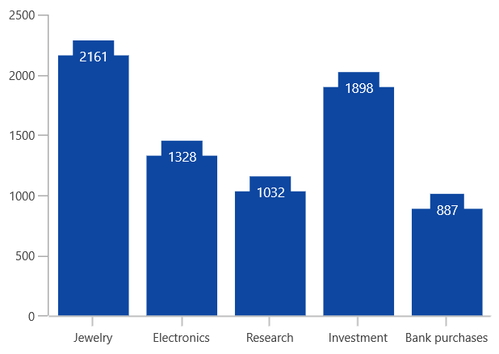
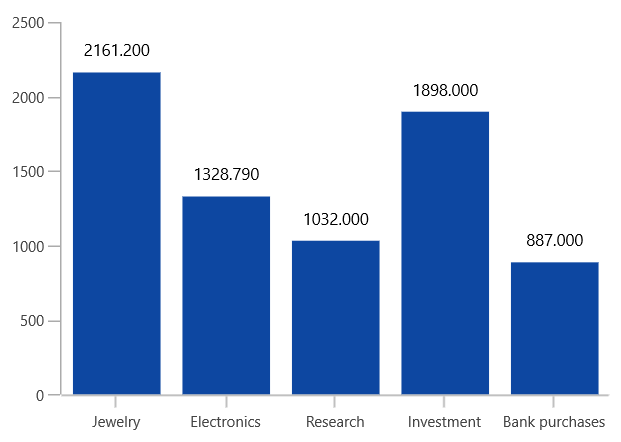
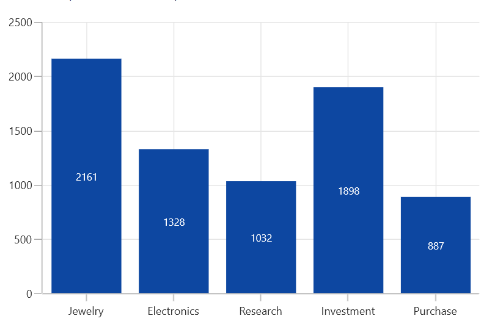

# Data labels in WinUI Cartesian Chart

Data labels are used to display values related to a chart segment. Values from data point(x, y) or other custom properties from a data source can be displayed. 

Each data label can be represented by the following:

* Label - displays the segment label content at the (X, Y) point.
* Connector line - used to connect the (X, Y) point and the label element.

## Enable data label 

The [ShowDataLabels]() property of series is used to enable the data labels. The following code example illustrates how to achieve this.





<chart:SfCartesianChart.Series>
    <chart:ColumnSeries ItemsSource="{Binding Data}" 
                     XBindingPath="Category"
                     YBindingPath="Value" ShowDataLabels="True">
    </chart:ColumnSeries>
</chart:SfCartesianChart.Series>





ColumnSeries series = new ColumnSeries()
{
    ItemsSource = viewModel.Data,
    XBindingPath = "Category",
    YBindingPath = "Value",
    ShowDataLabels = true
};

chart.Series.Add(series);





 

## Data label context

To customize the content of data labels, need to define [DataLabelSettings]() of series and set [Context]() property of [CartesianDataLabelSettings]() to define the value to be displayed as label content.

The following code example demonstrates how to define the value to be displayed as data label content.





<chart:ColumnSeries.DataLabelSettings>
    <chart:CartesianDataLabelSettings Context="YValue"/>
</chart:ColumnSeries.DataLabelSettings>




        
series.DataLabelSettings = new CartesianDataLabelSettings()
{
    Context = LabelContext.YValue
};





| Context values | Description | Output |
|---|--|---|
| DateTime | Displays LabelContent.DateTime value |  |
|DataLabelItem | Displays the y value||
| Percentage | Displays the percentage value of series point among other points | |
| XValue | Displays the X value of series point| |
| YValue | Displays the Y value of series point|  |

## Data Label customization

The following properties are used to customize the data label.

* [BorderBrush]()- used to change the border color.
* [BorderThickness]()- used to change the thickness of the border.
* [Margin]()- used to change the margin size for label.
* [FontStyle]()-  used to change font style of the label.
* [FontSize]()-  used to change font size of the label.
* [Foreground]()- used to change the text color of the label.
* [FontFamily]()-  used to change the font family of the label.
* [Background]()- used to change the label background color.

The following code example demonstrates the customization of label using the above properties:





<chart:ColumnSeries.DataLabelSettings>
    <chart:CartesianDataLabelSettings Position="Outer" Foreground="White" 
                                      FontSize="11" FontFamily="Calibri" 
                                      BorderBrush="Black" BorderThickness="1" 
                                      Margin="1" FontStyle="Italic" Background="#1E88E5" />
</chart:ColumnSeries.DataLabelSettings>





series.DataLabelSettings = new CartesianDataLabelSettings()
{
    Position = DataLabelPosition.Outer,
    Foreground = new SolidColorBrush(Colors.White),
    BorderBrush = new SolidColorBrush(Colors.Black),
    Background = new SolidColorBrush(Colors.LightBlue),
    BorderThickness = new Thickness(1),
    Margin = new Thickness(1),
    FontStyle = FontStyle.Italic,
    FontFamily = new FontFamily("Calibri"),
    FontSize = 11
};





## Label template

The appearance of the data label can be customized using the [`ContentTemplate`]() property of [`CartesianDataLabelSettings`]() as in the below code example:





<chart:SfCartesianChart.Resources>
    <DataTemplate x:Key="dataMarkerTemplate">
        <StackPanel Orientation="Vertical">
            <Path Grid.Row="0"  Stretch="Uniform" Fill="#1E88E5"                              
               Width="15" Height="15" Margin="0,0,0,0"                              
               RenderTransformOrigin="0.5,0.5"
               Data="M22.5,15.8899993896484L37.5,                                
               30.8899993896484 7.5,30.8899993896484 22.5,15.8899993896484z">
                <Path.RenderTransform>
                    <TransformGroup>
                        <TransformGroup.Children>
                            <RotateTransform Angle="0" />
                            <ScaleTransform ScaleX="1" ScaleY="1" />
                        </TransformGroup.Children>
                    </TransformGroup>
                </Path.RenderTransform>
            </Path>
            <TextBlock Grid.Row="1" Text="{Binding}" FontSize="11" Foreground="Black"></TextBlock>
        </StackPanel>
    </DataTemplate>
</chart:SfCartesianChart.Resources>
. . . 
<chart:ColumnSeries.DataLabelSettings>
    <chart:CartesianDataLabelSettings Position="Outer" ContentTemplate="{StaticResource dataMarkerTemplate}"/>
</chart:ColumnSeries.DataLabelSettings>





series.DataLabelSettings = new CartesianDataLabelSettings()
{
    Position = DataLabelPosition.Outer,
    ContentTemplate = chart.Resources["dataMarkerTemplate"] as DataTemplate
};





## Label format

The Format property can be used to format the data labels. The following code example demonstrates the how to format data labels with three decimal digits.





<chart:ColumnSeries.DataLabelSettings>
    <chart:CartesianDataLabelSettings Format="#.000" />
</chart:ColumnSeries.DataLabelSettings>





series.DataLabelSettings = new CartesianDataLabelSettings()
{
    Format = "#.000"
};





## Label rotation

The [Rotation]() property is used to define the angle to which the label has to rotate. The following code demonstrates the label rotating angle.





<chart:ColumnSeries.DataLabelSettings>
    <chart:CartesianDataLabelSettings Rotation="45" Position="Outer" />
</chart:ColumnSeries.DataLabelSettings>





series.DataLabelSettings = new CartesianDataLabelSettings()
{
    Rotation = 45,
    Position = DataLabelPosition.Outer,
};





## Alignment

The alignment of data labels inside the series is defined by using the [BarLabelAlignment]() property. 

* [Top]() - Positions the data lable at the top edge point of a chart segment.
* [Middle]() - Positions the data label at the center point of a chart segment.
* [Bottom]() - Positions the data label at the bottom edge point of a chart segment.

N> This behavior varies based on the chart series type.

The following code example explains the positioning of data label in the middle of the segment.





<chart:ColumnSeries.DataLabelSettings>
    <chart:CartesianDataLabelSettings BarLabelAlignment="Middle"/>
</chart:ColumnSeries.DataLabelSettings>





series.DataLabelSettings = new CartesianDataLabelSettings()
{
    BarLabelAlignment = BarLabelAlignment.Middle,
};





Also, you can define the label alignment using  [HorizontalAlignment]() and [VerticalAlignment]() properties.

## Position

Other than the above alignment options, Chart providing additional customization option to position the data labels smartly based on series type using the [Position]() property.

The following are the values for [Position]()  property: 

* [Default]()
* [Auto]()
* [Inner]()
* [Outer]()
* [Center]()

The following code sample illustrates the center position of data marker labels,





<chart:ColumnSeries.DataLabelSettings>
    <chart:CartesianDataLabelSettings Position="Center"/>
</chart:ColumnSeries.DataLabelSettings>





series.DataLabelSettings = new CartesianDataLabelSettings()
{
    Position = DataLabelPosition.Center,
};    





| Column | Spline |
|--|--|
|||

The following code sample illustrates the inner position of data marker labels,





<chart:ColumnSeries.DataLabelSettings>
    <chart:CartesianDataLabelSettings Position="Inner"/>
</chart:ColumnSeries.DataLabelSettings>





series.DataLabelSettings = new CartesianDataLabelSettings()
{
    Position = DataLabelPosition.Inner,
};       





| Column | Spline |
|--|--|
|||

The following code sample illustrates the outer position of data marker labels,





<chart:ColumnSeries.DataLabelSettings>
    <chart:CartesianDataLabelSettings Position="Outer"/>
</chart:ColumnSeries.DataLabelSettings>





series.DataLabelSettings = new CartesianDataLabelSettings()
{
    Position = DataLabelPosition.Outer,
};    





| Column | Spline |
|--|--|
|||

## Connector line

Connector line is used to connect label and data point using a line. [ShowConnectorLine]() property of [CartesianDataLabelSettings]() is used to enable the connector line in the cartesian chart. 

The connector line can be customized using the below properies.

* [ConnectorHeight]() - used to set height for connector line.
* [ConnectorLineStyle]() - used to customize the style of line.
* [ConnectorType]() - used to connector line type.

The following code example shows the customization of connector line:





<chart:SfCartesianChart.Resources>
    
</chart:SfCartesianChart.Resources>
. . .
<chart:ColumnSeries.DataLabelSettings>
    <chart:CartesianDataLabelSettings Position="Outer" 
                                      ConnectorHeight="40"
                                      ShowConnectorLine="True"
                                      ConnectorLineStyle="{StaticResource lineStyle}" />
</chart:ColumnSeries.DataLabelSettings>





series.DataLabelSettings = new CartesianDataLabelSettings()
{
    Position = DataLabelPosition.Outer,
    ConnectorHeight = 40,
    ConnectorLineStyle = chart.Resources["LineStyle"] as Style,
};





## Applying series brush

[UseSeriesPalette]() property is used to set the interior of the series to the data marker background. 





<chart:ColumnSeries.DataLabelSettings>
    <chart:CartesianDataLabelSettings  UseSeriesPalette="True"/>
</chart:ColumnSeries.DataLabelSettings>





series.DataLabelSettings = new CartesianDataLabelSettings()
{
    UseSeriesPalette = true,
};





