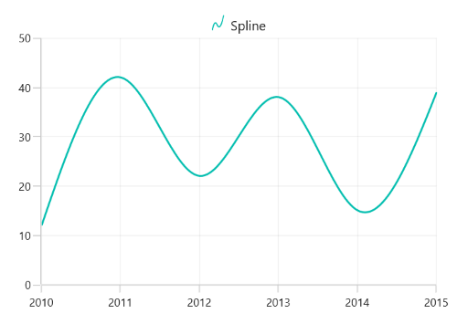
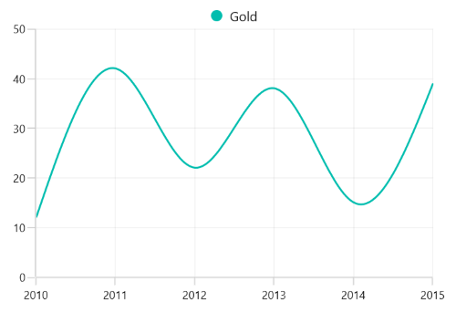
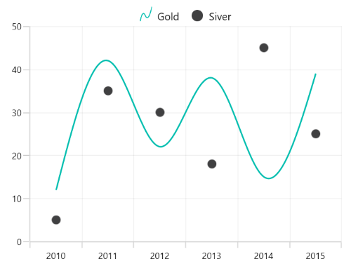
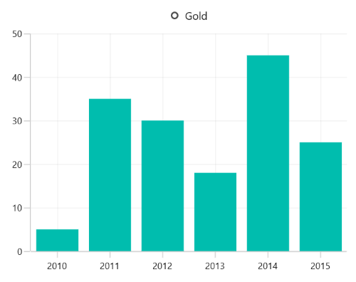
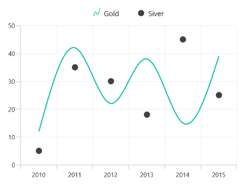
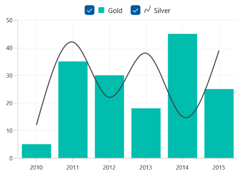
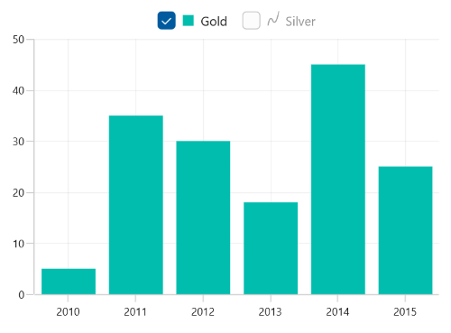
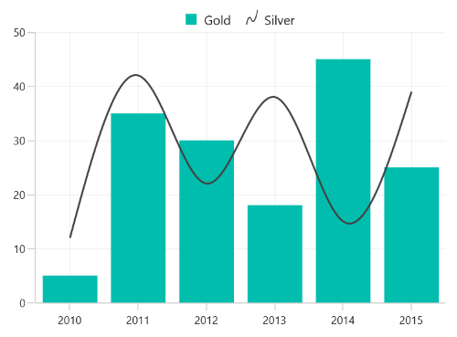
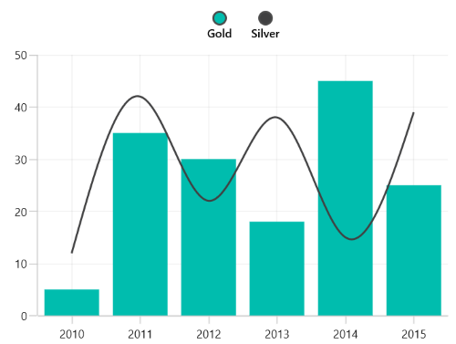

# Legend in WinUI Chart (SfCartesianChart)

The legend contains a list of series data points in the chart. The information provided in each legend item helps you to identify the corresponding series in the chart. This allows us to specify the [Label](https://help.syncfusion.com/cr/winui/Syncfusion.UI.Xaml.Charts.ChartSeriesBase.html#Syncfusion_UI_Xaml_Charts_ChartSeriesBase_Label) for each series which is to be displayed in legend label.





<chart:SfCartesianChart>
. . .
    <chart:SfCartesianChart.Legend>
        <chart:ChartLegend/>
    </chart:SfCartesianChart.Legend>

    <chart:SplineSeries Label="Spline"
                        ItemsSource="{Binding Data}" 
                        XBindingPath="Year"
                        YBindingPath="India">
    </chart:SplineSeries>

</chart:SfCartesianChart>





SfCartesianChart chart = new SfCartesianChart();
. . .
ChartLegend legend = new ChartLegend();
chart.Legend = legend;

SplineSeries series = new SplineSeries();
series.ItemsSource = (new ViewModel()).Data;
series.XBindingPath = "Year";
series.YBindingPath = "India";
series.Label = "Spline";
chart.Series.Add(series);
this.Content = chart;





## Title

Cartesian chart provides support to add any `UIElement` as a title for legend. [Header](https://help.syncfusion.com/cr/winui/Syncfusion.UI.Xaml.Charts.ChartLegend.html#Syncfusion_UI_Xaml_Charts_ChartLegend_Header) property of [ChartLegend](https://help.syncfusion.com/cr/winui/Syncfusion.UI.Xaml.Charts.ChartBase.html#Syncfusion_UI_Xaml_Charts_ChartBase_Legend) is used to define the title for legend as the following code example.





<chart:SfCartesianChart>
. . .
    <chart:SfCartesianChart.Legend>
        <chart:ChartLegend>
            <chart:ChartLegend.Header>
                <TextBox Text="Foods" 
                         HorizontalAlignment="Center"
                         FontWeight="Bold"
                         Foreground="Blue"/>
            </chart:ChartLegend.Header>
        </chart:ChartLegend>
    </chart:SfCartesianChart.Legend>
. . .
</chart:SfCartesianChart>





SfCartesianChart chart = new SfCartesianChart();
ChartLegend legend = new ChartLegend();
. . .
TextBlock textBlock = new TextBlock()
{
    Text = "Foods",
    HorizontalTextAlignment = TextAlignment.Center,
    Foreground = new SolidColorBrush(Colors.Blue),
    FontWeight = FontWeights.Bold,
};

legend.Header = textBlock;
chart.Legend = legend;
. . .
this.Content = chart;





## Icon

Legend icon represents a symbol associated with the each legend item. [LegendIcon](https://help.syncfusion.com/cr/winui/Syncfusion.UI.Xaml.Charts.ChartSeriesBase.html#Syncfusion_UI_Xaml_Charts_ChartSeriesBase_LegendIcon) property of series is used to set the icon type for legend item. By default, the legend icon is [SeriesType](https://help.syncfusion.com/cr/winui/Syncfusion.UI.Xaml.Charts.ChartLegendIcon.html#Syncfusion_UI_Xaml_Charts_ChartLegendIcon_SeriesType).





<chart:SfCartesianChart>
. . .
    <chart:SfCartesianChart.Legend>
        <chart:ChartLegend/>
    </chart:SfCartesianChart.Legend>

    <chart:SplineSeries  LegendIcon="Circle"
                         Label="Gold"
                         ItemsSource="{Binding Data}" 
                         XBindingPath="Year"
                         YBindingPath="India">
    </chart:SplineSeries>

</chart:SfCartesianChart>





SfCartesianChart chart = new SfCartesianChart();
. . .
ChartLegend legend = new ChartLegend();
chart.Legend = legend;

SplineSeries series = new SplineSeries();
series.ItemsSource = (new ViewModel()).Data;
series.XBindingPath = "Year";
series.YBindingPath = "India";
series.Label = "Gold";
series.LegendIcon = ChartLegendIcon.Circle;
chart.Series.Add(series);
this.Content = chart;





The appearance of the legend icon can be customized using the below properties.

* [IconWidth](https://help.syncfusion.com/cr/winui/Syncfusion.UI.Xaml.Charts.ChartLegend.html#Syncfusion_UI_Xaml_Charts_ChartLegend_IconWidth) - Gets or sets the double value that represents the legend icon(s) width.
* [IconHeight](https://help.syncfusion.com/cr/winui/Syncfusion.UI.Xaml.Charts.ChartLegend.html#Syncfusion_UI_Xaml_Charts_ChartLegend_IconHeight) - Gets or sets the double value that represents the legend icon(s) height.
* [IconVisibility](https://help.syncfusion.com/cr/winui/Syncfusion.UI.Xaml.Charts.ChartLegend.html#Syncfusion_UI_Xaml_Charts_ChartLegend_IconVisibility) - Gets or sets the visibility of the legend icon.





<chart:SfCartesianChart.Legend>
    <chart:ChartLegend IconWidth="15" 
                       IconHeight="15" 
                       IconVisibility="Visible">
    </chart:ChartLegend>
</chart:SfCartesianChart.Legend>





chart.Legend = new ChartLegend()
{
    IconWidth = 15,
    IconHeight = 15,
    IconVisibility = Visibility.Visible,
};





### Custom Icon

Cartesian chart provides support to add custom icon for the legend using [LegendIconTemplate](https://help.syncfusion.com/cr/winui/Syncfusion.UI.Xaml.Charts.ChartSeriesBase.html#Syncfusion_UI_Xaml_Charts_ChartSeriesBase_LegendIconTemplate) property of series as in below example.





<chart:SfCartesianChart >
     <chart:SfCartesianChart.Resources>
        <DataTemplate x:Key="iconTemplate">
            <Ellipse Height="10" 
                     Width="10" 
                     Fill="White" 
                     Stroke="#4a4a4a" 
                     StrokeThickness="2"/>
        </DataTemplate>
    </chart:SfCartesianChart.Resources>
    . . .   
    <chart:SfCartesianChart.Legend>
        <chart:ChartLegend />
    </chart:SfCartesianChart.Legend>
    . . .
    <chart:SfCartesianChart.Series>
        <chart:ColumnSeries  ItemsSource="{Binding Data}" 
                             Label="Gold" 
                             LegendIconTemplate="{StaticResource iconTemplate}" 
                             XBindingPath="Year" 
                             YBindingPath="India"/>
    </chart:SfCartesianChart.Series>
</chart:SfCartesianChart>





SfCartesianChart chart = new SfCartesianChart();
chart.Legend = new ChartLegend();
. . .
ColumnSeries series = new ColumnSeries()
{
    ItemsSource = new ViewModel().Data,
    XBindingPath = "Year",
    YBindingPath = "India",
    IconTemplate = chart.Resources["iconTemplate"] as DataTemplate
    Label = "Gold";
};

chart.Series.Add(series);
this.Content = chart;





## Legend Visibility

The [IsVisibleOnLegend]() property of series is used to enable/disable the visibility of legend as shown in below example.





<chart:SfCartesianChart >
   . . .  
    <chart:SfCartesianChart.Legend>
        <chart:ChartLegend />
    </chart:SfCartesianChart.Legend>

    <chart:SfCartesianChart.Series>
        <chart:ColumnSeries ItemsSource="{Binding Data}" 
                            Label="Gold" 
                            IsVisibleOnLegend="True"
                            XBindingPath="Year" 
                            YBindingPath="India"/>

        <chart:SplineSeries ItemsSource="{Binding Data}" 
                            Label="Silver" 
                            IsVisibleOnLegend="False"
                            XBindingPath="Year" 
                            YBindingPath="America"/>
    </chart:SfCartesianChart.Series>
</chart:SfCartesianChart>





SfCartesianChart chart = new SfCartesianChart();
 . . .
chart.Legend = new ChartLegend();

ColumnSeries columnSeries = new ColumnSeries()
{
    Label = "Gold",
    ItemsSource = new ViewModel().Data,
    XBindingPath = "Year",
    YBindingPath = "India",
    IsVisibleOnLegend = true
};
SplineSeries splineSeries = new SplineSeries()
{
    Label = "Silver",
    ItemsSource = new ViewModel().Data,
    XBindingPath = "Year",
    YBindingPath = "America",
    IsVisibleOnLegend = false
};

chart.Series.Add(splineSeries);
chart.Series.Add(columnSeries);
this.Content = chart;





## Item spacing

[ItemMargin](https://help.syncfusion.com/cr/winui/Syncfusion.UI.Xaml.Charts.ChartLegend.html#Syncfusion_UI_Xaml_Charts_ChartLegend_ItemMargin) property of the [ChartLegend](https://help.syncfusion.com/cr/winui/Syncfusion.UI.Xaml.Charts.ChartBase.html#Syncfusion_UI_Xaml_Charts_ChartBase_Legend) is used to provide spacing between each legend items.





<chart:SfCartesianChart.Legend>
    <chart:ChartLegend ItemMargin="10"/>
</chart:SfCartesianChart.Legend>





chart.Legend = new ChartLegend()
{
    ItemMargin = new Thickness(10)
};





## Checkbox for Legend

Cartesian chart provides support to enable the checkbox for each legend item to visible or collapse the associated series. By default, the value of [CheckBoxVisibility](https://help.syncfusion.com/cr/winui/Syncfusion.UI.Xaml.Charts.ChartLegend.html#Syncfusion_UI_Xaml_Charts_ChartLegend_CheckBoxVisibility) property is `Collapsed`. 





<chart:SfCartesianChart.Legend>
    <chart:ChartLegend CheckBoxVisibility="Visible"/>
</chart:SfCartesianChart.Legend>





chart.Legend = new ChartLegend()
{
   CheckBoxVisibility = Visibility.Visible
};





The series can be collapsed by unchecking the checkbox as below:

## Toggle Series Visibility 

The visibility of the series can be control by tapping the legend item by enabling the [ToggleSeriesVisibility](https://help.syncfusion.com/cr/winui/Syncfusion.UI.Xaml.Charts.ChartLegend.html#Syncfusion_UI_Xaml_Charts_ChartLegend_ToggleSeriesVisibility) property. By default, the value of [ToggleSeriesVisibility](https://help.syncfusion.com/cr/winui/Syncfusion.UI.Xaml.Charts.ChartLegend.html#Syncfusion_UI_Xaml_Charts_ChartLegend_ToggleSeriesVisibility) property is `False`.





<chart:SfCartesianChart.Legend>
    <chart:ChartLegend ToggleSeriesVisibility="True"/>
</chart:SfCartesianChart.Legend>





chart.Legend = new ChartLegend()
{
   ToggleSeriesVisibility = true
};





By clicking on disabled legend item, we can view the associated `series`, 

## Placement

Legends can be docked left, right, and top or bottom around the chart area using [Placement](https://help.syncfusion.com/cr/winui/Syncfusion.UI.Xaml.Charts.ChartLegend.html#Syncfusion_UI_Xaml_Charts_ChartLegend_Placement) property. By default, the chart legend is docked at the top of the chart as mentioned earlier.

To display the legend at the bottom, set the [Placement](https://help.syncfusion.com/cr/winui/Syncfusion.UI.Xaml.Charts.ChartLegend.html#Syncfusion_UI_Xaml_Charts_ChartLegend_Placement) as [Bottom](https://help.syncfusion.com/cr/winui/Syncfusion.UI.Xaml.Charts.LegendPlacement.html#Syncfusion_UI_Xaml_Charts_LegendPlacement_Bottom) as in below code snippet.





<chart:SfCartesianChart.Legend>
    <chart:ChartLegend Placement="Bottom"/>
</chart:SfCartesianChart.Legend>





chart.Legend = new ChartLegend()
{
   Placement = LegendPlacement.Bottom
};





## Background customization 

The legend background appearance can be customized by using the following properties:

`BorderThickness` - used to change the stroke width of the legend.
`BorderBrush` - used to change the stroke color of the legend.
`Background` - used to change the background color of the legend.
[CornerRadius](https://help.syncfusion.com/cr/winui/Syncfusion.UI.Xaml.Charts.ChartLegend.html#Syncfusion_UI_Xaml_Charts_ChartLegend_CornerRadius) - used to change the corner radius of the legend.





<chart:SfCartesianChart.Legend>
    <chart:ChartLegend Background="LightGray" 
                       BorderBrush="Black" 
                       BorderThickness="1" 
                       CornerRadius="5" >
    </chart:ChartLegend>
</chart:SfCartesianChart.Legend>





chart.Legend = new ChartLegend()
{
    Background = new SolidColorBrush(Colors.LightGray),
    BorderBrush = new SolidColorBrush(Colors.Black),
    BorderThickness = new Thickness(1),
    CornerRadius = new CornerRadius(5)
};





## Template

Customize each legend item by using the `ItemTemplate` property in [ChartLegend](https://help.syncfusion.com/cr/winui/Syncfusion.UI.Xaml.Charts.ChartBase.html#Syncfusion_UI_Xaml_Charts_ChartBase_Legend), as shown in the following code sample.





<chart:SfCartesianChart>
    <chart:SfCartesianChart.Resources>
        <DataTemplate x:Key="labelTemplate">
            <StackPanel Margin="10" Orientation="Vertical">
                <Ellipse Height="15" 
                         Width="15" 
                         Fill="{Binding Interior}" 
                         Stroke="#4a4a4a" 
                         StrokeThickness="2"/>
                <TextBlock HorizontalAlignment="Center" 
                           FontSize="12"
                           Foreground="Black" 
                           FontWeight="SemiBold" 
                           Text="{Binding Label}"/>
            </StackPanel>
        </DataTemplate>
    </chart:SfCartesianChart.Resources>
    . . .
    <chart:SfCartesianChart.Legend>
        <chart:ChartLegend ItemTemplate="{StaticResource labelTemplate}"/>
    </chart:SfCartesianChart.Legend>

</chart:SfCartesianChart>





chart.Legend = new ChartLegend()
{
   ItemTemplate = chart.Resources["itemTemplate"] as DataTemplate
};





