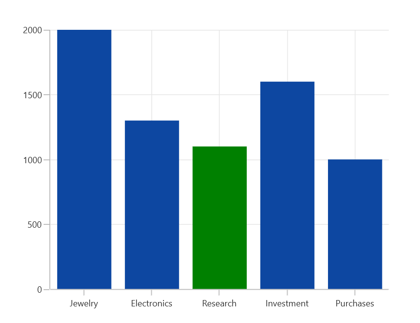
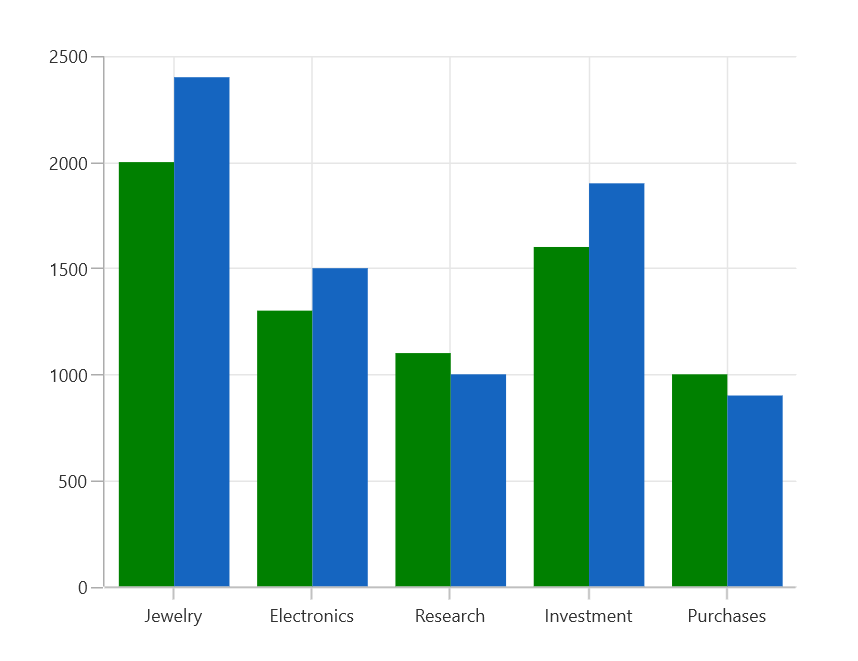
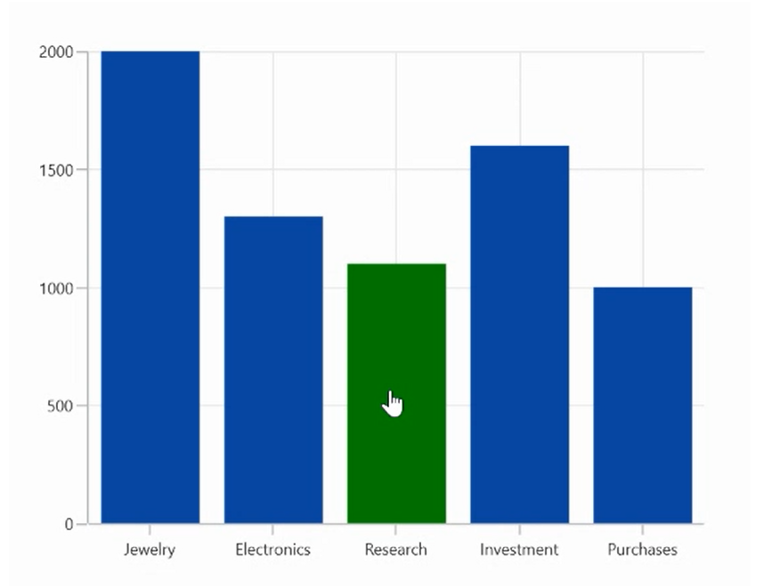

# Selection in WinUI Cartesian Chart (SfCartesianChart)

Cartesian chart supports selection that allows to select a segment or series in the chart by using [ChartSelectionBehavior](). 

## Enable selection

To enable the selection in chart, create an instance of [ChartSelectionBehavior]() and add it to the `Behaviors` collection of cartesian chart. And also need to set the [SelectionBrush]() property to highlight the segment in the chart.





<chart:SfCartesianChart>
. . .
    <chart:SfCartesianChart.Behaviors>
        <chart:ChartSelectionBehavior />
    </chart:SfCartesianChart.Behaviors>

        <chart:ColumnSeries ItemsSource="{Binding Data}" 
                            XBindingPath="Demand"
                            YBindingPath="Year2010"
                            SelectionBrush="Green"/>
</chart:SfCartesianChart>





SfCartesianChart chart = new SfCartesianChart();
. . .
ChartSelectionBehavior selection = new ChartSelectionBehavior();
chart.Behaviors.Add(selection);

ColumnSeries series = new ColumnSeries()
{
    ItemsSource = new ViewModel().Data,
    XBindingPath = "Demand",
    YBindingPath = "Year2010",
    SelectionBrush = new SolidColorBrush(Colors.Green)
};

chart.Series.Add(series);
this.Content = chart;





## Segment selection in linear type series

In linear type series the segment selection can be viewed by changing the data label interior.

The following code example demonstrates the spline series segment selection by changing the data label interior.





<chart:SfCartesianChart>
. . .
    <chart:SfCartesianChart.Behaviors>
        <chart:ChartSelectionBehavior />
    </chart:SfCartesianChart.Behaviors>

        <chart:SplineSeries ItemsSource="{Binding Data}" 
                            XBindingPath="Demand"
                            YBindingPath="Year2010"
                            SelectionBrush="Green"
                            ShowDataLabels="True"/>
</chart:SfCartesianChart>





SfCartesianChart chart = new SfCartesianChart();
. . .
ChartSelectionBehavior selection = new ChartSelectionBehavior();
chart.Behaviors.Add(selection);

SplineSeries series = new SplineSeries()
{
    ItemsSource = new ViewModel().Data,
    XBindingPath = "Demand",
    YBindingPath = "Year2010",
    SelectionBrush = new SolidColorBrush(Colors.Green),
    ShowDataLabels="True" 
};

chart.Series.Add(series);
this.Content = chart;





## Enable series selection

Series selection is used to highlight a particular series when using multiple series. Series selection is enabled by setting the [Type]() property value to [Series]() in [ChartSelectionBehavior](). The [SeriesSelectionBrush]() property is used to set the brush color to highlight the series.

The following code example demonstrates highlighting a series.





<chart:SfCartesianChart>
. . .
    <chart:SfCartesianChart.Behaviors>
        <chart:ChartSelectionBehavior SeriesSelectionBrush="Green" Type="Series"/>
    </chart:SfCartesianChart.Behaviors>
. . .
</chart:SfCartesianChart>





SfCartesianChart chart = new SfCartesianChart();
. . .
ChartSelectionBehavior selection = new ChartSelectionBehavior();
selection.SeriesSelectionBrush = new SolidColorBrush(Colors.Green);
selection.Type = SelectionType.Series;
chart.Behaviors.Add(selection);
. . .
this.Content = chart;





## Multi-selection

Cartesian chart provides support to select single or multiple segments/series by using the [Type]() property. [Type]() property with [MultiPoint]() value is used to select multiple segments and [MultiSeries]() is used to select multiple series. By default, the [Type]() value is [Point]().

The following code snippet demonstrates multiple segment selection.





<chart:SfCartesianChart>
. . .
    <chart:SfCartesianChart.Behaviors>
        <chart:ChartSelectionBehavior  Type="MultiPoint"/>
    </chart:SfCartesianChart.Behaviors>

    <chart:SfCartesianChart.Series>
        <chart:ColumnSeries ItemsSource="{Binding Data}"  
                            XBindingPath="Demand"
                            YBindingPath="Year2010" 
                            SelectionBrush="Green"/>
    </chart:SfCartesianChart.Series>

</chart:SfCartesianChart>





SfCartesianChart chart = new SfCartesianChart();
. . .
ChartSelectionBehavior selection = new ChartSelectionBehavior();
selection.Type = SelectionType.MultiPoint;
chart.Behaviors.Add(selection);

ColumnSeries series = new ColumnSeries()
{
    ItemsSource = new ViewModel().Data,
    XBindingPath = "Demand",
    YBindingPath = "Year2010",
    SelectionBrush = new SolidColorBrush(Colors.Green)
};
chart.Series.Add(series);
this.Content = chart;





The following code snippet demonstrates multiple series selection.





<chart:SfCartesianChart>
. . .
    <chart:SfCartesianChart.Behaviors>
        <chart:ChartSelectionBehavior SeriesSelectionBrush="Green" Type="MultiSeries"/>
    </chart:SfCartesianChart.Behaviors>
. . .
</chart:SfCartesianChart>





SfCartesianChart chart = new SfCartesianChart();
. . .
ChartSelectionBehavior selection = new ChartSelectionBehavior();
selection.SeriesSelectionBrush = new SolidColorBrush(Colors.Green);
selection.Type = SelectionType.MultiSeries;
chart.Behaviors.Add(selection);
. . .
this.Content = chart;





## Selection on initial rendering

Cartesian chart provides support to select a point programmatically on a chart using the [SelectedIndex]() property of series.





<chart:SfCartesianChart>
. . .
    <chart:SfCartesianChart.Behaviors>
        <chart:ChartSelectionBehavior/>
    </chart:SfCartesianChart.Behaviors>

    <chart:SfCartesianChart.Series>
        <chart:ColumnSeries ItemsSource="{Binding Data}" 
                            XBindingPath="Demand"
                            YBindingPath="Year2010" 
                            SelectionBrush="Green"]
                            SelectedIndex="3"/>
    </chart:SfCartesianChart.Series>

</chart:SfCartesianChart>





SfCartesianChart chart = new SfCartesianChart();
. . .
ChartSelectionBehavior selection = new ChartSelectionBehavior();
chart.Behaviors.Add(selection);

ColumnSeries series = new ColumnSeries()
{
    ItemsSource = new ViewModel().Data,
    XBindingPath = "Demand",
    YBindingPath = "Year2010",
    SelectionBrush = new SolidColorBrush(Colors.Green),
    SelectedIndex = 3
};
chart.Series.Add(series);
this.Content = chart;





Select a series programmatically on a chart using the [SelectedSeriesIndex]() property of the chart.





<chart:SfCartesianChart SelectedSeriesIndex="0">
. . .
    <chart:SfCartesianChart.Behaviors>
        <chart:ChartSelectionBehavior SeriesSelectionBrush="Green" Type="Series"/>
    </chart:SfCartesianChart.Behaviors>
. . .
</chart:SfCartesianChart>





SfCartesianChart chart = new SfCartesianChart();
chart.SelectedSeriesIndex = 0;
. . .
ChartSelectionBehavior selection = new ChartSelectionBehavior();
selection.SeriesSelectionBrush = new SolidColorBrush(Colors.Green);
selection.Type = SelectionType.Series;
chart.Behaviors.Add(selection);
. . .
this.Content = chart;





## Changing cursor while selection

[Cursor]() property allows to define the cursor when mouse is hovered over the segment with segment selection enabled.

The following code snippet demonstrates hand cursor in the segment selection.





<chart:SfCartesianChart>
. . . 
    <chart:SfCartesianChart.Behaviors>
        <chart:ChartSelectionBehavior  Cursor="Hand"/>
    </chart:SfCartesianChart.Behaviors>

    <chart:SfCartesianChart.Series>
        <chart:ColumnSeries ItemsSource="{Binding Data}"  
                            XBindingPath="Demand" 
                            YBindingPath="Year2010" 
                            SelectionBrush="Green"/>
     </chart:SfCartesianChart.Series>

</chart:SfCartesianChart>





SfCartesianChart chart = new SfCartesianChart();
. . .
ChartSelectionBehavior selection = new ChartSelectionBehavior();
selection.Cursor = Windows.UI.Core.CoreCursorType.Hand;
chart.Behaviors.Add(selection);

ColumnSeries series = new ColumnSeries()
{
    ItemsSource = new ViewModel().Data,
    XBindingPath = "Demand",
    YBindingPath = "Year2010",
    SelectionBrush = new SolidColorBrush(Colors.Green)
};

chart.Series.Add(series);
this.Content = chart;





## Events

The following selection events are available in the `SfCartesianChart`.

### SelectionChanging

The [SelectionChanging]() event occurs before the data point is being selected. This is a cancelable event. This argument contains the following information.

* [SelectedSeries]() - Gets the series of the selected data point.
* [SelectedSegments]() - Gets or sets the segments collection of the selected series.
* [SelectedSegment]() - Gets the segment of the selected data point.
* [SelectedIndex]() - Gets the selected data point index.
* [PreviousSelectedIndex]() - Gets the previous selected data point index.
* [IsSelected]() - Gets a value that indicates whether the segment or series is selected.
* [IsDataPointSelection]() - Gets a value that indicates whether the selection is segment selection or series selection.
* [Cancel]() - Gets or Sets a value that indicates whether the selection should be canceled.

### SelectionChanged

The [SelectionChanged]() event occurs after a data point has been selected. This argument contains the following information.

* [SelectedSeries]() - Gets the series of the selected data point.
* [SelectedSegments]() - Gets the segments collection of the selected series.
* [SelectedSegment]() - Gets the segment of the selected data point.
* [SelectedIndex]() - Gets the selected data point index.
* [PreviousSelectedSeries]() - Gets the previous selected series.
* [PreviousSelectedSegment]() - Gets the segment of previous selected data point.
* [PreviousSelectedIndex]() - Gets the previous selected data point index.
* [OldPointInfo]() - Gets the previous selected segment item value.
* [NewPointInfo]() - Gets the selected segment item value.
* [IsSelected]() - Gets a value that indicates whether the segment or series is being selected.
* [IsDataPointSelection]() - Gets a value that indicates whether the selection is segment selection or series selection.

