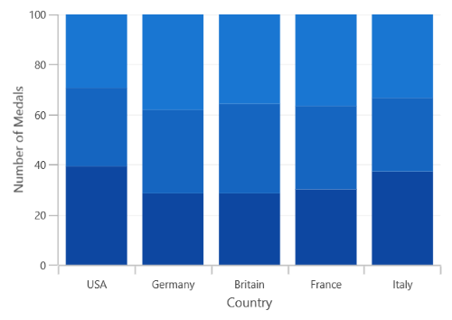
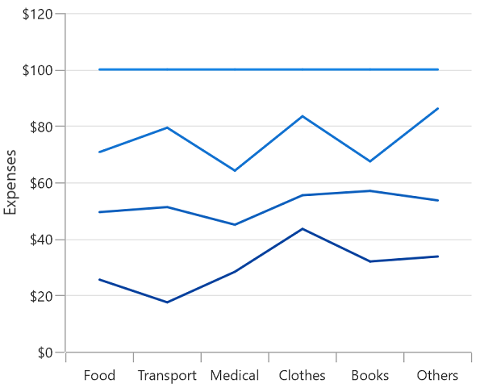
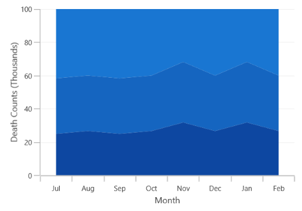

# Stacked 100 Charts in WinUI Chart (SfCartesianChart)

## Stacked Column 100 Chart

The [StackedColumn100Series](https://help.syncfusion.com/cr/winui/Syncfusion.UI.Xaml.Charts.StackedColumn100Series.html) resembles [StackedColumnSeries](https://help.syncfusion.com/cr/winui/Syncfusion.UI.Xaml.Charts.StackedColumnSeries.html) but the cumulative portion of each stacked element always comes to a total of 100%. 





<chart:SfCartesianChart>
    
    <chart:SfCartesianChart.XAxes>
        <chart:CategoryAxis LabelPlacement="BetweenTicks"/>
    </chart:SfCartesianChart.XAxes>

    <chart:SfCartesianChart.YAxes>
        <chart:NumericalAxis />
    </chart:SfCartesianChart.YAxes>  

    <chart:StackedColumn100Series XBindingPath="CountryName" 
                                  YBindingPath="GoldMedals" 
                                  ItemsSource="{Binding MedalDetails}"/>

    <chart:StackedColumn100Series XBindingPath="CountryName"
                                  YBindingPath="SilverMedals" 
                                  ItemsSource="{Binding MedalDetails}"/>

    <chart:StackedColumn100Series XBindingPath="CountryName" 
                                  YBindingPath="BronzeMedals" 
                                  ItemsSource="{Binding MedalDetails}"/>
    ...
</chart:SfCartesianChart>





SfCartesianChart chart = new SfCartesianChart();
ViewModel viewModel = new ViewModel();
CategoryAxis primaryAxis = new CategoryAxis();
primaryAxis.LabelPlacement = LabelPlacement.BetweenTicks;
chart.XAxes.Add(primaryAxis);
NumericalAxis secondaryAxis = new NumericalAxis();
chart.YAxes.Add(secondaryAxis);

StackedColumn100Series series1 = new StackedColumn100Series()
{
    ItemsSource = viewModel.MedalDetails,
    XBindingPath = "CountryName",
    YBindingPath = "GoldMedals",
};

StackedColumn100Series series2 = new StackedColumn100Series()
{
    ItemsSource = viewModel.MedalDetails,
    XBindingPath = "CountryName",
    YBindingPath = "SilverMedals",
};

StackedColumn100Series series3 = new StackedColumn100Series()
{
    ItemsSource = viewModel.MedalDetails,
    XBindingPath = "CountryName",
    YBindingPath = "BronzeMedals",
};

chart.Series.Add(series1);
chart.Series.Add(series2);
chart.Series.Add(series3);
...





N> You can refer to our [WinUI 100% Stacked Column Chart](https://www.syncfusion.com/winui-controls/charts/winui-stacked-column-100-chart) feature tour page for its groundbreaking feature representations. You can also explore our [WinUI 100% Stacked Column Chart example](https://github.com/syncfusion/winui-demos/blob/master/chart/Views/Stacking%20Charts%20100/StackingColumn100Chart.xaml) that shows how to easily configure with built-in support for creating stunning visual effects.

## Stacked Line 100 Chart

The [StackedLine100Series](https://help.syncfusion.com/cr/winui/Syncfusion.UI.Xaml.Charts.StackedLine100Series.html) resembles [StackedLineSeries](https://help.syncfusion.com/cr/winui/Syncfusion.UI.Xaml.Charts.StackedLineSeries.html) but the cumulative portion of each stacked element always comes to a total of 100%. 





<chart:SfCartesianChart>
    
    <chart:SfCartesianChart.XAxes>
        <chart:CategoryAxis LabelPlacement="BetweenTicks"/>
    </chart:SfCartesianChart.XAxes>

    <chart:SfCartesianChart.YAxes>
        <chart:NumericalAxis />
    </chart:SfCartesianChart.YAxes>  

    <chart:StackedLine100Series ItemsSource="{Binding Data}" 
                                XBindingPath="MonthlyExpenses" 
                                YBindingPath="Father" />

    <chart:StackedLine100Series ItemsSource="{Binding Data}"
                                XBindingPath="MonthlyExpenses"  
                                YBindingPath="Mother" />

    <chart:StackedLine100Series ItemsSource="{Binding Data}"
                                XBindingPath="MonthlyExpenses" 
                                YBindingPath="Son"/>
    ...
<chart:SfCartesianChart>





SfCartesianChart chart = new SfCartesianChart();
ViewModel viewModel = new ViewModel();
CategoryAxis primaryAxis = new CategoryAxis();
primaryAxis.LabelPlacement = LabelPlacement.BetweenTicks;
chart.XAxes.Add(primaryAxis);
NumericalAxis secondaryAxis = new NumericalAxis();
chart.YAxes.Add(secondaryAxis);

StackedLine100Series series1 = new StackedLine100Series()
{
    ItemsSource = viewModel.Data,
    XBindingPath = "MonthlyExpenses",
    YBindingPath = "Father",
};

StackedLine100Series series2 = new StackedLine100Series()
{
    ItemsSource = viewModel.Data,
    XBindingPath = "MonthlyExpenses",
    YBindingPath = "Mother",
};

StackedLine100Series series3 = new StackedLine100Series()
{
    ItemsSource = viewModel.Data,
    XBindingPath = "MonthlyExpenses",
    YBindingPath = "Son",
};

chart.Series.Add(series1);
chart.Series.Add(series2);
chart.Series.Add(series3);
...





N> You can refer to our [WinUI 100% Stacked Line Chart](https://www.syncfusion.com/winui-controls/charts/winui-stacked-line-100-chart) feature tour page for its groundbreaking feature representations. You can also explore our [WinUI 100% Stacked Line Chart example](https://github.com/syncfusion/winui-demos/blob/master/chart/Views/Stacking%20Charts%20100/StackingLine100Chart.xaml) that shows how to easily configure with built-in support for creating stunning visual effects.

## Stacked Area 100 Chart

The [StackedArea100Series](https://help.syncfusion.com/cr/winui/Syncfusion.UI.Xaml.Charts.StackedArea100Series.html) is similar to [StackedAreaSeries](https://help.syncfusion.com/cr/winui/Syncfusion.UI.Xaml.Charts.StackedAreaSeries.html), but the cumulative portion of each stacked element always comes to a total of 100%. 





<chart:SfCartesianChart>
    
    <chart:SfCartesianChart.XAxes>
        <chart:CategoryAxis LabelPlacement="BetweenTicks"/>
    </chart:SfCartesianChart.XAxes>

    <chart:SfCartesianChart.YAxes>
        <chart:NumericalAxis />
    </chart:SfCartesianChart.YAxes>  
    
    <chart:StackedArea100Series XBindingPath="Month"         
                                YBindingPath="Bus" 
                                ItemsSource="{Binding Accidents}" />

    <chart:StackedArea100Series XBindingPath="Month" 
                                YBindingPath="Car" 
                                ItemsSource="{Binding Accidents}" />

    <chart:StackedArea100Series XBindingPath="Month" 
                                YBindingPath="Truck" 
                                ItemsSource="{Binding Accidents}" />
</chart:SfCartesianChart>





SfCartesianChart chart = new SfCartesianChart();
ViewModel viewModel = new ViewModel();
CategoryAxis primaryAxis = new CategoryAxis();
primaryAxis.LabelPlacement = LabelPlacement.BetweenTicks;
chart.XAxes.Add(primaryAxis);
NumericalAxis secondaryAxis = new NumericalAxis();
chart.YAxes.Add(secondaryAxis);

StackedArea100Series series1 = new StackedArea100Series()
{
    ItemsSource = viewModel.Accidents,
    XBindingPath = "Month",
    YBindingPath = "Bus",
};

StackedArea100Series series2 = new StackedArea100Series()
{
    ItemsSource = viewModel.Accidents,
    XBindingPath = "Month",
    YBindingPath = "Car",
};

StackedArea100Series series3 = new StackedArea100Series()
{
    ItemsSource = viewModel.Accidents,
    XBindingPath = "Month",
    YBindingPath = "Truck",
};

chart.Series.Add(series1);
chart.Series.Add(series2);
chart.Series.Add(series3);
...





N> You can refer to our [WinUI 100% Stacked Area Chart](https://www.syncfusion.com/winui-controls/charts/winui-stacked-area-100-chart) feature tour page for its groundbreaking feature representations. You can also explore our [WinUI 100% Stacked Area Chart example](https://github.com/syncfusion/winui-demos/blob/master/chart/Views/Stacking%20Charts%20100/StackingArea100Chart.xaml) that shows how to easily configure with built-in support for creating stunning visual effects.