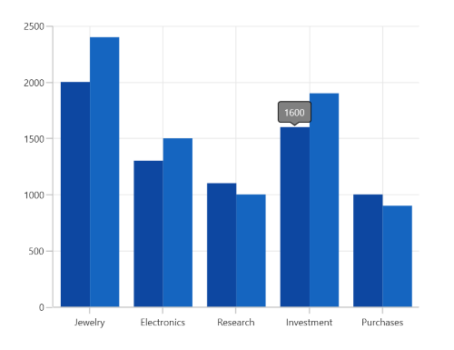
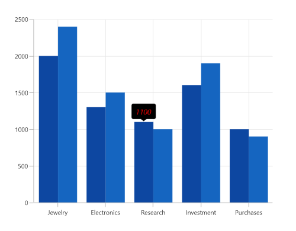
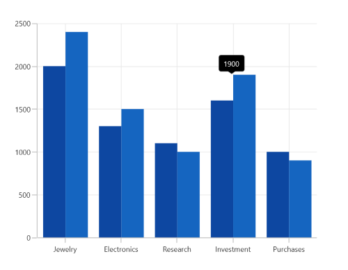
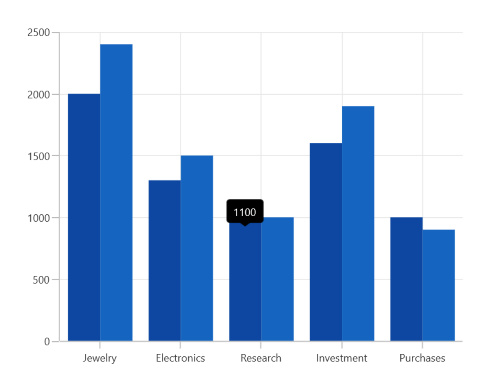
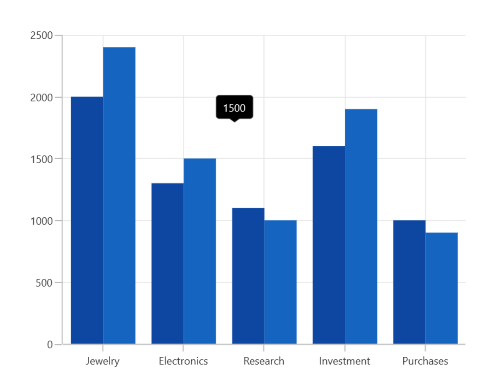

# Tooltip in WinUI Chart (SfCartesianChart)

Tooltip is used to display any information over segments. It appears at the data point position when the mouse hovers over any series segment. It is set to display the metadata of the hovered segment or data point.

## Define Tooltip

To define the tooltip in the series, set the [EnableTooltip](https://help.syncfusion.com/cr/winui/Syncfusion.UI.Xaml.Charts.ChartSeries.html#Syncfusion_UI_Xaml_Charts_ChartSeries_EnableTooltip) property to true. The default value of [EnableTooltip](https://help.syncfusion.com/cr/winui/Syncfusion.UI.Xaml.Charts.ChartSeries.html#Syncfusion_UI_Xaml_Charts_ChartSeries_EnableTooltip) property is `false`.





<chart:SfCartesianChart>
. . .
    <chart:SfCartesianChart.Series>
        <chart:ColumnSeries ItemsSource="{Binding Data}" 
                            XBindingPath="Demand"
                            YBindingPath="Year2010" 
                            EnableTooltip="True"/>

        <chart:ColumnSeries ItemsSource="{Binding Data}" 
                            XBindingPath="Demand"
                            YBindingPath="Year2011"
                            EnableTooltip="True"/>
    </chart:SfCartesianChart.Series>
</chart:SfCartesianChart>





SfCartesianChart chart = new SfCartesianChart();
. . .
ColumnSeries series1 = new ColumnSeries()
{
    ItemsSource = new ViewModel().Data,
    XBindingPath = "Demand",
    YBindingPath = "Year2010",
    EnableTooltip = true
};

ColumnSeries series2 = new ColumnSeries()
{
    ItemsSource = new ViewModel().Data,
    XBindingPath = "Demand",
    YBindingPath = "Year2011",
    EnableTooltip = true
};

chart.Series.Add(series1);
chart.Series.Add(series2);
this.Content = chart;





The [ChartTooltipBehavior](https://help.syncfusion.com/cr/winui/Syncfusion.UI.Xaml.Charts.ChartTooltipBehavior.html)  is used to customize the tooltip. For customizing the tooltip, create an instance [ChartTooltipBehavior](https://help.syncfusion.com/cr/winui/Syncfusion.UI.Xaml.Charts.ChartTooltipBehavior.html) and set it to the [TooltipBehavior](https://help.syncfusion.com/cr/winui/Syncfusion.UI.Xaml.Charts.ChartBase.html#Syncfusion_UI_Xaml_Charts_ChartBase_TooltipBehavior) property of the [SfCartesianChart](https://help.syncfusion.com/cr/winui/Syncfusion.UI.Xaml.Charts.SfCartesianChart.html). The following properties are used to customize the tooltip:

* [Style](https://help.syncfusion.com/cr/winui/Syncfusion.UI.Xaml.Charts.ChartTooltipBehavior.html#Syncfusion_UI_Xaml_Charts_ChartTooltipBehavior_Style) - Used to customize the fill and stroke of the tooltip.
* [LabelStyle](https://help.syncfusion.com/cr/winui/Syncfusion.UI.Xaml.Charts.ChartTooltipBehavior.html#Syncfusion_UI_Xaml_Charts_ChartTooltipBehavior_LabelStyle) - Used to customize the tooltip label.
* [HorizontalAlignment](https://help.syncfusion.com/cr/winui/Syncfusion.UI.Xaml.Charts.ChartTooltipBehavior.html#Syncfusion_UI_Xaml_Charts_ChartTooltipBehavior_HorizontalAlignment) - Used to align the tooltip label at the left, right, and center of the data point position or cursor position horizontally.
* [VerticalAlignment](https://help.syncfusion.com/cr/winui/Syncfusion.UI.Xaml.Charts.ChartTooltipBehavior.html#Syncfusion_UI_Xaml_Charts_ChartTooltipBehavior_VerticalAlignment) - Used to align the tooltip label at the top, center, and bottom of the data point position or cursor position vertically.
* [HorizontalOffset](https://help.syncfusion.com/cr/winui/Syncfusion.UI.Xaml.Charts.ChartTooltipBehavior.html#Syncfusion_UI_Xaml_Charts_ChartTooltipBehavior_HorizontalOffset) - Used to position the tooltip at a distance from the data point or cursor position horizontally.
* [VerticalOffset](https://help.syncfusion.com/cr/winui/Syncfusion.UI.Xaml.Charts.ChartTooltipBehavior.html#Syncfusion_UI_Xaml_Charts_ChartTooltipBehavior_VerticalOffset) - Used to position the tooltip at a distance from the data point or cursor position vertically.
* [ShowDuration](https://help.syncfusion.com/cr/winui/Syncfusion.UI.Xaml.Charts.ChartTooltipBehavior.html#Syncfusion_UI_Xaml_Charts_ChartTooltipBehavior_ShowDuration) - Used to set the amount of time that the tooltip remains visible in milliseconds.
* [EnableAnimation](https://help.syncfusion.com/cr/winui/Syncfusion.UI.Xaml.Charts.ChartTooltipBehavior.html#Syncfusion_UI_Xaml_Charts_ChartTooltipBehavior_EnableAnimation) - Used to enable the animation when showing the tooltip.
* [InitialShowDelay](https://help.syncfusion.com/cr/winui/Syncfusion.UI.Xaml.Charts.ChartTooltipBehavior.html#Syncfusion_UI_Xaml_Charts_ChartTooltipBehavior_InitialShowDelay) - Used to delay the display of the tooltip in milliseconds after the user interacts with the series.





<chart:SfCartesianChart.TooltipBehavior>
    <chart:ChartTooltipBehavior/>
</chart:SfCartesianChart.TooltipBehavior>





SfCartesianChart chart = new SfCartesianChart();

ChartTooltipBehavior tooltip = new ChartTooltipBehavior();
chart.TooltipBehavior = tooltip;





## Background Style

The tooltip's fill and stroke color can be customized by using the [Style](https://help.syncfusion.com/cr/winui/Syncfusion.UI.Xaml.Charts.ChartTooltipBehavior.html#Syncfusion_UI_Xaml_Charts_ChartTooltipBehavior_Style) property. To define a [Style](https://help.syncfusion.com/cr/winui/Syncfusion.UI.Xaml.Charts.ChartTooltipBehavior.html#Syncfusion_UI_Xaml_Charts_ChartTooltipBehavior_Style) for tooltip, specify the style of `TargetType` as `Path`.





<chart:SfCartesianChart>
    <chart:SfCartesianChart.Resources>
        
    </chart:SfCartesianChart.Resources>
. . .
    <chart:SfCartesianChart.TooltipBehavior>
        <chart:ChartTooltipBehavior Style="{StaticResource style}"/>
    </chart:SfCartesianChart.TooltipBehavior>

    <chart:SfCartesianChart.Series>
        <chart:ColumnSeries ItemsSource="{Binding Data}" 
                            XBindingPath="Demand"
                            YBindingPath="Year2010" 
                            EnableTooltip="True"/>
                
        <chart:ColumnSeries ItemsSource="{Binding Data}" 
                            XBindingPath="Demand"
                            YBindingPath="Year2011"
                            EnableTooltip="True"/>
    </chart:SfCartesianChart.Series>

</chart:SfCartesianChart>





SfCartesianChart chart = new SfCartesianChart();

Style style = new Style(typeof(Path));
style.Setters.Add(new Setter(Path.StrokeProperty, new SolidColorBrush(Colors.Black)));
style.Setters.Add(new Setter(Path.FillProperty, new SolidColorBrush(Colors.Gray)));
...
ChartTooltipBehavior tooltipBehavior = new ChartTooltipBehavior();
tooltipBehavior.Style = style;
chart.TooltipBehavior = tooltipBehavior;

ColumnSeries series1 = new ColumnSeries()
{
    ItemsSource = new ViewModel().Data,
    XBindingPath = "Demand",
    YBindingPath = "Year2010",
    EnableTooltip = true
};

ColumnSeries series2 = new ColumnSeries()
{
    ItemsSource = new ViewModel().Data,
    XBindingPath = "Demand",
    YBindingPath = "Year2011",
    EnableTooltip = true
};

chart.Series.Add(series1);
chart.Series.Add(series2);
this.Content = chart;





## Label Style

The tooltip label style can be customized by using the [LabelStyle](https://help.syncfusion.com/cr/winui/Syncfusion.UI.Xaml.Charts.ChartTooltipBehavior.html#Syncfusion_UI_Xaml_Charts_ChartTooltipBehavior_LabelStyle) property. To define a `Style` for the tooltip label, specify the style of `TargetType` as `TextBlock`.





<chart:SfCartesianChart>
    <chart:SfCartesianChart.Resources>
        
    </chart:SfCartesianChart.Resources>
. . .
    <chart:SfCartesianChart.TooltipBehavior>
        <chart:ChartTooltipBehavior LabelStyle="{StaticResource labelStyle}"/>
    </chart:SfCartesianChart.TooltipBehavior>

    <chart:SfCartesianChart.Series>
        <chart:ColumnSeries ItemsSource="{Binding Data}" 
                            XBindingPath="Demand"
                            YBindingPath="Year2010" 
                            EnableTooltip="True"/>
                
        <chart:ColumnSeries ItemsSource="{Binding Data}" 
                            XBindingPath="Demand"
                            YBindingPath="Year2011"
                            EnableTooltip="True"/>
    </chart:SfCartesianChart.Series>

</chart:SfCartesianChart>





SfCartesianChart chart = new SfCartesianChart();

Style labelStyle = new Style(typeof(TextBlock));
labelStyle.Setters.Add(new Setter(TextBlock.FontSizeProperty, 14d));
labelStyle.Setters.Add(new Setter(TextBlock.FontStyleProperty, FontStyles.Italic));
labelStyle.Setters.Add(new Setter(TextBlock.ForegroundProperty, new SolidColorBrush(Colors.Red)));
...
ChartTooltipBehavior tooltipBehavior = new ChartTooltipBehavior();
tooltipBehavior.LabelStyle = labelStyle;
chart.TooltipBehavior = tooltipBehavior;

ColumnSeries series1 = new ColumnSeries()
{
    ItemsSource = new ViewModel().Data,
    XBindingPath = "Demand",
    YBindingPath = "Year2010",
    EnableTooltip = true
};

ColumnSeries series2 = new ColumnSeries()
{
    ItemsSource = new ViewModel().Data,
    XBindingPath = "Demand",
    YBindingPath = "Year2011",
    EnableTooltip = true
};

chart.Series.Add(series1);
chart.Series.Add(series2);
this.Content = chart;





## Alignment

The tooltip can be aligned with respect to the cursor position using the [HorizontalAlignment](https://help.syncfusion.com/cr/winui/Syncfusion.UI.Xaml.Charts.ChartTooltipBehavior.html#Syncfusion_UI_Xaml_Charts_ChartTooltipBehavior_HorizontalAlignment) and [VerticalAlignment](https://help.syncfusion.com/cr/winui/Syncfusion.UI.Xaml.Charts.ChartTooltipBehavior.html#Syncfusion_UI_Xaml_Charts_ChartTooltipBehavior_VerticalAlignment) properties.

**HorizontalAlignment**

Tooltip can be positioned horizontally left, right, or center to the cursor position.





<chart:SfCartesianChart Height="388"  Width="500">
. . .
    <chart:SfCartesianChart.TooltipBehavior>
        <chart:ChartTooltipBehavior HorizontalAlignment="Left"/>
    </chart:SfCartesianChart.TooltipBehavior>

    <chart:SfCartesianChart.Series>
        <chart:ColumnSeries ItemsSource="{Binding Data}" 
                            XBindingPath="Demand"
                            YBindingPath="Year2010" 
                            EnableTooltip="True"/>
                
        <chart:ColumnSeries ItemsSource="{Binding Data}" 
                            XBindingPath="Demand"
                            YBindingPath="Year2011"
                            EnableTooltip="True"/>
    </chart:SfCartesianChart.Series>

</chart:SfCartesianChart>





SfCartesianChart chart = new SfCartesianChart();
. . .
ChartTooltipBehavior tooltipBehavior = new ChartTooltipBehavior();
tooltipBehavior.HorizontalAlignment = HorizontalAlignment.Left;
chart.TooltipBehavior = tooltipBehavior;

ColumnSeries series1 = new ColumnSeries()
{
    ItemsSource = new ViewModel().Data,
    XBindingPath = "Demand",
    YBindingPath = "Year2010",
    EnableTooltip = true
};

ColumnSeries series2 = new ColumnSeries()
{
    ItemsSource = new ViewModel().Data,
    XBindingPath = "Demand",
    YBindingPath = "Year2011",
    EnableTooltip = true
};

chart.Series.Add(series1);
chart.Series.Add(series2);
this.Content = chart;





**VerticalAlignment**

Tooltip can be positioned vertically top, bottom, or center to the cursor position.





<chart:SfCartesianChart Height="388"  Width="500">
. . .
    <chart:SfCartesianChart.TooltipBehavior>
        <chart:ChartTooltipBehavior VerticalAlignment="Bottom"/>
    </chart:SfCartesianChart.TooltipBehavior>

    <chart:SfCartesianChart.Series>
        <chart:ColumnSeries ItemsSource="{Binding Data}" 
                            XBindingPath="Demand"
                            YBindingPath="Year2010" 
                            EnableTooltip="True"/>
                
        <chart:ColumnSeries ItemsSource="{Binding Data}" 
                            XBindingPath="Demand"
                            YBindingPath="Year2011"
                            EnableTooltip="True"/>
    </chart:SfCartesianChart.Series>

</chart:SfCartesianChart>





SfCartesianChart chart = new SfCartesianChart();
. . .
ChartTooltipBehavior tooltipBehavior = new ChartTooltipBehavior();
tooltipBehavior.VerticalAlignment = VerticalAlignment.Bottom;
chart.TooltipBehavior = tooltipBehavior;

ColumnSeries series1 = new ColumnSeries()
{
    ItemsSource = new ViewModel().Data,
    XBindingPath = "Demand",
    YBindingPath = "Year2010",
    EnableTooltip = true
};

ColumnSeries series2 = new ColumnSeries()
{
    ItemsSource = new ViewModel().Data,
    XBindingPath = "Demand",
    YBindingPath = "Year2011",
    EnableTooltip = true
};

chart.Series.Add(series1);
chart.Series.Add(series2);
this.Content = chart;





## Offset

The tooltip can be positioned at a particular distance from the cursor by using the [HorizontalOffset](https://help.syncfusion.com/cr/winui/Syncfusion.UI.Xaml.Charts.ChartTooltipBehavior.html#Syncfusion_UI_Xaml_Charts_ChartTooltipBehavior_HorizontalOffset) and [VerticalOffset](https://help.syncfusion.com/cr/winui/Syncfusion.UI.Xaml.Charts.ChartTooltipBehavior.html#Syncfusion_UI_Xaml_Charts_ChartTooltipBehavior_VerticalOffset) properties.





<chart:SfCartesianChart Height="388"  Width="500">
. . .
    <chart:SfCartesianChart.TooltipBehavior>
        <chart:ChartTooltipBehavior HorizontalOffset="40" VerticalOffset="40"/>
    </chart:SfCartesianChart.TooltipBehavior>

    <chart:SfCartesianChart.Series>
        <chart:ColumnSeries ItemsSource="{Binding Data}" 
                            XBindingPath="Demand"
                            YBindingPath="Year2010" 
                            EnableTooltip="True"/>
                
        <chart:ColumnSeries ItemsSource="{Binding Data}" 
                            XBindingPath="Demand"
                            YBindingPath="Year2011"
                            EnableTooltip="True"/>
    </chart:SfCartesianChart.Series>

</chart:SfCartesianChart>





SfCartesianChart chart = new SfCartesianChart();
. . .
ChartTooltipBehavior tooltipBehavior = new ChartTooltipBehavior();
tooltipBehavior.HorizontalOffset = 40;
tooltipBehavior.VerticalOffset = 40;
chart.TooltipBehavior = tooltipBehavior;

ColumnSeries series1 = new ColumnSeries()
{
    ItemsSource = new ViewModel().Data,
    XBindingPath = "Demand",
    YBindingPath = "Year2010",
    EnableTooltip = true
};

ColumnSeries series2 = new ColumnSeries()
{
    ItemsSource = new ViewModel().Data,
    XBindingPath = "Demand",
    YBindingPath = "Year2011",
    EnableTooltip = true
};

chart.Series.Add(series1);
chart.Series.Add(series2);
this.Content = chart;





## Duration

The [ShowDuration]() property is used to specify the duration time in milliseconds for which tooltip will be displayed.

N> By default, the tooltip will be displayed for 1000 milliseconds.





<chart:SfCartesianChart Height="388"  Width="500">
. . .
    <chart:SfCartesianChart.TooltipBehavior>
        <chart:ChartTooltipBehavior ShowDuration="5000"/>
    </chart:SfCartesianChart.TooltipBehavior>

    <chart:SfCartesianChart.Series>
        <chart:ColumnSeries ItemsSource="{Binding Data}" 
                            XBindingPath="Demand"
                            YBindingPath="Year2010" 
                            EnableTooltip="True"/>
                
        <chart:ColumnSeries ItemsSource="{Binding Data}" 
                            XBindingPath="Demand"
                            YBindingPath="Year2011"
                            EnableTooltip="True"/>
    </chart:SfCartesianChart.Series>

</chart:SfCartesianChart>





SfCartesianChart chart = new SfCartesianChart();
. . .
ChartTooltipBehavior tooltipBehavior = new ChartTooltipBehavior();
tooltipBehavior.ShowDuration = 5000;
chart.TooltipBehavior = tooltipBehavior;

ColumnSeries series1 = new ColumnSeries()
{
    ItemsSource = new ViewModel().Data,
    XBindingPath = "Demand",
    YBindingPath = "Year2010",
    EnableTooltip = true
};

ColumnSeries series2 = new ColumnSeries()
{
    ItemsSource = new ViewModel().Data,
    XBindingPath = "Demand",
    YBindingPath = "Year2011",
    EnableTooltip = true
};

chart.Series.Add(series1);
chart.Series.Add(series2);
this.Content = chart;





## Animation

Animation for tooltip can be set by using the [EnableAnimation](https://help.syncfusion.com/cr/winui/Syncfusion.UI.Xaml.Charts.ChartTooltipBehavior.html#Syncfusion_UI_Xaml_Charts_ChartTooltipBehavior_EnableAnimation) property as shown in the following code sample.





<chart:SfCartesianChart Height="388"  Width="500">
. . .
    <chart:SfCartesianChart.TooltipBehavior>
        <chart:ChartTooltipBehavior EnableAnimation="True"/>
    </chart:SfCartesianChart.TooltipBehavior>

    <chart:SfCartesianChart.Series>
        <chart:ColumnSeries ItemsSource="{Binding Data}" 
                            XBindingPath="Demand"
                            YBindingPath="Year2010" 
                            EnableTooltip="True"/>
                
        <chart:ColumnSeries ItemsSource="{Binding Data}" 
                            XBindingPath="Demand"
                            YBindingPath="Year2011"
                            EnableTooltip="True"/>
    </chart:SfCartesianChart.Series>

</chart:SfCartesianChart>





SfCartesianChart chart = new SfCartesianChart();
. . .
ChartTooltipBehavior tooltipBehavior = new ChartTooltipBehavior();
tooltipBehavior.EnableAnimation = true;
chart.TooltipBehavior = tooltipBehavior;

ColumnSeries series1 = new ColumnSeries()
{
    ItemsSource = new ViewModel().Data,
    XBindingPath = "Demand",
    YBindingPath = "Year2010",
    EnableTooltip = true
};

ColumnSeries series2 = new ColumnSeries()
{
    ItemsSource = new ViewModel().Data,
    XBindingPath = "Demand",
    YBindingPath = "Year2011",
    EnableTooltip = true
};

chart.Series.Add(series1);
chart.Series.Add(series2);
this.Content = chart;





## Template

The [SfCartesianChart](https://help.syncfusion.com/cr/winui/Syncfusion.UI.Xaml.Charts.SfCartesianChart.html) provides support to customize the appearance of the tooltip by using the [TooltipTemplate](https://help.syncfusion.com/cr/winui/Syncfusion.UI.Xaml.Charts.ChartSeries.html#Syncfusion_UI_Xaml_Charts_ChartSeries_TooltipTemplate) property.





<chart:SfCartesianChart Height="388"  Width="500">
    <chart:SfCartesianChart.Resources>
        <DataTemplate x:Key="tooltipTemplate1">
            <StackPanel Orientation="Horizontal">
                <TextBlock Text="{Binding Item.Category}"
						   Foreground="Black"
						   FontWeight="Medium" 
						   FontSize="12"
						   HorizontalAlignment="Center"
						   VerticalAlignment="Center"/>
                <TextBlock Text=" : "
						   Foreground="Black"
						   FontWeight="Medium"
						   FontSize="12" 
						   HorizontalAlignment="Center"
						   VerticalAlignment="Center"/>
                <TextBlock Text="{Binding Item.Value}"
						   Foreground="Black"
						   FontWeight="Medium"
						   FontSize="12"
						   HorizontalAlignment="Center"
						   VerticalAlignment="Center"/>
            </StackPanel>
        </DataTemplate>
        . . .
        
    </chart:SfCartesianChart.Resources>
. . .
    <chart:SfCartesianChart.TooltipBehavior>
        <chart:ChartTooltipBehavior Style="{StaticResource style}"/>
    </chart:SfCartesianChart.TooltipBehavior>

    <chart:SfCartesianChart.Series>
        <chart:ColumnSeries ItemsSource="{Binding Data}" 
                            TooltipTemplate="{StaticResource tooltipTemplate1}"
                            XBindingPath="Demand"
                            YBindingPath="Year2010" 
                            EnableTooltip="True"/>
                
        <chart:ColumnSeries ItemsSource="{Binding Data}" 
                            TooltipTemplate="{StaticResource tooltipTemplate2}"
                            XBindingPath="Demand"
                            YBindingPath="Year2011"
                            EnableTooltip="True"/>
    </chart:SfCartesianChart.Series>

</chart:SfCartesianChart>





SfCartesianChart chart = new SfCartesianChart();
. . .
ColumnSeries series1 = new ColumnSeries()
{
    ItemsSource = new ViewModel().Data,
    XBindingPath = "Demand",
    YBindingPath = "Year2010",
    EnableTooltip = true,
    TooltipTemplate = chart.Resources["tooltipTemplate1"] as DataTemplate
};

ColumnSeries series2 = new ColumnSeries()
{
    ItemsSource = new ViewModel().Data,
    XBindingPath = "Demand",
    YBindingPath = "Year2011",
    EnableTooltip = true,
    TooltipTemplate = chart.Resources["tooltipTemplate2"] as DataTemplate
};

chart.Series.Add(series1);
chart.Series.Add(series2);
this.Content = chart;
        




