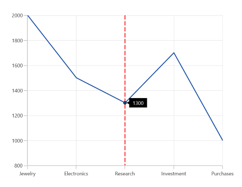
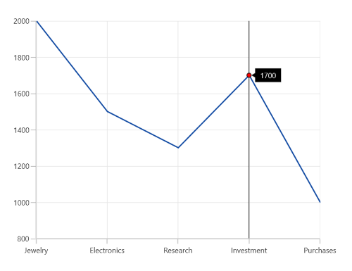
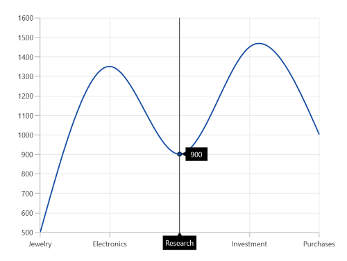
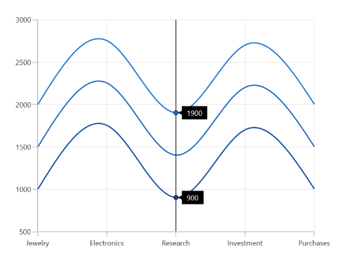
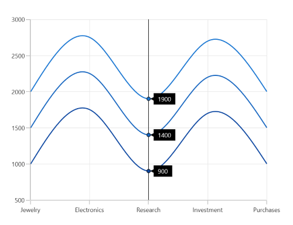
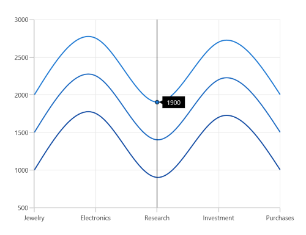
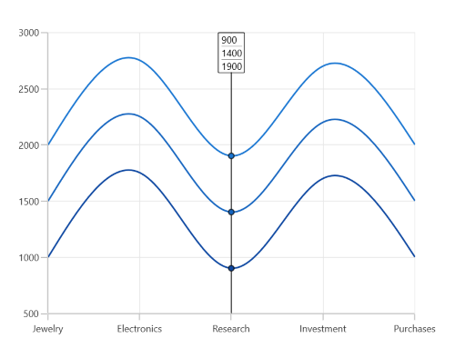
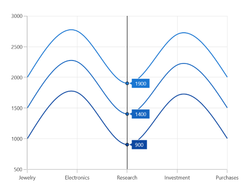

# Trackball in WinUI Chart (SfCartesianChart)

The trackball allows you to track a data point closer to the cursor position. The x values are determined from the position of the vertical line in the axis and y values are determined from the points touching the vertical line in the series.

## Define Trackball

To add the trackball in the chart, create an instance [ChartTrackballBehavior](https://help.syncfusion.com/cr/winui/Syncfusion.UI.Xaml.Charts.ChartTrackballBehavior.html) and set it to the [TrackballBehavior](https://help.syncfusion.com/cr/winui/Syncfusion.UI.Xaml.Charts.SfCartesianChart.html#Syncfusion_UI_Xaml_Charts_SfCartesianChart_TrackballBehavior) property of the chart.





<chart:SfCartesianChart>
    <chart:SfCartesianChart.TrackballBehavior>
        <chart:ChartTrackballBehavior/>
    </chart:SfCartesianChart.TrackballBehavior>
    ...
</chart:SfCartesianChart>





SfCartesianChart chart = new SfCartesianChart();
. . .
ChartTrackballBehavior behavior = new ChartTrackballBehavior();
chart.TrackballBehavior = behavior;
...





To view the trackball label in the particular axis, you have to enable the [ShowTrackballLabel](https://help.syncfusion.com/cr/winui/Syncfusion.UI.Xaml.Charts.ChartAxis.html#Syncfusion_UI_Xaml_Charts_ChartAxis_ShowTrackballLabel) property in that axis as in the following code snippet.





<chart:SfCartesianChart>
    <chart:SfCartesianChart.XAxes>
        <chart:CategoryAxis ShowTrackballLabel="True"/>
    </chart:SfCartesianChart.XAxes>
    . . .
    <chart:SfCartesianChart.TrackballBehavior>
        <chart:ChartTrackballBehavior/>
    </chart:SfCartesianChart.TrackballBehavior>
</chart:SfCartesianChart>





SfCartesianChart chart = new SfCartesianChart();
ChartTrackballBehavior behavior = new ChartTrackballBehavior();
chart.TrackballBehavior = behavior;

CategoryAxis primaryAxis = new CategoryAxis()
{
    ShowTrackballLabel = true
};
chart.XAxes.Add(primaryAxis);
...





The default appearance of the Trackball in primary axis (CategoryAxis).

The Trackball is composed of the following parts:

1. Line
2. Symbol
3. Axis label
4. Series label

## Trackball Line

The trackball line is visible, when you initialize the [ChartTrackballBehavior](https://help.syncfusion.com/cr/winui/Syncfusion.UI.Xaml.Charts.ChartTrackballBehavior.html). If you want to collapse the visibility of the trackball line, then you have to set [ShowLine](https://help.syncfusion.com/cr/winui/Syncfusion.UI.Xaml.Charts.ChartTrackballBehavior.html#Syncfusion_UI_Xaml_Charts_ChartTrackballBehavior_ShowLine) to `false`.





<chart:SfCartesianChart>
    <chart:SfCartesianChart.TrackballBehavior>
        <chart:ChartTrackballBehavior ShowLine="False"/>
    </chart:SfCartesianChart.TrackballBehavior>
</chart:SfCartesianChart>





SfCartesianChart chart = new SfCartesianChart();

ChartTrackballBehavior behavior = new ChartTrackballBehavior()
{
    ShowLine = false
};

chart.TrackballBehavior = behavior;
...





### Customization of trackball line

By using the [LineStyle](https://help.syncfusion.com/cr/winui/Syncfusion.UI.Xaml.Charts.ChartTrackballBehavior.html#Syncfusion_UI_Xaml_Charts_ChartTrackballBehavior_LineStyle) property, you can customize the appearance of trackball line.





<chart:SfCartesianChart Height="388"  Width="500">
. . .
    <chart:SfCartesianChart.Resources>
        
    </chart:SfCartesianChart.Resources>
    . . .
    <chart:SfCartesianChart.TrackballBehavior>
        <chart:ChartTrackballBehavior LineStyle="{StaticResource lineStyle}"/>
    </chart:SfCartesianChart.TrackballBehavior>
. . .   
</chart:SfCartesianChart>





SfCartesianChart chart = new SfCartesianChart();
ChartTrackballBehavior Trackball = new ChartTrackballBehavior()
{
    LineStyle = chart.Resources["lineStyle"] as Style
};

chart.TrackballBehavior = Trackball;
...





## Symbol

By default, the trackball symbol is displayed as ellipse. To change the default style of the symbol by using the [ChartTrackballStyle](https://help.syncfusion.com/cr/winui/Syncfusion.UI.Xaml.Charts.ChartTrackballBehavior.html#Syncfusion_UI_Xaml_Charts_ChartTrackballBehavior_ChartTrackballStyle) property.





<chart:SfCartesianChart Height="388"  Width="500">
. . 
    <chart:SfCartesianChart.Resources>
        
    </chart:SfCartesianChart.Resources>
    . . .
    <chart:SfCartesianChart.TrackballBehavior>
        <chart:ChartTrackballBehavior
					ChartTrackballStyle="{StaticResource trackballStyle}"/>
    </chart:SfCartesianChart.TrackballBehavior>
. . .
</chart:SfCartesianChart>





SfCartesianChart chart = new SfCartesianChart();

ChartTrackballBehavior Trackball = new ChartTrackballBehavior()
{
    ChartTrackballStyle = chart.Resources["trackballStyle"] as Style
};

chart.TrackballBehavior = Trackball;
...





## Axis Label

The axis label will be viewed when the [ShowTrackballLabel](https://help.syncfusion.com/cr/winui/Syncfusion.UI.Xaml.Charts.ChartAxis.html#Syncfusion_UI_Xaml_Charts_ChartAxis_ShowTrackballLabel) property is set to true. The default value of [ShowTrackballLabel](https://help.syncfusion.com/cr/winui/Syncfusion.UI.Xaml.Charts.ChartAxis.html#Syncfusion_UI_Xaml_Charts_ChartAxis_ShowTrackballLabel) is `false`.





<chart:SfCartesianChart>
    <chart:SfCartesianChart.XAxes>
        <chart:CategoryAxis ShowTrackballLabel="True"/>
    </chart:SfCartesianChart.XAxes>
    . . .
    <chart:SfCartesianChart.TrackballBehavior>
        <chart:ChartTrackballBehavior/>
    </chart:SfCartesianChart.TrackballBehavior>
    . . .
</chart:SfCartesianChart>





SfCartesianChart chart = new SfCartesianChart();
. . .
CategoryAxis primaryAxis = new CategoryAxis()
{
    ShowTrackballLabel = true
};
chart.XAxes.Add(primaryAxis);
...
ChartTrackballBehavior behavior = new ChartTrackballBehavior();
chart.TrackballBehavior = behavior;
. . .
this.Content = chart;





### Axis label alignment 

The alignment of the axis label can be defined using the [AxisLabelAlignment](https://help.syncfusion.com/cr/winui/Syncfusion.UI.Xaml.Charts.ChartTrackballBehavior.html#Syncfusion_UI_Xaml_Charts_ChartTrackballBehavior_AxisLabelAlignment) property. By default, the axis label will positioned in center.

* `Auto` - used to align in Near/Far positions based on the trackball movement.
* `Far` - used to align in far from the position of trackball.
* `Near` -used to align in near to the position of trackball.
* `Center` - used to align to the center of the trackball.

### Customization of axis label

The appearance of the axis label can be customized by using the [TrackballLabelTemplate](https://help.syncfusion.com/cr/winui/Syncfusion.UI.Xaml.Charts.ChartAxis.html#Syncfusion_UI_Xaml_Charts_ChartAxis_TrackballLabelTemplate) property in the chart axis as in the below code snippet.





<chart:SfCartesianChart>

    <chart:SfCartesianChart.Resources>
        <DataTemplate x:Key="labelTemplate">
            <Border CornerRadius="4"
					BorderThickness="1"
					BorderBrush="Black"
                    Background="LightGreen"
					Padding="6,0,6,6">
                <TextBlock Foreground="Black"
						   Text="{Binding ValueX}"
						   FontSize="15"/>
            </Border>
        </DataTemplate>
    </chart:SfCartesianChart.Resources>

    <chart:SfCartesianChart.XAxes>
        <chart:CategoryAxis ShowTrackballLabel="True" 
                            TrackballLabelTemplate="{StaticResource labelTemplate}"/>
    </chart:SfCartesianChart.XAxes>
. . .
</chart:SfCartesianChart>





SfCartesianChart chart = new SfCartesianChart();

NumericalAxis primaryAxis = new NumericalAxis()
{
    ShowTrackballLabel = true,
    TrackballLabelTemplate = chart.Resources["labelTemplate"] as DataTemplate
};
chart.XAxes.Add(primaryAxis);





## Series Label

When the mouse hovered in the chart area, you can view the label displayed over the series in addition the axis label.

**ShowTrackballLabel**

The [ShowTrackballLabel](https://help.syncfusion.com/cr/winui/Syncfusion.UI.Xaml.Charts.CartesianSeries.html#Syncfusion_UI_Xaml_Charts_CartesianSeries_ShowTrackballLabel) property is used to enable or disable the label for corresponding series. By default, [ShowTrackballLabel](https://help.syncfusion.com/cr/winui/Syncfusion.UI.Xaml.Charts.CartesianSeries.html#Syncfusion_UI_Xaml_Charts_CartesianSeries_ShowTrackballLabel) property is `true`.





<chart:SfCartesianChart>
    <chart:SfCartesianChart.Series>
        <chart:SplineSeries ItemsSource="{Binding Data}" 
                            XBindingPath="Demand" 
                            YBindingPath="Year2010"/>
        <chart:SplineSeries ItemsSource="{Binding Data}" 
                            XBindingPath="Demand" 
                            YBindingPath="Year2011" 
                            ShowTrackballLabel="False"/>
        <chart:SplineSeries ItemsSource="{Binding Data}" 
                            XBindingPath="Demand" 
                            YBindingPath="Year2012">
    </chart:SfCartesianChart.Series>
    ...
</chart:SfCartesianChart>
 




SfCartesianChart chart = new SfCartesianChart();
. . .
SplineSeries series1 = new SplineSeries();
chart.Series.Add(series1);
SplineSeries series2 = new SplineSeries()
{
    ShowTrackballLabel = false
};
chart.Series.Add(series2);
SplineSeries series3 = new SplineSeries();
chart.Series.Add(series3);
...





**Alignment of series label**

The trackball label displayed over the series can be aligned using the [LabelHorizontalAlignment](https://help.syncfusion.com/cr/winui/Syncfusion.UI.Xaml.Charts.ChartTrackballBehavior.html#Syncfusion_UI_Xaml_Charts_ChartTrackballBehavior_LabelHorizontalAlignment) and [LabelVerticalAlignment](https://help.syncfusion.com/cr/winui/Syncfusion.UI.Xaml.Charts.ChartTrackballBehavior.html#Syncfusion_UI_Xaml_Charts_ChartTrackballBehavior_LabelVerticalAlignment) properties. By default, the [LabelHorizontalAlignment](https://help.syncfusion.com/cr/winui/Syncfusion.UI.Xaml.Charts.ChartTrackballBehavior.html#Syncfusion_UI_Xaml_Charts_ChartTrackballBehavior_LabelHorizontalAlignment) is `Left` and [LabelVerticalAlignment](https://help.syncfusion.com/cr/winui/Syncfusion.UI.Xaml.Charts.ChartTrackballBehavior.html#Syncfusion_UI_Xaml_Charts_ChartTrackballBehavior_LabelVerticalAlignment) is `Top`.





<chart:SfCartesianChart>
. . .
    <chart:SfCartesianChart.TrackballBehavior>
        <chart:ChartTrackballBehavior LabelHorizontalAlignment="Center" 
                                      LabelVerticalAlignment="Center"/>
    </chart:SfCartesianChart.TrackballBehavior>
. . .
</chart:SfCartesianChart>





SfCartesianChart chart = new SfCartesianChart();
. . .
ChartTrackballBehavior behavior = new ChartTrackballBehavior()
{
    LabelHorizontalAlignment = ChartAlignment.Center,
    LabelVerticalAlignment = ChartAlignment.Center
};

chart.TrackballBehavior = behavior;





## Display Mode

When there is a multiple series, the trackball series label will be displayed only for the nearest point. If you want to display all the y values with respect to the x value then the [DisplayMode](https://help.syncfusion.com/cr/winui/Syncfusion.UI.Xaml.Charts.ChartTrackballBehavior.html#Syncfusion_UI_Xaml_Charts_ChartTrackballBehavior_DisplayMode) property is set to [FloatAllPoints](https://help.syncfusion.com/cr/winui/Syncfusion.UI.Xaml.Charts.TrackballLabelDisplayMode.html#Syncfusion_UI_Xaml_Charts_TrackballLabelDisplayMode_FloatAllPoints).

**FloatAllPoints**





<chart:SfCartesianChart>
    <chart:SfCartesianChart.TrackballBehavior>
        <chart:ChartTrackballBehavior DisplayMode="FloatAllPoints"/>
    </chart:SfCartesianChart.TrackballBehavior>
    ...
</chart:SfCartesianChart>





SfCartesianChart chart = new SfCartesianChart();
. . .
ChartTrackballBehavior behavior = new ChartTrackballBehavior()
{
    DisplayMode = LabelDisplayMode.FloatAllPoints
};

chart.TrackballBehavior = behavior;
...





**NearestPoint**





<chart:SfCartesianChart>
    <chart:SfCartesianChart.TrackballBehavior>
        <chart:ChartTrackballBehavior DisplayMode="NearestPoint"/>
    </chart:SfCartesianChart.TrackballBehavior>
</chart:SfCartesianChart>





SfCartesianChart chart = new SfCartesianChart();
. . .
ChartTrackballBehavior behavior = new ChartTrackballBehavior()
{
    DisplayMode = LabelDisplayMode.NearestPoint
};

chart.TrackballBehavior = behavior;
...





**GroupAllPoints**

[ChartTrackballBehavior](https://help.syncfusion.com/cr/winui/Syncfusion.UI.Xaml.Charts.ChartTrackballBehavior.html) supports to group the multiple trackball points, and allows to display the trackball points in a single trackball label. It can be achieved by setting the [DisplayMode](https://help.syncfusion.com/cr/winui/Syncfusion.UI.Xaml.Charts.ChartTrackballBehavior.html#Syncfusion_UI_Xaml_Charts_ChartTrackballBehavior_DisplayMode) property of [ChartTrackballBehavior](https://help.syncfusion.com/cr/winui/Syncfusion.UI.Xaml.Charts.ChartTrackballBehavior.html) as [GroupAllPoints](https://help.syncfusion.com/cr/winui/Syncfusion.UI.Xaml.Charts.TrackballLabelDisplayMode.html#Syncfusion_UI_Xaml_Charts_TrackballLabelDisplayMode_GroupAllPoints).





<chart:SfCartesianChart>
    <chart:SfCartesianChart.TrackballBehavior>
        <chart:ChartTrackballBehavior DisplayMode="GroupAllPoints"/>
    </chart:SfCartesianChart.TrackballBehavior>
    ...
</chart:SfCartesianChart>





SfCartesianChart chart = new SfCartesianChart();
. . .
ChartTrackballBehavior behavior = new ChartTrackballBehavior()
{
    DisplayMode = LabelDisplayMode.GroupAllPoints
};

chart.TrackballBehavior = behavior;
...





The following screenshot illustrates the trackball label for multiple series, when the [DisplayMode](https://help.syncfusion.com/cr/winui/Syncfusion.UI.Xaml.Charts.ChartTrackballBehavior.html#Syncfusion_UI_Xaml_Charts_ChartTrackballBehavior_DisplayMode) property value is `GroupAllPoints`.

## Template

[TrackballLabelTemplate](https://help.syncfusion.com/cr/winui/Syncfusion.UI.Xaml.Charts.ChartSeries.html#Syncfusion_UI_Xaml_Charts_ChartSeries_TrackballLabelTemplate) property is used to customize the appearance of series label in trackball.





<chart:SfCartesianChart>
. . .
    <chart:SfCartesianChart.Resources>
        <DataTemplate x:Key="labelTemplate">
            <Border CornerRadius="5"
					BorderThickness="1" 
					BorderBrush="Black"
					Background="LightGreen"
					Padding="5">
                <TextBlock Foreground="Black"
						   Text="{Binding ValueY}"/>
            </Border>
        </DataTemplate>
    </chart:SfCartesianChart.Resources>
    . . .
    <chart:SfCartesianChart.TrackballBehavior>
        <chart:ChartTrackballBehavior />
    </chart:SfCartesianChart.TrackballBehavior>

    <chart:SfCartesianChart.Series>
        <chart:ColumnSeries ItemsSource="{Binding Data}" 
                            XBindingPath="Demand" 
                            YBindingPath="Year2010"
                            TrackballLabelTemplate="{StaticResource labelTemplate}">
        </chart:ColumnSeries>
    </chart:SfCartesianChart.Series>
    ...
</chart:SfCartesianChart>





SfCartesianChart chart = new SfCartesianChart();
. . .
ChartTrackballBehavior Trackball = new ChartTrackballBehavior();
chart.TrackballBehavior = Trackball;

ColumnSeries series = new ColumnSeries()
{
    ItemsSource = new ViewModel().Data,
    XBindingPath = "Demand",
    YBindingPath = "Year2010",
    TrackballLabelTemplate = chart.Resources["labelTemplate"] as DataTemplate,
};

chart.Series.Add(series);
...





### Applying Series Interior

Interior color of the series is applied to the series label by setting [UseSeriesPalette](https://help.syncfusion.com/cr/winui/Syncfusion.UI.Xaml.Charts.ChartTrackballBehavior.html#Syncfusion_UI_Xaml_Charts_ChartTrackballBehavior_UseSeriesPalette) to true as shown in the following code snippet.





<chart:SfCartesianChart>
    <chart:SfCartesianChart.TrackballBehavior>
        <chart:ChartTrackballBehavior UseSeriesPalette="True"/>
    </chart:SfCartesianChart.TrackballBehavior>
    ...
</chart:SfCartesianChart>




SfCartesianChart chart = new SfCartesianChart();
. . .
ChartTrackballBehavior behavior = new ChartTrackballBehavior()
{
     UseSeriesPalette = true
};

chart.TrackballBehavior = behavior;
...





