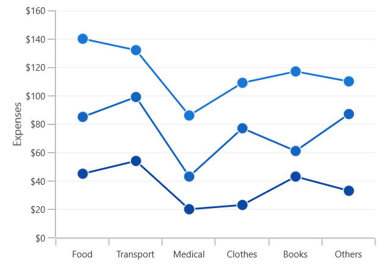
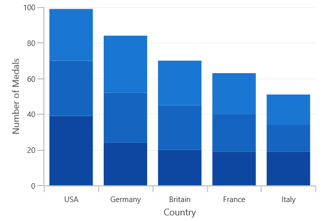
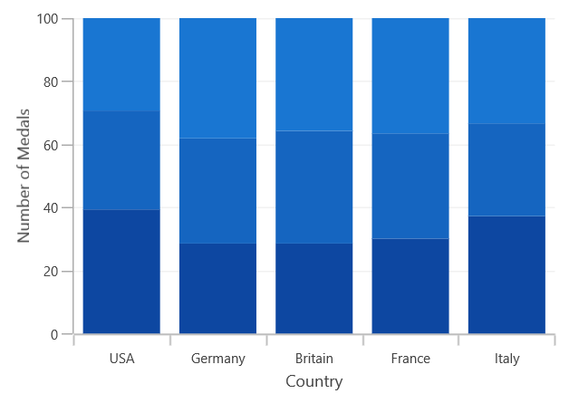
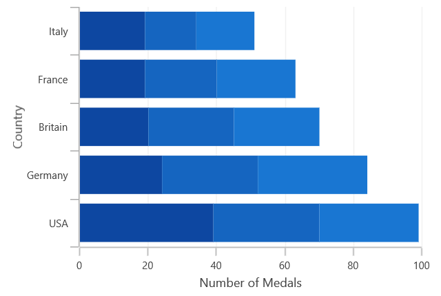
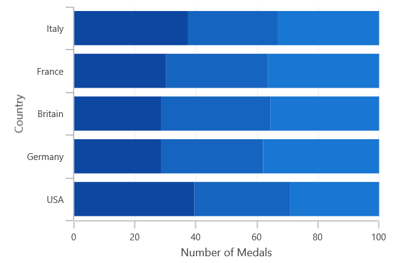

# Stacked Charts in WinUI Chart (SfChart)

## Stacked Line

[`StackedLineSeries`](https://help.syncfusion.com/cr/WinUI/Syncfusion.UI.Xaml.Charts.StackedLineSeries.html) resembles multiple types of series of the [`LineSeries`](https://help.syncfusion.com/cr/WinUI/Syncfusion.UI.Xaml.Charts.LineSeries.html). Each series is vertically stacked one above the other. When there is only one series, then it is [`LineSeries`](https://help.syncfusion.com/cr/WinUI/Syncfusion.UI.Xaml.Charts.LineSeries.html). 

The following code example illustrates how to use [`StackedLineSeries`](https://help.syncfusion.com/cr/WinUI/Syncfusion.UI.Xaml.Charts.StackedLineSeries.html):





<chart:StackedLineSeries  

XBindingPath="MonthlyExpenses"    

YBindingPath="Father" 

Interior="#4A4A4A"

ItemsSource="{Binding Data}"/>

<chart:StackedLineSeries

XBindingPath="MonthlyExpenses" 

YBindingPath="Mother"

Interior="#BCBCBC"

ItemsSource="{Binding Data}"/> 

<chart:StackedLineSeries 

XBindingPath="MonthlyExpenses" 

YBindingPath="Son"

Interior="#7F7F7F"

ItemsSource="{Binding Data}" />





StackedLineSeries series1 = new StackedLineSeries()
{

    ItemsSource = new ViewModel().Data,

    XBindingPath = "MonthlyExpenses",

    YBindingPath ="Father",

    Interior = new SolidColorBrush(Color.FromRgb(0x4A, 0x4A, 0X4A))

};

StackedLineSeries series2 = new StackedLineSeries()
{

    ItemsSource = new ViewModel().Data,

    XBindingPath = "MonthlyExpenses",

    YBindingPath = "Mother",

    Interior = new SolidColorBrush(Color.FromRgb(0xBC, 0xBC, 0XBC))

};

StackedLineSeries series3 = new StackedLineSeries()
{

    ItemsSource = new ViewModel().Data,

    XBindingPath = "MonthlyExpenses",

    YBindingPath = "Son",

    Interior = new SolidColorBrush(Color.FromRgb(0x7F, 0x7F, 0X7F))

};

chart.Series.Add(series1);

chart.Series.Add(series2);

chart.Series.Add(series3);





## Stacked Line 100

[`StackedLine100Series`](https://help.syncfusion.com/cr/WinUI/Syncfusion.UI.Xaml.Charts.StackedLine100Series.html) resembles [`StackedLineSeries`](https://help.syncfusion.com/cr/WinUI/Syncfusion.UI.Xaml.Charts.StackedLineSeries.html) but the cumulative portion of each stacked element always comes to a total of 100%. 





<chart:StackedLine100Series ItemsSource="{Binding Data}" 

XBindingPath="MonthlyExpenses" 

YBindingPath="Father" 

Interior="#4A4A4A"
/>

<chart:StackedLine100Series ItemsSource="{Binding Data}"

XBindingPath="MonthlyExpenses"  

YBindingPath="Mother"

Interior="#BCBCBC"/>

<chart:StackedLine100Series ItemsSource="{Binding Data}"

XBindingPath="MonthlyExpenses" 

YBindingPath="Son"

Interior="#7F7F7F"/>





StackedLine100Series series1 = new StackedLine100Series()
{

    ItemsSource = new ViewModel().Data,

    XBindingPath = "MonthlyExpenses",

    YBindingPath = "Father",

    Interior = new SolidColorBrush(Color.FromRgb(0x4A, 0x4A, 0X4A))

};

StackedLine100Series series2 = new StackedLine100Series()
{

    ItemsSource = new ViewModel().Data,

    XBindingPath = "MonthlyExpenses",

    YBindingPath = "Mother",

    Interior = new SolidColorBrush(Color.FromRgb(0xBC, 0xBC, 0XBC))

};

StackedLine100Series series3 = new StackedLine100Series()
{

    ItemsSource = new ViewModel().Data,

    XBindingPath = "MonthlyExpenses",

    YBindingPath = "Son",

    Interior = new SolidColorBrush(Color.FromRgb(0x7F, 0x7F, 0X7F))

};

chart.Series.Add(series1);

chart.Series.Add(series2);

chart.Series.Add(series3);





## Stacked Column

[`StackedColumnSeries`](https://help.syncfusion.com/cr/WinUI/Syncfusion.UI.Xaml.Charts.StackedColumnSeries.html#) resembles multiple types of ColumnSeries. Each series is vertically stacked one above the other. When there is only one series, then it is ColumnSeries. 

The following code example illustrates how to use StackedColumnSeries:





<chart:StackedColumnSeries  

XBindingPath="CountryName"    

YBindingPath="GoldMedals" 

Interior="#4A4A4A"

ItemsSource="{Binding MedalDetails}"/>

<chart:StackedColumnSeries 

Interior="#BCBCBC"

XBindingPath="CountryName" 

YBindingPath="SilverMedals"

ItemsSource="{Binding MedalDetails}"/> 

<chart:StackedColumnSeries 

Interior="#7F7F7F"

XBindingPath="CountryName" 

YBindingPath="BronzeMedals" />





StackedColumnSeries series1 = new StackedColumnSeries()
{

    ItemsSource = new ViewModel().MedalDetails,

    XBindingPath = "CountryName",

    YBindingPath ="GoldMedals",

    Interior = new SolidColorBrush(Color.FromRgb(0x4A, 0x4A, 0X4A))

};

StackedColumnSeries series2 = new StackedColumnSeries()
{

    ItemsSource = new ViewModel().MedalDetails,

    XBindingPath = "CountryName",

    YBindingPath = "SilverMedals",

    Interior = new SolidColorBrush(Color.FromRgb(0xBC, 0xBC, 0XBC))

};

StackedColumnSeries series3 = new StackedColumnSeries()
{

    ItemsSource = new ViewModel().MedalDetails,

    XBindingPath = "CountryName",

    YBindingPath = "BronzeMedals",

    Interior = new SolidColorBrush(Color.FromRgb(0x7F, 0x7F, 0X7F))

};

chart.Series.Add(series1);

chart.Series.Add(series2);

chart.Series.Add(series3);





## 100% Stacked Column

[`StackedColumn100Series`](https://help.syncfusion.com/cr/WinUI/Syncfusion.UI.Xaml.Charts.StackedColumn100Series.html#) resembles StackedColumnSeries but the cumulative portion of each stacked element always comes to a total of 100%. 





<chart:StackedColumn100Series  XBindingPath="CountryName" 

YBindingPath="GoldMedals" Interior="#4A4A4A"

ItemsSource="{Binding MedalDetails}"/>

<chart:StackedColumn100Series ItemsSource="{Binding MedalDetails}"

XBindingPath="CountryName"  

YBindingPath="SilverMedals"

Interior="#BCBCBC"/>





StackedColumn100Series series1 = new StackedColumn100Series()
{

    ItemsSource = new ViewModel().MedalDetails,

    XBindingPath = "CountryName",

    YBindingPath = "GoldMedals",

    Interior = new SolidColorBrush(Color.FromRgb(0x4A, 0x4A, 0X4A))

};

StackedColumn100Series series2 = new StackedColumn100Series()
{

    ItemsSource = new ViewModel().MedalDetails,

    XBindingPath = "CountryName",

    YBindingPath = "SilverMedals",

    Interior = new SolidColorBrush(Color.FromRgb(0xBC, 0xBC, 0XBC))

};

StackedColumn100Series series3 = new StackedColumn100Series()
{

    ItemsSource = new ViewModel().MedalDetails,

    XBindingPath = "CountryName",

    YBindingPath = "BronzeMedals",

    Interior = new SolidColorBrush(Color.FromRgb(0x7F, 0x7F, 0X7F))

};

chart.Series.Add(series1);

chart.Series.Add(series2);

chart.Series.Add(series3);





## Stacked Bar

[`StackedBarSeries`](https://help.syncfusion.com/cr/WinUI/Syncfusion.UI.Xaml.Charts.StackedBarSeries.html#) is a multiple series type of BarSeries. Each BarSeries is then stacked horizontally, side by side to each other. When there exists only one series, it resembles a simple BarSeries. 





<chart:StackedBarSeries XBindingPath="CountryName"        

Interior="#BCBCBC"

YBindingPath="GoldMedals" 

ItemsSource="{Binding MedalDetails}" >

</chart:StackedBarSeries>

<chart:StackedBarSeries Interior="#4A4A4A"

XBindingPath="CountryName" 

YBindingPath="SilverMedals" 

ItemsSource="{Binding MedalDetails}">

</chart:StackedBarSeries>

<chart:StackedBarSeries Interior="#7F7F7F"

XBindingPath="CountryName" 

YBindingPath="BronzeMedals"

ItemsSource="{Binding MedalDetails}" >

</chart:StackedBarSeries>





StackedBarSeries series1 = new StackedBarSeries()
{

    ItemsSource = new ViewModel().MedalDetails,

    XBindingPath = "CountryName",

    YBindingPath = "GoldMedals",

    Interior = new SolidColorBrush(Color.FromRgb(0x4A, 0x4A, 0X4A))

};

StackedBarSeries series2 = new StackedBarSeries()
{

    ItemsSource = new ViewModel().MedalDetails,

    XBindingPath = "CountryName",

    YBindingPath = "SilverMedals",

    Interior = new SolidColorBrush(Color.FromRgb(0xBC, 0xBC, 0XBC))

};

StackedBarSeries series3 = new StackedBarSeries()
{

    ItemsSource = new ViewModel().MedalDetails,

    XBindingPath = "CountryName",

    YBindingPath = "BronzeMedals",

    Interior = new SolidColorBrush(Color.FromRgb(0x7F, 0x7F, 0X7F))

};

chart.Series.Add(series1);

chart.Series.Add(series2);

chart.Series.Add(series3);





## 100% Stacked Bar

[`StackedBar100Series`](https://help.syncfusion.com/cr/WinUI/Syncfusion.UI.Xaml.Charts.StackedBar100Series.html#) resembles a StackedBarSeries. StackedBar100Series displays multiple series as stacked bars and the cumulative portion of each stacked element is always 100%. 





<chart:StackedBar100Series Interior="#BCBCBC"

XBindingPath="CountryName" 

YBindingPath="GoldMedals" 

ItemsSource="{Binding MedalDetails}" />

<chart:StackedBar100Series Interior="#4A4A4A" 

XBindingPath="CountryName"                          

YBindingPath="SilverMedals" 

ItemsSource="{Binding MedalDetails}" />

<chart:StackedBar100Series Interior="#7F7F7F" 

XBindingPath="CountryName" 

YBindingPath="BronzeMedals" 

ItemsSource="{Binding MedalDetails}" />





StackedBar100Series series1 = new StackedBar100Series()
{

    ItemsSource = new ViewModel().MedalDetails,

    XBindingPath = "CountryName",

    YBindingPath = "GoldMedals",

    Interior = new SolidColorBrush(Color.FromRgb(0x4A, 0x4A, 0X4A))

};

StackedBar100Series series2 = new StackedBar100Series()
{

    ItemsSource = new ViewModel().MedalDetails,

    XBindingPath = "CountryName",

    YBindingPath = "SilverMedals",

    Interior = new SolidColorBrush(Color.FromRgb(0xBC, 0xBC, 0XBC))

};

StackedBar100Series series3 = new StackedBar100Series()
{

    ItemsSource = new ViewModel().MedalDetails,

    XBindingPath = "CountryName",

    YBindingPath = "BronzeMedals",

    Interior = new SolidColorBrush(Color.FromRgb(0x7F, 0x7F, 0X7F))

};

chart.Series.Add(series1);

chart.Series.Add(series2);

chart.Series.Add(series3);





## Stacked Area

[`StackedAreaSeries`](https://help.syncfusion.com/cr/WinUI/Syncfusion.UI.Xaml.Charts.StackedAreaSeries.html#) is representing areas stacked vertically one above the other. 





<chart:StackedAreaSeries Interior="#BCBCBC" 

XBindingPath="Month" YBindingPath="Bus" 

ItemsSource="{Binding Accidents}" />

<chart:StackedAreaSeries Interior="#4A4A4A"                  

XBindingPath="Month" YBindingPath="Car" 

ItemsSource="{Binding Accidents}" />

<chart:StackedAreaSeries  Interior="#7F7F7FC"                     

XBindingPath="Month" 

YBindingPath="Truck" 

ItemsSource="{Binding Accidents}" />





StackedAreaSeries series1 = new StackedAreaSeries()
{

    ItemsSource = new ViewModel().Accidents,

    XBindingPath = "Month",

    YBindingPath = "Bus",

    Interior = new SolidColorBrush(Color.FromRgb(0x4A, 0x4A, 0X4A))

};

StackedAreaSeries series2 = new StackedAreaSeries()
{

    ItemsSource = new ViewModel().Accidents,

    XBindingPath = "Month",

    YBindingPath = "Car",

    Interior = new SolidColorBrush(Color.FromRgb(0xBC, 0xBC, 0XBC))

};

StackedAreaSeries series3 = new StackedAreaSeries()
{

    ItemsSource = new ViewModel().Accidents,

    XBindingPath = "Month",

    YBindingPath = "Truck",

    Interior = new SolidColorBrush(Color.FromRgb(0x7F, 0x7F, 0X7F))

};

chart.Series.Add(series1);

chart.Series.Add(series2);

chart.Series.Add(series3);





## 100% Stacked Area

StackedArea100Series is similar to StackedAreaSeries, but the cumulative portion of each stacked element always totals 100%. 

The following code example shows the way to add Stacked area 100 series:





<chart:StackedArea100Series Interior="#BCBCBC" 

XBindingPath="Month"         

YBindingPath="Bus" 

ItemsSource="{Binding Accidents}" 

/>

<chart:StackedArea100Series Interior="#4A4A4A" 

XBindingPath="Month" YBindingPath="Car" 

ItemsSource="{Binding Accidents}" />

<chart:StackedArea100Series Interior="#7F7F7F" 

XBindingPath="Month" 

YBindingPath="Truck" 

ItemsSource="{Binding Accidents}" />





StackedArea100Series series1 = new StackedArea100Series()
{

    ItemsSource = new ViewModel().Accidents,

    XBindingPath = "Month",

    YBindingPath = "Bus",

    Interior = new SolidColorBrush(Color.FromRgb(0x4A, 0x4A, 0X4A))

};

StackedArea100Series series2 = new StackedArea100Series()
{

    ItemsSource = new ViewModel().Accidents,

    XBindingPath = "Month",

    YBindingPath = "Car",

    Interior = new SolidColorBrush(Color.FromRgb(0xBC, 0xBC, 0XBC))

};

StackedArea100Series series3 = new StackedArea100Series()
{

    ItemsSource = new ViewModel().Accidents,

    XBindingPath = "Month",

    YBindingPath = "Truck",

    Interior = new SolidColorBrush(Color.FromRgb(0x7F, 0x7F, 0X7F))

};

chart.Series.Add(series1);

chart.Series.Add(series2);

chart.Series.Add(series3);





You can draw open curve like Area using this [`IsClosed`](https://help.syncfusion.com/cr/WinUI/Syncfusion.UI.Xaml.Charts.StackedAreaSeries.html#Syncfusion_UI_Xaml_Charts_StackedAreaSeries_IsClosed) property.





<chart:StackedAreaSeries  Interior="#BCBCBC" Stroke="Black" StrokeThickness="3"

IsClosed="False" XBindingPath="Month" 

YBindingPath="Bus" 

ItemsSource="{Binding Accidents}"/>

<chart:StackedAreaSeries  Interior="#777777" Stroke="White" StrokeThickness="3"

IsClosed="False"  XBindingPath="Month"             

YBindingPath="Car"

ItemsSource="{Binding Accidents}"/>

<chart:StackedAreaSeries  Interior="#7F7F7F" Stroke="Black"   

StrokeThickness="3" IsClosed="False"   

XBindingPath="Month" 

YBindingPath="Truck" 

ItemsSource="{Binding Accidents}" />





StackedAreaSeries series1 = new StackedAreaSeries()
{

    ItemsSource = new ViewModel().Accidents,

    XBindingPath = "Month",

    YBindingPath = "Bus",

    Stroke = new SolidColorBrush(Colors.Black),

    StrokeThickness = 3,

    IsClosed = false,

    Interior = new SolidColorBrush(Color.FromRgb(0xBC, 0xBC, 0XBC))

};

StackedAreaSeries series2 = new StackedAreaSeries()
{

    ItemsSource = new ViewModel().Accidents,

    XBindingPath = "Month",

    YBindingPath = "Car",

    Stroke = new SolidColorBrush(Colors.White),

    StrokeThickness = 3,

    IsClosed = false,

    Interior = new SolidColorBrush(Color.FromRgb(0x77, 0x77, 0X77))

};

StackedAreaSeries series3 = new StackedAreaSeries()
{

    ItemsSource = new ViewModel().Accidents,

    XBindingPath = "Month",

    YBindingPath = "Truck",

    Stroke = new SolidColorBrush(Colors.Black),

    StrokeThickness = 3,

    IsClosed = false,

    Interior = new SolidColorBrush(Color.FromRgb(0x7F, 0x7F, 0X7F))

};

chart.Series.Add(series1);

chart.Series.Add(series2);

chart.Series.Add(series3);





