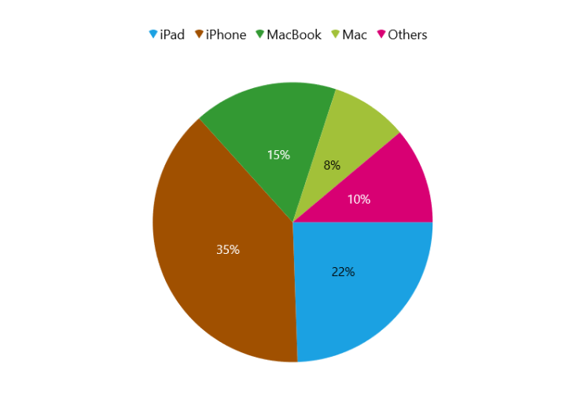
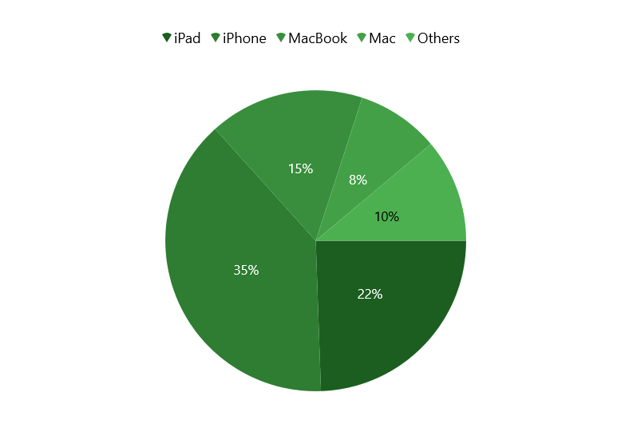
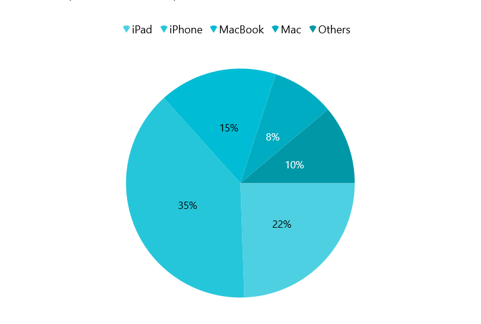
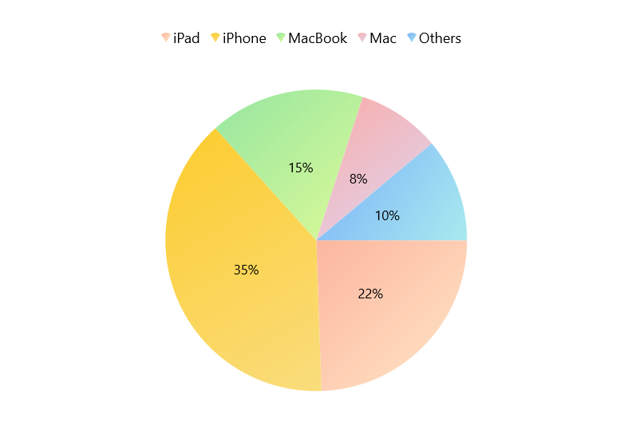
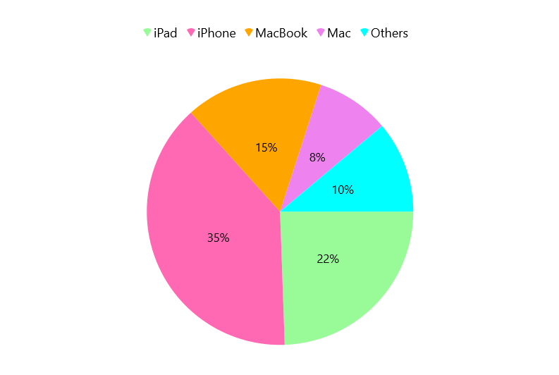

# Appearance in WinUI Chart (SfCircularChart)

The appearance of [SfCircularChart]() can be customized by using the predefined palettes, custom palettes and gradient, which allows to enrich the application.

## Palettes

Circular series provides options for applying various kinds of palettes. Some predefined palettes, such as.

* Metro
* AutumnBrights
* FloraHues
* Pineapple
* TomatoSpectrum
* RedChrome
* PurpleChrome
* BlueChrome
* GreenChrome
* Elite
* LightCandy
* SandyBeach

### Applying palette

Each palette applies a set of predefined brushes to the series in a predefined order. [Metro]() palette is the default palette.





<chart:PieSeries ItemsSource="{Binding Data}" 
                 XBindingPath="Product" 
                 YBindingPath="SalesRate">
</chart:PieSeries>





PieSeries series = new PieSeries() { Label = "Continents" };
. . .
chart.Series.Add(series);





The following code example defined [`Palette`]() as [`GreenChrome`]().





<chart:SfCircularChart>
. . .
    <chart:PieSeries Palette="GreenChrome"
                     ItemsSource="{Binding Data}" 
                     XBindingPath="Product" 
                     YBindingPath="SalesRate">
    </chart:PieSeries>
</chart:SfCircularChart>





SfCircularChart chart = new SfCircularChart();
. . .
PieSeries series = new PieSeries();
series.Palette = ChartColorPalette.GreenChrome;
. . .
chart.Series.Add(series);





## Custom Palette

[SfCircularChart]() provides support to define own brushes for chart with preferred order by using the [CustomBrushes]() property of [ChartColorModel]() and [Palette]() value as [Custom]().





<chart:SfCircularChart>
. . .
<chart:PieSeries Palette="Custom">
    <chart:PieSeries.ColorModel>
        <chart:ChartColorModel>
            <chart:ChartColorModel.CustomBrushes>
                <SolidColorBrush Color="#4dd0e1"/>
                <SolidColorBrush Color="#26c6da"/>
                <SolidColorBrush Color="#00bcd4"/>
                <SolidColorBrush Color="#00acc1"/>
                <SolidColorBrush Color="#0097a7"/>
                <SolidColorBrush Color="#00838f"/>
            </chart:ChartColorModel.CustomBrushes>
        </chart:ChartColorModel>
    </chart:PieSeries.ColorModel>
</chart:PieSeries>
</chart:SfCircularChart>





SfCircularChart chart = new SfCircularChart();
. . .
PieSeries series = new PieSeries();
series.Palette = ChartColorPalette.Custom;

ChartColorModel colorModel = new ChartColorModel();
colorModel.CustomBrushes.Add(new SolidColorBrush(Color.FromArgb(255, 77, 208, 225)));
colorModel.CustomBrushes.Add(new SolidColorBrush(Color.FromArgb(255, 38, 198, 218)));
colorModel.CustomBrushes.Add(new SolidColorBrush(Color.FromArgb(255, 0, 188, 212)));
colorModel.CustomBrushes.Add(new SolidColorBrush(Color.FromArgb(255, 0, 172, 193)));
colorModel.CustomBrushes.Add(new SolidColorBrush(Color.FromArgb(255, 0, 151, 167)));
colorModel.CustomBrushes.Add(new SolidColorBrush(Color.FromArgb(255, 0, 131, 143)));

series.ColorModel = colorModel;
. . .
chart.Series.Add(series);





## Applying Gradient Brushes

Gradient for the circular chart can be set by using the [ColorModel]() property of the series with the help of `LinearGradientBrush` or `RadialGradientBrush`.





<chart:SfCircularChart>
. . .
<chart:PieSeries Palette="Custom">
    <chart:PieSeries.ColorModel>
        <chart:ChartColorModel>
                <chart:ChartColorModel.CustomBrushes>
                    <LinearGradientBrush>
                        <GradientStop Offset="1" Color="#FFE7C7" />
                        <GradientStop Offset="0" Color="#FCB69F" />
                    </LinearGradientBrush>
                    <LinearGradientBrush>
                        <GradientStop Offset="1" Color="#fadd7d" />
                        <GradientStop Offset="0" Color="#fccc2d" />
                    </LinearGradientBrush>
                    <LinearGradientBrush>
                        <GradientStop Offset="1" Color="#DCFA97" />
                        <GradientStop Offset="0" Color="#96E6A1" />
                    </LinearGradientBrush>
                    <LinearGradientBrush>
                        <GradientStop Offset="1" Color="#DDD6F3" />
                        <GradientStop Offset="0" Color="#FAACA8" />
                    </LinearGradientBrush>
                    <LinearGradientBrush>
                        <GradientStop Offset="1" Color="#A8EAEE" />
                        <GradientStop Offset="0" Color="#7BB0F9" />
                    </LinearGradientBrush>
                </chart:ChartColorModel.CustomBrushes>
            </chart:ChartColorModel>
    </chart:PieSeries.ColorModel>
</chart:PieSeries>
</chart:SfCircularChart>





SfCircularChart chart = new SfCircularChart();
. . .
PieSeries series = new PieSeries();
series.Palette = ChartColorPalette.Custom;

ChartColorModel colorModel = new ChartColorModel();
LinearGradientBrush gradientColor1 = new LinearGradientBrush();
GradientStop stop1 = new GradientStop() { Offset = 1, Color = Color.FromArgb(255, 255, 231, 199) };
GradientStop stop2 = new GradientStop() { Offset = 0, Color = Color.FromArgb(255, 252, 182, 159) };
gradientColor1.GradientStops.Add(stop1);
gradientColor1.GradientStops.Add(stop2);
series.ColorModel = colorModel;
. . .
chart.Series.Add(series);





## Segment Color Binding

The color of the each segment can be set by binding their corresponding model property from the `ItemsSource` collection to its [SegmentColorPath]() property of series as follows.





<chart:SfCircularChart>
. . .
<chart:PieSeries ItemsSource="{Binding Data}" 
                 XBindingPath="Product" SegmentColorPath="SegmentColor"
                 YBindingPath="SalesRate"/>
. . . 
</chart:SfCircularChart>





public class ChartViewModel
{
    public List<Sales> Data { get; set; }

    public ChartViewModel()
    {
        Data = new List<Sales>()
        {
            new Sales(){Product = "iPad", SalesRate = 22, SegmentColor = new SolidColorBrush(Color.FromArgb(255, 152, 251, 152))},
            new Sales(){Product = "iPhone", SalesRate = 35, SegmentColor = new SolidColorBrush(Color.FromArgb(255, 255, 105, 180))},
            new Sales(){Product = "MacBook", SalesRate = 15, SegmentColor = new SolidColorBrush(Color.FromArgb(255, 255, 165, 0))},
            new Sales(){Product = "Mac", SalesRate = 8, SegmentColor = new SolidColorBrush(Color.FromArgb(255, 238, 130, 238))},
            new Sales(){Product = "Others", SalesRate = 10, SegmentColor = new SolidColorBrush(Color.FromArgb(255, 0, 255, 255))},
        };
    }
}

SfCircularChart chart = new SfCircularChart();
. . .
PieSeries series = new PieSeries();
series.XBindingPath = "Product";
series.YBindingPath = "SalesRate";
series.SegmentColorPath = "SegmentColor";
. . .
chart.Series.Add(series);





