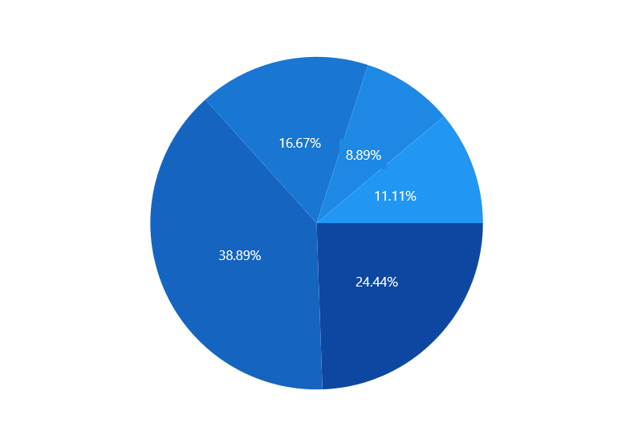
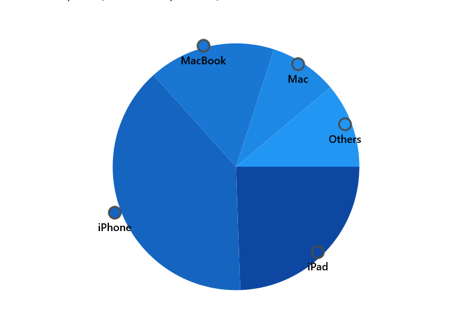
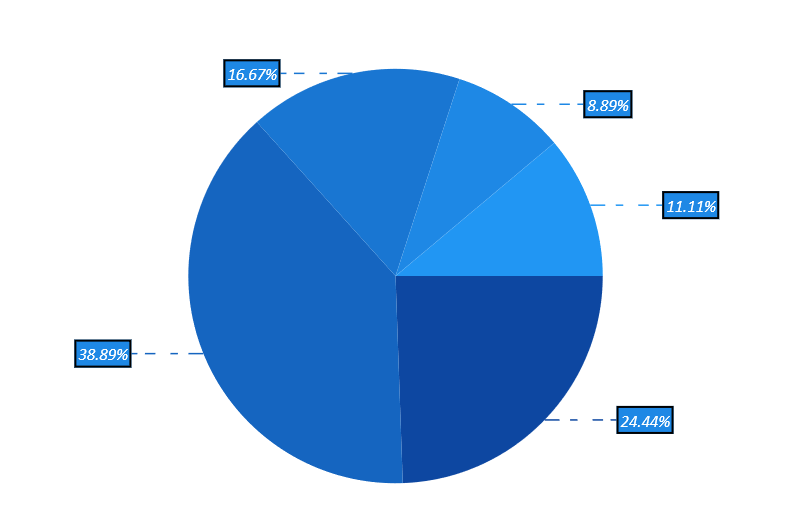
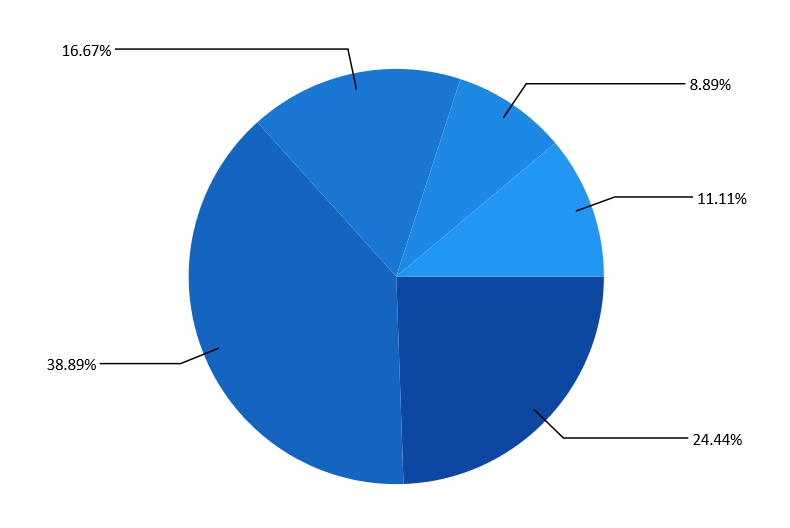
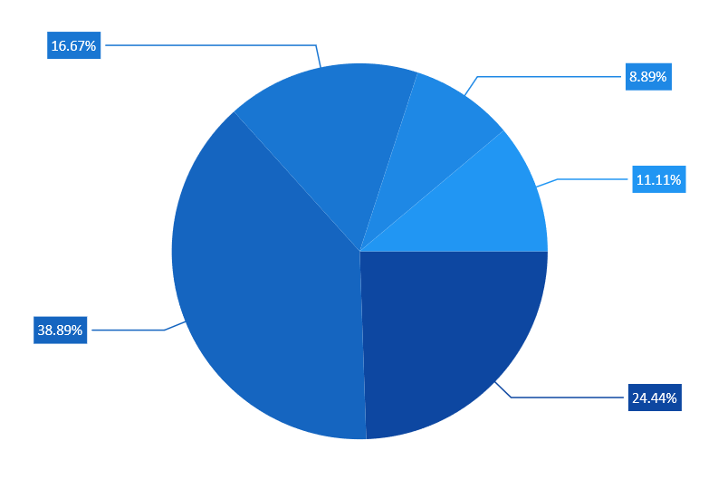

# Data Labels in WinUI Chart (SfCircularChart)

Data labels are used to display values related to a chart segment. Values from data point(x, y) or other custom properties from a data source can be displayed. 

Each data label can be represented by the following:

* Label - displays the segment label content at the (X, Y) point.
* Connector line - used to connect the (X, Y) point and the label element.

## Enable data label 

[ShowDataLabels]() property of series is used to enable the data labels.





<chart:SfCircularChart>
. . .
<chart:PieSeries ShowDataLabels="True"
                 ItemsSource="{Binding Data}"  
                 XBindingPath="Product" 
                 YBindingPath="SalesRate"/>
. . .
</chart:SfCircularChart>





SfCircularChart chart = new SfCircularChart();
. . .
PieSeries series = new PieSeries();
series.ShowDataLabels = true;
. . .
chart.Series.Add(series);





 

## Context

To customize the content of data labels, need to define [DataLabelSettings]() of series and set [Context]() property of [DataLabelSettings]() to define the value to be displayed as label content.





<chart:SfCircularChart>
. . .
<chart:PieSeries ShowDataLabels="True">
    <chart:PieSeries.DataLabelSettings>
        <chart:CircularDataLabelSettings Context="Percentage"/>
    </chart:PieSeries.DataLabelSettings>
</chart:PieSeries>
. . .
</chart:SfCircularChart>




SfCircularChart chart = new SfCircularChart();
. . .
PieSeries series = new PieSeries();
series.ShowDataLabels = true;
series.DataLabelSettings = new CircularDataLabelSettings() {Context = LabelContext.Percentage };
. . .
chart.Series.Add(series);





 

## Customization

The following properties are used to customize the data label.

* [BorderBrush]()- used to change the border color.
* [BorderThickness]()- used to change the thickness of the border.
* [Margin]()- used to change the margin size for label.
* [FontStyle]()-  used to change font style of the label.
* [FontSize]()-  used to change font size of the label.
* [Foreground]()- used to change the color of the label.
* [FontFamily]()-  used to change the font family of the label.
* [Background]()- used to change the label background color.





<chart:SfCircularChart>
. . .
<chart:PieSeries.DataLabelSettings>
    <chart:CircularDataLabelSettings Position="Outside"
                                     Foreground="White"
                                     FontSize="11" 
                                     FontFamily="Calibri" 
                                     BorderBrush="Black" 
                                     BorderThickness="1" Margin="1" 
                                     FontStyle="Italic" Background="#1E88E5"
                                     Context="Percentage"/>
</chart:PieSeries.DataLabelSettings>
. . .
</chart:SfCircularChart>





SfCircularChart chart = new SfCircularChart();
. . . 
PieSeries series = new PieSeries();
series.ShowDataLabels = true;
series.DataLabelSettings = new CircularDataLabelSettings()
{
    Position = CircularSeriesLabelPosition.Outside,
    Foreground = new SolidColorBrush(Colors.White),
    BorderBrush = new SolidColorBrush(Colors.Black),
    Background =new SolidColorBrush(Colors.AliceBlue),
    BorderThickness = new Thickness(1),
    Margin = new Thickness(1),
    FontStyle = FontStyle.Italic,
    FontFamily = new FontFamily("Calibri"),
    FontSize = 11
};

chart.Series.Add(series);





## Template

The appearance of the data label can be customized using [`ContentTemplate`]() property of [`CircularDataLabelSettings`]() as in the below code example:





<chart:SfCircularChart >
    <chart:SfCircularChart.Resources>
        <local:ChartValueConverter x:Key="valueconvert"/>
        <DataTemplate x:Key="labelTemplate">
            <StackPanel Margin="10" Orientation="Vertical">
                <Ellipse Height="15" Width="15" Fill="{Binding Interior}" 
                 Stroke="#4a4a4a" StrokeThickness="2"/>
                <TextBlock HorizontalAlignment="Center" FontSize="12"
                           Foreground="Black" 
                           FontWeight="SemiBold" Text="{Binding Item.Product}"/>
            </StackPanel>
        </DataTemplate>
    </chart:SfCircularChart.Resources>
...
<chart:PieSeries ShowDataLabels="True">
    <chart:PieSeries.DataLabelSettings>
        <chart:CircularDataLabelSettings Position="Outside" ContentTemplate="{StaticResource labelTemplate}"
                                         Context="DataLabelItem"/>
    </chart:PieSeries.DataLabelSettings>
</chart:PieSeries>
. . .
</chart:SfCircularChart>




SfCircularChart chart = new SfCircularChart();
. . .
PieSeries series = new PieSeries();
series.ShowDataLabels = true;
series.DataLabelSettings = new CircularDataLabelSettings()
{
    Position = CircularSeriesLabelPosition.Outside,
    Context = LabelContext.DataLabelItem,
    ContentTemplate = chart.Resources["labelTemplate"] as DataTemplate,
};
. . .
chart.Series.Add(series);





## Rotation

[Rotation]() property is used to define the angle to which the label has to rotate. The following code demonstrates the label rotating angle.





<chart:SfCircularChart>
. . .
<chart:PieSeries ShowDataLabels="True">
    <chart:PieSeries.DataLabelSettings>
        <chart:CircularDataLabelSettings Position="Outside" Rotation="335"/>
    </chart:PieSeries.DataLabelSettings>
</chart:PieSeries>
. . .
</chart:SfCircularChart>





SfCircularChart chart = new SfCircularChart();
. . .
PieSeries series = new PieSeries();
series.ShowDataLabels = true;
series.DataLabelSettings = new CircularDataLabelSettings()
{
    Position = CircularSeriesLabelPosition.Outside,
    Rotation = 335,
};

chart.Series.Add(series);





## Connector Line

Connector line is used to connect label and data point using a line. [ShowConnectorLine]() property of [CircularDataLabelSettings]() is used to enable the connector line in the circular chart. 

The connector line can be customized using the below properties.

* [ConnectorHeight]() - used to set height for connector line.
* [ConnectorLineStyle]() - used to customize the style of line.
* [ConnectorType]() - used to connector line type.





<chart:SfCircularChart>
    <chart:SfCircularChart.Resources>
        
</chart:SfCircularChart.Resources>
. . . 
<chart:PieSeries ShowDataLabels="True">
    <chart:PieSeries.DataLabelSettings>
        <chart:CircularDataLabelSettings ShowConnectorLine="True" ConnectorHeight="40" ConnectorType="StraightLine" ConnectorLineStyle="{StaticResource lineStyle}"/>
    </chart:PieSeries.DataLabelSettings>
</chart:PieSeries>

</chart:SfCircularChart>





SfCircularChart chart = new SfCircularChart();
. . .
PieSeries series = new PieSeries();
series.ShowDataLabels = true;
series.DataLabelSettings = new CircularDataLabelSettings()
{
    ShowConnectorLine = true,
    ConnectorHeight = 40,
    ConnectorLineStyle = chart.Resources["lineStyle"] as Style,
};
. . .
chart.Series.Add(series);





### Connector line type

[ConnectorType]() property in [CircularDataLabelSettings]() is used to specify the connector line type such as [Line]() or [Bezier]() or [StraightLine]().





<chart:SfCircularChart>
. . .
<chart:PieSeries ShowDataLabels="True">
    <chart:PieSeries.DataLabelSettings>
        <chart:CircularDataLabelSettings ConnectorType="Bezier"
                                         Position="Outside"
                                         ShowConnectorLine="True"/>
    </chart:PieSeries.DataLabelSettings>
</chart:PieSeries>

</chart:SfCircularChart>




SfCircularChart chart = new SfCircularChart();

PieSeries series = new PieSeries();
series.ShowDataLabels = true;
series.DataLabelSettings = new CircularDataLabelSettings()
{
    ShowConnectorLine = true,
    ConnectorType = ConnectorMode.Bezier, 
    Position = CircularSeriesLabelPosition.Outside,
};

chart.Series.Add(series);





 **Bezier**
 

 **Line** 
 
  

**Straight Line**

## Applying series brush

[`UseSeriesPalette`]() property is used to set the interior of the series to the data label background. 





<chart:SfCircularChart>
. . .
<chart:PieSeries ShowDataLabels="True">
    <chart:PieSeries.DataLabelSettings>
        <chart:CircularDataLabelSettings UseSeriesPalette="True"/>
    </chart:PieSeries.DataLabelSettings>
</chart:PieSeries>

</chart:SfCircularChart>





SfCircularChart chart = new SfCircularChart();
. . .
PieSeries series = new PieSeries();
series.ShowDataLabels = true;
series.DataLabelSettings = new CircularDataLabelSettings()
{
    UseSeriesPalette = true,
};

chart.Series.Add(series);





