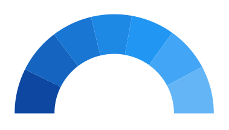
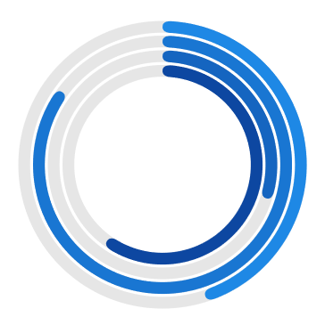

# Doughnut Series in WinUI Circular Chart

[DoughnutSeries]() is similar to PieSeries. It is used to show the relationship between parts of data and whole data. 

The DoughnutSeries can be added to chart as in below code example:





<chart:DoughnutSeries XBindingPath="Category" ItemsSource="{Binding Data}" YBindingPath="Value"/>





DoughnutSeries series = new DoughnutSeries()
{

    ItemsSource = new ViewModel().Data,

    XBindingPath = "Category",

    YBindingPath = "Value"
};

chart.Series.Add(series);





The Doughnut also having coefficient property, [DoughnutCoefficient]() which defines the inner circle. Also it has [DoughnutSize](), used to define the size for this series like [CircularCoefficient]() in PieSeries.





<chart:DoughnutSeries DoughnutCoefficient="0.7" XBindingPath="Category" ItemsSource="{Binding Data}" YBindingPath="Value"/>





DoughnutSeries series = new DoughnutSeries()
{

    ItemsSource = new ViewModel().Data,

    XBindingPath = "Category",

    YBindingPath = "Value",

    DoughnutCoefficient = 0.7
};

chart.Series.Add(series);





**Size**

The size of doughnut series can be customized by using its [DoughnutSize]() property. The following code illustrates how to use the property in series.





<syncfusion:SfChart>

<syncfusion:DoughnutSeries DoughnutSize="0.8"/>
       
<syncfusion:DoughnutSeries DoughnutSize="0.8"/>

</syncfusion:SfChart>





DoughnutSeries doughnut = new DoughnutSeries();

doughnut.DoughnutSize = 0.8;

chart.Series.Add(doughnut);

DoughnutSeries doughnut1 = new DoughnutSeries();

doughnut1.DoughnutSize = 0.8;

chart.Series.Add(doughnut1);





**Hole Size**

[DoughnutHoleSize]() is an attachable property. It gets or sets the double value, which is used to customize the doughnut hole size. Its value ranges from 0 to 1, and it can be set as shown in the following code example.





<Chart:SfChart Chart:DoughnutSeries.DoughnutHoleSize="0.2">
    
</chart:SfChart>





SfChart chart = new SfChart();

DoughnutSeries.SetDoughnutHoleSize(chart, 0.2);





## Semi Doughnut

By using custom [StartAngle]() and [EndAngle]() properties,  can draw doughnut series in different shapes such as semicircular or quarter circular series.





<chart:DoughnutSeries StartAngle="180" EndAngle="360" XBindingPath="Utilization" YBindingPath="ResponseTime" ItemsSource="{Binding Data}"/>





DoughnutSeries series = new DoughnutSeries()
{

    ItemsSource = new ViewModel().Data,

    XBindingPath = "Utilization",

    YBindingPath = "ResponseTime",

    StartAngle = 180,

    EndAngle = 360

};

chart.Series.Add(series);





## Stacked doughnut

Doughnut segments can be separated as individual circles using the [IsStackedDoughnut]() property. The following properties are used to customize the stacked doughnut chart:

* [CapStyle]() - Specifies the shapes of the start and end points of a circular segment. The supported values are [BothFlat](), [BothCurve](), [StartCurve](), and [EndCurve](). The default value of the this property is BothFlat.

* [SegmentSpacing]() - Changes the spacing between two individual segments. The default value of spacing is 0, and the value ranges from 0 to 1. Here, 1 represents 100%, and 0 represents 0% of the available space.

* [MaximumValue]() - Represents the entire span of an individual circle. The default value of the this property is double.NaN.

* [TrackColor]() - Changes the color of the track area.

* [TrackBorderColor]() - Changes the color of the track border.

* [TrackBorderWidth]() - Changes the width of the track border.





<chart:SfChart>
    …
    <chart:DoughnutSeries IsStackedDoughnut="True" CapStyle="BothCurve" SegmentSpacing="0.2" MaximumValue="100" XBindingPath="Category" YBindingPath="Expenditure" ItemsSource="{Binding ExpenditureData}">
    </chart:DoughnutSeries>

</chart:SfChart>





SfChart chart = new SfChart();

DoughnutSeries doughnutSeries = new DoughnutSeries()
{
    IsStackedDoughnut = true,
    CapStyle = DoughnutCapStyle.BothCurve,
    SegmentSpacing = 0.2,
    MaximumValue = 100,
    XBindingPath = "Category",
    YBindingPath = "Expenditure",
    ItemsSource = new ViewModel().ExpenditureData
};

chart.Series.Add(doughnutSeries);





