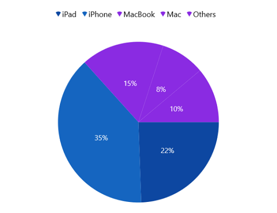

# Selection in WinUI Chart (SfCircularChart)

Circular chart supports selection that allows to select a segment in a series by using [DataPointSelectionBehavior](). 

## Enable Selection

To enable the selection in chart, create an instance of [DataPointSelectionBehavior]() and set it to the `SelectionBehavior` property of cirucular series. And also need to set the [SelectionBrush]() property to highlight the segment in the series.





<chart:SfCircularChart>
. . .
    <chart:SfCircularChart.Series>
        <chart:PieSeries>
            <chart:PieSeries.SelectionBehavior>
                chart:DataPointSelectionBehavior SelectionBrush="BlueViolet"/>
            </chart:PieSeries.SelectionBehavior>
        </chart:PieSeries>
    </chart:SfCircularChart.Series>
    
</chart:SfCircularChart>





SfCircularChart chart = new SfCircularChart();
. . .
PieSeries series = new PieSeries();
DataPointSelectionBehavior selection = new DataPointSelectionBehavior()
{
	SelectionBrush = new SolidColorBrush(Colors.BlueViolet),
};

series.SelectionBehavior = selection;
chart.Series.Add(series);





## Multi-selection

Circular chart allows to select single or multiple segments using [Type]() property. By default the [Type]() value is [Single]().





<chart:SfCircularChart>
. . .
    <chart:SfCircularChart.Series>
        <chart:PieSeries>
            <chart:PieSeries.SelectionBehavior>
                chart:DataPointSelectionBehavior SelectionBrush="BlueViolet" Type="Multiple" />
            </chart:PieSeries.SelectionBehavior>
        </chart:PieSeries>
    </chart:SfCircularChart.Series>

</chart:SfCircularChart>





SfCircularChart chart = new SfCircularChart();
. . .
PieSeries series = new PieSeries();
DataPointSelectionBehavior selection = new DataPointSelectionBehavior()
{
	SelectionBrush = new SolidColorBrush(Colors.BlueViolet),
    Type = SelectionType.Multiple
};

series.SelectionBehavior = selection;
chart.Series.Add(series);





## Events

The following events are available in the [SfCircularChart](https://help.syncfusion.com/cr/winui/Syncfusion.UI.Xaml.Charts.SfCircularChart.html) selection.

### SelectionChanging

The [SelectionChanging](https://help.syncfusion.com/cr/winui/Syncfusion.UI.Xaml.Charts.ChartBase.html#Syncfusion_UI_Xaml_Charts_ChartBase_SelectionChanging) event occurs before the data point is being selected. This is a cancelable event. This argument contains the following information.

* [CurrentIndex]() - Gets the selected data point index.
* [PreviousIndex]() - Gets the previous selected data point index.

* [Cancel](https://help.syncfusion.com/cr/winui/Syncfusion.UI.Xaml.Charts.ChartSelectionChangingEventArgs.html#Syncfusion_UI_Xaml_Charts_ChartSelectionChangingEventArgs_Cancel) - Gets or Sets a value that indicates whether the selection should be canceled.

### SelectionChanged

The [SelectionChanged](https://help.syncfusion.com/cr/winui/Syncfusion.UI.Xaml.Charts.ChartBase.html#Syncfusion_UI_Xaml_Charts_ChartBase_SelectionChanged) event occurs after a data point has been selected. This argument contains the following information.

* [CurrentIndex]() - Gets the selected data point index.
* [PreviousIndex]() - Gets the previous selected data point index.
