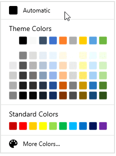
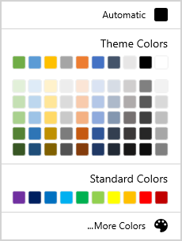

# Control Customization in WinUI ColorPalette (SfColorPalette)

This section explains the different types of colors available in the [ColorPalette](https://help.syncfusion.com/cr/winUI/Syncfusion.UI.Xaml.Editors.SfColorPalette.html) and  how to choose the colors and its panel customizations.

## Accessing a Color programmatically

You can set or change the selected color of the `ColorPalette` programmatically by setting the value to [SelectedBrush](https://help.syncfusion.com/cr/winUI/Syncfusion.UI.Xaml.Editors.SfColorPalette.html#Syncfusion_UI_Xaml_Editors_SfColorPalette_SelectedBrush) property. You can also get the selected color by using the `SelectedBrush` property. The default value of `SelectedBrush` property is `Transparent(#00FFFFFF)`.




<editors:SfColorPalette SelectedBrush="Yellow"
                        Name="colorPalette" />




colorPalette.SelectedBrush = new SolidColorBrush(Colors.Yellow);




Here, `Yellow` color is selected color in the `ColorPalette`.

N> Download demo application from [GitHub](https://github.com/SyncfusionExamples/syncfusion-winui-colorpalette-examples/blob/master/Samples/ColorPalette_features)

## Setting null value programmatically

You can set a null color value for the selected color by setting the color code `#00000000` or `Colors.Transparent` for `SelectedBrush` property to indicate the null value.




<editors:SfColorPalette SelectedBrush="Transparent"
                        Name="colorPalette"/>




colorPalette.SelectedBrush = new SolidColorBrush(Colors.Transparent);




## Select transparent color 

If you want to select the `Transparent` color, click the `No Color` button. You can display the
 `No color` button only by setting the [ShowNoColorButton](https://help.syncfusion.com/cr/winUI/Syncfusion.UI.Xaml.Editors.SfColorPalette.html#Syncfusion_UI_Xaml_Editors_SfColorPalette_ShowNoColorButton) property value as `true`. The default value of `ShowNoColorButton` property is `false`. 




<editors:SfColorPalette ShowNoColorButton="True"
                        Name="colorPalette"/>




colorPalette.ShowNoColorButton = true;




N> Download demo application from [GitHub](https://github.com/SyncfusionExamples/syncfusion-winui-colorpalette-examples/blob/master/Samples/ColorPalette_features)

## Setting default color

If you want to change the default selected color on application launching, set the value for [DefaultBrush](https://help.syncfusion.com/cr/winUI/Syncfusion.UI.Xaml.Editors.SfColorPalette.html#Syncfusion_UI_Xaml_Editors_SfColorPalette_DefaultBrush) property. If you changed the selected color, then you can easily make the default color as selected color by clicking the default color button. The default value of `DefaultBrush` property is `Black`.




<editors:SfColorPalette AutomaticBrush="Red"
                        Name="colorPalette" />




colorPalette.AutomaticBrush = new SolidColorBrush(Colors.Red);




N> Download demo application from [GitHub](https://github.com/SyncfusionExamples/syncfusion-winui-colorpalette-examples/blob/master/Samples/Custom-Colors)

### Hide default color button

You can hide the default color button visibility by setting the [ShowDefaultColorButton](https://help.syncfusion.com/cr/winUI/Syncfusion.UI.Xaml.Editors.SfColorPalette.html#Syncfusion_UI_Xaml_Editors_SfColorPalette_ShowDefaultColorButton) property value as `Collapsed`. The default value of `ShowDefaultColorButton` property is `true`.




<editors:SfColorPalette AutomaticBrush="Green"
                        ShowDefaultColorButton="False"
                        Name="colorPalette" />




colorPalette.AutomaticBrush = new SolidColorBrush(Colors.Red);
colorPalette.ShowDefaultColorButton = false;




## Selected color changed notification

You will be notified when selected color changed in `ColorPalette` by using [SelectedBrushChanged](https://help.syncfusion.com/cr/winUI/Syncfusion.UI.Xaml.Editors.SfColorPalette.html#Syncfusion_UI_Xaml_Editors_SfColorPalette_SelectedBrushChanged) event. The `SelectedBrushChanged` event contains the old and newly selected color values in the [OldBrush](https://help.syncfusion.com/cr/winUI/Syncfusion.UI.Xaml.Editors.SelectedBrushChangedEventArgs.html#Syncfusion_UI_Xaml_Editors_SelectedBrushChangedEventArgs_OldBrush) and [NewBrush](https://help.syncfusion.com/cr/winUI/Syncfusion.UI.Xaml.Editors.SelectedBrushChangedEventArgs.html#Syncfusion_UI_Xaml_Editors_SelectedBrushChangedEventArgs_NewBrush) properties.




<editors:SfColorPalette SelectedBrushChanged="ColorPalette_SelectedBrushChanged"
                        Name="colorPalette" />




colorPalette.SelectedBrushChanged += ColorPalette_SelectedBrushChanged;




You can handle the event as follows,




//Invoked when the selected color is changed
private void ColorPalette_SelectedBrushChanged(object sender, SelectedBrushChangedEventArgs e) {
    var oldBrush= e.OldBrush;
    var newBrush= e.NewBrush;

}




## Tooltip support

Tooltip is used to show the information about the segment, when you mouse over on the segment. You can show information about name of the color item using tooltip when hovering the mouse on the specific color item.

## Recently used color items

The recently selected color items are displayed in the `Recent Colors` panel. If you want to choose a color which are previously selected, use the `Recent Colors` panel. You can get the recently selected color list by using the [RecentColors](https://help.syncfusion.com/cr/winUI/Syncfusion.UI.Xaml.Editors.SfColorPalette.html#Syncfusion_UI_Xaml_Editors_SfColorPalette_RecentColors) collection property.




<editors:SfColorPalette Name="colorPalette"/>




SfColorPalette colorPalette = new SfColorPalette();

//Recently selected color list 
var recentColors = colorPalette.RecentColors;




## Customize the header text

You can customize the foreground of `Theme Colors`, `Standard Colors` and `Recent Colors` palette headers by using the `Foreground` property. The default value of `Foreground` property is `Black`.




<editors:SfColorPalette Foreground="Red"
                        Name="colorPalette" />




colorPalette.Foreground = new SolidColorBrush(Colors.Red);




N> Download demo application from [GitHub](https://github.com/SyncfusionExamples/syncfusion-winui-colorpalette-examples/blob/master/Samples/Custom-Colors)

## Change flow direction

You can change the flow direction of the `ColorPalette` layout from right to left by setting the `FlowDirection` property value as `RightToLeft`. The default value of `FlowDirection` property is `LeftToRight`.




<editors:SfColorPalette FlowDirection="RightToLeft"
                        Name="colorPalette" />




colorPalette.FlowDirection = FlowDirection.RightToLeft;




N> Download demo application from [GitHub](https://github.com/SyncfusionExamples/syncfusion-winui-colorpalette-examples/blob/master/Samples/Custom-Colors)
