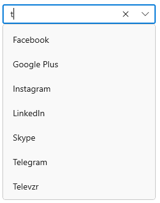

# Searching in WinUI ComboBox

The ComboBox control provides rich text searching functionality. The `TextSearchMode` and `IsTextSearchEnabled` properties of the SfComboBox can be used in order to regulate how the control behaves when it receives user input.

## Search based on member path

The `TextMemberPath`and `DisplayMemberPath` properties of ComboBox control specifies the property path, by which the searching has to be done when a custom data is bound to the `ItemsSource` property.

`TextMemberPath` -  Specifies the property path, by which the searching has to be done when recieves user input in the selection box portion of the combo box control. The default value is `String.Empty`.
`DisplayMemberPath` -  Specifies the property path, by which the searching has to be done when recieves user input in the drop down portion of the combo box control. The default value is `String.Empty`.

## Auto appending of text

The ComboBox control provides support to auto append the text based on data source when end-user edits. If the `IsTextSearchEnabled` property is set as `false`, the matched suitable text will not append with the entered text.




<editors:SfComboBox x:Name="sfComboBox"
    Width="250"
    IsEditable="true"
    ItemsSource="{Binding SocialMedias}"
    TextMemberPath="Name"
    DisplayMemberPath="Name" />




N> Auto appending of text is supported only in `Editable` mode and `TextSearchMode` property should be `StartsWith`.

## Search Mode

The `TextSearchMode` property of the SfComboBox can be used in order to regulate how the control behaves when it receives user input. The default text searching type is `StartsWith`, ignoring accent and it is case insensitive. The available text search modes are,

* StartsWith
* Contains

### Search with beginning text

Search the matching items based on the starting text and the first item which fits the user input in the drop down list will be highlighted.

Below examples shows, text searching functionality in single selection mode.




<editors:SfComboBox x:Name="sfComboBox"
                    Width="250"
                    TextSearchMode="StartsWith"
                    ItemsSource="{Binding SocialMedias}"
                    DisplayMemberPath="Name"
                    TextMemberPath="Name">
</editors:SfComboBox>





sfComboBox.TextSearchMode = ComboBoxTextSearchMode.StartsWith;




Below examples shows, text searching functionality in multiple selection mode.




<editors:SfComboBox x:Name="sfComboBox"
                    Width="250"
                    SelectionMode="Multiple"
                    TextSearchMode="StartsWith"
                    ItemsSource="{Binding SocialMedias}"
                    DisplayMemberPath="Name"
                    TextMemberPath="Name">
</editors:SfComboBox>





sfComboBox.TextSearchMode = ComboBoxTextSearchMode.StartsWith;




### Search with contains text

Search the matching items containing specific text and the first item which fits the user input in the drop down list will be highlighted.




<editors:SfComboBox x:Name="sfComboBox"
    Width="250"
    IsEditable="True"
    TextSearchMode="Contains"
    ItemsSource="{Binding SocialMedias}"
    TextMemberPath="Name"
    DisplayMemberPath="Name" />





sfComboBox.TextSearchMode = ComboBoxTextSearchMode.Contains;




## How to disable searching?

To disable searching and auto appending text functionalities, set the `IsTextSearchEnabled` property as `false`. The default value is true.




<editors:SfComboBox x:Name="sfComboBox"
    Width="250"
    IsTextSearchEnabled="false"
    IsEditable="true"
    ItemsSource="{Binding SocialMedias}"
    TextMemberPath="Name"
    DisplayMemberPath="ID" />





sfComboBox.IsTextSearchEnabled = false;




