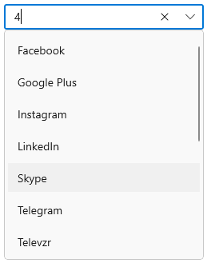
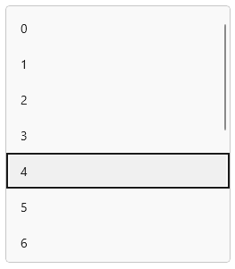

# Searching in WinUI ComboBox (SfComboBox)

The [ComboBox](https://help.syncfusion.com/cr/winui/Syncfusion.UI.Xaml.Editors.SfComboBox.html) control provides rich text searching functionality. The [TextSearchMode](https://help.syncfusion.com/cr/winui/Syncfusion.UI.Xaml.Editors.SfComboBox.html#Syncfusion_UI_Xaml_Editors_SfComboBox_TextSearchMode) and [IsTextSearchEnabled](https://help.syncfusion.com/cr/winui/Syncfusion.UI.Xaml.Editors.SfComboBox.html#Syncfusion_UI_Xaml_Editors_SfComboBox_IsTextSearchEnabled) properties of the `ComboBox` can be used to regulate how the control behaves when it receives user input.

## Search based on member path

The [TextMemberPath](https://help.syncfusion.com/cr/winui/Syncfusion.UI.Xaml.Editors.SfDropDownListBase.html#Syncfusion_UI_Xaml_Editors_SfDropDownListBase_TextMemberPath) and [DisplayMemberPath](https://help.syncfusion.com/cr/winui/Syncfusion.UI.Xaml.Editors.SfDropDownListBase.html#Syncfusion_UI_Xaml_Editors_SfDropDownListBase_DisplayMemberPath) properties of `ComboBox` control specify the property path, by which the searching must be done when a custom data is bound to the `ItemsSource` property.

`TextMemberPath` - Specifies the property path, by which the searching must be done when user input is received in the selection box portion of the `ComboBox` control. The default value is `String.Empty`.

`DisplayMemberPath` - Specifies the property path, by which the searching must be done when user input is received in the drop-down portion of the `ComboBox` control. The default value is `String.Empty`.

N> `TextMemberPath` and `DisplayMemberPath` will be effective for the collection item that holds two or more properties in it.

## Edit mode Searching based on TextMemberPath

In edit mode, searching will be performed based on the `TextMemberPath` property while entering the text into the selection box. If `TextMemberPath` is set to `null`, searching will be disabled. Edit mode searching will not be performed based on the `DisplayMemberPath` property.




<editors:SfComboBox x:Name="comboBox"
    Width="250"
    IsTextSearchEnabled="true"
    IsEditable="true"
    ItemsSource="{Binding SocialMedias}"
    TextMemberPath="ID"
    DisplayMemberPath="Name" />





comboBox.TextMemberPath = "ID";




For e.g. After typing `4` in selection box.

## Non-Editable mode Searching based on DisplayMemberPath

In non-editable mode, searching will be performed based on the `DisplayMemberPath` property while entering the text into the selection box. If `DisplayMemberPath` is `null`, searching will be disabled. Non-editable mode searching will not be performed based on the `TextMemberPath` property.




<editors:SfComboBox x:Name="comboBox"
    Width="250"
    IsTextSearchEnabled="true"
    ItemsSource="{Binding SocialMedias}"
    TextMemberPath="Name"
    DisplayMemberPath="ID" />





comboBox.DisplayMemberPath = "ID";




For e.g. After typing `4` in drop-down.

N> If `TextMemberPath` and `DisplayMemberPath` are `null`, searching will be performed based on the class name with namespace of the item.

## Auto appending of text

The `ComboBox` control provides support to auto append the text based on data source when end-user edits. If the `IsTextSearchEnabled` property is set as `false`, the matched suitable text will not append with the entered text.




<editors:SfComboBox x:Name="comboBox"
    Width="250"
    IsEditable="true"
    ItemsSource="{Binding SocialMedias}"
    TextMemberPath="Name"
    DisplayMemberPath="Name" />




N> Auto appending of text is supported only in `Editable` mode and `TextSearchMode` property should be `StartsWith`.

## Search Mode

The `TextSearchMode` property of the `ComboBox` can be used to regulate how the control behaves when it receives user input. The default text searching type is `StartsWith`, ignoring accent and it is case insensitive. The available text search modes are,

* StartsWith
* Contains

### Search with beginning text

Search the matching items based on the starting text, and the first item which fits the user input in the drop-down list, will be highlighted.

The following examples show how to perform text searching functionality in single selection mode.




<editors:SfComboBox x:Name="comboBox"
                    Width="250"
                    TextSearchMode="StartsWith"
                    ItemsSource="{Binding SocialMedias}"
                    DisplayMemberPath="Name"
                    TextMemberPath="Name">
</editors:SfComboBox>





comboBox.TextSearchMode = ComboBoxTextSearchMode.StartsWith;




The following examples show how to perform text searching functionality in multiple selection mode.




<editors:SfComboBox x:Name="comboBox"
                    Width="250"
                    SelectionMode="Multiple"
                    TextSearchMode="StartsWith"
                    ItemsSource="{Binding SocialMedias}"
                    DisplayMemberPath="Name"
                    TextMemberPath="Name">
</editors:SfComboBox>





comboBox.TextSearchMode = ComboBoxTextSearchMode.StartsWith;




### Search with contains text

Search the matching items containing specific text, and the first item which fits the user input in the drop-down list, will be highlighted.




<editors:SfComboBox x:Name="comboBox"
    Width="250"
    IsEditable="True"
    TextSearchMode="Contains"
    ItemsSource="{Binding SocialMedias}"
    TextMemberPath="Name"
    DisplayMemberPath="Name" />





comboBox.TextSearchMode = ComboBoxTextSearchMode.Contains;




### Custom searching

The ComboBox control provides support to implement the own custom logic for the searching mechanism by using the `SearchBehavior` property. In order to implement the desired custom searching behavior for ComboBox you need to create a class that derives from the `IComboBoxSearchBehavior` interface. 

`IComboBoxSearchBehavior` contains the following method:

`GetHighlightIndex(SfComboBox source, ComboBoxSearchInfo searchInfo)` – Returns the index of the highlighted item which was calculated from the filtered items based on text entered in ComboBox control. 

The following example demonstrates highlighting the first item that fully matches the typed length entered in the ComboBox control.




<editors:SfComboBox x:Name="comboBox"
                    Width="250"
                    IsEditable="True"
                    ItemsSource="{Binding SocialMedias}"
                    TextMemberPath="Name"
                    DisplayMemberPath="Name">
        <editors:SfComboBox.SearchBehavior>
            <local:StringLengthSearchingBehavior/>
        </editors:SfComboBox.SearchBehavior>
</editors:SfComboBox>





/// 

/// To highlight the first item that fully matches the typed length entered in the ComboBox control.
/// 

public class StringLengthSearchingBehavior : IComboBoxSearchBehavior
{
    private int charLength;

    public int GetHighlightIndex(SfComboBox source, ComboBoxSearchInfo searchInfo)
    {
        if (int.TryParse(searchInfo.Text, out this.charLength)) 
        {
           var fullMatch = source.Items.OfType<SocialMedia>().FirstOrDefault(i => i.Name.Length == charLength); 
           if (fullMatch != null)
           {
              return source.Items.IndexOf(fullMatch); 
           }
        }
       
        return -1;
    }
}




For e.g. After typing `9` in selection box, instagram (string length is 9) will be highlighted.

## How to disable searching

To disable searching and auto appending text functionalities, set the `IsTextSearchEnabled` property as `false`. The default value is `true`.




<editors:SfComboBox x:Name="comboBox"
    Width="250"
    IsTextSearchEnabled="false"
    IsEditable="true"
    ItemsSource="{Binding SocialMedias}"
    TextMemberPath="Name"
    DisplayMemberPath="Name" />





comboBox.IsTextSearchEnabled = false;




