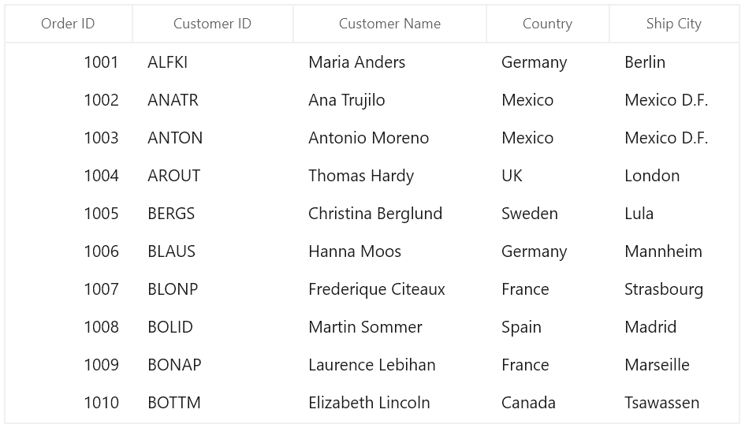
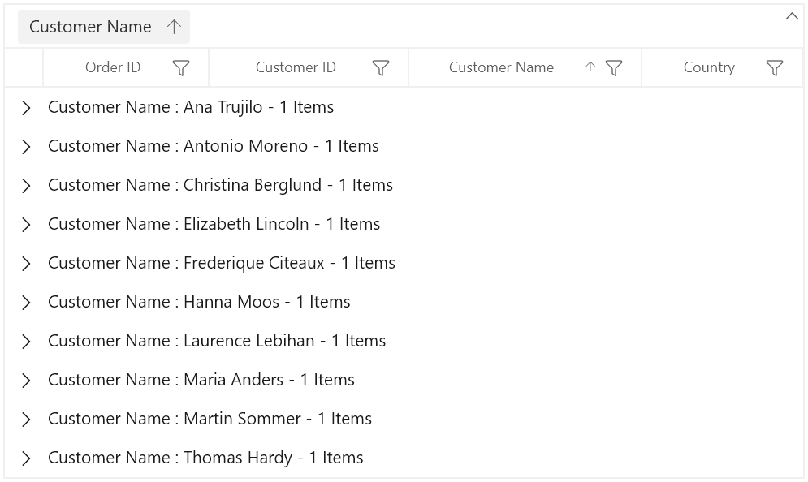

# Getting Started with WinUI DataGrid

This section explains the steps required to add the DataGrid control and binding data in datagrid control. This section covers only basic features needed to get started with Syncfusion datagrid control.

## Creating an application with WinUI DataGrid

1. Create a [WinUI 3 desktop app for C# and .NET 5](https://docs.microsoft.com/en-us/windows/apps/winui/winui3/get-started-winui3-for-desktop).

2. Add reference to [Syncfusion.Grid.WinUI](https://www.nuget.org/packages/Syncfusion.Grid.WinUI) NuGet. 

3. Import the control namespace `Syncfusion.UI.Xaml.DataGrid`  in XAML or C# code.

4. Initialize the SfDataGrid control.



<Page
    x:Class="GettingStarted.MainPage"
    xmlns="http://schemas.microsoft.com/winfx/2006/xaml/presentation"
    xmlns:x="http://schemas.microsoft.com/winfx/2006/xaml"
    xmlns:local="using:GettingStarted"
    xmlns:d="http://schemas.microsoft.com/expression/blend/2008"
    xmlns:mc="http://schemas.openxmlformats.org/markup-compatibility/2006"
    xmlns:dataGrid="using:Syncfusion.UI.Xaml.DataGrid"
    mc:Ignorable="d"
    Background="{ThemeResource ApplicationPageBackgroundThemeBrush}">
    <Grid x:Name="rootGrid">
    <dataGrid:SfDataGrid x:Name="sfDataGrid" />
    </Grid>
</Page>



using Syncfusion.UI.Xaml.DataGrid;
namespace GettingStarted
{
    /// 

    /// An empty page that can be used on its own or navigated to within a Frame.
    /// 

    public sealed partial class MainPage : Page
    {
        public MainPage()
        {
            this.InitializeComponent();
            SfDataGrid sfDataGrid = new SfDataGrid();
            rootGrid.Children.Add(sfDataGrid);
        }
    }
}



### Creating Data Model for sample application

SfDataGrid is a data-bound control. So before create binding to the control, you must create data model for Application.

1. Create data object class named **OrderInfo** and declare properties as shown below,




public class OrderInfo
{
    int orderID;
    string customerId;
    string country;
    string customerName;
    string shippingCity;
	
    public int OrderID
    {
        get {   return orderID;  }
        set {   orderID = value; }
    }

    public string CustomerID
    {
        get {  return customerId; }
        set {  customerId = value; }
    }

    public string CustomerName
    {
        get {  return customerName; }
        set {  customerName = value;}
    }

    public string Country
    {
        get { return country; }
        set  {  country = value; }
    }

    public string ShipCity
    {
        get {  return shippingCity; }
        set {  shippingCity = value; }
    }

    public OrderInfo(int orderId, string customerName, string country, string customerId,string shipCity)
    {
        this.OrderID = orderId;
        this.CustomerName = customerName;
        this.Country = country;
        this.CustomerID = customerId;
        this.ShipCity = shipCity;
    }
}




N> If you want your data object (OrderInfo class) to automatically reflect property changes, then the object must implement **INotifyPropertyChanged** interface.
 
2.Create a **ViewModel** class with Orders property and Orders property is initialized with several data objects in constructor.

 


public class ViewModel
{
    private ObservableCollection<OrderInfo> _orders;
    public ObservableCollection<OrderInfo> Orders
    {
        get { return _orders; }
        set { _orders = value; }
    }

    public ViewModel()
    {
        _orders = new ObservableCollection<OrderInfo>();
        this.GenerateOrders();
    }

    private void GenerateOrders()
    {
        _orders.Add(new OrderInfo(1001, "Maria Anders", "Germany", "ALFKI", "Berlin"));
        _orders.Add(new OrderInfo(1002, "Ana Trujilo", "Mexico", "ANATR", "Mexico D.F."));
        _orders.Add(new OrderInfo(1003, "Antonio Moreno", "Mexico", "ANTON", "Mexico D.F."));
        _orders.Add(new OrderInfo(1004, "Thomas Hardy", "UK", "AROUT", "London"));
        _orders.Add(new OrderInfo(1005, "Christina Berglund", "Sweden", "BERGS", "Lula"));
        _orders.Add(new OrderInfo(1006, "Hanna Moos", "Germany", "BLAUS", "Mannheim"));
        _orders.Add(new OrderInfo(1007, "Frederique Citeaux", "France", "BLONP", "Strasbourg"));
        _orders.Add(new OrderInfo(1008, "Martin Sommer", "Spain", "BOLID", "Madrid"));
        _orders.Add(new OrderInfo(1009, "Laurence Lebihan", "France", "BONAP", "Marseille"));
       _orders.Add(new OrderInfo(1010, "Elizabeth Lincoln", "Canada", "BOTTM", "Tsawassen"));
    }
}




### Binding to Data

To bind the SfDataGrid to data, set the [SfDataGrid.ItemsSource](https://help.syncfusion.com/cr/winui/Syncfusion.UI.Xaml.DataGrid.SfDataGrid.html#Syncfusion_UI_Xaml_DataGrid_SfDataGrid_ItemsSource) property to an IEnumerable implementation. Each row in SfDataGrid is bound to an object in data source and each column in SfDataGrid bound to a property in data object. 
 
Bind the collection created in previous step to `SfDataGrid.ItemsSource` property in XAML by setting ViewModel as `DataContext`.




<Page
    x:Class="GettingStarted.MainPage"
    xmlns="http://schemas.microsoft.com/winfx/2006/xaml/presentation"
    xmlns:x="http://schemas.microsoft.com/winfx/2006/xaml"
    xmlns:local="using:GettingStarted"
    xmlns:d="http://schemas.microsoft.com/expression/blend/2008"
    xmlns:mc="http://schemas.openxmlformats.org/markup-compatibility/2006"
    xmlns:dataGrid="using:Syncfusion.UI.Xaml.DataGrid"
    mc:Ignorable="d"
    Background="{ThemeResource ApplicationPageBackgroundThemeBrush}">
    <Page.DataContext>
        <local:ViewModel/>
    </Page.DataContext>
    <Grid>
        <dataGrid:SfDataGrid x:Name="sfDataGrid"
                               AutoGenerateColumns="True"
                               ItemsSource="{Binding Orders}"/>
    </Grid>
</Page>



ViewModel viewModel = new ViewModel();
sfDataGrid.ItemsSource = viewModel.Orders;



Now, run the application and you can expect the below output,

## Defining Columns

By default, the SfDataGrid control generates the columns automatically when value assigned to [SfDataGrid.ItemsSource](https://help.syncfusion.com/cr/winui/Syncfusion.UI.Xaml.DataGrid.SfDataGrid.html#Syncfusion_UI_Xaml_DataGrid_SfDataGrid_ItemsSource) property. The type of the column generated depends on the type of data in the column and the attribute of the property the column bound with. 

The following table lists the column types and it’s constraints for auto column generation.

<table>
<tr>
<th>
Generated Column Type
</th>
<th>
Data Type / Attribute
</th>
</tr>
<tr>
<td>
GridTextColumn
</td>
<td>
Property of type String and any other type apart from below specified cases.
</td>
</tr>
<tr>
<td>
GridCheckBoxColumn
</td>
<td>
Property of type Bool
</td>
</tr>
<tr>
<td>
GridDateColumn
</td>
<td>
Property of type DateTimeOffset
</td>
</tr>
<tr>
<td>
GridHyperLinkColumn
</td>
<td>
Property of type Uri
</td>
</tr>
<tr>
<td>
GridNumericColumn
</td>
<td>
Property of type Double
</td>
</tr>
</table>

When columns are auto-generated, you can handle the [SfDataGrid.AutoGeneratingColumn](https://help.syncfusion.com/cr/winui/Syncfusion.UI.Xaml.DataGrid.SfDataGrid.html#Syncfusion_UI_Xaml_DataGrid_SfDataGrid_AutoGeneratingColumn) event to customize or cancel the columns before they are added to the SfDataGrid. 

You can prevent the automatic column generation by setting SfDataGrid.AutoGenerateColumns property to `false`. When [SfDataGrid.AutoGenerateColumns](https://help.syncfusion.com/cr/winui/Syncfusion.UI.Xaml.Grids.SfGridBase.html#Syncfusion_UI_Xaml_Grids_SfGridBase_AutoGenerateColumns) property is `false`, you have to define the columns to be displayed as below,



<dataGrid:SfDataGrid x:Name="sfDataGrid"  
                       ItemsSource="{Binding Orders}" 
                       AutoGenerateColumns="False">
    <dataGrid:SfDataGrid.Columns>
        <dataGrid:GridTextColumn  MappingName="OrderID" />
        <dataGrid:GridTextColumn  MappingName="CustomerID"/>
        <dataGrid:GridTextColumn  MappingName="CustomerName"/>
        <dataGrid:GridTextColumn  MappingName="ShipCity"/>
        <dataGrid:GridTextColumn  MappingName="Country"/>
    </dataGrid:SfDataGrid.Columns>
</dataGrid:SfDataGrid>


SfDataGrid sfDataGrid = new SfDataGrid();
sfDataGrid.AutoGenerateColumns = false;
sfDataGrid.Columns.Add(new GridTextColumn() { MappingName = "OrderID" });
sfDataGrid.Columns.Add(new GridTextColumn() { MappingName = "CustomerID" });
sfDataGrid.Columns.Add(new GridTextColumn() { MappingName = "CustomerName" });
sfDataGrid.Columns.Add(new GridTextColumn() { MappingName = "ShipCity" });
sfDataGrid.Columns.Add(new GridTextColumn() { MappingName = "Country" });



Below are the list of column types provided in SfDataGrid.

<table>
<tr>
<th>
Column Type
</th>
<th>
Comments
</th>
</tr>
<tr>
<td>
GridTextColumn
</td>
<td>
Represents SfDataGrid column that hosts textual content in its cells.
</td>
</tr>
<tr>
<td>
GridComboBoxColumn
</td>
<td>
Represents SfDataGrid column that hosts <code>ComboBox</code> controls in its cells.
</td>
</tr>
<tr>
<td>
GridCheckBoxColumn
</td>
<td>
Represents SfDataGrid column that hosts <code>CheckBox</code> controls in its cells.
</td>
</tr>
<tr>
<td>
GridCheckBoxSelectorColumn
</td>
<td>
Represents SfDataGrid column that hosts CheckBox controls to select or deselects rows which are not actually bound with data object of row.
</td>
</tr>
<tr>
<td>
GridDateColumn
</td>
<td>
Represents SfDataGrid column that hosts {{'[SfCalendarDatePicker](https://help.syncfusion.com/cr/winui/Syncfusion.UI.Xaml.Calendar.SfCalendarDatePicker.html)'| markdownify }} controls in its cells which is used to display and format Date values.
</td>
</tr>
<tr>
<td>
GridImageColumn
</td>
<td>
Represents SfDataGrid column that hosts <code>Image</code> controls in its cells.
</td>
</tr>
<tr>
<td>
GridHyperlinkColumn
</td>
<td>
Represents SfDataGrid column that hosts <code>HyperlinkButton</code> controls in its cells.
</td>
</tr>
<tr>
<td>
GridNumericColumn
</td>
<td>
Represents SfDataGrid column that hosts {{'[SfNumberBox](https://help.syncfusion.com/cr/winui/Syncfusion.UI.Xaml.Editors.SfNumberBox.html)'| markdownify }} controls in its cells which is used to format and display Numeric values.
</td>
</tr>
<tr>
<td>
GridTimeColumn
</td>
<td>
Represents SfDataGrid column that hosts {{'[SfTimePicker](https://help.syncfusion.com/cr/winui/Syncfusion.UI.Xaml.Editors.SfTimePicker.html)'| markdownify }} controls in its cells which is used to format and display Time values.
</td>
</tr>
<tr>
<td>
GridTemplateColumn
</td>
<td>
Represents SfDataGrid column that hosts template-specified content in its cells
</td>
</tr>
<tr>
<td>
GridToggleSwitchColumn
</td>
<td>
Represents SfDataGrid column that hosts <code>ToggleSwitch</code> controls in its cells.
</td>
</tr>
<tr>
<td>
GridUnboundColumn
</td>
<td>
Represents SfDataGrid column that hosts textual or template-specified content which are not actually bound with data object of row.
</td>
</tr>
</table>

## Selection

By default, the entire row is selected when a user clicks a cell in a SfDataGrid. You can set the [SfDataGrid.SelectionMode](https://help.syncfusion.com/cr/winui/Syncfusion.UI.Xaml.Grids.SfGridBase.html#Syncfusion_UI_Xaml_Grids_SfGridBase_SelectionMode) property to specify whether a user can select single row or cell, or multiple rows or cells.  Set the [SfDataGrid.SelectionUnit](https://help.syncfusion.com/cr/winui/Syncfusion.UI.Xaml.DataGrid.SfDataGrid.html#Syncfusion_UI_Xaml_DataGrid_SfDataGrid_SelectionUnit) property to specify whether rows can be selected, or cells can selected.

You can handle the selection operations with the help of [SfDataGrid.SelectionChanging](https://help.syncfusion.com/cr/winui/Syncfusion.UI.Xaml.DataGrid.SfDataGrid.html#Syncfusion_UI_Xaml_DataGrid_SfDataGrid_SelectionChanging) and [SfDataGrid.SelectionChanged](https://help.syncfusion.com/cr/winui/Syncfusion.UI.Xaml.DataGrid.SfDataGrid.html#Syncfusion_UI_Xaml_DataGrid_SfDataGrid_SelectionChanged) events of SfDataGrid.

## Sorting

By default, you can sort columns in a SfDataGrid by clicking the column header. You can configure the sorting by setting [SfDataGrid.SortColumnDescriptions](https://help.syncfusion.com/cr/winui/Syncfusion.UI.Xaml.Grids.SfGridBase.html#Syncfusion_UI_Xaml_Grids_SfGridBase_SortColumnDescriptions) property as below,



<dataGrid:SfDataGrid x:Name="sfDataGrid"  
                       ItemsSource="{Binding Orders}" >
    <dataGrid:SfDataGrid.SortColumnDescriptions>
        <dataGrid:SortColumnDescription ColumnName="CustomerName"/>
    </dataGrid:SfDataGrid.SortColumnDescriptions>
</dataGrid:SfDataGrid>



You can customize sorting by handling the [SfDataGrid.SortColumnsChanging](https://help.syncfusion.com/cr/winui/Syncfusion.UI.Xaml.DataGrid.SfDataGrid.html#Syncfusion_UI_Xaml_DataGrid_SfDataGrid_SortColumnsChanging) and [SfDataGrid.SortColumnsChanged](https://help.syncfusion.com/cr/winui/Syncfusion.UI.Xaml.DataGrid.SfDataGrid.html#Syncfusion_UI_Xaml_DataGrid_SfDataGrid_SortColumnsChanged) events. To cancel the default sort, set the `Cancel` property to `true` in `SfDataGrid.SortColumnsChanging` event. 



this.sfDataGrid.SortColumnsChanging += SfDataGrid_SortColumnsChanging;

private void SfDataGrid_SortColumnsChanging(object sender, GridSortColumnsChangingEventArgs e)
{
    if (e.AddedItems[0].ColumnName == "CustomerName")
        e.Cancel = true;
}




## Grouping

Grouping can be enabled by setting [SfDataGrid.ShowGroupDropArea](https://help.syncfusion.com/cr/winui/Syncfusion.UI.Xaml.DataGrid.SfDataGrid.html#Syncfusion_UI_Xaml_DataGrid_SfDataGrid_ShowGroupDropArea) property, where you can group by dragging the column header and dropping it in the `GroupDropArea` over the column headers. You can configure the grouping by setting [SfDataGrid.GroupColumnDescriptions](https://help.syncfusion.com/cr/winui/Syncfusion.UI.Xaml.DataGrid.SfDataGrid.html#Syncfusion_UI_Xaml_DataGrid_SfDataGrid_GroupColumnDescriptions) property as below,



<dataGrid:SfDataGrid x:Name="sfDataGrid"  
                       ItemsSource="{Binding Orders}" >
    <dataGrid:SfDataGrid.GroupColumnDescriptions>
        <dataGrid:GroupColumnDescription ColumnName="CustomerName"/>
    </dataGrid:SfDataGrid.GroupColumnDescriptions>
</dataGrid:SfDataGrid>



## Editing

Editing can be enabled by setting [SfDataGrid.AllowEditing](https://help.syncfusion.com/cr/winui/Syncfusion.UI.Xaml.Grids.SfGridBase.html#Syncfusion_UI_Xaml_Grids_SfGridBase_AllowEditing) property to `true`. 
You can customize the editing operations by handling [SfDataGrid.CurrentCellBeginEdit](https://help.syncfusion.com/cr/winui/Syncfusion.UI.Xaml.DataGrid.SfDataGrid.html#Syncfusion_UI_Xaml_DataGrid_SfDataGrid_CurrentCellBeginEdit) and [SfDataGrid.CurrentCellEndEdit](https://help.syncfusion.com/cr/winui/Syncfusion.UI.Xaml.DataGrid.SfDataGrid.html#Syncfusion_UI_Xaml_DataGrid_SfDataGrid_CurrentCellEndEdit) events.

## Filtering

Filtering can be enabled by setting [SfDataGrid.AllowFiltering](https://help.syncfusion.com/cr/winui/Syncfusion.UI.Xaml.DataGrid.SfDataGrid.html#Syncfusion_UI_Xaml_DataGrid_SfDataGrid_AllowFiltering) property to `true`, where you can open advanced filter UI by clicking the Filter icon in column header and filter the SfDataGrid. You can customize the filtering operations by handling [SfDataGrid.FilterChanging](https://help.syncfusion.com/cr/winui/Syncfusion.UI.Xaml.DataGrid.SfDataGrid.html#Syncfusion_UI_Xaml_DataGrid_SfDataGrid_FilterChanging) and [SfDataGrid.FilterChanged](https://help.syncfusion.com/cr/winui/Syncfusion.UI.Xaml.DataGrid.SfDataGrid.html#Syncfusion_UI_Xaml_DataGrid_SfDataGrid_FilterChanged) events.

