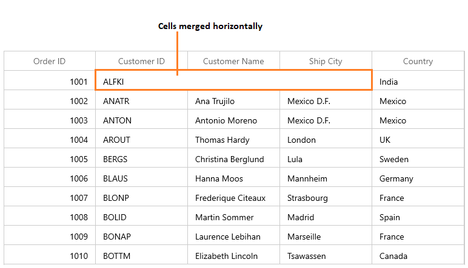
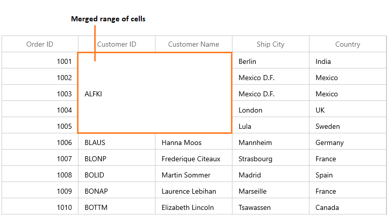
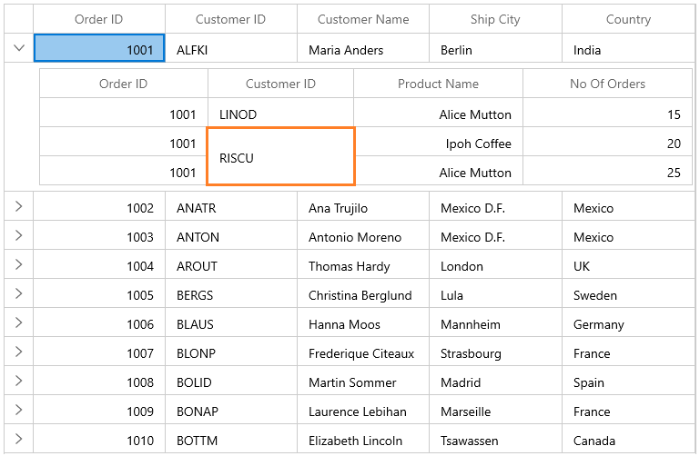

---
layout: post
title: Merge Cells in WinUI DataGrid control | Syncfusion
description: Learn about Merge Cells support in Syncfusion WinUI DataGrid control and more details.
platform: winui
control: DataGrid
documentation: ug
---	

# Merge Cells in WinUI DataGrid
	
DataGrid allows you to merge the range of adjacent cells using [QueryCoveredRange](https://help.syncfusion.com/cr/winui/Syncfusion.UI.Xaml.DataGrid.SfDataGrid.html#Syncfusion_UI_Xaml_DataGrid_SfDataGrid_QueryCoveredRange) event. Merged cells can be printed.

`QueryCoveredRange` event occurs when each cell gets arranged and the custom range will be stored for visible rows and columns in [SfDataGrid.CoveredCells](https://help.syncfusion.com/cr/winui/Syncfusion.UI.Xaml.DataGrid.SfDataGrid.html#Syncfusion_UI_Xaml_DataGrid_SfDataGrid_CoveredCells). This event is not fired for the cells that are not visible and also for the cells that are already in `SfDataGrid.CoveredCells`. When scrolling the merged range will be added for newly added rows & columns through this event and also removed for the rows & columns which are out of view.

[GridQueryCoveredRangeEventArgs](https://help.syncfusion.com/cr/winui/Syncfusion.UI.Xaml.DataGrid.GridQueryCoveredRangeEventArgs.html) of the `QueryCoveredRange` event provides information about the cell triggered this event. [GridQueryCoveredRangeEventArgs.OriginalSender](https://help.syncfusion.com/cr/winui/Syncfusion.UI.Xaml.Grids.GridEventArgs.html#Syncfusion_UI_Xaml_Grids_GridEventArgs_OriginalSender) returns the DataGrid fired this event for DetailsView. By [GridQueryCoveredRangeEventArgs.Range](https://help.syncfusion.com/cr/winui/Syncfusion.UI.Xaml.DataGrid.GridQueryCoveredRangeEventArgs.html#Syncfusion_UI_Xaml_DataGrid_GridQueryCoveredRangeEventArgs_Range) property, the adjacent cells can be merged.



xmlns:dataGrid="using:Syncfusion.UI.Xaml.DataGrid"

<dataGrid:SfDataGrid x:Name="sfDataGrid" 
                       ItemsSource="{Binding Orders}" 
                       SelectionUnit="Cell"
                       NavigationMode="Cell"
                       QueryCoveredRange="sfDataGrid_QueryCoveredRange" />


this.sfDataGrid.SelectionUnit = GridSelectionUnit.Cell;
this.sfDataGrid.NavigationMode = Syncfusion.UI.Xaml.Grids.NavigationMode.Cell;
this.sfDataGrid.QueryCoveredRange += SfDataGrid_QueryCoveredRange;

private void SfDataGrid_QueryCoveredRange(object sender, GridQueryCoveredRangeEventArgs e)
{
    
}



## Merging cells

You can span a cell in a row and column by merging the range of cells by setting [CoveredCellInfo](https://help.syncfusion.com/cr/winui/Syncfusion.UI.Xaml.Grids.CoveredCellInfo.html#Syncfusion_UI_Xaml_Grids_CoveredCellInfo__ctor_System_Int32_System_Int32_System_Int32_System_Int32_) (by defining Left, Right, Top & Bottom) to `GridQueryCoveredRangeEventArgs.Range` and handling the event.
 
### Merging cells horizontally by fixed range

You can merge the columns in a row by setting the column range using Left and Right properties of `CoveredCellInfo`.   



this.sfDataGrid.QueryCoveredRange += SfDataGrid_QueryCoveredRange;

private void SfDataGrid_QueryCoveredRange(object sender, GridQueryCoveredRangeEventArgs e)
{
    if (e.RowColumnIndex.RowIndex == 1)
    {
        if (e.RowColumnIndex.ColumnIndex >= 1 && e.RowColumnIndex.ColumnIndex <= 3)
        {
            e.Range = new CoveredCellInfo(1, 3, 1, 1);
            e.Handled = true;
        }
    }
}



### Merging cells vertically by fixed range

You can merge the range of rows for a particular column by setting the row range using Top and Bottom properties of `CoveredCellInfo`.



this.sfDataGrid.QueryCoveredRange += SfDataGrid_QueryCoveredRange;

private void SfDataGrid_QueryCoveredRange(object sender, GridQueryCoveredRangeEventArgs e)
{
    if (e.RowColumnIndex.ColumnIndex == 1)
    {
        if (e.RowColumnIndex.RowIndex >= 1 && e.RowColumnIndex.RowIndex <= 5)
        {
            e.Range = new CoveredCellInfo(1, 1, 1, 5);
            e.Handled = true;
        }
    }
}



### Merging range of cells

You can merge the range of rows and columns by setting the range using Left, Right, Top and Bottom properties of `CoveredCellInfo`.



this.sfDataGrid.QueryCoveredRange += SfDataGrid_QueryCoveredRange;

private void SfDataGrid_QueryCoveredRange(object sender, GridQueryCoveredRangeEventArgs e)
{
    //Merge range
    if (e.RowColumnIndex.ColumnIndex == 1 && e.RowColumnIndex.RowIndex == 1)
    {
        e.Range = new CoveredCellInfo(1, 2, 1, 5);
        e.Handled = true;
    }
}




## Merging cells based on the content

You can merge the redundant data in adjacent cells in a row or columns using `QueryCoveredRange` event.

In the below code, `GetRange` method returns range for a cell based on adjacent cells content. From range from `GetRange` method `QueryCoveredRange` handler sets the range if the calculated range is already not exist in the  [SfDataGrid.CoveredCells](https://help.syncfusion.com/cr/winui/Syncfusion.UI.Xaml.DataGrid.SfDataGrid.html#Syncfusion_UI_Xaml_DataGrid_SfDataGrid_CoveredCells) using [CoveredCells.IsInRange](https://help.syncfusion.com/cr/winui/Syncfusion.UI.Xaml.DataGrid.CoveredCellInfoCollection.html#Syncfusion_UI_Xaml_DataGrid_CoveredCellInfoCollection_IsInRange_Syncfusion_UI_Xaml_Grids_CoveredCellInfo_) method.




this.sfDataGrid.ItemsSourceChanged += SfDataGrid_ItemsSourceChanged;
this.sfDataGrid.QueryCoveredRange += SfDataGrid_QueryCoveredRange;

/// 

/// Reflector for SfDataGrid’s data.
/// 

IPropertyAccessProvider reflector = null;

/// 

/// ItemsSourceChanged event handler.
/// 

private void SfDataGrid_ItemsSourceChanged(object sender, GridItemsSourceChangedEventArgs e)
{
    if (sfDataGrid.View != null)
        reflector = sfDataGrid.View.GetPropertyAccessProvider();
    else
        reflector = null;            
}

/// 

/// QueryCoveredRange event handler
/// 

private void SfDataGrid_QueryCoveredRange(object sender, GridQueryCoveredRangeEventArgs e)
{
    var range = GetRange(e.GridColumn, e.RowColumnIndex.RowIndex, e.RowColumnIndex.ColumnIndex, e.Record);

    if (range == null)
        return;

    // You can know that the range is already exist in Covered Cells by IsInRange method.
    if (!sfDataGrid.CoveredCells.IsInRange(range))
    {
        e.Range = range;
        e.Handled = true;
    }

    //If the calculated range is already exist in CoveredCells, you can get the range using SfDataGrid.GetConflictRange (CoveredCellInfo coveredCellInfo) extension method.
}

/// 

/// Method to get the covered range based on cell value.
/// 

/// <param name="column"></param>
/// <param name="rowIndex"></param>
/// <param name="columnIndex"></param>
/// <param name="rowData"></param>
/// <returns> Compares the adjacent cell value and returns the range </returns>
/// <remark> If the method find that the adjacent values are equal by horizontal then it will merge vertically. And vice versa</remarks>
private CoveredCellInfo GetRange(GridColumn column, int rowIndex, int columnIndex, object rowData)
{
    var range = new CoveredCellInfo(columnIndex, columnIndex, rowIndex, rowIndex);
    object data = reflector.GetFormattedValue(rowData, column.MappingName);

    GridColumn leftColumn = null;
    GridColumn rightColumn = null;

    // total rows count.
    int recordsCount = this.sfDataGrid.GroupColumnDescriptions.Count != 0 ?
    (this.sfDataGrid.View.TopLevelGroup.DisplayElements.Count + this.sfDataGrid.TableSummaryRows.Count + this.sfDataGrid.UnboundRows.Count + (this.sfDataGrid.AddNewRowPosition == AddNewRowPosition.Top ? +1 : 0)) :
    (this.sfDataGrid.View.Records.Count + this.sfDataGrid.TableSummaryRows.Count + this.sfDataGrid.UnboundRows.Count + (this.sfDataGrid.AddNewRowPosition == AddNewRowPosition.Top ? +1 : 0));

    // Merge Horizontally

    // compare right column               
    for (int i = sfDataGrid.Columns.IndexOf(column); i < this.sfDataGrid.Columns.Count - 1; i++)
    {
        var compareData = reflector.GetFormattedValue(rowData, sfDataGrid.Columns[i + 1].MappingName);

        if (compareData == null)
            break;

        if (!compareData.Equals(data))
            break;
        rightColumn = sfDataGrid.Columns[i + 1];
    }

    // compare left column.
    for (int i = sfDataGrid.Columns.IndexOf(column); i > 0; i--)
    {
        var compareData = reflector.GetFormattedValue(rowData, sfDataGrid.Columns[i - 1].MappingName);

        if (compareData == null)
            break;

        if (!compareData.Equals(data))
            break;
        leftColumn = sfDataGrid.Columns[i - 1];
    }

    if (leftColumn != null || rightColumn != null)
    {

        // set left index
        if (leftColumn != null)
        {
            var leftColumnIndex = this.sfDataGrid.ResolveToScrollColumnIndex(this.sfDataGrid.Columns.IndexOf(leftColumn));
            range = new CoveredCellInfo(leftColumnIndex, range.Right, range.Top, range.Bottom);
        }

        // set right index
        if (rightColumn != null)
        {
            var rightColumnIndex = this.sfDataGrid.ResolveToScrollColumnIndex(this.sfDataGrid.Columns.IndexOf(rightColumn));
            range = new CoveredCellInfo(range.Left, rightColumnIndex, range.Top, range.Bottom);
        }
        return range;
    }

    // Merge Vertically from the row index.
    int previousRowIndex = -1;
    int nextRowIndex = -1;
    object previousData = null;
    // Get previous row data.                
    var startIndex = sfDataGrid.ResolveStartIndexBasedOnPosition();

    for (int i = rowIndex - 1; i >= startIndex; i--)
    {
        var recordIndex = this.sfDataGrid.ResolveToRecordIndex(i);
        if (this.sfDataGrid.View.GroupDescriptions.Count > 0)
        {
             previousData = this.sfDataGrid.View.TopLevelGroup.DisplayElements[recordIndex];                    
        }
        else
        {
            var recordCount = this.sfDataGrid.View.Records.Count;
            previousData = (recordCount > 0 && recordIndex >= 0 && recordIndex < recordCount)
                       ? sfDataGrid.View.Records[recordIndex]
                       : null;
        }
        
        if (previousData == null || !(previousData as NodeEntry).IsRecords)
            break;
        var compareData = reflector.GetFormattedValue((previousData as RecordEntry).Data, column.MappingName);

        if (compareData == null)
            break;

        if (!compareData.Equals(data))
            break;
        previousRowIndex = i;
    }

    // get next row data.
    object nextData = null;
    for (int i = rowIndex + 1; i < recordsCount + 1; i++)
    {
        var recordIndex = this.sfDataGrid.ResolveToRecordIndex(i);
        if (this.sfDataGrid.View.GroupDescriptions.Count > 0)
        {
            nextData = this.sfDataGrid.View.TopLevelGroup.DisplayElements[recordIndex];                    
        }
        else
        {
            var recordCount = this.sfDataGrid.View.Records.Count;
            nextData = (recordCount > 0 && recordIndex >= 0 && recordIndex < recordCount)
                       ? sfDataGrid.View.Records[recordIndex]
                       : null; 
        }                

        if (nextData == null || !(nextData as NodeEntry).IsRecords)
            break;
        var compareData = reflector.GetFormattedValue((nextData as RecordEntry).Data , column.MappingName);

        if (compareData == null)
            break;

        if (!compareData.Equals(data))
            break;
        nextRowIndex = i;
    }

    if (previousRowIndex != -1 || nextRowIndex != -1)
    {

        if (previousRowIndex != -1)
            range = new CoveredCellInfo(range.Left, range.Right, previousRowIndex, range.Bottom);

        if (nextRowIndex != -1)
            range = new CoveredCellInfo(range.Left, range.Right, range.Top, nextRowIndex);
        return range;
    }
    return null;
}




## Merge cells in Master-Details View

Master-details view allows you to merge the range of cells using the `QueryCoveredRange` event of [ViewDefinition.DataGrid](https://help.syncfusion.com/cr/winui/Syncfusion.UI.Xaml.DataGrid.GridViewDefinition.html#Syncfusion_UI_Xaml_DataGrid_GridViewDefinition_DataGrid). You can get the **DetailsViewDataGrid** which triggered the event from `GridQueryCoveredRangeEventArgs.OriginalSender` of the `QueryCoveredRange` event. 



<dataGrid:SfDataGrid x:Name="sfDataGrid" 
                        SelectionUnit="Cell" 
                        NavigationMode="Cell"
                        AutoGenerateColumns="True" ColumnSizer="Star"
                        ItemsSource="{Binding Orders}">
    <dataGrid:SfDataGrid.DetailsViewDefinition>
        <dataGrid:GridViewDefinition RelationalColumn="OrderDetails">
            <dataGrid:GridViewDefinition.DataGrid>
                <dataGrid:SfDataGrid x:Name="firstDetailsViewGrid" AutoGenerateColumns="True" QueryCoveredRange="FirstDetailsViewGrid_QueryCoveredRange" />
            </dataGrid:GridViewDefinition.DataGrid>
        </dataGrid:GridViewDefinition>
    </dataGrid:SfDataGrid.DetailsViewDefinition>
</dataGrid:SfDataGrid>



this.sfDataGrid.SelectionUnit = GridSelectionUnit.Cell;
this.sfDataGrid.NavigationMode = Syncfusion.UI.Xaml.Grids.NavigationMode.Cell;
this.firstDetailsViewGrid.QueryCoveredRange += FirstDetailsViewGrid_QueryCoveredRange;

private void FirstDetailsViewGrid_QueryCoveredRange(object sender, GridQueryCoveredRangeEventArgs e)
{
    if (e.RowColumnIndex.ColumnIndex == 1)
    {
        if (e.RowColumnIndex.RowIndex >= 2 && e.RowColumnIndex.RowIndex <= 3)
        {
            e.Range = new CoveredCellInfo(1, 1, 2, 3);
            e.Handled = true;
        }
    }
}




### Merging range of parent cells

You can’t vertically merge the cells of row when it has details view. You can check whether the row have details view or not using [CanMergeNextRows](https://help.syncfusion.com/cr/winui/Syncfusion.UI.Xaml.DataGrid.MergedCellHelper.html#Syncfusion_UI_Xaml_DataGrid_MergedCellHelper_CanMergeNextRows_Syncfusion_UI_Xaml_DataGrid_SfDataGrid_System_Object_) extension method of [MergedCellHelper](https://help.syncfusion.com/cr/winui/Syncfusion.UI.Xaml.DataGrid.MergedCellHelper.html).



this.sfDataGrid.QueryCoveredRange += SfDataGrid_QueryCoveredRange;

private void SfDataGrid_QueryCoveredRange(object sender, GridQueryCoveredRangeEventArgs e)
{
    if (!sfDataGrid.CanMergeNextRows(e.Record))
        return;

    if (e.RowColumnIndex.ColumnIndex == 1)
    {
        if (e.RowColumnIndex.RowIndex >= 1 && e.RowColumnIndex.RowIndex <= 4)
        {
            e.Range = new CoveredCellInfo(1, 1, 1, 4);
            e.Handled = true;
        }
    }
}



### Limitations

Below are the limitation when using Cell Merging in SfDataGrid.

1. Row selection is not supported.
2. Heterogeneous rows can’t be merged.
3. Cell loaded with Template Selector can’t be merged.
4. [AllowFrozenGroupHeaders](https://help.syncfusion.com/cr/winui/Syncfusion.UI.Xaml.DataGrid.SfDataGrid.html#Syncfusion_UI_Xaml_DataGrid_SfDataGrid_AllowFrozenGroupHeaders) is not supported.
5. With DetailsViewDefinition, Cell merging is not supported if [HideEmptyGridViewDefinition](https://help.syncfusion.com/cr/winui/Syncfusion.UI.Xaml.DataGrid.SfDataGrid.html#Syncfusion_UI_Xaml_DataGrid_SfDataGrid_HideEmptyGridViewDefinition) is `false` or record has DetailsViewDataGrid.

## How to 

### Allow cell merging with Row Selection or NavigationMode as Row or AllowFrozenGroupHeaders is true

[SfDataGrid](https://help.syncfusion.com/cr/winui/Syncfusion.UI.Xaml.DataGrid.SfDataGrid.html) does not allow cell merging when [SelectionUnit](https://help.syncfusion.com/cr/winui/Syncfusion.UI.Xaml.DataGrid.SfDataGrid.html#Syncfusion_UI_Xaml_DataGrid_SfDataGrid_SelectionUnit) is [Row](https://help.syncfusion.com/cr/winui/Syncfusion.UI.Xaml.Grids.GridSelectionUnit.html#Syncfusion_UI_Xaml_Grids_GridSelectionUnit_Row) or [NavigationMode](https://help.syncfusion.com/cr/winui/Syncfusion.UI.Xaml.Grids.SfGridBase.html#Syncfusion_UI_Xaml_Grids_SfGridBase_NavigationMode) is [Row](https://help.syncfusion.com/cr/winui/Syncfusion.UI.Xaml.Grids.NavigationMode.html#Syncfusion_UI_Xaml_Grids_NavigationMode_Row) or `AllowFrozenGroupHeaders` is `true`. You can overcome this behavior by setting [ExternalExceptionThrownEventArgs.Handled](https://help.syncfusion.com/cr/winui/Syncfusion.UI.Xaml.DataGrid.ExternalExceptionThrownEventArgs.html#Syncfusion_UI_Xaml_DataGrid_ExternalExceptionThrownEventArgs_Handled) to `true` using [ExternalExceptionThrown](https://help.syncfusion.com/cr/winui/Syncfusion.UI.Xaml.DataGrid.SfDataGrid.html#Syncfusion_UI_Xaml_DataGrid_SfDataGrid_ExternalExceptionThrown) event.



this.sfDataGrid.ExternalExceptionThrown += SfDataGrid_ExternalExceptionThrown;
 
private void SfDataGrid_ExternalExceptionThrown(object sender, ExternalExceptionThrownEventArgs e)
{
    if (e.Exception is NotSupportedException && e.Exception.Message == "Merged Cell will not support when SfDataGrid.SelectionUnit is Row or Any, or SfDataGrid.NavigationMode is Row or SfDataGrid.AllowFrozenGroupedHeaders is true")
    {
        e.Handled = true;
    }
}


