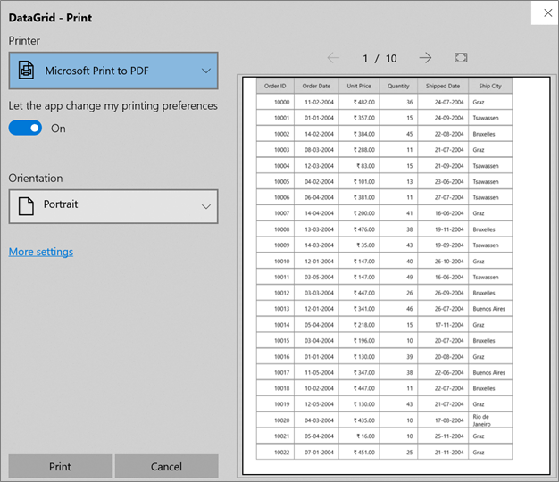
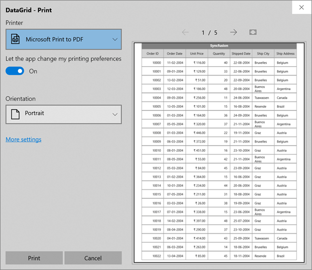
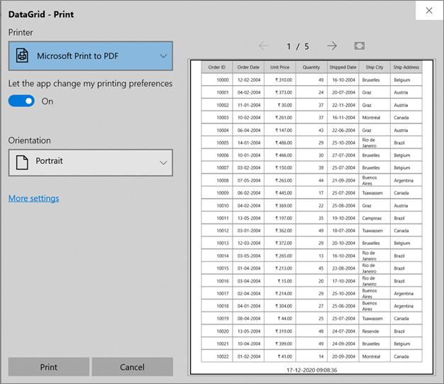
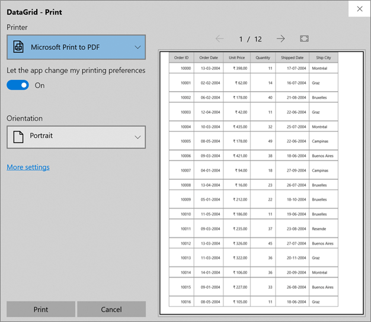
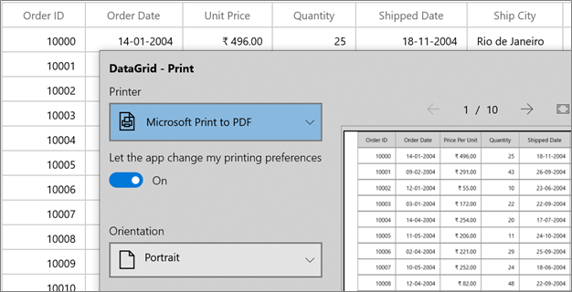
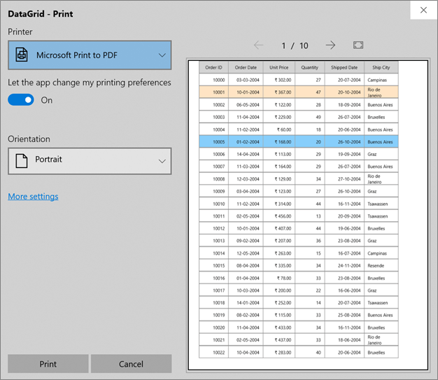
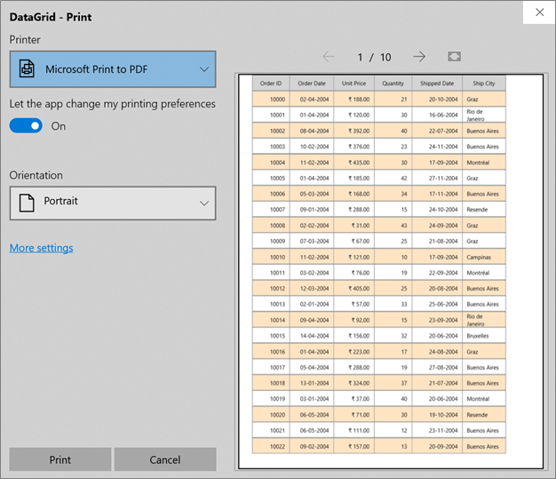
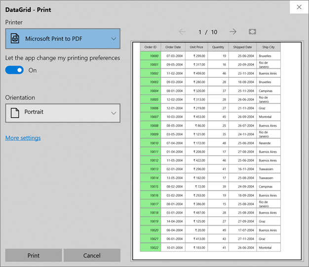
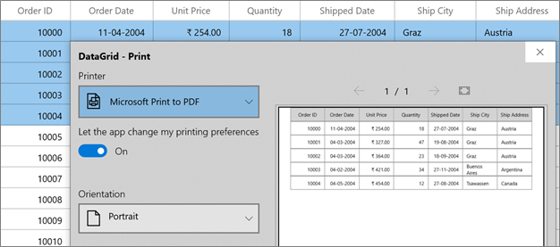

# Printing with WinUI DataGrid (SfDataGrid)

DataGrid provides support to print the data displayed in the DataGrid using [SfDataGrid.Print](https://help.syncfusion.com/cr/winui/Syncfusion.UI.Xaml.DataGrid.SfDataGrid.html#Syncfusion_UI_Xaml_DataGrid_SfDataGrid_Print) method.
 


this.sfDataGrid.Print();



## Print Settings

SfDataGrid provides various options to customize print preview settings using [SfDataGrid.PrintSettings](https://help.syncfusion.com/cr/winui/Syncfusion.UI.Xaml.DataGrid.SfDataGrid.html#Syncfusion_UI_Xaml_DataGrid_SfDataGrid_PrintSettings) property of type [DataGridPrintSettings](https://help.syncfusion.com/cr/winui/Syncfusion.UI.Xaml.DataGrid.Print.DataGridPrintSettings.html).



sfDataGrid.PrintSettings.CanRepeatHeaders = true;
sfDataGrid.Print();



### Print

Print method opens the print dialog where user can select the available printer, change the orientation and preview of the DataGrid to be printed will be loaded on print preview panel.

### Scaling

SfDataGrid provides support to scale rows or columns or both while printing to fit on one page. Scaling options can be changed by setting [PrintSettings.ScalingOption](https://help.syncfusion.com/cr/winui/Syncfusion.UI.Xaml.DataGrid.Print.DataGridPrintSettings.html#Syncfusion_UI_Xaml_DataGrid_Print_DataGridPrintSettings_ScalingOption) property.



sfDataGrid.PrintSettings.ScalingOption = PrintScalingOptions.FitAllColumnsOnOnePage;
sfDataGrid.Print();



### Column Header on each page

Column headers can be printed on each page by enabling [PrintSettings.CanRepeatHeaders](https://help.syncfusion.com/cr/winui/Syncfusion.UI.Xaml.DataGrid.Print.DataGridPrintSettings.html#Syncfusion_UI_Xaml_DataGrid_Print_DataGridPrintSettings_CanRepeatHeaders) property while printing.



sfDataGrid.PrintSettings.CanRepeatHeaders = true;
sfDataGrid.Print();



### Changing Flow Direction while printing

You can change the text direction in print page by using [PrintSettings.FlowDirection](https://help.syncfusion.com/cr/winui/Syncfusion.UI.Xaml.DataGrid.Print.DataGridPrintSettings.html#Syncfusion_UI_Xaml_DataGrid_Print_DataGridPrintSettings_FlowDirection) property.



sfDataGrid.PrintSettings.FlowDirection = FlowDirection.RightToLeft;
sfDataGrid.Print();



### Print with StackedHeaders

SfDataGrid provides support to print the StackedHeaders by setting the [PrintSettings.CanPrintStackedHeaders](https://help.syncfusion.com/cr/winui/Syncfusion.UI.Xaml.DataGrid.Print.DataGridPrintSettings.html#Syncfusion_UI_Xaml_DataGrid_Print_DataGridPrintSettings_CanPrintStackedHeaders) as ‘true’.


sfDataGrid.PrintSettings.CanPrintStackedHeaders = true;
sfDataGrid.Print();



## Page Settings

SfDataGrid provides various options to customize page settings using [SfDataGrid.PrintSettings](https://help.syncfusion.com/cr/winui/Syncfusion.UI.Xaml.DataGrid.SfDataGrid.html#Syncfusion_UI_Xaml_DataGrid_SfDataGrid_PrintSettings) property of type [DataGridPrintSettings](https://help.syncfusion.com/cr/winui/Syncfusion.UI.Xaml.DataGrid.Print.DataGridPrintSettings.html).

### Orientation

SfDataGrid provides support to switch between Portrait (more rows but fewer columns) and Landscape (more columns but fewer rows) orientation while printing. Orientation can be changed by setting [PrintSettings.Orientation](https://help.syncfusion.com/cr/winui/Syncfusion.UI.Xaml.DataGrid.Print.DataGridPrintSettings.html#Syncfusion_UI_Xaml_DataGrid_Print_DataGridPrintSettings_Orientation) Property.
Orientation can also be changed in print dialog at runtime by selecting a option from orientation drop-down.



sfDataGrid.PrintSettings.Orientation = PrintOrientation.Landscape;
sfDataGrid.Print();



### Page size

SfDataGrid provides support to change the page size. Page size can be changed by setting [PrintSettings.PageSize](https://help.syncfusion.com/cr/winui/Syncfusion.UI.Xaml.DataGrid.Print.DataGridPrintSettings.html#Syncfusion_UI_Xaml_DataGrid_Print_DataGridPrintSettings_PageSize) property.



sfDataGrid.PrintSettings.PageSize = new Size(800, 800);
sfDataGrid.Print();



### Page padding

SfDataGrid provides support to change the page padding to adjust content in printed page. Page padding can be changed by setting [PrintSettings.PagePadding](https://help.syncfusion.com/cr/winui/Syncfusion.UI.Xaml.DataGrid.Print.DataGridPrintSettings.html#Syncfusion_UI_Xaml_DataGrid_Print_DataGridPrintSettings_PagePadding) property. 



sfDataGrid.PrintSettings.PagePadding = ThicknessHelper.FromLengths(10, 20, 10, 20);
sfDataGrid.Print();



## Setting Header and Footer

SfDataGrid provides a way to display additional content at the top (Header) or bottom (Footer) of the page while printing. This can be achieved by setting [PageHeaderHeight](https://help.syncfusion.com/cr/winui/Syncfusion.UI.Xaml.DataGrid.Print.DataGridPrintSettings.html#Syncfusion_UI_Xaml_DataGrid_Print_DataGridPrintSettings_PageHeaderHeight), [HeaderTemplate](https://help.syncfusion.com/cr/winui/Syncfusion.UI.Xaml.DataGrid.Print.DataGridPrintSettings.html#Syncfusion_UI_Xaml_DataGrid_Print_DataGridPrintSettings_HeaderTemplate), [FooterHeight](https://help.syncfusion.com/cr/winui/Syncfusion.UI.Xaml.DataGrid.Print.DataGridPrintSettings.html#Syncfusion_UI_Xaml_DataGrid_Print_DataGridPrintSettings_FooterHeight), [FooterTemplate](https://help.syncfusion.com/cr/winui/Syncfusion.UI.Xaml.DataGrid.Print.DataGridPrintSettings.html#Syncfusion_UI_Xaml_DataGrid_Print_DataGridPrintSettings_FooterTemplate) properties in [PrintSettings](https://help.syncfusion.com/cr/winui/Syncfusion.UI.Xaml.DataGrid.SfDataGrid.html#Syncfusion_UI_Xaml_DataGrid_SfDataGrid_PrintSettings).

Steps to add page header while printing,

1. Create DataTemplate in Page.Resources.



<Page.Resources>
    <DataTemplate x:Key="PageHeaderTemplate">
        <Grid Background="Gray">
            <TextBlock Text="Syncfusion" FontSize="18" FontWeight="Bold" 
               Foreground="White" HorizontalAlignment="Center"/>
        </Grid>
    </DataTemplate>
</Page.Resources>



2. Set the above defined DataTemplate to [PrintSettings.HeaderTemplate](https://help.syncfusion.com/cr/winui/Syncfusion.UI.Xaml.DataGrid.Print.DataGridPrintSettings.html#Syncfusion_UI_Xaml_DataGrid_Print_DataGridPrintSettings_HeaderTemplate) and assign value for [PrintSettings.PageHeaderHeight](https://help.syncfusion.com/cr/winui/Syncfusion.UI.Xaml.DataGrid.Print.DataGridPrintSettings.html#Syncfusion_UI_Xaml_DataGrid_Print_DataGridPrintSettings_PageHeaderHeight) property also.



sfDataGrid.PrintSettings.PageHeaderHeight = 30;
sfDataGrid.PrintSettings.HeaderTemplate = Resources["PageHeaderTemplate"] as DataTemplate;
sfDataGrid.Print();



3.Now run the application and you can see page header in all the pages. In the same way, you can set [PrintSettings.FooterTemplate](https://help.syncfusion.com/cr/winui/Syncfusion.UI.Xaml.DataGrid.Print.DataGridPrintSettings.html#Syncfusion_UI_Xaml_DataGrid_Print_DataGridPrintSettings_FooterTemplate) also.

N> [DataGridPrintManager](https://help.syncfusion.com/cr/winui/Syncfusion.UI.Xaml.DataGrid.Print.DataGridPrintManager.html) is the DataContext for [DataGridPrintPageControl](https://help.syncfusion.com/cr/winui/Syncfusion.UI.Xaml.DataGrid.Print.DataGridPrintPageControl.html), where the header and footer templates are loaded.

### Printing Current Date time

You can print current Date and Time at each page by setting the  [FooterHeight](https://help.syncfusion.com/cr/winui/Syncfusion.UI.Xaml.DataGrid.Print.DataGridPrintSettings.html#Syncfusion_UI_Xaml_DataGrid_Print_DataGridPrintSettings_FooterHeight), [FooterTemplate](https://help.syncfusion.com/cr/winui/Syncfusion.UI.Xaml.DataGrid.Print.DataGridPrintSettings.html#Syncfusion_UI_Xaml_DataGrid_Print_DataGridPrintSettings_FooterTemplate) properties in [PrintSettings](https://help.syncfusion.com/cr/winui/Syncfusion.UI.Xaml.DataGrid.SfDataGrid.html#Syncfusion_UI_Xaml_DataGrid_SfDataGrid_PrintSettings). 



<Page.Resources>        
    <local:OrderInfoViewModel  x:Key="viewModel"/>    
    <DataTemplate x:Key="PageFooterTemplate">
        <Grid>
            <TextBlock HorizontalAlignment="Center" FontSize="20" VerticalAlignment="Center"  
             Text="{Binding Path=Date, Source={StaticResource viewModel}}"/>
        </Grid>
    </DataTemplate>
</Page.Resources>


sfDataGrid.PrintSettings.FooterHeight = 30;
sfDataGrid.PrintSettings.FooterTemplate = Resources["PageFooterTemplate"] as DataTemplate;
sfDataGrid.Print();



## Printing with styles

When you want to print the SfDataGrid with same appearance settings as in the display (Background and Foreground) or with custom appearance by writing styles.
You can print SfDataGrid as it displayed in View by setting [PrintSettings.CanPrintStyles](https://help.syncfusion.com/cr/winui/Syncfusion.UI.Xaml.DataGrid.Print.DataGridPrintSettings.html#Syncfusion_UI_Xaml_DataGrid_Print_DataGridPrintSettings_CanPrintStyles) to true.



sfDataGrid.PrintSettings.CanPrintStyles = true;
sfDataGrid.Print();



[GridHeaderCellControl](https://help.syncfusion.com/cr/winui/Syncfusion.UI.Xaml.DataGrid.GridHeaderCellControl.html) style customized and the same style will be exported while printing by setting [PrintSettings.CanPrintStyles](https://help.syncfusion.com/cr/winui/Syncfusion.UI.Xaml.DataGrid.Print.DataGridPrintSettings.html#Syncfusion_UI_Xaml_DataGrid_Print_DataGridPrintSettings_CanPrintStyles) to true.



<Page.Resources>
    
</Page.Resources>



## Printing Customization 

Printing operations can be customized by overriding [DataGridPrintManager](https://help.syncfusion.com/cr/winui/Syncfusion.UI.Xaml.DataGrid.Print.DataGridPrintManager.html) and its available methods.

### Setting different row height

SfDataGrid allows you to set different row height for specific rows while printing. You can achieve this by overriding the [GetRowHeight](https://help.syncfusion.com/cr/winui/Syncfusion.UI.Xaml.DataGrid.Print.DataGridPrintManager.html#Syncfusion_UI_Xaml_DataGrid_Print_DataGridPrintManager_GetRowHeight_System_Object_System_Int32_Syncfusion_UI_Xaml_DataGrid_RowType_) method in [DataGridPrintManager](https://help.syncfusion.com/cr/winui/Syncfusion.UI.Xaml.DataGrid.Print.DataGridPrintManager.html) class.



public class CustomPrintManager : DataGridPrintManager
{
    public CustomPrintManager(SfDataGrid grid)
        : base(grid)
    {
    }

    protected override double GetRowHeight(object record, int rowIndex, RowType type)
    {
        if (rowIndex != -1 && !(record is Group) && rowIndex % 2 != 0)
            return 80.0;
        return base.GetRowHeight(record, rowIndex, type);
    }
}





sfDataGrid.PrintSettings.PrintManager = new CustomPrintManager(this.sfDataGrid);
sfDataGrid.PrintSettings.PrintManager.Print();



### Hiding rows while printing
     
You can hide specific row by using [GetRowHeight](https://help.syncfusion.com/cr/winui/Syncfusion.UI.Xaml.DataGrid.Print.DataGridPrintManager.html#Syncfusion_UI_Xaml_DataGrid_Print_DataGridPrintManager_GetRowHeight_System_Object_System_Int32_Syncfusion_UI_Xaml_DataGrid_RowType_) method in [DataGridPrintManager](https://help.syncfusion.com/cr/winui/Syncfusion.UI.Xaml.DataGrid.Print.DataGridPrintManager.html) class and setting height as 0.
Here, unbound row is excluded while printing. Likewise, you can hide any row based on record and row index.



public class CustomPrintManager : DataGridPrintManager
{
    public CustomPrintManager(SfDataGrid grid)
        : base(grid)
    {
    }

    protected override double GetRowHeight(object record, int rowIndex, RowType type)
    {
        if (record is GridUnboundRow)
           return 0;
        return base.GetRowHeight(record, rowIndex, type);
    }
}





sfDataGrid.PrintSettings.PrintManager = new CustomPrintManager(this.sfDataGrid);
sfDataGrid.PrintSettings.PrintManager.Print();



### Setup columns to be printed

SfDataGrid allows you to the exclude the columns while printing the grid. You can change the column list by overriding the [GetColumns](https://help.syncfusion.com/cr/winui/Syncfusion.UI.Xaml.DataGrid.Print.DataGridPrintManager.html#Syncfusion_UI_Xaml_DataGrid_Print_DataGridPrintManager_GetColumns) method in [DataGridPrintManager](https://help.syncfusion.com/cr/winui/Syncfusion.UI.Xaml.DataGrid.Print.DataGridPrintManager.html) class.



public class CustomPrintManager : DataGridPrintManager
{
    public CustomPrintManager(SfDataGrid grid)
        : base(grid)
    {
    }

    protected override List<GridColumn> GetColumns()
    {
        List<GridColumn> columns = new List<GridColumn>();
        columns = dataGrid.Columns.ToList();
        columns.Remove(columns.FirstOrDefault(x => x.MappingName == "OrderDate"));
        return columns;
    }
}





sfDataGrid.PrintSettings.PrintManager = new CustomPrintManager(this.sfDataGrid);
sfDataGrid.PrintSettings.PrintManager.Print();



### Customize the header text while printing

SfDataGrid allows you to change column header text while printing the grid. You can change the Column header text by overriding the [GetColumnHeaderText](https://help.syncfusion.com/cr/winui/Syncfusion.UI.Xaml.DataGrid.Print.DataGridPrintManager.html#Syncfusion_UI_Xaml_DataGrid_Print_DataGridPrintManager_GetColumnHeaderText_System_String_) method in [DataGridPrintManager](https://help.syncfusion.com/cr/winui/Syncfusion.UI.Xaml.DataGrid.Print.DataGridPrintManager.html).



public class CustomPrintManager : DataGridPrintManager
{
    public CustomPrintManager(SfDataGrid grid)
        : base(grid)
    {
    }

    protected override string GetColumnHeaderText(string mappingName)
    {
        if (mappingName == "UnitPrice")
            return "Price Per Unit";
        return base.GetColumnHeaderText(mappingName);
    }

}





sfDataGrid.PrintSettings.PrintManager = new CustomPrintManager(this.sfDataGrid);
sfDataGrid.PrintSettings.PrintManager.Print();



### Styling Rows

You can apply row styles based on custom logic by overriding [GetPrintGridCell](https://help.syncfusion.com/cr/winui/Syncfusion.UI.Xaml.DataGrid.Print.DataGridPrintManager.html#Syncfusion_UI_Xaml_DataGrid_Print_DataGridPrintManager_GetPrintGridCell_System_Object_Syncfusion_UI_Xaml_DataGrid_GridColumn_) method in [DataGridPrintManager](https://help.syncfusion.com/cr/winui/Syncfusion.UI.Xaml.DataGrid.Print.DataGridPrintManager.html).



public class CustomPrintManager : DataGridPrintManager
{
    public CustomPrintManager(SfDataGrid grid)
        : base(grid)
    {
    }

    protected override ContentControl GetPrintGridCell(object data, GridColumn column)
    {
        if (!(data is OrderInfo))
            return base.GetPrintGridCell(data, column);

        if ((data as OrderInfo).OrderID == 10001)
            return new PrintGridCell() { Background = new SolidColorBrush(Colors.Bisque) };

        else if ((data as OrderInfo).OrderID == 10005)
            return new PrintGridCell() { Background = new SolidColorBrush(Colors.LightSkyBlue) };
        return base.GetPrintGridCell(data, column);
    }
}





sfDataGrid.PrintSettings.PrintManager = new CustomPrintManager(this.sfDataGrid);
sfDataGrid.PrintSettings.PrintManager.Print();



N> 
<table>
<tr>
<th>
**Appearance to be customized**
</th>
<th>
**Method**
</th>
</tr>
<tr>
<td>
Header Cell
</td>
<td>
[GetPrintHeaderCell](https://help.syncfusion.com/cr/winui/Syncfusion.UI.Xaml.DataGrid.Print.DataGridPrintManager.html#Syncfusion_UI_Xaml_DataGrid_Print_DataGridPrintManager_GetPrintHeaderCell_Syncfusion_UI_Xaml_DataGrid_GridColumn_)
</td>
</tr>
<tr>
<td>
Normal Cells
</td>
<td>
[GetPrintGridCell](https://help.syncfusion.com/cr/winui/Syncfusion.UI.Xaml.DataGrid.Print.DataGridPrintManager.html#Syncfusion_UI_Xaml_DataGrid_Print_DataGridPrintManager_GetPrintGridCell_System_Object_Syncfusion_UI_Xaml_DataGrid_GridColumn_)
</td>
</tr>
<tr>
<td>
Caption summary cells
</td>
<td>
[GetPrintCaptionSummaryCell](https://help.syncfusion.com/cr/winui/Syncfusion.UI.Xaml.DataGrid.Print.DataGridPrintManager.html#Syncfusion_UI_Xaml_DataGrid_Print_DataGridPrintManager_GetPrintCaptionSummaryCell_System_Object_Syncfusion_UI_Xaml_DataGrid_GridColumn_)
</td>
</tr>
<tr>
<td>
Group summary cells
</td>
<td>
[GetPrintGroupSummaryCell](https://help.syncfusion.com/cr/winui/Syncfusion.UI.Xaml.DataGrid.Print.DataGridPrintManager.html#Syncfusion_UI_Xaml_DataGrid_Print_DataGridPrintManager_GetPrintGroupSummaryCell_System_Object_Syncfusion_UI_Xaml_DataGrid_GridColumn_)
</td>
</tr>
<tr>
<td>
Table summary cells
</td>
<td>
[GetPrintTableSummaryCell](https://help.syncfusion.com/cr/winui/Syncfusion.UI.Xaml.DataGrid.Print.DataGridPrintManager.html#Syncfusion_UI_Xaml_DataGrid_Print_DataGridPrintManager_GetPrintTableSummaryCell_System_Object_Syncfusion_UI_Xaml_DataGrid_GridColumn_)
</td>
</tr>
<tr>
<td>
Unbound row cells
</td>
<td>
[GetPrintUnboundRowCell](https://help.syncfusion.com/cr/winui/Syncfusion.UI.Xaml.DataGrid.Print.DataGridPrintManager.html#Syncfusion_UI_Xaml_DataGrid_Print_DataGridPrintManager_GetPrintUnboundRowCell_System_Object_Syncfusion_UI_Xaml_DataGrid_GridColumn_)
</td>
</tr>
</table>

### Setup alternate row style

SfDataGrid allows you to apply alternative row style by overriding [GetPrintGridCell](https://help.syncfusion.com/cr/winui/Syncfusion.UI.Xaml.DataGrid.Print.DataGridPrintManager.html#Syncfusion_UI_Xaml_DataGrid_Print_DataGridPrintManager_GetPrintGridCell_System_Object_Syncfusion_UI_Xaml_DataGrid_GridColumn_) method in [DataGridPrintManager](https://help.syncfusion.com/cr/winui/Syncfusion.UI.Xaml.DataGrid.Print.DataGridPrintManager.html).



public class CustomPrintManager : DataGridPrintManager
{
    public CustomPrintManager(SfDataGrid grid)
        : base(grid)
    {
    }

    protected override ContentControl GetPrintGridCell(object data, GridColumn column)
    {
        var index = dataGrid.View.Records.IndexOfRecord(data);

        if (index % 2 == 0)
            return new PrintGridCell() { Background = new SolidColorBrush(Colors.Bisque) };
        return base.GetPrintGridCell(data, column);
    }
}





sfDataGrid.PrintSettings.PrintManager = new CustomPrintManager(this.sfDataGrid);
sfDataGrid.PrintSettings.PrintManager.Print();



### Styling Columns

You can apply column styles based on custom logic by overriding [GetPrintGridCell](https://help.syncfusion.com/cr/winui/Syncfusion.UI.Xaml.DataGrid.Print.DataGridPrintManager.html#Syncfusion_UI_Xaml_DataGrid_Print_DataGridPrintManager_GetPrintGridCell_System_Object_Syncfusion_UI_Xaml_DataGrid_GridColumn_) method in [DataGridPrintManager](https://help.syncfusion.com/cr/winui/Syncfusion.UI.Xaml.DataGrid.Print.DataGridPrintManager.html).



public class CustomPrintManager : DataGridPrintManager
{
    public CustomPrintManager(SfDataGrid grid)
        : base(grid)
    {
    }

    protected override ContentControl GetPrintGridCell(object data, GridColumn column)
    {
        if (column.MappingName == "OrderID")
            return new PrintGridCell() { Background = new SolidColorBrush(Colors.LightGreen), FontStyle = Windows.UI.Text.FontStyle.Italic };
        return base.GetPrintGridCell(data, column);
    }
}





sfDataGrid.PrintSettings.PrintManager = new CustomPrintManager(this.sfDataGrid);
sfDataGrid.PrintSettings.PrintManager.Print();



N> [GetColumnWidth](https://help.syncfusion.com/cr/winui/Syncfusion.UI.Xaml.DataGrid.Print.DataGridPrintManager.html#Syncfusion_UI_Xaml_DataGrid_Print_DataGridPrintManager_GetColumnWidth_System_String_), [GetColumnTextWrapping](https://help.syncfusion.com/cr/winui/Syncfusion.UI.Xaml.DataGrid.Print.DataGridPrintManager.html#Syncfusion_UI_Xaml_DataGrid_Print_DataGridPrintManager_GetColumnTextWrapping_System_String_) and [GetColumnTextAlignment](https://help.syncfusion.com/cr/winui/Syncfusion.UI.Xaml.DataGrid.Print.DataGridPrintManager.html#Syncfusion_UI_Xaml_DataGrid_Print_DataGridPrintManager_GetColumnTextAlignment_System_String_) methods are also used for column customization while printing.

### Printing selected rows

Selected rows can be printed by overriding [GetSourceListForPrinting](https://help.syncfusion.com/cr/winui/Syncfusion.UI.Xaml.DataGrid.Print.DataGridPrintManager.html#Syncfusion_UI_Xaml_DataGrid_Print_DataGridPrintManager_GetSourceListForPrinting) method in [DataGridPrintManager](https://help.syncfusion.com/cr/winui/Syncfusion.UI.Xaml.DataGrid.Print.DataGridPrintManager.html) class.



public class CustomPrintManager : DataGridPrintManager
{
    public CustomPrintManager(SfDataGrid grid)
        : base(grid)
    {
    }

    protected override IList GetSourceListForPrinting()
    {
        List<object> selectedRecords = new List<object>();
        var selectedRows = dataGrid.SelectionController.SelectedRows.ToList();

        foreach (var row in selectedRows)
        {

            if (row.IsAddNewRow || (row.NodeEntry != null && (!row.NodeEntry.IsRecords)))
                continue;

            if (row.IsUnboundRow)
            {
                var _row = dataGrid.UnboundRows.FirstOrDefault(r => r.Position == row.GridUnboundRowInfo.Position && r.ShowBelowSummary == row.GridUnboundRowInfo.ShowBelowSummary && r.RowIndex == row.GridUnboundRowInfo.RowIndex);
                selectedRecords.Add(_row);
            }

            else
                selectedRecords.Add(row.NodeEntry);
        }
        return selectedRecords;
    }
}




sfDataGrid.PrintSettings.PrintManager = new CustomPrintManager(this.sfDataGrid);
sfDataGrid.PrintSettings.PrintManager.Print();



### Printing specific pages

The specific pages can be printed by customizing the print preview window to have options for custom page range through events and customizing the default print manager.

#### Add custom page range option

You can print the range of pages by adding the [CustomPageRanges](https://docs.microsoft.com/en-us/uwp/api/windows.graphics.printing.standardprinttaskoptions.custompageranges?view=winrt-19041) option to the [PrintTaskOptions.DisplayedOptions](https://docs.microsoft.com/en-us/uwp/api/windows.graphics.printing.printtaskoptions.displayedoptions?view=winrt-19041) property and also add all other available options in the [StandardPrintTaskOptions](https://docs.microsoft.com/en-us/uwp/api/windows.graphics.printing.standardprinttaskoptions?view=winrt-19041) and do the customization to support all other options in [SfDataGrid.PrintTaskRequested](https://help.syncfusion.com/cr/uwp/Syncfusion.UI.Xaml.Grid.SfDataGrid.html#Syncfusion_UI_Xaml_Grid_SfDataGrid_PrintTaskRequested) event.
You have to call the [PrintTaskRequest.CreatePrintTask](https://docs.microsoft.com/en-us/uwp/api/windows.graphics.printing.printtaskrequest.createprinttask?view=winrt-19041) method using [DataGridPrintTaskRequested.Request](https://help.syncfusion.com/cr/winui/Syncfusion.UI.Xaml.DataGrid.Print.DataGridPrintTaskRequestedEventArgs.html#Syncfusion_UI_Xaml_DataGrid_Print_DataGridPrintTaskRequestedEventArgs_Request) property. While performing the custom operation in this event, you have to set the [DataGridPrintTaskRequestedEventArgs.PrintDocumentSource](https://help.syncfusion.com/cr/winui/Syncfusion.UI.Xaml.DataGrid.Print.DataGridPrintTaskRequestedEventArgs.html#Syncfusion_UI_Xaml_DataGrid_Print_DataGridPrintTaskRequestedEventArgs_PrintDocumentSource) property in [PrintTaskSourceRequestedArgs.SetSource](https://docs.microsoft.com/en-us/uwp/api/windows.graphics.printing.printtasksourcerequestedargs.setsource?view=winrt-19041) which is the event args for event handler available in `PrintTaskRequest.CreatePrintTask` method.

In the below code, print task has been created with changing needed `PageRangeOptions`.




sfDataGrid.PrintTaskRequested += DataGrid_PrintTaskRequested;

private void DataGrid_PrintTaskRequested(object sender, DataGridPrintTaskRequestedEventArgs e)
{
    e.PrintTask = e.Request.CreatePrintTask("Printing", sourceRequested =>
    {

        PrintTaskOptionDetails printDetailedOptions = PrintTaskOptionDetails.GetFromPrintTaskOptions(e.PrintTask.Options);
        IList<string> displayedOptions = printDetailedOptions.DisplayedOptions;
        displayedOptions.Add(Windows.Graphics.Printing.StandardPrintTaskOptions.CustomPageRanges);
        e.PrintTask.Options.PageRangeOptions.AllowCurrentPage = true;
        e.PrintTask.Options.PageRangeOptions.AllowAllPages = true;
        e.PrintTask.Options.PageRangeOptions.AllowCustomSetOfPages = true;

        sourceRequested.SetSource(e.PrintDocumentSource);

    });    
}   
           



N> View sample in [GitHub](https://github.com/SyncfusionExamples/how-to-print-specific-pages-in-winui-datagrid).

### Disable print preview

You can disable the print preview in print dialog by setting [PrintTask.IsPreviewEnabled](https://docs.microsoft.com/en-us/uwp/api/windows.graphics.printing.printtask.ispreviewenabled?view=winrt-19041) property to false.




sfDataGrid.PrintTaskRequested += DataGrid_PrintTaskRequested;

private void DataGrid_PrintTaskRequested(object sender, DataGridPrintTaskRequestedEventArgs e)
{
    e.PrintTask = e.Request.CreatePrintTask("Printing", sourceRequested =>
    {       
        sourceRequested.SetSource(e.PrintDocumentSource);
    }); 
	e.PrintTask.IsPreviewEnabled = false;
}   
           



N> View sample in [GitHub](https://github.com/SyncfusionExamples/how-to-disable-print-preview-in-winui-datagrid).

