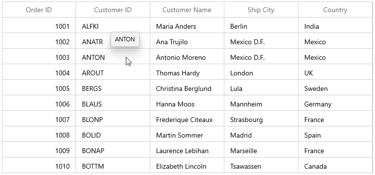
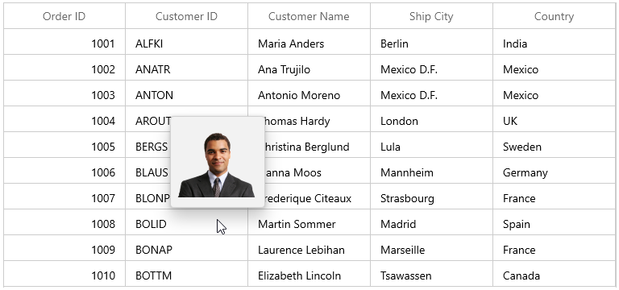
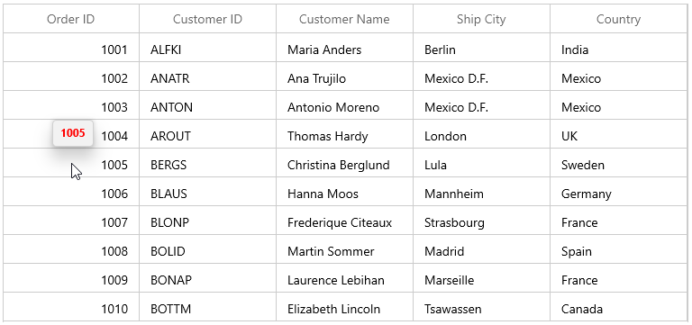
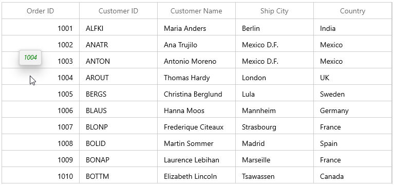

# ToolTip in WinUI DataGrid

ToolTip provides the support to show the pop-up window that displays the information when the mouse hovers in cells of SfDataGrid. 

## Record cell tooltip

You can enable the ToolTip for the [GridCell](https://help.syncfusion.com/cr/winui/Syncfusion.UI.Xaml.DataGrid.GridCell.html) by setting the [SfDataGrid.ShowToolTip](https://help.syncfusion.com/cr/winui/Syncfusion.UI.Xaml.Grids.SfGridBase.html#Syncfusion_UI_Xaml_Grids_SfGridBase_ShowToolTip) as `true`.



xmlns:dataGrid="using:Syncfusion.UI.Xaml.DataGrid"

<dataGrid:SfDataGrid x:Name="sfDataGrid" 
                       AutoGenerateColumns="True"
                       ShowToolTip="True"
                       ItemsSource="{Binding Orders}" >
</dataGrid:SfDataGrid>





this.sfDataGrid.ShowToolTip = true;




You can enable the ToolTip for the particular column by setting the [GridColumn.ShowToolTip](https://help.syncfusion.com/cr/winui/Syncfusion.UI.Xaml.Grids.GridColumnBase.html#Syncfusion_UI_Xaml_Grids_GridColumnBase_ShowToolTip) as `true`.




<dataGrid:SfDataGrid.Columns>
    <dataGrid:GridTextColumn HeaderText="Order ID" ShowToolTip="True" MappingName="OrderID" TextAlignment="Right" />
    <dataGrid:GridTextColumn HeaderText="Customer ID" ShowToolTip="True" MappingName="CustomerID" />
</dataGrid:SfDataGrid.Columns>





this.sfDataGrid.Columns["OrderID"].ShowToolTip = true;
this.sfDataGrid.Columns["CustomerID"].ShowToolTip = true;




N> `GridColumn.ShowToolTip` takes higher priority than `SfDataGrid.ShowToolTip`.

## Header tooltip

You can enable the ToolTip for the header cell by setting the [GridColumn.ShowHeaderToolTip](https://help.syncfusion.com/cr/winui/Syncfusion.UI.Xaml.Grids.GridColumnBase.html#Syncfusion_UI_Xaml_Grids_GridColumnBase_ShowHeaderToolTip) as `true`.




<dataGrid:SfDataGrid.Columns>
    <dataGrid:GridTextColumn HeaderText="Order ID" ShowHeaderToolTip="True" MappingName="OrderID" TextAlignment="Right" />
</dataGrid:SfDataGrid.Columns>





this.sfDataGrid.Columns["OrderID"].ShowHeaderToolTip = true;




## ToolTip Customization

You can customize the template of ToolTip by using the [GridColumn.ToolTipTemplate](https://help.syncfusion.com/cr/winui/Syncfusion.UI.Xaml.Grids.GridColumnBase.html#Syncfusion_UI_Xaml_Grids_GridColumnBase_ToolTipTemplate) and [GridColumn.ToolTipTemplateSelector](https://help.syncfusion.com/cr/winui/Syncfusion.UI.Xaml.Grids.GridColumnBase.html#Syncfusion_UI_Xaml_Grids_GridColumnBase_ToolTipTemplateSelector) properties. 

### Customize the ToolTip using ToolTipTemplate

You can customize the appearance of the ToolTip for particular column by setting `GridColumn.ToolTipTemplate`. And you can also customize the appearance of header ToolTip for particular column by [GridColumn.HeaderToolTipTemplate](https://help.syncfusion.com/cr/winui/Syncfusion.UI.Xaml.Grids.GridColumnBase.html#Syncfusion_UI_Xaml_Grids_GridColumnBase_HeaderToolTipTemplate) property.




<Page.Resources>
    <local:StringToImageConverter x:Key="imageConverter" />        
    <DataTemplate x:Key="templateToolTip">
        <Image Height="100" Width="100" Source="{Binding CustomerID,Converter={StaticResource imageConverter}}" />
    </DataTemplate>
</Page.Resources>

<dataGrid:SfDataGrid.Columns>
    <dataGrid:GridTextColumn HeaderText="Order ID"  ShowToolTip="True" MappingName="OrderID" />
    <dataGrid:GridTextColumn HeaderText="Customer ID" ToolTipTemplate="{StaticResource templateToolTip}" ShowToolTip="True" MappingName="CustomerID" />
</dataGrid:SfDataGrid.Columns>




public class StringToImageConverter : IValueConverter
{
    public object Convert(object value, Type targetType, object parameter, string language)
    {
        string imagename = value.ToString();
        return "Assets/" + imagename + @".png";
    }

    public object ConvertBack(object value, Type targetType, object parameter, string language)
    {
        return value;
    }
}



### Customize the ToolTip with ToolTipTemplateSelector

The different ToolTip template can be loaded in a same column conditionally based on data by setting `GridColumn.ToolTipTemplateSelector`




<Page.Resources>
    <DataTemplate x:Key="toolTip1">
        <Grid>
            <Rectangle Fill="Transparent"/>
            <TextBlock Text="{Binding OrderID}" FontWeight="Bold" Foreground="Red" />
        </Grid>
    </DataTemplate>
    <DataTemplate x:Key="toolTip2">
        <Grid>
            <Rectangle Fill="Transparent"/>
            <TextBlock Text="{Binding OrderID}" FontStyle="Italic" Foreground="Green" />
        </Grid>
    </DataTemplate>
</Page.Resources>

<dataGrid:SfDataGrid.Columns>
    <dataGrid:GridTextColumn HeaderText="Order ID" ShowToolTip="True" MappingName="OrderID" >
        <dataGrid:GridTextColumn.ToolTipTemplateSelector>
            <local:ToolTipTemplateSelector AlternateTemplate="{StaticResource toolTip2}"  DefaultTemplate="{StaticResource toolTip1}" />
        </dataGrid:GridTextColumn.ToolTipTemplateSelector>
    </dataGrid:GridTextColumn>
</dataGrid:SfDataGrid.Columns>







public class ToolTipTemplateSelector : DataTemplateSelector
{
    private DataTemplate _defaultTemplate;

    /// 

    /// Gets or sets DefaultTemplate.
    /// 

    public DataTemplate DefaultTemplate
    {
        get { return _defaultTemplate; }
        set { _defaultTemplate = value; }
    }

    private DataTemplate _alternateTemplate;

    /// 

    /// Gets or Sets AlternateTemplate.
    /// 

    public DataTemplate AlternateTemplate
    {
        get { return _alternateTemplate; }
        set { _alternateTemplate = value; }
    }

    protected override DataTemplate SelectTemplateCore(object item, DependencyObject container)
    {
        //The item that comes from ToolTipTemplate is DataContextHelper. When set SetCellBoundValue to true, it sets DataContextHelper as DataContext to DataTemplate. Refer property section of CellTemplate.
        OrderInfo orderInfo = item as OrderInfo;

        if (orderInfo == null) return this.DefaultTemplate;

        //use reflection to retrieve property
        Type type = orderInfo.GetType();
        PropertyInfo property = type.GetProperty("OrderID");

        //To see what template needs to be select according to the specified property value.
        if (property.GetValue(orderInfo, null).ToString().Contains('9') || property.GetValue(orderInfo, null).ToString().Contains('4'))
            return this.AlternateTemplate;
        else
            return this.DefaultTemplate;
    }
}




The below image refers the `DefaultTemplate` which is applied through `ToolTipTemplateSelector`.

The below image refers the `AlternateTemplate` which is applied through `ToolTipTemplateSelector`.

## Events

### CellToolTipOpening event

The [CellToolTipOpening](https://help.syncfusion.com/cr/winui/Syncfusion.UI.Xaml.DataGrid.SfDataGrid.html#Syncfusion_UI_Xaml_DataGrid_SfDataGrid_CellToolTipOpening) event occurs when any tooltip of the cell is opened. The `CellToolTipOpening` event receives the [GridCellToolTipOpeningEventArgs](https://help.syncfusion.com/cr/winui/Syncfusion.UI.Xaml.DataGrid.GridCellToolTipOpeningEventArgs.html) as argument which has the following properties:

<ul>
<li> <a href="https://help.syncfusion.com/cr/winui/Syncfusion.UI.Xaml.DataGrid.CellToolTipOpeningEventArgs.html#Syncfusion_UI_Xaml_DataGrid_CellToolTipOpeningEventArgs_Column">Column :</a> Gets the hovered cell column in the SfDataGrid.</li>
<li> <a href="https://help.syncfusion.com/cr/winui/Syncfusion.UI.Xaml.DataGrid.CellToolTipOpeningEventArgs.html#Syncfusion_UI_Xaml_DataGrid_CellToolTipOpeningEventArgs_Record">Record :</a> Gets the data context of hovered cell.</li>
<li> <a href="https://help.syncfusion.com/cr/winui/Syncfusion.UI.Xaml.DataGrid.CellToolTipOpeningEventArgs.html#Syncfusion_UI_Xaml_DataGrid_CellToolTipOpeningEventArgs_RowColumnIndex">RowColumnIndex :</a> Gets the row and column index of the hovered cell.</li>
<li> <a href="https://help.syncfusion.com/cr/winui/Syncfusion.UI.Xaml.DataGrid.CellToolTipOpeningEventArgs.html#Syncfusion_UI_Xaml_DataGrid_CellToolTipOpeningEventArgs_ToolTip">ToolTip :</a> Gets the tooltip of the hovered cells.</li>
</ul>



<dataGrid:SfDataGrid Name="sfDataGrid"  
                        CellToolTipOpening="SfDataGrid_CellToolTipOpening"
                        AutoGenerateColumns="True"
                        ItemsSource="{Binding Orders}" />


this.sfDataGrid.CellToolTipOpening += SfDataGrid_CellToolTipOpening;

private void SfDataGrid_CellToolTipOpening(object sender, GridCellToolTipOpeningEventArgs e)
{
    
}


