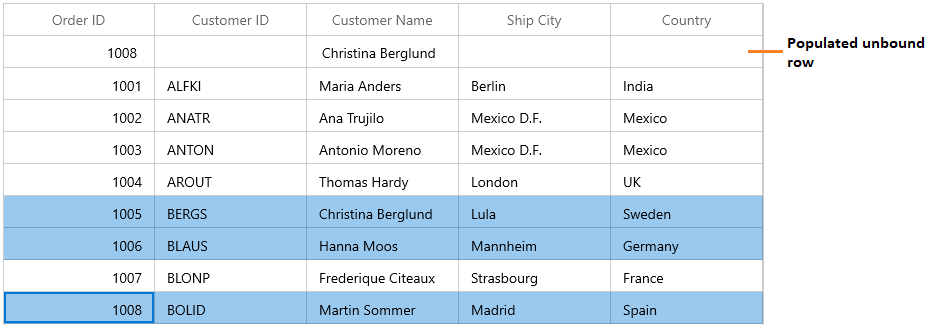
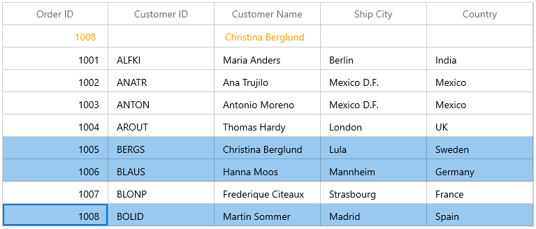
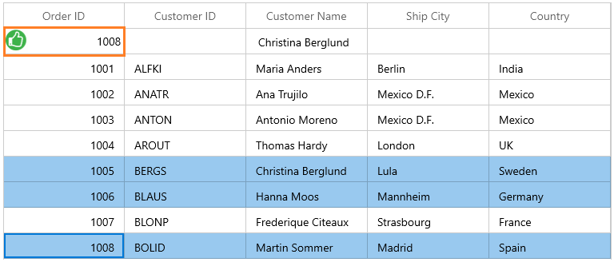
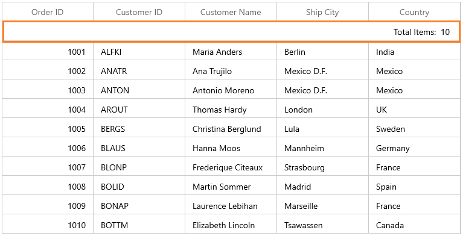

# Unbound Rows in WinUI DataGrid (SfDataGrid)

SfDataGrid allows you to add **additional rows** at top and also bottom of the SfDataGrid which are **not bound with data object** from underlying data source. You can add unbound rows using [SfDataGrid.UnboundRows](https://help.syncfusion.com/cr/winui/Syncfusion.UI.Xaml.DataGrid.SfDataGrid.html#Syncfusion_UI_Xaml_DataGrid_SfDataGrid_UnboundRows) collection property. You can add any no of unbound rows to SfDataGrid. Unbound rows can be printed.



xmlns:dataGrid="using:Syncfusion.UI.Xaml.DataGrid"

<dataGrid:SfDataGrid x:Name="sfDataGrid" AutoGenerateColumns="False" ItemsSource="{Binding Orders}">
    <dataGrid:SfDataGrid.UnboundRows>
        <dataGrid:GridUnboundRow  Position="Top"/>
    </dataGrid:SfDataGrid.UnboundRows>
</dataGrid:SfDataGrid>



this.sfDataGrid.UnboundRows.Add(new GridUnboundRow() {Position = UnboundRowsPosition.Top});



N> [AllowFrozenGroupHeaders](https://help.syncfusion.com/cr/winui/Syncfusion.UI.Xaml.DataGrid.SfDataGrid.html#Syncfusion_UI_Xaml_DataGrid_SfDataGrid_AllowFrozenGroupHeaders) is not supported with unbound rows.

## Positioning unbound rows

Unbound row can be placed in top or bottom of the SfDataGrid. Unbound row positioned based on [GridUnboundRow.Position](https://help.syncfusion.com/cr/winui/Syncfusion.UI.Xaml.DataGrid.GridUnboundRow.html#Syncfusion_UI_Xaml_DataGrid_GridUnboundRow_Position) and [GridUnboundRow.ShowBelowSummary](https://help.syncfusion.com/cr/winui/Syncfusion.UI.Xaml.DataGrid.GridUnboundRow.html#Syncfusion_UI_Xaml_DataGrid_GridUnboundRow_ShowBelowSummary) properties.

Below table shows the unbound row positioning based on property settings of `Position` and `ShowBelowSummary`.

<table>
<tr>
<th>
UnboundRowPosition
</th>
<th>
ShowBelowSummary
</th>
<th>
Position in DataGrid
</th>
</tr>
<tr>
<td>
Top
</td>
<td>
True
</td>
<td>
Unbound row placed at top, right above the record rows. In this position, unbound row is selectable and <b>editable</b>. 
</td>
</tr>
<tr>
<td>
Top
</td>
<td>
False
</td>
<td>
Unbound row placed at top, right next to Header row. In this position, unbound row is not selectable, <b>not editable</b> and <b>frozen</b> when scrolling.
</td>
</tr>
<tr>
<td>
Bottom
</td>
<td>
True
</td>
<td>
Unbound row placed at bottom of SfDataGrid. In this position, unbound row is not selectable, <b>not editable</b> and <b>frozen</b> when scrolling.
</td>
</tr>
<tr>
<td>
Bottom
</td>
<td>
False
</td>
<td>
Unbound row placed at bottom, right below record rows. In this position, unbound row is selectable and <b>editable</b>.
</td>
</tr>
</table>

Below screen shot shows different unbound rows placed in all possible positions.

## Populating data for unbound rows

You can populate data for the unbound row by handling [QueryUnboundRow](https://help.syncfusion.com/cr/winui/Syncfusion.UI.Xaml.DataGrid.SfDataGrid.html#Syncfusion_UI_Xaml_DataGrid_SfDataGrid_QueryUnboundRow) event of SfDataGrid. This event occurs for each cell in unbound row whenever the row gets refreshed. 
[GridUnboundRowEventsArgs](https://help.syncfusion.com/cr/winui/Syncfusion.UI.Xaml.DataGrid.GridUnboundRowEventsArgs.html) of the `QueryUnboundRow` event provides information about the cell triggered this event. [GridUnboundRowEventsArgs.OriginalSender](https://help.syncfusion.com/cr/winui/Syncfusion.UI.Xaml.Grids.GridEventArgs.html#Syncfusion_UI_Xaml_Grids_GridEventArgs_OriginalSender) returns the DataGrid fired this event for DetailsView. 

You can get or set the [GridUnboundRowEventsArgs.Value](https://help.syncfusion.com/cr/winui/Syncfusion.UI.Xaml.DataGrid.GridUnboundRowEventsArgs.html#Syncfusion_UI_Xaml_DataGrid_GridUnboundRowEventsArgs_Value) property based on the [UnboundAction](https://help.syncfusion.com/cr/winui/Syncfusion.UI.Xaml.DataGrid.GridUnboundRowEventsArgs.html#Syncfusion_UI_Xaml_DataGrid_GridUnboundRowEventsArgs_UnboundAction). If `UnboundAction` is [QueryData](https://help.syncfusion.com/cr/winui/Syncfusion.UI.Xaml.DataGrid.UnboundActions.html#Syncfusion_UI_Xaml_DataGrid_UnboundActions_QueryData) then you can set the value for display. If the `UnboundAction` is [CommitData](https://help.syncfusion.com/cr/winui/Syncfusion.UI.Xaml.DataGrid.UnboundActions.html#Syncfusion_UI_Xaml_DataGrid_UnboundActions_CommitData) then you can get the edited value.



<dataGrid:SfDataGrid x:Name="sfDataGrid" 
                       ItemsSource="{Binding Orders}"                            
                       SelectionMode="Multiple" >                        
    <dataGrid:SfDataGrid.UnboundRows>
        <dataGrid:GridUnboundRow  Position="Top" />
    </dataGrid:SfDataGrid.UnBoundRows>                        
</dataGrid:SfDataGrid>



For example, now unbound row populated based on selected items in SfDataGrid.



this.sfDataGrid.SelectedItems.Add(collection[4]);
this.sfDataGrid.SelectedItems.Add(collection[5]);
this.sfDataGrid.SelectedItems.Add(collection[7]);
this.sfDataGrid.QueryUnboundRow += SfDataGrid_QueryUnboundRow;

private void SfDataGrid_QueryUnboundRow(object sender, GridUnboundRowEventsArgs e)
{
    if (e.UnboundAction == UnboundActions.QueryData)
    {
        if (e.RowColumnIndex.ColumnIndex == 0)
        {
            e.Value = (sfDataGrid.SelectedItems.OrderBy(item => (item as OrderInfo).OrderID).Last() as OrderInfo).OrderID;
            e.Handled = true;
        }
        else if (e.RowColumnIndex.ColumnIndex == 2)
        {
            e.Value = (sfDataGrid.SelectedItems.First(item => (item as OrderInfo).CustomerName.Contains("g")) as OrderInfo).CustomerName;
            e.Handled = true;
        }
    }
}



## Refreshing the Unbound Rows at runtime

### Add/Remove unbound rows

You can add or remove unbound rows using [SfDataGrid.UnboundRows](https://help.syncfusion.com/cr/winui/Syncfusion.UI.Xaml.DataGrid.SfDataGrid.html#Syncfusion_UI_Xaml_DataGrid_SfDataGrid_UnboundRows) property which reflects in UI immediately.

## Editing in unbound rows

### Cancel the editing for unbound row cell

You can cancel the editing of unbound row cell by handling the [SfDataGrid.CurrentCellBeginEdit](https://help.syncfusion.com/cr/winui/Syncfusion.UI.Xaml.DataGrid.SfDataGrid.html#Syncfusion_UI_Xaml_DataGrid_SfDataGrid_CurrentCellBeginEdit) event with the help of [SfDataGrid.GetUnboundRow](https://help.syncfusion.com/cr/winui/Syncfusion.UI.Xaml.DataGrid.GridIndexResolver.html#Syncfusion_UI_Xaml_DataGrid_GridIndexResolver_GetUnboundRow_Syncfusion_UI_Xaml_DataGrid_SfDataGrid_System_Int32_) method and row index.



this.sfDataGrid.CurrentCellBeginEdit += SfDataGrid_CurrentCellBeginEdit;

private void SfDataGrid_CurrentCellBeginEdit(object sender, CurrentCellBeginEditEventArgs e)
{
    var unboundRow = sfDataGrid.GetUnboundRow(e.RowColumnIndex.RowIndex);

    if (unboundRow == null)
        return;
    e.Cancel = true;
}



### Saving edited unbound row cell value to external source

You can get the edited value of unbound row cell from [GridUnboundRowEventsArgs.Value](https://help.syncfusion.com/cr/winui/Syncfusion.UI.Xaml.DataGrid.GridUnboundRowEventsArgs.html#Syncfusion_UI_Xaml_DataGrid_GridUnboundRowEventsArgs_Value) property of [QueryUnboundRow](https://help.syncfusion.com/cr/winui/Syncfusion.UI.Xaml.DataGrid.SfDataGrid.html#Syncfusion_UI_Xaml_DataGrid_SfDataGrid_QueryUnboundRow) event when [UnboundAction](https://help.syncfusion.com/cr/winui/Syncfusion.UI.Xaml.DataGrid.GridUnboundRowEventsArgs.html#Syncfusion_UI_Xaml_DataGrid_GridUnboundRowEventsArgs_UnboundAction) is [CommitData](https://help.syncfusion.com/cr/winui/Syncfusion.UI.Xaml.DataGrid.UnboundActions.html#Syncfusion_UI_Xaml_DataGrid_UnboundActions_CommitData).



this.sfDataGrid.QueryUnboundRow += SfDataGrid_QueryUnboundRow;

private void SfDataGrid_QueryUnboundRow(object sender, GridUnboundRowEventsArgs e)
{            
    if (e.UnboundAction == UnboundActions.CommitData)
    {
        var editedValue = e.Value;
    }
}




## Customize the unbound row’s behavior

SfDataGrid allows you to customize the operations like key navigation and UI related interactions by overriding the corresponding renderer associated with the unbound row cell. Each renderer have set of virtual methods for handling the behaviors. Creating new renderers also supported.

Below table lists the available cell types for unbound row and its renderers.

<table>
<tr>
<th>
Cell Type
</th>
<th>
Renderer
</th>
</tr>
<tr>
<td>
UnboundTemplateColumn
</td>
<td>
{{'[GridUnboundRowCellTemplateRenderer](https://help.syncfusion.com/cr/winui/Syncfusion.UI.Xaml.DataGrid.Renderers.GridUnboundRowCellTemplateRenderer.html)'| markdownify }}
</td>
</tr>
<tr>
<td>
UnboundTextColumn
</td>
<td>
{{'[GridUnboundRowCellTextBoxRenderer](https://help.syncfusion.com/cr/winui/Syncfusion.UI.Xaml.DataGrid.Renderers.GridUnboundRowCellTextBoxRenderer.html)'| markdownify }}
</td>
</tr>
</table>

The renderer of unbound row cell defined by [GridUnboundRowEventsArgs.CellType](https://help.syncfusion.com/cr/winui/Syncfusion.UI.Xaml.DataGrid.GridUnboundRowEventsArgs.html#Syncfusion_UI_Xaml_DataGrid_GridUnboundRowEventsArgs_CellType) property in the [QueryUnboundRow](https://help.syncfusion.com/cr/winui/Syncfusion.UI.Xaml.DataGrid.SfDataGrid.html#Syncfusion_UI_Xaml_DataGrid_SfDataGrid_QueryUnboundRow) event. If the `GridUnboundRowEventsArgs.CellType` not defined then the `UnboundTextColumn` set as default cell type of [GridUnboundRowCell](https://help.syncfusion.com/cr/winui/Syncfusion.UI.Xaml.DataGrid.GridUnboundRowCell.html).
 
If [GridUnboundRowEventsArgs.CellTemplate](https://help.syncfusion.com/cr/winui/Syncfusion.UI.Xaml.DataGrid.GridUnboundRowEventsArgs.html#Syncfusion_UI_Xaml_DataGrid_GridUnboundRowEventsArgs_CellTemplate) and [GridUnboundRowEventsArgs.EditTemplate](https://help.syncfusion.com/cr/winui/Syncfusion.UI.Xaml.DataGrid.GridUnboundRowEventsArgs.html#Syncfusion_UI_Xaml_DataGrid_GridUnboundRowEventsArgs_EditTemplate) properties defined then `UnboundTemplateColumn` set as cell type of `GridUnboundRowCell`.

### Overriding existing cell type

You can customize the unbound row cell behavior by overriding existing renderer and replace the default one in [SfDataGrid.UnboundRowCellRenderers](https://help.syncfusion.com/cr/winui/Syncfusion.UI.Xaml.DataGrid.SfDataGrid.html#Syncfusion_UI_Xaml_DataGrid_SfDataGrid_UnboundRowCellRenderers).

Below `GridUnboundRowCellTextBoxRenderer` is customized to change the foreground.



public class GridUnboundRowCellTextBoxRendererExt : GridUnboundRowCellTextBoxRenderer
{

    public override void OnInitializeDisplayElement(DataColumnBase dataColumn, TextBlock uiElement, object dataContext)
    {
        base.OnInitializeDisplayElement(dataColumn, uiElement, dataContext);
        var cellValue = dataColumn.GridUnBoundRowEventsArgs != null && dataColumn.GridUnBoundRowEventsArgs.Value != null ?
            dataColumn.GridUnBoundRowEventsArgs.Value.ToString() :
            string.Empty;
        uiElement.Text = cellValue;
        uiElement.Foreground = new SolidColorBrush(Colors.Orange);
    }

    public override void OnInitializeEditElement(DataColumnBase dataColumn, TextBox uiElement, object dataContext)
    {
        base.OnInitializeEditElement(dataColumn, uiElement, dataContext);

        var cellValue = (dataColumn.GridUnBoundRowEventsArgs != null && dataColumn.GridUnBoundRowEventsArgs.Value != null) ?
                            dataColumn.GridUnBoundRowEventsArgs.Value.ToString() :
                            string.Empty;

        uiElement.Text = cellValue.ToString();
    }
}




In the below code default renderer replaced using the above custom renderer in `SfDataGrid.UnboundRowCellRenderers`.



this.sfDataGrid.UnboundRowCellRenderers.Remove("UnboundTextColumn");
this.sfDataGrid.UnboundRowCellRenderers.Add("UnboundTextColumn", new GridUnboundRowCellTextBoxRendererExt());



## Templating unbound row cells

You can customize the unbound row cells using [GridUnboundRowEventsArgs.CellTemplate](https://help.syncfusion.com/cr/winui/Syncfusion.UI.Xaml.DataGrid.GridUnboundRowEventsArgs.html#Syncfusion_UI_Xaml_DataGrid_GridUnboundRowEventsArgs_CellTemplate) property.



<DataTemplate x:Key="unboundRowCellTemplate">
    <Grid>
        <Grid.ColumnDefinitions>
            <ColumnDefinition Width="*"/>
            <ColumnDefinition Width="*"/>
        </Grid.ColumnDefinitions>
        <TextBlock Text="{Binding}" 
                   Grid.Column="1" Margin="0,0,3,0" 
                   TextWrapping="Wrap"  
                   VerticalAlignment="Center"  
                   HorizontalAlignment="Right" />
        <Image Source="\Images\thumb_yes.png" HorizontalAlignment="Left" />
    </Grid>
</DataTemplate>


 



this.sfDataGrid.QueryUnboundRow += SfDataGrid_QueryUnboundRow;

private void SfDataGrid_QueryUnboundRow(object sender, GridUnboundRowEventsArgs e)
{
    if (e.UnboundAction == UnboundActions.QueryData)
    {
        if (e.RowColumnIndex.ColumnIndex == 0)
        {
            e.CellType = "UnboundTemplateColumn";
            e.CellTemplate = App.Current.Resources["unboundRowCellTemplate"] as DataTemplate;
            e.Value = (sfDataGrid.SelectedItems.OrderBy(item => (item as OrderInfo).OrderID).Last() as OrderInfo).OrderID;
            e.Handled = true;
        }
        else if (e.RowColumnIndex.ColumnIndex == 2)
        {
            e.Value = (sfDataGrid.SelectedItems.First(item => (item as OrderInfo).CustomerName.Contains("g")) as OrderInfo).CustomerName;
            e.Handled = true;
        }
    } 
}




## Changing unbound row height

You can change the height of unbound row using [SfDataGrid.QueryRowHeight](https://help.syncfusion.com/cr/winui/Syncfusion.UI.Xaml.DataGrid.SfDataGrid.html#Syncfusion_UI_Xaml_DataGrid_SfDataGrid_QueryRowHeight) event.



using Syncfusion.UI.Xaml.DataGrid;
this.sfDataGrid.QueryRowHeight += SfDataGrid_QueryRowHeight;

private void SfDataGrid_QueryRowHeight(object sender, QueryRowHeightEventArgs e)
{
    if (sfDataGrid.IsUnboundRow(e.RowIndex))
    {
        e.Height = 40;
        e.Handled = true;
    }
}




## Get unbound rows

You can get the unbound row of specified row index using [GetUnboundRow](https://help.syncfusion.com/cr/winui/Syncfusion.UI.Xaml.DataGrid.GridIndexResolver.html#Syncfusion_UI_Xaml_DataGrid_GridIndexResolver_GetUnboundRow_Syncfusion_UI_Xaml_DataGrid_SfDataGrid_System_Int32_) method.



using Syncfusion.UI.Xaml.DataGrid;

var unboundRow = sfDataGrid.GetUnboundRow(1);




## Merging with unbound rows

You can merge the unbound row cell by setting the Left, Right, Top and Bottom properties of [CoveredCellInfo](https://help.syncfusion.com/cr/winui/Syncfusion.UI.Xaml.Grids.CoveredCellInfo.html) with the help of `GetUnboundRow` method and row index.



using Syncfusion.UI.Xaml.DataGrid;
this.sfDataGrid.QueryCoveredRange += SfDataGrid_QueryCoveredRange;

private void SfDataGrid_QueryCoveredRange(object sender, GridQueryCoveredRangeEventArgs e)
{
    var unboundRow = this.sfDataGrid.GetUnboundRow(e.RowColumnIndex.RowIndex);

    if (unboundRow == null)
        return;

    if (e.RowColumnIndex.ColumnIndex == 0)
    {
        e.Range = new CoveredCellInfo(e.RowColumnIndex.ColumnIndex, (e.OriginalSender as SfDataGrid).Columns.Count, e.RowColumnIndex.RowIndex, e.RowColumnIndex.RowIndex);
        e.Handled = true;
    }
}



 




this.sfDataGrid.QueryUnboundRow += SfDataGrid_QueryUnboundRow;

private void SfDataGrid_QueryUnboundRow(object sender, GridUnboundRowEventsArgs e)
{
    if (e.RowColumnIndex.ColumnIndex == 0)
    {
        e.Value = "Total Items:  " + (e.OriginalSender as SfDataGrid).View.Records.Count();
        e.Handled = true;
    }
}




## Unbound row for Master-details view

Master-details view also allows you to add additional rows to [ViewDefinition.DataGrid](https://help.syncfusion.com/cr/winui/Syncfusion.UI.Xaml.DataGrid.GridViewDefinition.html#Syncfusion_UI_Xaml_DataGrid_GridViewDefinition_DataGrid) which are **not bound with data object** from underlying data source. 

You can get the DetailsViewDataGrid using [GridUnboundRowEventsArgs.OriginalSender](https://help.syncfusion.com/cr/winui/Syncfusion.UI.Xaml.Grids.GridEventArgs.html#Syncfusion_UI_Xaml_Grids_GridEventArgs_OriginalSender) of the [QueryUnboundRow](https://help.syncfusion.com/cr/winui/Syncfusion.UI.Xaml.DataGrid.SfDataGrid.html#Syncfusion_UI_Xaml_DataGrid_SfDataGrid_QueryUnboundRow) event, which fired the event and rendered in UI.



<dataGrid:SfDataGrid x:Name="sfDataGrid"                                  
                       NavigationMode="Cell"
                       AutoGenerateColumns="True"                              
                       ItemsSource="{Binding Orders}">
    <dataGrid:SfDataGrid.DetailsViewDefinition>
        <dataGrid:GridViewDefinition RelationalColumn="OrderDetails">
            <dataGrid:GridViewDefinition.DataGrid>
                <dataGrid:SfDataGrid x:Name="firstDetailsViewGrid"                                             AutoGenerateColumns="True">
                    <dataGrid:SfDataGrid.UnboundRows>
                        <dataGrid:GridUnboundRow Position="Top" 
                                                 ShowBelowSummary="True" />
                    </dataGrid:SfDataGrid.UnboundRows>
                </dataGrid:SfDataGrid>
            </dataGrid:GridViewDefinition.DataGrid>
        </dataGrid:GridViewDefinition>
    </dataGrid:SfDataGrid.DetailsViewDefinition>
</dataGrid:SfDataGrid>





this.firstDetailsViewGrid.QueryUnboundRow += FirstDetailsViewGrid_QueryUnboundRow;

private void FirstDetailsViewGrid_QueryUnboundRow(object sender, GridUnboundRowEventsArgs e)
{
    if (e.UnboundAction == UnboundActions.QueryData)
    {
        if (e.RowColumnIndex.ColumnIndex == 0)
        {
            e.Value = "Total Items  ";
            e.Handled = true;
        }

        else if (e.RowColumnIndex.ColumnIndex == 1)
        {
            e.Value = (e.OriginalSender as SfDataGrid).View.Records.Count();
            e.Handled = true;
        }
    }
}




