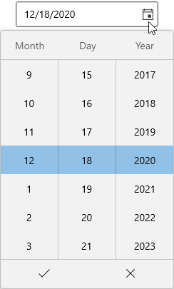
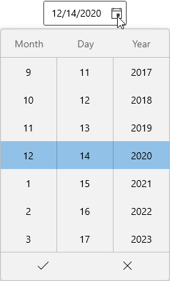
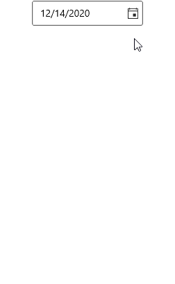

# Getting Started with WinUI DatePicker (SfDatePicker)

This section explains the steps required to add the [DatePicker]() control and its date selection options. This section covers only basic features needed to get started with Syncfusion `DatePicker` control.

## Structure of DatePicker control

## Creating an application with WinUI DatePicker

1. Create a simple project using the instructions given in the [Getting Started with your first WinUI app](https://docs.microsoft.com/en-us/windows/apps/winui/winui3/get-started-winui3-for-uwp) documentation.
2. Add reference to [Syncfusion.Editors.WinUI](https://www.nuget.org/packages/Syncfusion.Editors.WinUI) NuGet. 
3. Import the control namespace `Syncfusion.UI.Xaml.Editors` in XAML or C# code.
4. Initialize the `SfDatePicker` control.




<Page
    x:Class="GettingStarted.MainPage"
    xmlns="http://schemas.microsoft.com/winfx/2006/xaml/presentation"
    xmlns:x="http://schemas.microsoft.com/winfx/2006/xaml"
    xmlns:local="using:GettingStarted"
    xmlns:d="http://schemas.microsoft.com/expression/blend/2008"
    xmlns:mc="http://schemas.openxmlformats.org/markup-compatibility/2006"
    xmlns:editors="using:Syncfusion.UI.Xaml.Editors"
    mc:Ignorable="d"
    Background="{ThemeResource ApplicationPageBackgroundThemeBrush}">
    <Grid Name="grid">
        <!--Adding DatePicker control -->
        <editors:SfDatePicker Name="sfDatePicker"/>
    </Grid>
</Page>




using Syncfusion.UI.Xaml.Editors;

namespace GettingStarted
{
    /// 

    /// An empty page that can be used on its own or navigated to within a Frame.
    /// 

    public sealed partial class MainPage : Page
    {
        public MainPage()
        {
            this.InitializeComponent();
            // Creating an instance of the DatePicker control
            SfDatePicker sfDatePicker = new SfDatePicker();

            grid.Children.Add(sfDatePicker);
        }
    }
}




N> Download demo application from [GitHub]()

## Select the date programmatically

You can set or change the selected date programmatically by using [SelectedDate]() property. If you not assign any value for the `SelectedDate` property, `DatePicker` will automatically assign the current system date as `SelectedDate`.




<editors:SfDatePicker Name="sfDatePicker" />




SfDatePicker sfDatePicker= new SfDatePicker();
sfDatePicker.SelectedDate = new DateTimeOffset(new DateTime(2021, 10, 29));




N> Download demo application from [GitHub]()

## Select date interactively

You can change the selected date interactively by enter the date value using keyboard or select from drop down date spinner. You can get the selected date from the `SelectedDate` property.




<editors:SfDatePicker Name="sfDatePicker" />




SfDatePicker sfDatePicker= new SfDatePicker();




N> Download demo application from [GitHub]()

## Setting null value

If you want to set null value for the `DatePicker`, set the [AllowNullValue]() property as `true` and [SelectedDate]() property as `null`. If `AllowNullValue` property is `false`, then the current system date is updated in `SelectedDate` property and displayed instead of `null`.




<editors:SfDatePicker SelectedDate="{x:Null}"
                         AllowNullValue="True"
                         Name="sfDatePicker" />




SfDatePicker sfDatePicker= new SfDatePicker();
sfDatePicker.SelectedDate = null;
sfDatePicker.AllowNullValue = true;




N> Download demo application from [GitHub]()

## Setting WaterMark text

You can prompt the user with some information by using the [PlaceHolderText]() property. This will dispaly only on when the `TimePicker` contains the `SelectedDate` property as `null` and `AllowNullValue` property as `true`. If `AllowNullValue` property is `false`, then the current system time is updated in `SelectedDate` property and displayed instead of `PlaceHolderText`.




<editors:SfDatePicker PlaceHolderText="Select the Date"
                         SelectedDate="{x:Null}"
                         AllowNullValue="True"
                         Name="sfDatePicker" />




SfDatePicker sfDatePicker= new SfDatePicker();
sfDatePicker.PlaceHolderText = "Select the Date";
sfDatePicker.SelectedDate = null;
sfDatePicker.AllowNullValue = true;




N> Download demo application from [GitHub]()

## Date changed notification

You will be notified when selected date changed in `SfDatePicker` by using [DateChanged]() event. The `DateChanged` event contains the old and newly selected date in the [OldDateTime](), [NewDateTime]() properties.

* OldDateTime - Gets a date which is previously selected.
* NewDateTime - Gets a date which is currently selected.




<editors:SfDatePicker DateChanged="SfDatePicker_DateChanged" 
                         Name="sfDatePicker"/>




SfDatePicker sfDatePicker = new SfDatePicker();
sfDatePicker.DateChanged += SfDatePicker_DateChanged;




You can handle the event as follows:




private void SfDatePicker_DateChanged(DependencyObject d, DependencyPropertyChangedEventArgs e) {          
    Console.WriteLine("The previously selected Date: " + e.OldDateTime.ToString());
    Console.WriteLine("The newly selected Date: " + e.NewDateTime.ToString());            
}




## Change date display format

 You can edit and display the selected date with various formatting like date, month and year formats by using the [FormatString]() property. The default value of `FormatString` property is `d`.




<editors:SfDatePicker x:Name="sfDatePicker" 
                         FormatString="M"/>




SfDatePicker sfDatePicker = new SfDatePicker();
sfDatePicker.FormatString= "M";




N> Download demo application from [GitHub]()

## Change date format for Spinner

You can allow the user to select the pair of date, month and year spinner or any single spinner cell from the drop down date spinner by using the [DropdownFormatString]() property. The default value of `DropdownFormatString` property is `d`.




<editors:SfDatePicker x:Name="sfDatePicker" 
                         DropdownFormatString="dd/MM"/>




SfDatePicker sfDatePicker = new SfDatePicker();
sfDatePicker.DropdownFormatString = "dd/MM";




Here, you can only able to select the date and month value from the drop down spinner.

N> Download demo application from [GitHub]()

## Restrict date selection

You can restrict the users from selecting a date within the particular range by specifying [MinDate]() and [MaxDate]() properties in `DatePicker` control. The default value of `MinDate` property is `1/1/0001` and `MaxDate` property is `12/31/9999`.




<editors:SfDatePicker x:Name="sfDatePicker" />




SfDatePicker sfDatePicker = new SfDatePicker();
sfDatePicker.MaxDate = new DateTimeOffset(new DateTime(2020,12,17));
sfDatePicker.MinDate = new DateTimeOffset(new DateTime(2020,12,20));




## Disable/block all weekends

If you want to block all weekend dates from the date selection, handle the [DateFieldItemPrepared]() event and use the [DateTimeFieldItemPreparedEventArgs.ItemInfo.IsBlackout]() property value as `true`.




<editors:SfDatePicker x:Name="sfDatePicker" 
                      DateFieldItemPrepared = "SfDatePicker_DateFieldItemPrepared"/>




sfDatePicker.DateFieldItemPrepared += SfDatePicker_DateFieldItemPrepared;




You can handle the event as follows,




private void SfDatePicker_DateFieldItemPrepared(object sender, DateTimeFieldItemPreparedEventArgs e)
{
    //Restrict the weekend days
    if (e.ItemInfo.DateTime.Value.DayOfWeek == DayOfWeek.Saturday ||
            e.ItemInfo.DateTime.Value.DayOfWeek == DayOfWeek.Sunday)
    {
        e.ItemInfo.IsBlackout = true;
    }
}




## Hide submit button(Select date directly from date spinner)

If you want to hide the submit button and select the date directly from the drop down date spinner without clicking the `Ok` button, use the [ShowSubmitButtons]() property value as `false`. The default value of `ShowSubmitButtons` property is `true`.




<editors:SfDatePicker ShowSubmitButtons="False" 
	                  x:Name="sfDatePicker"/>




SfDatePicker sfDatePicker = new SfDatePicker();
sfDatePicker.ShowSubmitButtons = false;




## Edit date using free form editing

If you want to perform the validation after the user completely entering their date inputs, use the [EditMode]() property value as `Normal`. Then the entered date value is validated with the `FormatString` property value by pressing the `Enter` key or lost focus. If entered value is not suit with `FormatString` property, the selected date will be set as default format value.

By default, the user entering each input numbers are automatically validated with the `FormatString` formats and assigned the proper value for it, then it will move to next input part of the time format.




<editors:SfDatePicker EditMode="Normal"
                      x:Name="sfDatePicker" />




SfDatePicker sfDatePicker = new SfDatePicker();
sfDatePicker.EditMode = DateTimeEditingMode.Normal;




