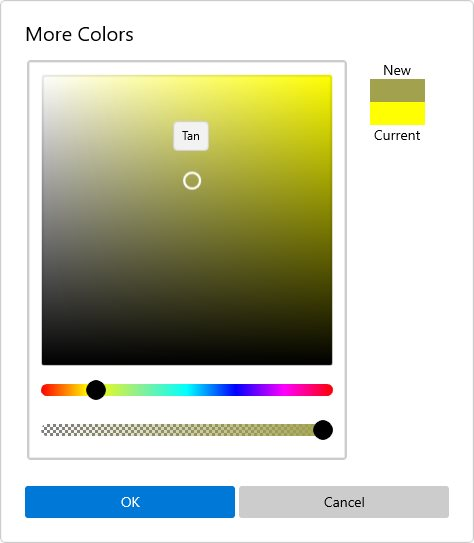
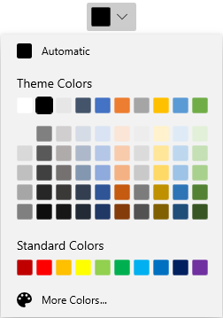
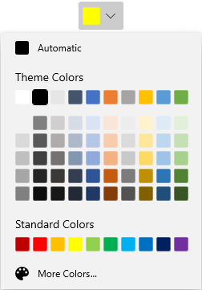

# Getting Started with WinUI DropDown Color Palette

This section explains the steps required to add the [WinUI DropDown Color Palette](https://www.syncfusion.com/winui-controls/dropdown-color-palette) control and its color options such as theme, standard and more custom colors.

## Control Structure

* The Selected Color represents the color that you select.
* The Automatic Color represents the color, which can be set by you as default color.
* The ToolTip with Color Details represents the toolTip, when the mouse hovers on the Color.
* The Standard Colors stores the standard colors like `Red`, `Green`, `Blue` and so on.
* The Recently User Colors stores the colors that are recently selected.
* The More Colors Option provides wide range of color in addition to colors in the palette.
* The Theme Variant Colors represents the Theme colors with variants.

### More Color Dialog

## Creating an application with WinUI DropDown Color Palette

In this walkthrough, you will create a WinUI application that contains the `DropDown Color Palette` control.

## Adding control manually in XAML

To add `DropDown Color Palette` control manually in XAML , follow the below steps.

1. Create a [WinUI 3 desktop app for C# and .NET 5](https://docs.microsoft.com/en-us/windows/apps/winui/winui3/get-started-winui3-for-desktop) or [WinUI 3 app in UWP for C#](https://docs.microsoft.com/en-us/windows/apps/winui/winui3/get-started-winui3-for-uwp).
2. Download and refer the following NuGet in the project.
    * [Syncfusion.Editors.WinUI](https://www.nuget.org/packages/Syncfusion.Editors.WinUI)
3. Import the control namespace `Syncfusion.UI.Xaml.Editors` in XAML or C# code.
4. Initialize the `SfDropDownColorPalette` control.




<Page
    x:Class="GettingStarted.MainPage"
    xmlns="http://schemas.microsoft.com/winfx/2006/xaml/presentation"
    xmlns:x="http://schemas.microsoft.com/winfx/2006/xaml"
    xmlns:local="using:GettingStarted"
    xmlns:d="http://schemas.microsoft.com/expression/blend/2008"
    xmlns:mc="http://schemas.openxmlformats.org/markup-compatibility/2006"
    xmlns:editors="using:Syncfusion.UI.Xaml.Editors"
    mc:Ignorable="d"
    Background="{ThemeResource ApplicationPageBackgroundThemeBrush}">
    <Grid x:Name="grid">
    <editors:SfDropDownColorPalette x:Name="sfDropDownColorPalette" />
    </Grid>
</Page>




## Adding control manually in C#

To add the `DropDown Color Palette` control manually in C#, follow the below steps.

1. Create a [WinUI 3 desktop app for C# and .NET 5](https://docs.microsoft.com/en-us/windows/apps/winui/winui3/get-started-winui3-for-desktop) or [WinUI 3 app in UWP for C#](https://docs.microsoft.com/en-us/windows/apps/winui/winui3/get-started-winui3-for-uwp).
2. Download and refer the following NuGet in the project.
    * [Syncfusion.Editors.WinUI](https://www.nuget.org/packages/Syncfusion.Editors.WinUI)
3. Import the `DropDown Color Palette` namespace `Syncfusion.UI.Xaml.Editors` in C# page.
4. Initialize the `SfDropDownColorPalette` control.




using Syncfusion.UI.Xaml.Editors;

namespace GettingStarted
{
    /// 

    /// An empty page that can be used on its own or navigated to within a Frame.
    /// 

    public sealed partial class MainPage : Page
    {
        public MainPage()
        {
            this.InitializeComponent();
            SfDropDownColorPalette sfDropDownColorPalette = new SfDropDownColorPalette();
            grid.Children.Add(sfDropDownColorPalette);
        }
    }
}



N> Download demo application from [GitHub](https://github.com/SyncfusionExamples/syncfusion-winui-colorpalette-examples/blob/master/Samples/DropDown_ColorPalette)

## Accessing a Color programmatically

You can set or change the selected color of the `DropDown Color Palette` programmatically by setting the value to [SelectedBrush](https://help.syncfusion.com/cr/winUI/Syncfusion.UI.Xaml.Editors.SfDropDownColorPalette.html#Syncfusion_UI_Xaml_Editors_SfDropDownColorPalette_SelectedBrush) property. You can also get the selected color by using the `SelectedBrush` property. The default value of `SelectedBrush` property is `Black`.




<editors:SfDropDownColorPalette SelectedBrush="Yellow"
                                Name="sfDropDownColorPalette" />




colorPalette.SelectedBrush = new SolidColorBrush(Colors.Yellow);




Here, `Yellow` color is selected color in the `DropDown Color Palette`.

N> Download demo application from [GitHub](https://github.com/SyncfusionExamples/syncfusion-winui-colorpalette-examples/blob/master/Samples/DropDown_ColorPalette)

## Select Color from Dropdown Color Palette

You can select a different colors from `Theme Colors` and `Standard Colors` panels.




<editors:SfDropDownColorPalette Name="sfDropDownColorPalette"/>




SfDropDownColorPalette sfDropDownColorPalette =  new SfDropDownColorPalette();




N> Download demo application from [GitHub](https://github.com/SyncfusionExamples/syncfusion-winui-colorpalette-examples/blob/master/Samples/DropDown_ColorPalette)

## Select Automatic Color

By default automatic color brush is selected color brush. If you changed the selected color brush, then you can easily make the automatic color brush as selected color brush by clicking the automatic color panel. The automatic color brush value is `Black`.




<editors:SfDropDownColorPalette Name="sfDropDownColorPalette"/>




SfDropDownColorPalette sfDropDownColorPalette =  new SfDropDownColorPalette();




N> Download demo application from [GitHub](https://github.com/SyncfusionExamples/syncfusion-winui-colorpalette-examples/blob/master/Samples/DropDown_ColorPalette)

## Choosing a Color from MoreColor dialog

If you want to choose a color that is not available in theme and standard palette, click the more color button and select the color from color spectrum and click the `Ok` button. 




<editors:SfDropDownColorPalette Name="sfDropDownColorPalette"/>




SfDropDownColorPalette sfDropDownColorPalette = new SfDropDownColorPalette();




N> Download demo application from [GitHub](https://github.com/SyncfusionExamples/syncfusion-winui-colorpalette-examples/blob/master/Samples/DropDown_ColorPalette)

## Recently used Colors

 If you want to choose a color brush which are recently selected from the `More Colors` dialog, use the `Recent Colors` panel. 

N> Colors selected from theme and standard colors will not be added in recent colors.




<editors:SfDropDownColorPalette Name="sfDropDownColorPalette"/>




SfDropDownColorPalette sfDropDownColorPalette = new SfDropDownColorPalette();




## Selected brush changed notification

You will be notified when selected color brush changed in `DropDown Color Palette` by using [SelectedBrushChanged](https://help.syncfusion.com/cr/winUI/Syncfusion.UI.Xaml.Editors.SfDropDownColorPalette.html#Syncfusion_UI_Xaml_Editors_SfDropDownColorPalette_SelectedBrushChanged) event. The `SelectedBrushChanged` event contains the old and newly selected color values in the [OldBrush](https://help.syncfusion.com/cr/winUI/Syncfusion.UI.Xaml.Editors.SelectedBrushChangedEventArgs.html#Syncfusion_UI_Xaml_Editors_SelectedBrushChangedEventArgs_OldBrush), [NewBrush](https://help.syncfusion.com/cr/winUI/Syncfusion.UI.Xaml.Editors.SelectedBrushChangedEventArgs.html#Syncfusion_UI_Xaml_Editors_SelectedBrushChangedEventArgs_NewBrush) properties.




<editors:SfDropDownColorPalette SelectedBrushChanged="sfDropDownColorPalette_SelectedBrushChanged"
                                Name="sfDropDownColorPalette" />




sfDropDownColorPalette.SelectedBrushChanged += sfDropDownColorPalette_SelectedBrushChanged;




You can handle the events as follows,




//Invoked when the selected color is changed
private void sfDropDownColorPalette_SelectedBrushChanged(object sender, SelectedBrushChangedEventArgs e) {
    var oldBrush= e.OldBrush;
    var newBrush= e.NewBrush;
}



