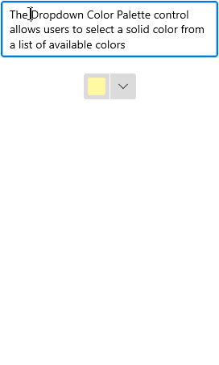
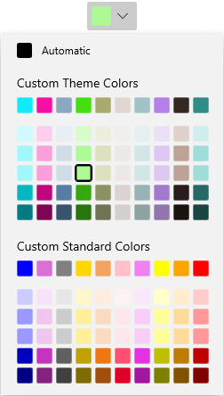
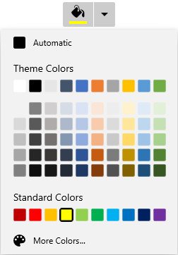
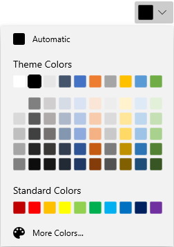

# Getting Started with WinUI DropDown ColorPalette

This section explains the steps required to add the [DropDownColorPalette](https://help.syncfusion.com/cr/winUI/Syncfusion.UI.Xaml.Editors.DropDownColorPalette.html) control and its color options such as theme, standard and more custom colors. This section covers only basic features needed to get started with Syncfusion `DropDownColorPalette` control.

## Control Structure

* The Selected Color represents the color that you select.

* The Automatic Color represents the color, which can be set by you as default color.

* The ToolTip with Color Details represents the toolTip, when the mouse hovers on the Color.

* The Standard Colors stores the standard colors like `Red`, `Green`, `Blue` and so on.

* The Recently User Colors stores the colors that are recently selected.

* The More Colors Option provides wide range of color in addition to colors in the palette.

* The Theme Variant Colors represents the Theme colors with variants.

### More Color Dialog

## Creating an application with WinUI DropDown ColorPalette

1. Create a simple project using the instructions given in the [Getting Started with your first WinUI app](https://docs.microsoft.com/en-us/windows/apps/winui/winui3/get-started-winui3-for-uwp) documentation.

2. Add reference to [Syncfusion.Editors.WinUI](https://www.nuget.org/packages/Syncfusion.Editors.WinUI) NuGet. 

3. Import the control namespace `Syncfusion.UI.Xaml.Editors` in XAML or C# code.

4. Initialize the `SfDropDownColorPalette` control.




<Page
    x:Class="GettingStarted.MainPage"
    xmlns="http://schemas.microsoft.com/winfx/2006/xaml/presentation"
    xmlns:x="http://schemas.microsoft.com/winfx/2006/xaml"
    xmlns:local="using:GettingStarted"
    xmlns:d="http://schemas.microsoft.com/expression/blend/2008"
    xmlns:mc="http://schemas.openxmlformats.org/markup-compatibility/2006"
    xmlns:syncfusion="using:Syncfusion.UI.Xaml.Editors"
    mc:Ignorable="d"
    Background="{ThemeResource ApplicationPageBackgroundThemeBrush}">
    <Grid x:Name="grid">
    <syncfusion:SfDropDownColorPalette x:Name="sfDropDownColorPalette" />
    </Grid>
</Page>




using Syncfusion.UI.Xaml.Editors;

namespace GettingStarted
{
    /// 

    /// An empty page that can be used on its own or navigated to within a Frame.
    /// 

    public sealed partial class MainPage : Page
    {
        public MainPage()
        {
            this.InitializeComponent();
            SfDropDownColorPalette sfDropDownColorPalette = new SfDropDownColorPalette();
            grid.Children.Add(sfDropDownColorPalette);
        }
    }
}



N> Download demo application from [GitHub](https://github.com/SyncfusionExamples/syncfusion-winui-colorpalette-examples/blob/master/Samples/DropDown_ColorPalette)

## Accessing a Color programmatically

You can set or change the selected color of the `DropDownColorPalette` programmatically by setting the value to [SelectedBrush](https://help.syncfusion.com/cr/winUI/Syncfusion.UI.Xaml.Editors.SfDropDownColorPalette.html#Syncfusion_UI_Xaml_Editors_SfDropDownColorPalette_SelectedBrush) property. You can also get the selected color by using the `SelectedBrush` property. The default value of `SelectedBrush` property is `Black`.




<syncfusion:SfDropDownColorPalette SelectedBrush="Yellow"
                                   Name="sfDropDownColorPalette" />




colorPalette.SelectedBrush = new SolidColorBrush(Colors.Yellow);




Here, `Yellow` color is selected color in the `DropDownColorPalette`.

N> Download demo application from [GitHub](https://github.com/SyncfusionExamples/syncfusion-winui-colorpalette-examples/blob/master/Samples/DropDown_ColorPalette)

## Select Color from dropdown Color Palette

You can select a different colors from `Theme Colors` and `Standard Colors` panels.




<syncfusion:SfDropDownColorPalette Name="sfDropDownColorPalette"/>




SfDropDownColorPalette sfDropDownColorPalette =  new SfDropDownColorPalette();




N> Download demo application from [GitHub](https://github.com/SyncfusionExamples/syncfusion-winui-colorpalette-examples/blob/master/Samples/DropDown_ColorPalette)

## Select Automatic Color

By default automatic color brush is selected color brush. If you changed the selected color brush, then you can easily make the automatic color brush as selected color brush by clicking the automatic color panel. The automatic color brush value is `Black`.




<syncfusion:SfDropDownColorPalette Name="sfDropDownColorPalette"/>




SfDropDownColorPalette sfDropDownColorPalette =  new SfDropDownColorPalette();




N> Download demo application from [GitHub](https://github.com/SyncfusionExamples/syncfusion-winui-colorpalette-examples/blob/master/Samples/DropDown_ColorPalette)

## Choosing a Color from MoreColor dialog

If you want to choose a color that is not available in theme and standard palette, click the more color button and select the color from color spectrum and click the `Ok` button. 




<syncfusion:SfDropDownColorPalette Name="sfDropDownColorPalette"/>




SfDropDownColorPalette sfDropDownColorPalette = new SfDropDownColorPalette();




N> Download demo application from [GitHub](https://github.com/SyncfusionExamples/syncfusion-winui-colorpalette-examples/blob/master/Samples/DropDown_ColorPalette)

## Recently used Color items

 If you want to choose a color brush which are recently selected from the `More Colors` dialog, use the `Recent Colors` panel. 

N> Colors selected from theme and standard colors will not be added in recent colors.




<syncfusion:SfDropDownColorPalette Name="sfDropDownColorPalette"/>




SfDropDownColorPalette sfDropDownColorPalette = new SfDropDownColorPalette();




## Color Palette as a command button

By default, `DropDownColorPalette` acts like a dropdown. It opening a color palette when clicking anywhere on the header. By setting the [DropDownMode](https://help.syncfusion.com/cr/winUI/Syncfusion.UI.Xaml.Editors.SfDropDownBase.html#Syncfusion_UI_Xaml_Editors_SfDropDownBase_DropDownMode) property value as `Split`, it acts like a button and dropdown as explained below.

1. When clicking on the dropdown arrow button, It acts like a dropdown.

2. When you click on the header area, it acts like a button and [Command](https://help.syncfusion.com/cr/winUI/Syncfusion.UI.Xaml.Editors.SfDropDownColorPalette.html#Syncfusion_UI_Xaml_Editors_SfDropDownColorPalette_Command) will be triggered. Using the `Command`, you can do some action like applying the selected color anywhere you want.

For example, if you want to apply a last selected color as a background to a TextEditor’s selected text. You can direct click the button instead of opening the dropdown and selecting an already selected color again.




public sealed partial class MainPage : Page
{
    private ICommand selectionChangedCommand;
    public ICommand SelectionChangedCommand {
        get {
            return selectionChangedCommand;
        }
    }
    public void SelectionChangedMethod(object param) {
        richTextBox.Document.Selection.CharacterFormat.BackgroundColor
            = (sfDropDownColorPalette.SelectedBrush as SolidColorBrush).Color;

    }
    public MainPage() {
        this.InitializeComponent();
        selectionChangedCommand = new DelegateCommand<object>(SelectionChangedMethod);
    }
}







<StackPanel Orientation="Vertical">

    <RichEditBox  Name="richTextBox" Margin="20"/>
   
    <syncfusion:SfDropDownColorPalette DropDownMode="Split"
                                       Command="{x:Bind SelectionChangedCommand}"
                                       Name="sfDropDownColorPalette" />
</StackPanel>




N> Download demo application from [GitHub](https://github.com/SyncfusionExamples/syncfusion-winui-colorpalette-examples/blob/master/Samples/DropDownColorPalette_as_command)

## Customize the ColorPalette

You can customize the color palette by replacing the default [ColorPalette](https://help.syncfusion.com/cr/winUI/Syncfusion.UI.Xaml.Editors.SfColorPalette.html) with your own instance using [DropDownContentTemplate](https://help.syncfusion.com/cr/winUI/Syncfusion.UI.Xaml.Editors.SfDropDownBase.html#Syncfusion_UI_Xaml_Editors_SfDropDownBase_DropDownContentTemplate) property.

N> The `DataContext` of `DropDownContentTemplate` property is [SfDropDownColorPalette.DropDownContent](https://help.syncfusion.com/cr/winUI/Syncfusion.UI.Xaml.Editors.SfDropDownBase.html#Syncfusion_UI_Xaml_Editors_SfDropDownBase_DropDownContent).

N> You can refer the [ColorPalette](https://help.syncfusion.com/winui/color-palette/overview) documentation page to know more about all customization available in the `ColorPalette` control.




<syncfusion:SfDropDownColorPalette Name="sfDropDownColorPalette">
    <syncfusion:SfDropDownColorPalette.DropDownContentTemplate>
        <DataTemplate>
            <syncfusion:SfColorPalette ShowMoreColorsButton="False"  Width="250" >
                <syncfusion:SfColorPalette.PaletteColors>
                    <syncfusion:ColorPaletteModel ShowColors="True" 
                              ShowColorShades="True"
                              Header="Custom Theme Colors" >
                        <syncfusion:ColorPaletteModel.Colors>
                            <syncfusion:ColorCollection>
                                <syncfusion:ColorModel Color="#FF11EBF8" Tooltip="Custom Aqua" />
                                <syncfusion:ColorModel Color="#FFF80FA6" Tooltip="Custom Deep Pink" />
                                <syncfusion:ColorModel Color="#FF8BA7C2" Tooltip="Custom Dark Gray" />
                                <syncfusion:ColorModel Color="#F53CDF07" Tooltip="Custom Lime Green" />
                                <syncfusion:ColorModel Color="#C2929545" Tooltip="Custom Olive Drab" />
                                <syncfusion:ColorModel Color="#2E956145" Tooltip="Custom Sienna" />
                                <syncfusion:ColorModel Color="#78458E95" Tooltip="Custom Steel Blue" />
                                <syncfusion:ColorModel Color="#8B8220E4" Tooltip="Custom Blue Violet" />
                                <syncfusion:ColorModel Color="#FF352722" Tooltip="Custom Dark Slate Gray" />
                                <syncfusion:ColorModel Color="#FF318B86" Tooltip="Custom Sea Green" />
                            </syncfusion:ColorCollection>
                        </syncfusion:ColorPaletteModel.Colors>
                    </syncfusion:ColorPaletteModel>
                </syncfusion:SfColorPalette.PaletteColors>

                <syncfusion:SfColorPalette.StandardColors>
                    <syncfusion:StandardPaletteModel ShowColors="True" 
                                 ShowColorShades="True"
                                 Header="Custom Standard Colors" >
                        <syncfusion:StandardPaletteModel.Colors>
                            <syncfusion:ColorCollection>
                                <syncfusion:ColorModel Color = "Blue" Tooltip = "Custom Blue" />
                                <syncfusion:ColorModel Color = "Orchid" Tooltip = "Custom Orchid" />
                                <syncfusion:ColorModel Color = "Gray" Tooltip = "Custom Gray" />
                                <syncfusion:ColorModel Color = "Gold" Tooltip = "Custom Gold" />
                                <syncfusion:ColorModel Color = "SandyBrown" Tooltip = "Custom SandyBrown" />
                                <syncfusion:ColorModel Color = "Pink" Tooltip = "Custom Pink" />
                                <syncfusion:ColorModel Color = "Violet" Tooltip = "Custom Violet" />
                                <syncfusion:ColorModel Color = "Yellow" Tooltip = "Custom Yellow" />
                                <syncfusion:ColorModel Color = "Orange" Tooltip = "Custom Orange" />
                                <syncfusion:ColorModel Color = "Red" Tooltip = "Custom Red" />
                            </syncfusion:ColorCollection>
                        </syncfusion:StandardPaletteModel.Colors>
                    </syncfusion:StandardPaletteModel>
                </syncfusion:SfColorPalette.StandardColors>
            </syncfusion:SfColorPalette>
        </DataTemplate>
    </syncfusion:SfDropDownColorPalette.DropDownContentTemplate>
</syncfusion:SfDropDownColorPalette>




N> Download demo application from [GitHub](https://github.com/SyncfusionExamples/syncfusion-winui-colorpalette-examples/blob/master/Samples/DropDownColorPalette_as_command)

## Custom UI of Dropdown Header

You can customize the appearance of the `DropDownColorPalette` header in both split mode and dropdown mode. You can customize the selected color button using [ContentTemplate](https://help.syncfusion.com/cr/winUI/Syncfusion.UI.Xaml.Editors.SfDropDownBase.html#Syncfusion_UI_Xaml_Editors_SfDropDownBase_ContentTemplate) property and customize the dropdown button by using the [DropDownButtonTemplate](https://help.syncfusion.com/cr/winUI/Syncfusion.UI.Xaml.Editors.SfDropDownBase.html#Syncfusion_UI_Xaml_Editors_SfDropDownBase_DropDownButtonTemplate) property.

N> The `DataContext` of `DropDownButtonTemplate` property and `ContentTemplate` property is `SfDropDownColorPalette`.

N> The `DropDownButtonTemplate` is effective only on when drop down mode is split mode.




<syncfusion:SfDropDownColorPalette DropDownMode="Split"                   
                                   Name="sfDropDownColorPalette">
    
    <!--Custom UI for DropDown button-->
    <syncfusion:SfDropDownColorPalette.DropDownButtonTemplate>
        <DataTemplate>
            <Grid>
                <StackPanel Width="30">
                    <Grid VerticalAlignment="Center"
                          HorizontalAlignment="Center">
                        <Path Fill="Black" 
                              Data="M 0 0 L 5 5 L 10 0 Z"/>
                    </Grid>
                </StackPanel>
            </Grid>
        </DataTemplate>
    </syncfusion:SfDropDownColorPalette.DropDownButtonTemplate>

    <!--Custom UI for Selected color button-->
    <syncfusion:SfDropDownColorPalette.ContentTemplate>
        <DataTemplate>
            <StackPanel Height="30" 
                        Orientation="Vertical">
                <Path Data="M22.078048,10.524087C22.078048,10.524087,31.99999,12.1271,31.99999,19.644161L31.99999,27.061223C31.99999,33.475275 25.987026,29.266241 25.987026,25.55721 25.987026,20.64617 30.397001,18.842155 28.392012,16.838139z M12.757101,0C17.367075,0,20.073059,6.5150537,20.174059,11.325093L20.174059,11.626096 20.374058,11.826097C22.178047,13.631112 24.483034,15.936131 25.28503,16.737138 26.588022,18.040148 25.686028,19.544161 25.18503,20.045165 24.583034,20.64617 14.160093,31.070255 14.160093,31.070255 12.9571,32.272265 8.9481231,30.067247 5.1401448,26.259216 1.3311667,22.450185 -0.8738203,18.341151 0.32917213,17.239142L11.354109,6.2140512C11.354109,6.2140512 12.055105,5.5120449 13.0581,5.5120449 13.559097,5.5120449 14.160093,5.713047 14.76109,6.3140526L15.964083,7.6170626C16.666079,9.8220806 16.165082,11.626096 15.864083,12.528103 15.263087,12.929107 14.862089,13.631112 14.862089,14.332118 14.862089,15.535128 15.864083,16.537136 17.067077,16.537136 18.26907,16.537136 19.272064,15.535128 19.272064,14.332118 19.272064,13.530111 18.871066,12.929107 18.26907,12.528103 18.37007,12.027099 18.37007,11.025091 18.16907,9.7220802 18.16907,9.7220802 18.37007,9.9220819 18.770067,10.323085L18.770067,10.123083C18.26907,6.0130501 15.964083,1.3030109 12.657102,1.3030109 8.6481248,1.3030109 7.7461299,5.4120445 7.74613,6.9150572L6.5431371,6.9150572C6.5431368,4.2090359,8.2471271,0,12.757101,0z" 
                      Stretch="Uniform"
                      Fill="Black" 
                      Width="20" Height="20" 
                      RenderTransformOrigin="0.5,0.5"/>
                <Border Margin="5" 
                        Background="{Binding}"
                        Grid.Row="1"
                        Width="25"
                        Height="7">
                </Border>
            </StackPanel>
        </DataTemplate>
    </syncfusion:SfDropDownColorPalette.ContentTemplate> 
</syncfusion:SfDropDownColorPalette>




N> Download demo application from [GitHub](https://github.com/SyncfusionExamples/syncfusion-winui-colorpalette-examples/blob/master/Samples/DropDownColorPalette_as_command)

## Change Dropdown alignment

You can change alignment of the drop down palette as full, center, left, right, top or bottom with edge of the dropdown header by using the [DropDownPlacement](https://help.syncfusion.com/cr/winUI/Syncfusion.UI.Xaml.Editors.SfDropDownBase.html#Syncfusion_UI_Xaml_Editors_SfDropDownBase_DropDownPlacement) property. The default value of `DropDownPlacement` property is `Auto`.




<syncfusion:SfDropDownColorPalette DropDownPlacement="BottomEdgeAlignedRight" 
                                   Name="sfDropDownColorPalette"/>




sfDropDownColorPalette.DropDownPlacement = FlyoutPlacementMode.BottomEdgeAlignedRight;;




N> Download demo application from [GitHub](https://github.com/SyncfusionExamples/syncfusion-winui-colorpalette-examples/blob/master/Samples/DropDown_ColorPalette)

## Selected Color brush changed notification

The selected color brush changed in `DropDownColorPalette` can be examined using [SelectedBrushChanged](https://help.syncfusion.com/cr/winUI/Syncfusion.UI.Xaml.Editors.SfDropDownColorPalette.html#Syncfusion_UI_Xaml_Editors_SfDropDownColorPalette_SelectedBrushChanged) event. The `SelectedBrushChanged` event contains the old and newly selected color values in the [OldBrush](https://help.syncfusion.com/cr/winUI/Syncfusion.UI.Xaml.Editors.SelectedBrushChangedEventArgs.html#Syncfusion_UI_Xaml_Editors_SelectedBrushChangedEventArgs_OldBrush), [NewBrush](https://help.syncfusion.com/cr/winUI/Syncfusion.UI.Xaml.Editors.SelectedBrushChangedEventArgs.html#Syncfusion_UI_Xaml_Editors_SelectedBrushChangedEventArgs_NewBrush) properties.




<syncfusion:SfDropDownColorPalette SelectedBrushChanged="sfDropDownColorPalette_SelectedBrushChanged"
                                   Name="sfDropDownColorPalette" />




sfDropDownColorPalette.SelectedBrushChanged += sfDropDownColorPalette_SelectedBrushChanged;







//Invoked when the selected color is changed
private void sfDropDownColorPalette_SelectedBrushChanged(object sender, SelectedBrushChangedEventArgs e) {
    var oldBrush= e.OldBrush;
    var newBrush= e.NewBrush;
}




## Dropdown Color Palette Open and Close notification

You can notified when drop-down opened and closed by using the `DropDownOpened` and `DropDownClosed` events.




<syncfusion:SfDropDownColorPalette DropDownOpened="sfDropDownColorPalette_DropDownOpened"
                                   DropDownClosed= "sfDropDownColorPalette_DropDownClosed" 
                                   Name="sfDropDownColorPalette" />




sfDropDownColorPalette.DropDownOpened += sfDropDownColorPalette_DropDownOpened;
sfDropDownColorPalette.DropDownClosed += sfDropDownColorPalette_DropDownClosed;







//Invoked when the drop down is opened
private void sfDropDownColorPalette_DropDownOpened(object sender, EventArgs e) {
}

//Invoked when the drop down is closed
private void sfDropDownColorPalette_DropDownClosed(object sender, EventArgs e) {
}




