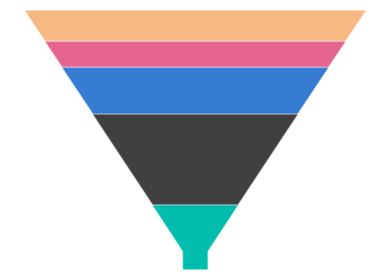
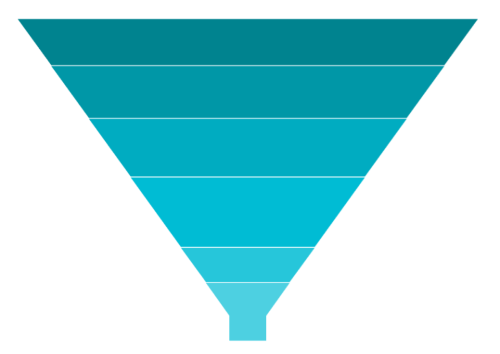
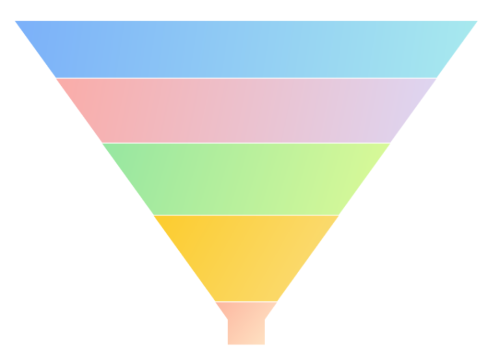

# Appearance in WinUI Chart (SfFunnelChart)

The appearance of the [SfFunnelChart](https://help.syncfusion.com/cr/winui/Syncfusion.UI.Xaml.Charts.SfFunnelChart.html) can be customized by using the predefined palettes, custom palettes, and gradient which allows enriching the application.

## Predefined PaletteBrushes

Currently, the [SfFunnelChart](https://help.syncfusion.com/cr/winui/Syncfusion.UI.Xaml.Charts.SfFunnelChart.html) supports only one predefined [PaletteBrushes](https://help.syncfusion.com/cr/winui/Syncfusion.UI.Xaml.Charts.SfFunnelChart.html#Syncfusion_UI_Xaml_Charts_SfFunnelChart_PaletteBrushes) and it is the default brushes for the SfFunnelChart. The following screenshot shows the default appearance of the funnel chart.





    <chart:SfFunnelChart x:Name="chart" 
                    ItemsSource="{Binding Data}" 
                    XBindingPath="Category"
                    YBindingPath="Value">

    </chart:SfFunnelChart>





    SfFunnelChart chart = new SfFunnelChart();
    chart.SetBinding(SfFunnelChart.ItemsSourceProperty, new Binding() { Path = new PropertyPath("Data") });
    chart.XBindingPath = "Category";
    chart.YBindingPath = "Value";
    . . .
    this.Content = chart;





## Custom PaletteBrushes

The [SfFunnelChart](https://help.syncfusion.com/cr/winui/Syncfusion.UI.Xaml.Charts.SfFunnelChart.html) provides support to define own brushes for the chart with preferred order by using the [PaletteBrushes](https://help.syncfusion.com/cr/winui/Syncfusion.UI.Xaml.Charts.SfFunnelChart.html#Syncfusion_UI_Xaml_Charts_SfFunnelChart_PaletteBrushes) property as shown in the following code example.





    <Grid>
        <Grid.Resources>
            <BrushCollection x:Key="customBrushes">
                <SolidColorBrush Color="#4dd0e1"/>
                <SolidColorBrush Color="#26c6da"/>
                <SolidColorBrush Color="#00bcd4"/>
                <SolidColorBrush Color="#00acc1"/>
                <SolidColorBrush Color="#0097a7"/>
                <SolidColorBrush Color="#00838f"/>
            </BrushCollection>
        </Grid.Resources>

        <chart:SfFunnelChart x:Name="chart" 
                    ItemsSource="{Binding Data}" 
                    XBindingPath="Category"
                    YBindingPath="Value"
                    PaletteBrushes="{StaticResource customBrushes}">
        . . .
        </chart:SfFunnelChart>
    </Grid>




    SfFunnelChart chart = new SfFunnelChart();
    ...
    List<Brush> CustomBrushes = new List<Brush>();
    CustomBrushes.Add(new SolidColorBrush(Color.FromArgb(255, 77, 208, 225)));
    CustomBrushes.Add(new SolidColorBrush(Color.FromArgb(255, 38, 198, 218)));
    CustomBrushes.Add(new SolidColorBrush(Color.FromArgb(255, 0, 188, 212)));
    CustomBrushes.Add(new SolidColorBrush(Color.FromArgb(255, 0, 172, 193)));
    CustomBrushes.Add(new SolidColorBrush(Color.FromArgb(255, 0, 151, 167)));
    CustomBrushes.Add(new SolidColorBrush(Color.FromArgb(255, 0, 131, 143)));

    chart.SetBinding(SfFunnelChart.ItemsSourceProperty, new Binding() { Path = new PropertyPath("Data") });
    chart.XBindingPath = "Category";
    chart.YBindingPath = "Value";
    chart.PaletteBrushes = CustomBrushes;

    . . .            
    this.Content = chart;





## Applying Gradient

The gradient for the funnel chart can be set by using the [PaletteBrushes](https://help.syncfusion.com/cr/winui/Syncfusion.UI.Xaml.Charts.SfFunnelChart.html#Syncfusion_UI_Xaml_Charts_SfFunnelChart_PaletteBrushes) property of the funnel chart with the help of the `LinearGradientBrush` or `RadialGradientBrush`.





    <Grid>
        <Grid.Resources>
            <BrushCollection x:Key="customBrushes">
                <LinearGradientBrush>
                        <GradientStop Offset="1" Color="#FFE7C7" />
                        <GradientStop Offset="0" Color="#FCB69F" />
                    </LinearGradientBrush>
                    <LinearGradientBrush>
                        <GradientStop Offset="1" Color="#fadd7d" />
                        <GradientStop Offset="0" Color="#fccc2d" />
                    </LinearGradientBrush>
                    <LinearGradientBrush>
                        <GradientStop Offset="1" Color="#DCFA97" />
                        <GradientStop Offset="0" Color="#96E6A1" />
                    </LinearGradientBrush>
                    <LinearGradientBrush>
                        <GradientStop Offset="1" Color="#DDD6F3" />
                        <GradientStop Offset="0" Color="#FAACA8" />
                    </LinearGradientBrush>
                    <LinearGradientBrush>
                        <GradientStop Offset="1" Color="#A8EAEE" />
                        <GradientStop Offset="0" Color="#7BB0F9" />
                    </LinearGradientBrush>
            </BrushCollection>
        </Grid.Resources>

        <chart:SfFunnelChart x:Name="chart" 
                    ItemsSource="{Binding Data}" 
                    XBindingPath="Category"
                    YBindingPath="Value"
                    PaletteBrushes="{StaticResource customBrushes}">
        . . .
        </chart:SfFunnelChart>
    </Grid>





    SfFunnelChart chart = new SfFunnelChart();
    ...
    List<Brush> customBrushes = new List<Brush>();
    LinearGradientBrush gradientColor1 = new LinearGradientBrush();
    GradientStop stop1 = new GradientStop() { Offset = 1, Color = Color.FromArgb(255, 255, 231, 199) };
    GradientStop stop2 = new GradientStop() { Offset = 0, Color = Color.FromArgb(255, 252, 182, 159) };
    gradientColor1.GradientStops.Add(stop1);
    gradientColor1.GradientStops.Add(stop2);
    LinearGradientBrush gradientColor2 = new LinearGradientBrush();
    stop1 = new GradientStop() { Offset = 1, Color = Color.FromArgb(255, 250, 221, 125) };
    stop2 = new GradientStop() { Offset = 0, Color = Color.FromArgb(255, 252, 204, 45) };
    gradientColor2.GradientStops.Add(stop1);
    gradientColor2.GradientStops.Add(stop2);
    ...
    customBrushes.Add(gradientColor1);
    customBrushes.Add(gradientColor2);
    ...
    chart.SetBinding(SfFunnelChart.ItemsSourceProperty, new Binding() { Path = new PropertyPath("Data") });
    chart.XBindingPath = "Category";
    chart.YBindingPath = "Value";
    chart.PaletteBrushes = customBrushes;
    . . .            
    this.Content = chart;





