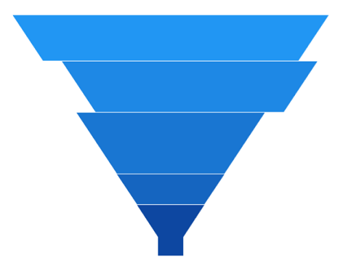

# Explode Segments in WinUI Chart (SfFunnelChart)

Exploding a segment is used to pull attention to a specific area of the funnel. The following properties are used to explode the segments in the funnel chart.

* [ExplodeAll]() - Used to explode all the segments of these series.
* [ExplodeIndex]() - Used to explode any specific segment.
* [ExplodeOffset]() - Used to define the explode distance of segment.
* [ExplodeOnTap]() - Used to explode the segment when segment is tapped/clicked.

 



<chart:SfFunnelChart x:Name="chart" 
                Palette="BlueChrome"
                ExplodeIndex="3"  
                ExplodeOffset="30" 
                ItemsSource="{Binding Data}" 
                XBindingPath="Category"
                YBindingPath="Value">

</chart:SfFunnelChart>
 




SfFunnelChart chart = new SfFunnelChart();
chart.Palette = ChartColorPalette.BlueChrome;
chart.SetBinding(SfFunnelChart.ItemsSourceProperty, new Binding() { Path = new PropertyPath("Data") });
chart.XBindingPath = "Category";
chart.YBindingPath = "Value";
chart.ExplodeIndex = 3;
chart.ExplodeOffset = 30;
. . . 
this.Content = chart;





