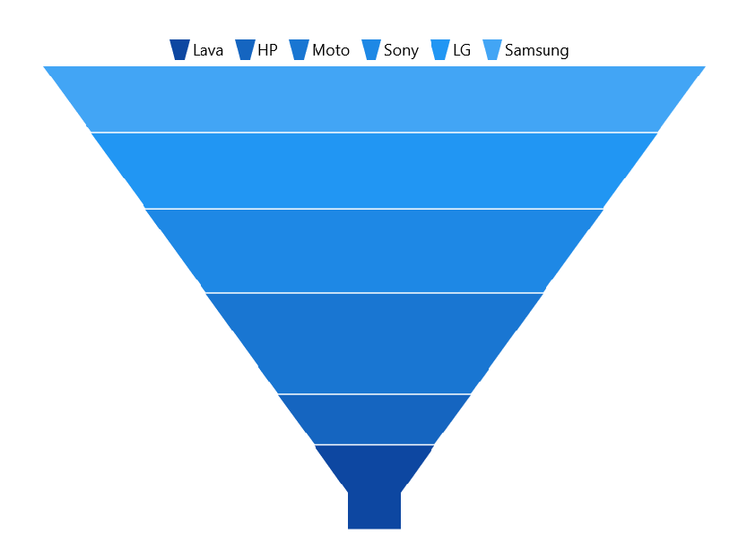
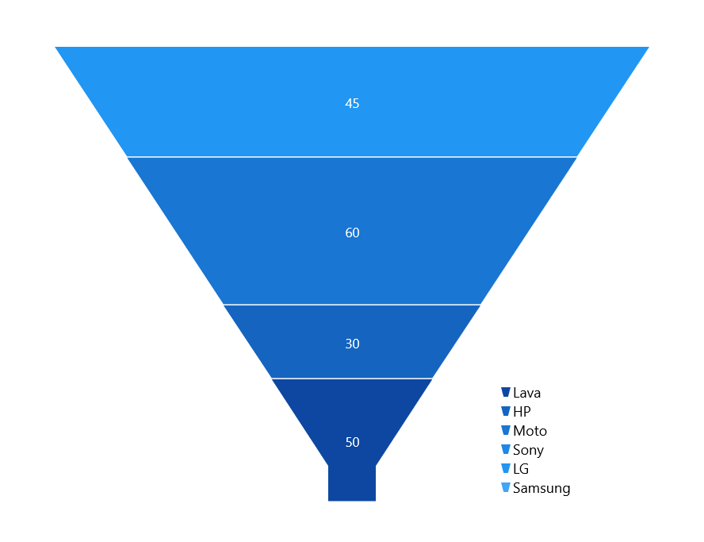

# Legend in WinUI Funnel Chart (SfFunnelChart)

The legend contains list of chart series/data points in chart. The information provided in each legend item helps to identify the corresponding data series in chart.

The following code example shows how to enable legend in chart.





<chart:SfFunnelChart.Legend>
    <chart:ChartLegend/>
</chart:SfFunnelChart.Legend>





SfFunnelChart chart = new SfFunnelChart();
chart.Legend = new ChartLegend();





N> Legend items ‘Label’ will be the x value of the Funnel chart.

## Legend Header

FunnelChart provides support to add any UIElement as a header for legend items. 

Define the [Header]() for legend using the following code example.





<chart:SfFunnelChart.Legend>
    <chart:ChartLegend>
        <chart:ChartLegend.Header>
            <TextBox Text="Products" 
                HorizontalAlignment="Center"
                FontWeight="Bold"
                Foreground="Blue"/>
        </chart:ChartLegend.Header>
    </chart:ChartLegend>
</chart:SfFunnelChart.Legend>





SfFunnelChart chart = new SfFunnelChart();
ChartLegend legend = new ChartLegend();

TextBlock textBlock = new TextBlock()
{
    Text = "Products",
    HorizontalTextAlignment = TextAlignment.Center,
    Foreground = new SolidColorBrush(Colors.Blue),
    FontWeight = FontWeights.Bold,
};

legend.Header = textBlock;
chart.Legend = legend;





## Legend Icon

FunnelSeries is used to define the label for the corresponding series legend item and for FunnelSeries type chart by default values mapped with xValueMapper will be displayed. The appearance of the label can be customized using the below properties.

* [IconWidth]() - Gets or sets the double value that represents the legend icon(s) width.
* [IconHeight]() - Gets or sets the double value that represents that legend icon(s) height.
* [IconVisibility]() - Gets or sets the Visibility of the legend icon.
* [ItemMargin]() - Gets or sets the margin for the legend items.
* [CornerRadius]() - Gets or sets the corner radius of the legend.

The following code example illustrates the customization of legend.





<chart:SfFunnelChart.Legend>
    <chart:ChartLegend IconWidth="15" IconHeight="15" 
                       IconVisibility="Visible"
                       BorderBrush="Blue" 
                       BorderThickness="2"
                       ItemMargin="5" 
                       CornerRadius="5"
                       Margin="5">
    </chart:ChartLegend>
</chart:SfFunnelChart.Legend>





chart.Legend = new ChartLegend()
{
    IconWidth = 15,
    IconHeight = 15,
    IconVisibility = Visibility.Visible,
    BorderBrush = new SolidColorBrush(Colors.Blue),
    BorderThickness = new Thickness(2),
    ItemMargin = new Thickness(5),
    CornerRadius = new CornerRadius(5),
    Margin = new Thickness(5)
};





## Checkbox for legend

Used to view or collapse the associated data points. By default, the [CheckBoxVisibility]() is `Collapsed`. 





<chart:SfFunnelChart.Legend>
    <chart:ChartLegend CheckBoxVisibility="Visible"/>
</chart:SfFunnelChart.Legend>





chart.Legend = new ChartLegend()
{
   CheckBoxVisibility = Visibility.Visible
};





## ToggleSeriesVisibility 

You can control the visibility of the series by tapping the legend item. You can enable this feature by enabling the [ToggleSeriesVisibility]() property. By default, [ToggleSeriesVisibility]() property is `False`.





<chart:SfFunnelChart.Legend>
    <chart:ChartLegend ToggleSeriesVisibility="True"/>
</chart:SfFunnelChart.Legend>





chart.Legend = new ChartLegend()
{
   ToggleSeriesVisibility = true
};





The data point can be collapsed and view it again, by clicking on the respective legend item,

## Positioning the Legend

**Legend Position**

The legends can be placed either [Inside]() or [Outside]() of the chart area (plotting area).
By default, it will be displayed outside and positioned at top (using [DockPosition]()) of the chart area.





<chart:SfFunnelChart.Legend>
    <chart:ChartLegend Position="Inside"/>
</chart:SfFunnelChart.Legend>





chart.Legend = new ChartLegend()
{
    Position = LegendPosition.Inside
};





**Docking**

Legends can be docked left, right, and top or bottom around the chart area using [DockPosition]() property. 
By default, the ChartLegend is docked at the top of the chart as mentioned earlier.

To display the legend at the bottom, you can set the [DockPosition]() as [Right]() as in below code snippet.





<chart:SfFunnelChart.Legend>
    <chart:ChartLegend ItemMargin="10" DockPosition="Right"/>
</chart:SfFunnelChart.Legend>





chart.Legend = new ChartLegend()
{
   DockPosition = ChartDock.Right
};





**Floating Legends**

To position the legend at any arbitrary location inside chart, need to set [DockPosition]() as `Floating` and provide its relative position using [OffsetX]() and [OffsetY]() properties.
 
Offset specifies x or y distance from origin.





 <chart:SfFunnelChart.Legend>
    <chart:ChartLegend DockPosition="Floating" Orientation="Vertical" OffsetX="370" OffsetY="300"/>
</chart:SfFunnelChart.Legend>





chart.Legend = new ChartLegend()
{
    DockPosition = ChartDock.Floating,
    OffsetX = 370,
    OffsetY = 300
};





## Legend Orientation

Orientation of the Legend can be vertical or horizontal. By default the [Orientation]() is [Horizontal](). 





<chart:SfFunnelChart.Legend>
    <chart:ChartLegend Orientation="Vertical"/>
</chart:SfFunnelChart.Legend>





chart.Legend = new ChartLegend()
{
    Orientation = ChartOrientation.Vertical
};





## Customization

**ItemTemplate**

Customize each legend item using [ItemTemplate]() property in ChartLegend as in below code snippet:





<chart:SfFunnelChart>
    <chart:SfFunnelChart.Resources>
        <DataTemplate x:Key="labelTemplate">
            <StackPanel Margin="10" Orientation="Vertical">
                <Ellipse Height="15" Width="15" Fill="{Binding Interior}" 
                 Stroke="#4a4a4a" StrokeThickness="2"/>
                <TextBlock HorizontalAlignment="Center" FontSize="12"
                           Foreground="Black" 
                           FontWeight="SemiBold" Text="{Binding Label}"/>
            </StackPanel>
        </DataTemplate>
    </chart:SfFunnelChart.Resources>
    . . .
    <chart:SfFunnelChart.Legend>
        <chart:ChartLegend ItemTemplate="{StaticResource labelTemplate}"/>
    </chart:SfFunnelChart.Legend>

</chart:SfFunnelChart>





chart.Legend = new ChartLegend()
{

   ItemTemplate = chart.Resources["itemTemplate"] as DataTemplate
};





