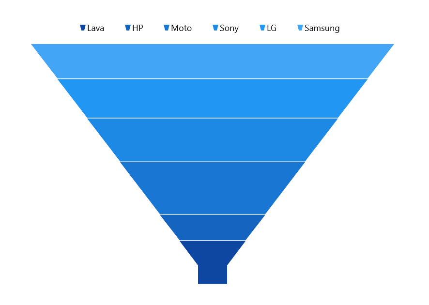
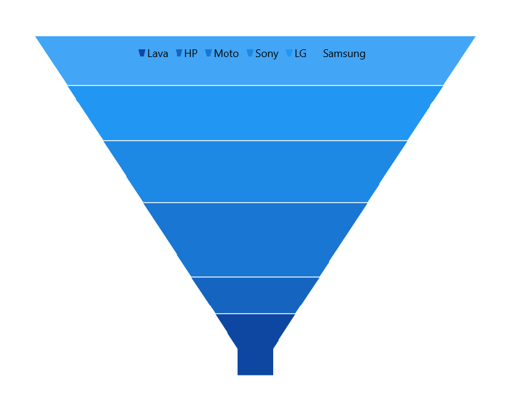
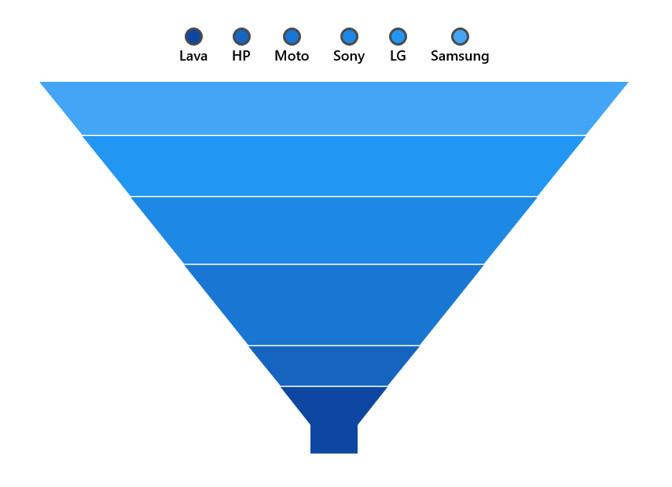

# Legend in WinUI Chart (SfFunnelChart)

The legend contains a list of series data points in the chart. The information provided in each legend item helps you to identify the corresponding data series in the chart.

N> The x-value of data points in the funnel chart will be the legend items ‘Label’.





<chart:SfFunnelChart.Legend>
    <chart:ChartLegend/>
</chart:SfFunnelChart.Legend>





SfFunnelChart chart = new SfFunnelChart();
chart.Legend = new ChartLegend();





## Title

The funnel chart provides support to add any `UIElement` as a title for legend. [Header]() property of `ChartLegend` is used to define the title for the legend as shown in the following code example.





<chart:SfFunnelChart.Legend>
    <chart:ChartLegend>
        <chart:ChartLegend.Header>
            <TextBox Text="Products" 
                HorizontalAlignment="Center"
                FontWeight="Bold"
                Foreground="Blue"/>
        </chart:ChartLegend.Header>
    </chart:ChartLegend>
</chart:SfFunnelChart.Legend>





SfFunnelChart chart = new SfFunnelChart();
ChartLegend legend = new ChartLegend();

TextBlock textBlock = new TextBlock()
{
    Text = "Products",
    HorizontalTextAlignment = TextAlignment.Center,
    Foreground = new SolidColorBrush(Colors.Blue),
    FontWeight = FontWeights.Bold,
};

legend.Header = textBlock;
chart.Legend = legend;





## Icon

The legend icon represents a symbol associated with each legend item. The appearance of the legend icon can be customized using the following properties:

* [IconWidth]() - Gets or sets the double value that represents the legend icon(s) width.
* [IconHeight]() - Gets or sets the double value that represents the legend icon(s) height.
* [IconVisibility]() - Gets or sets the visibility of the legend icon.





<chart:SfFunnelChart.Legend>
    <chart:ChartLegend IconWidth="15" IconHeight="15" 
                       IconVisibility="Visible">
    </chart:ChartLegend>
</chart:SfFunnelChart.Legend>





chart.Legend = new ChartLegend()
{
    IconWidth = 15,
    IconHeight = 15,
    IconVisibility = Visibility.Visible,
};





## Item spacing

`ItemMargin` property of the `ChartLegend` is used to provide spacing between each legend items.





<chart:SfFunnelChart.Legend>
    <chart:ChartLegend ItemMargin="10"/>
</chart:SfFunnelChart.Legend>





chart.Legend = new ChartLegend()
{
    ItemMargin = new Thickness(10)
};





## Checkbox for Legend

Funnel chart provides support to enable the checkbox for each legend item to visible or collapse the associated data points. By default, the value of [CheckBoxVisibility]() property is `Collapsed`. 





<chart:SfFunnelChart.Legend>
    <chart:ChartLegend CheckBoxVisibility="Visible"/>
</chart:SfFunnelChart.Legend>





chart.Legend = new ChartLegend()
{
   CheckBoxVisibility = Visibility.Visible
};





## Toggle Series Visibility 

By enabling the [ToggleSeriesVisibility]() property, the visibility of the segment can be controlled by tapping the legend item. By default, the value of [ToggleSeriesVisibility]() property is `False`.





<chart:SfFunnelChart.Legend>
    <chart:ChartLegend ToggleSeriesVisibility="True"/>
</chart:SfFunnelChart.Legend>





chart.Legend = new ChartLegend()
{
   ToggleSeriesVisibility = true
};





## Position

The legends can be placed either inside or outside of the chart area (plotting area). By default, it will be displayed outside and positioned at top (using [DockPosition]()) of the chart area.





<chart:SfFunnelChart.Legend>
    <chart:ChartLegend Position="Inside"/>
</chart:SfFunnelChart.Legend>





chart.Legend = new ChartLegend()
{
    Position = LegendPosition.Inside
};





### Docking the Legend Position

By using the [DockPosition]() property, legends can be docked to the left, right, and top or bottom of the chart area. By default, the chart legend is docked at the top of the chart as mentioned earlier.

To display the legend at the right, you can set the [DockPosition]() as [Right]() as shown in the following code sample.





<chart:SfFunnelChart.Legend>
    <chart:ChartLegend ItemMargin="10" DockPosition="Right"/>
</chart:SfFunnelChart.Legend>





chart.Legend = new ChartLegend()
{
   DockPosition = ChartDock.Right,
   ItemMargin = new Thickness(10),
};





### Floating Legends

To position the legend at any arbitrary location within the chart, you need to set [DockPosition]() as `Floating` and provide its relative position by using the [OffsetX]() and [OffsetY]() properties.





 <chart:SfFunnelChart.Legend>
    <chart:ChartLegend DockPosition="Floating" Orientation="Vertical" OffsetX="370" OffsetY="300"/>
</chart:SfFunnelChart.Legend>





chart.Legend = new ChartLegend()
{
    DockPosition = ChartDock.Floating,
    Orientation = ChartOrientation.Vertical,
    OffsetX = 370,
    OffsetY = 300
};





## Orientation

Orientation of the legend items can be aligned vertically or horizontally by setting the [Orientation]() property of legend. By default, the value of [Orientation]() property is [Horizontal]().





<chart:SfFunnelChart.Legend>
    <chart:ChartLegend Orientation="Vertical"/>
</chart:SfFunnelChart.Legend>





chart.Legend = new ChartLegend()
{
    Orientation = ChartOrientation.Vertical
};





## Background customization 

The legend background appearance can be customized by using the following properties:

[BorderThickness]() - used to change the stroke width of the legend.
[BorderBrush]() - used to change the stroke color of the legend.
[Background]() - used to change the background color of the legend.
[Opacity]() - used to control the transparency of the legend icon shape.
[CornerRadius]() - used to change the corner radius of the legend.





<chart:SfFunnelChart.Legend>
    <chart:ChartLegend Background="Gray" BorderBrush="Black" 
                       BorderThickness="1" CornerRadius="5" 
                       Opacity="0.9" >
    </chart:ChartLegend>
</chart:SfFunnelChart.Legend>





chart.Legend = new ChartLegend()
{
    Background = new SolidColorBrush(Colors.Gray),
    BorderBrush = new SolidColorBrush(Colors.Black),
    BorderThickness = new Thickness(1),
    Opacity = 0.9,
    CornerRadius = CornerRadiusHelper.FromUniformRadius(5)
};





## Template

Customize each legend item by using the [ItemTemplate]() property in `ChartLegend`, as shown in the following code sample.





<chart:SfFunnelChart>
    <chart:SfFunnelChart.Resources>
        <DataTemplate x:Key="labelTemplate">
            <StackPanel Margin="10" Orientation="Vertical">
                <Ellipse Height="15" Width="15" Fill="{Binding Interior}" 
                 Stroke="#4a4a4a" StrokeThickness="2"/>
                <TextBlock HorizontalAlignment="Center" FontSize="12"
                           Foreground="Black" 
                           FontWeight="SemiBold" Text="{Binding Label}"/>
            </StackPanel>
        </DataTemplate>
    </chart:SfFunnelChart.Resources>
    . . .
    <chart:SfFunnelChart.Legend>
        <chart:ChartLegend ItemTemplate="{StaticResource labelTemplate}"/>
    </chart:SfFunnelChart.Legend>

</chart:SfFunnelChart>





chart.Legend = new ChartLegend()
{

   ItemTemplate = chart.Resources["itemTemplate"] as DataTemplate
};





