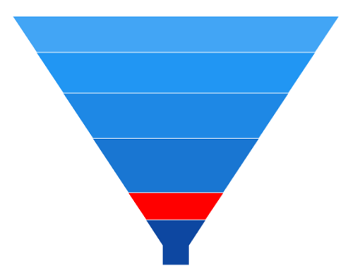
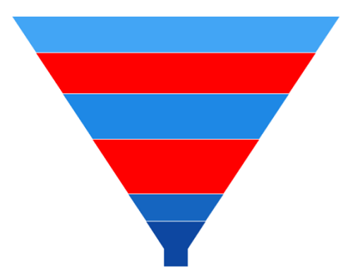
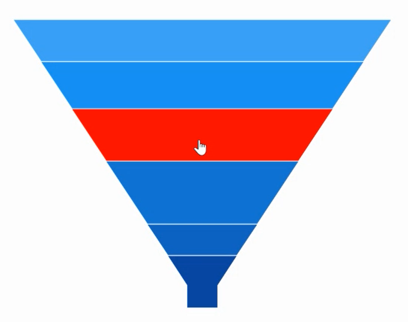

# Selection in WinUI Chart (SfFunnelChart)

Funnel chart supports selection that allows to select a segment in the chart by using [ChartSelectionBehavior](). 

## Enable Selection

To enable the selection in chart, create an instance of [ChartSelectionBehavior]() and add it to the `Behaviors` collection of funnel chart. And also need to set the [SelectionBrush]() property to highlight the segment in the funnel chart.





<chart:SfFunnelChart x:Name="chart" 
                    SelectionBrush="Red"
                    Height="388" Width="500"
                    Palette="BlueChrome"
                    ItemsSource="{Binding Data}" 
                    XBindingPath="Category"
                    YBindingPath="Value">

    <chart:SfFunnelChart.Behaviors>
        <chart:ChartSelectionBehavior />
    </chart:SfFunnelChart.Behaviors>

</chart:SfFunnelChart>





SfFunnelChart chart = new SfFunnelChart();
chart.SetBinding(SfFunnelChart.ItemsSourceProperty, new Binding() { Path = new PropertyPath("Data") });
chart.XBindingPath = "Category";
chart.YBindingPath = "Value";
chart.SelectionBrush = new SolidColorBrush(Colors.Red);
ChartSelectionBehavior selection = new ChartSelectionBehavior();
chart.Behaviors.Add(selection);
. . .
this.Content = chart;





## Multi-selection

Funnel chart provides support to select multiple segments by using [Type]() property as `MultiPoint`. By default, the value of [Type]() is `Point` and it is used for single selection.

N> `Series` and `MultiSeries` selection type is not support for funnel chart.





<chart:SfFunnelChart x:Name="chart"  
                    SelectionBrush="Red"
                    Palette="BlueChrome" 
                    ItemsSource="{Binding Data}" 
                    XBindingPath="Category"
                    YBindingPath="Value">

    <chart:SfFunnelChart.Behaviors>
        <chart:ChartSelectionBehavior Type="MultiPoint"/>
    </chart:SfFunnelChart.Behaviors>
. . .
</chart:SfFunnelChart>





SfFunnelChart chart = new SfFunnelChart();
chart.SetBinding(SfFunnelChart.ItemsSourceProperty, new Binding() { Path = new PropertyPath("Data") });
chart.XBindingPath = "Category";
chart.YBindingPath = "Value";
chart.SelectionBrush = new SolidColorBrush(Colors.Red);
ChartSelectionBehavior selection = new ChartSelectionBehavior();
selection.Type = SelectionType.MultiPoint;
chart.Behaviors.Add(selection);
. . .
this.Content = chart;





## Changing Cursor while Selection

[Cursor]() property allows to define the cursor when mouse is hovered over the segment with segment selection enabled.

The following code snippet demonstrates hand cursor in segment selection.





<<chart:SfFunnelChart x:Name="chart"  
                    SelectionBrush="Red"
                    Palette="BlueChrome"  
                    ItemsSource="{Binding Data}" 
                    XBindingPath="Category"
                    YBindingPath="Value">

        <chart:SfFunnelChart.Behaviors>
            <chart:ChartSelectionBehavior Cursor="Hand" />
        </chart:SfFunnelChart.Behaviors>

</chart:SfFunnelChart>





SfFunnelChart chart = new SfFunnelChart();
chart.SetBinding(SfFunnelChart.ItemsSourceProperty, new Binding() { Path = new PropertyPath("Data") });
chart.XBindingPath = "Category";
chart.YBindingPath = "Value";
chart.SelectionBrush = new SolidColorBrush(Colors.Red);
ChartSelectionBehavior selection = new ChartSelectionBehavior();
selection.Cursor = Windows.UI.Core.CoreCursorType.Hand;
chart.Behaviors.Add(selection);
. . .
this.Content = chart;





## Events

The following selection events are available in `SfFunnelChart`.

### SelectionChanging

The [SelectionChanging]() event occurs before the data point is being selected. This is a cancelable event. This argument contains the following information.

* [SelectedSegment]() - Gets the segment of the selected data point.
* [SelectedIndex]() - Gets the selected data point index.
* [PreviousSelectedIndex]() - Gets the previous selected data point index.
* [Cancel]() - Gets or Sets a value that indicates whether the selection should be canceled.

### SelectionChanged

The [SelectionChanged]() event occurs after a data point has been selected. This argument contains the following information.

* [SelectedSegment]() - Gets the segment of the selected data point.
* [SelectedIndex]() - Gets the selected data point index.
* [PreviousSelectedSegment]() - Gets the segment of previous selected data point.
* [PreviousSelectedIndex]() - Gets the previous selected data point index.
