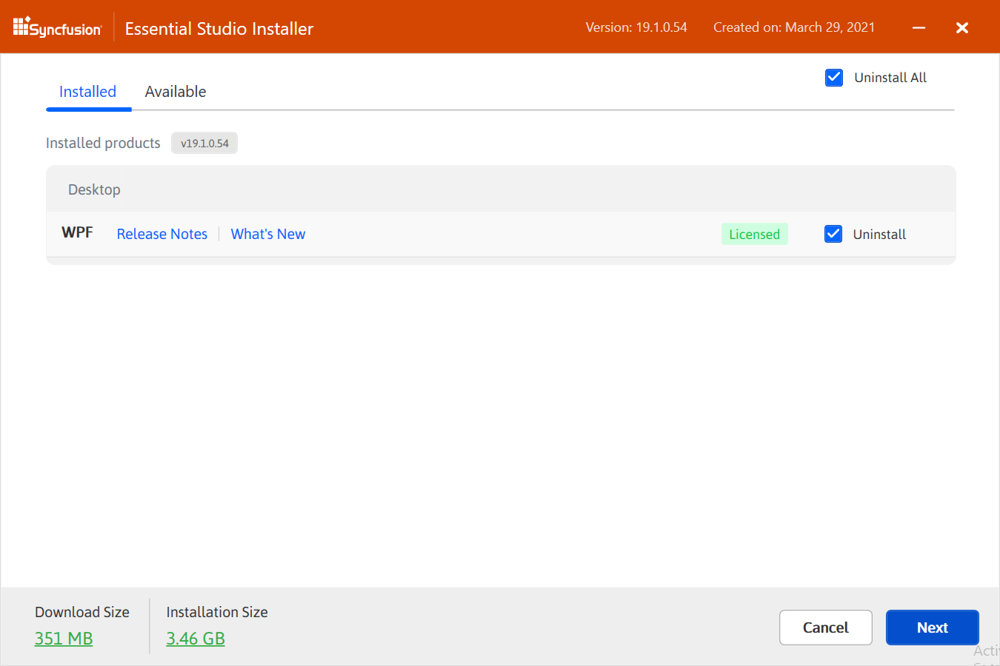
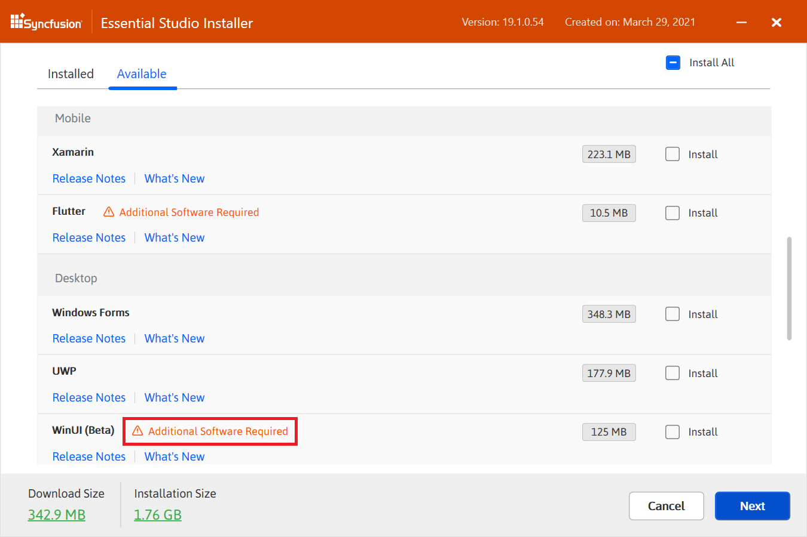
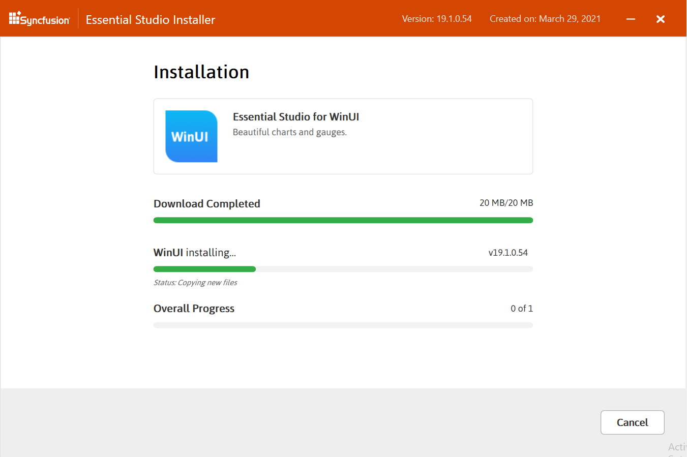
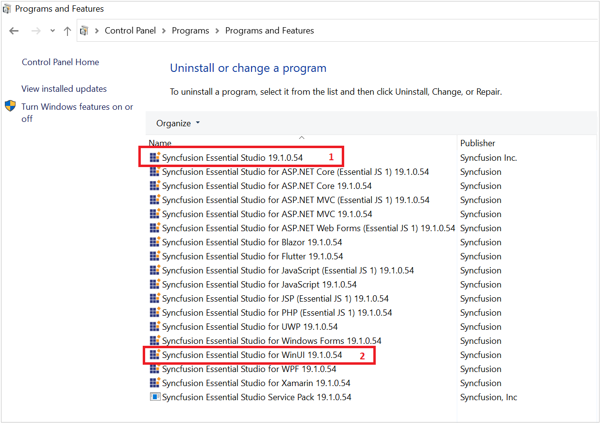
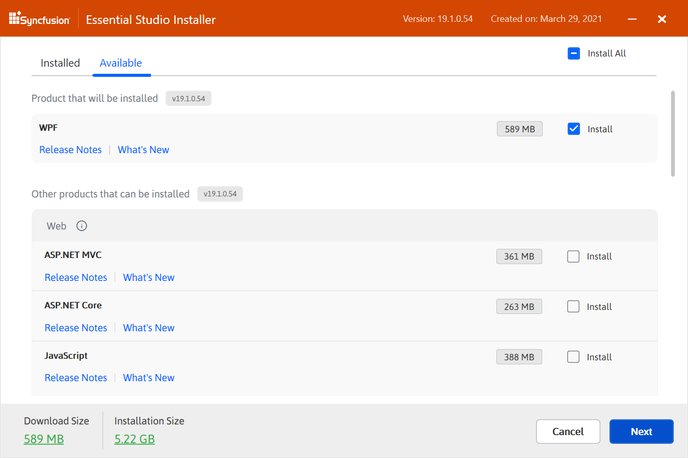
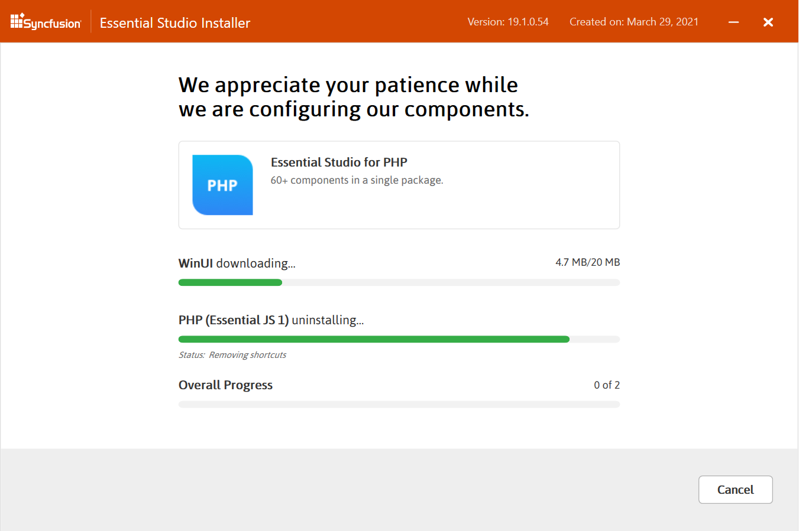
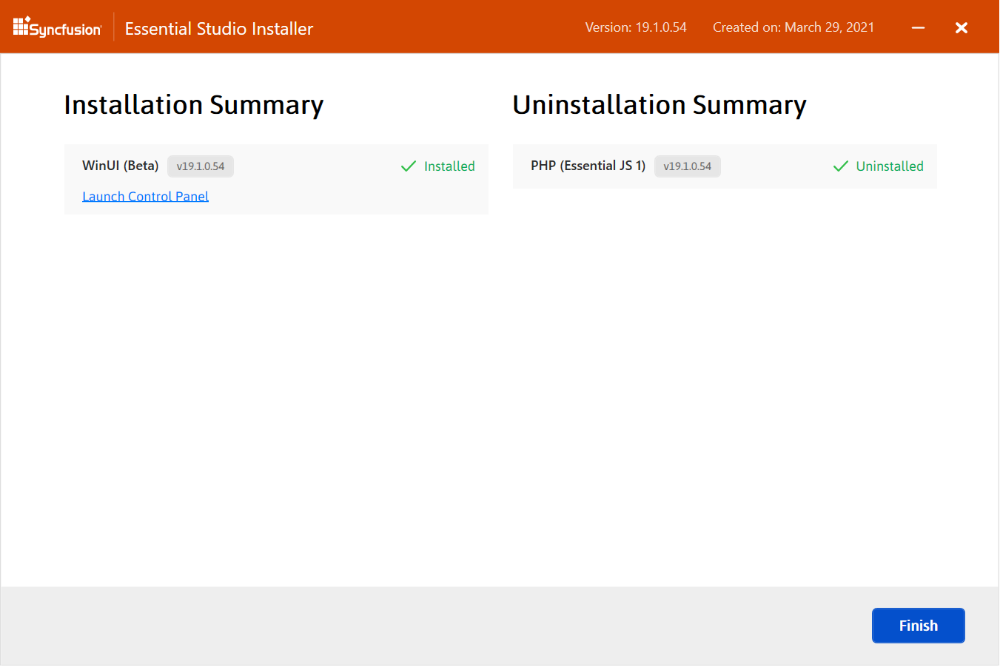

# Installation using Web Installer

You can refer to the [**Download**](https://help.syncfusion.com/winui/installation-and-upgrade/download) section to learn how to get the WinUI trial or licensed installer.

## Overview

For the Essential Studio WinUI platform, Syncfusion offers a Web Installer. This installer alleviates the burden of downloading a larger installer. You can simply download and run the online installer, which will be smaller in size and will download and install the Essential Studio products you have chosen. You can get the most recent version of Essential Studio Web Installer [here](https://www.syncfusion.com/downloads/latest-version). The platforms listed below are included in the Essential Studio Web Installer. 

**Web (Essential JS 2)**

* ASP.NET MVC
* ASP.NET Core
* JavaScript

**Mobile**

* Xamarin
* Flutter

**Desktop**

* Windows Forms
* WPF
* Universal Windows Platform
* WinUI(Preview)

**FileFormats**

* Read and Write Excel, Word, PDF and PowerPoint files

**Web (Essential JS 1)**

* ASP.NET Web Forms
* ASP.NET MVC
* ASP.NET Core
* JavaScript
* PHP
* JSP

 
## Installation

The steps below show how to install Essential Studio WinUI Web Installer.

1.  Open the Syncfusion Essential Studio WinUI Web Installer file from downloaded location by double-clicking it. The Installer Wizard automatically opens and extracts the package.

    

    
    N> The installer wizard extracts the syncfusionessentialwinuiwebinstaller_{version}.exe dialog, which displays the package's unzip operation.
    
2. 	The Syncfusion WinUI Web Installer's welcome wizard will be displayed. Click the Next button.

    

  
3.  The Platform Selection Wizard will appear. From the **Available** tab, select the platforms to be installed. Select the **Install All** checkbox to install all platforms. 
    
	**Available**
	
	
	
	If you have multiple platforms installed in the same version, they will be listed under the **Installed** tab. You can also select which platforms to uninstall from the same version. Click the Next button.
	
	**Installed**
	
    
	
	I> If the required software for the selected platform isn't already installed, the **Additional Software Required** alert will appear. You can, however, continue the installation and install the necessary software later.
	
	**Required Software**
	
	
		
	
4.	If previous version(s) for the selected platforms are installed, the Uninstall previous version wizard will be displayed. You can see the list of previously installed versions for the platforms you've chosen here. To remove all versions, check the **Uninstall All** checkbox. Click the Next button.

	
	
	N> From the 2021 Volume 1 release, Syncfusion has provided option to uninstall the previous versions from 18.1 while installing the new version.
	
	
5.	Pop up screen will be displayed to get the confirmation to uninstall selected previous versions.

	
	
	
6. 	The Confirmation Wizard will appear with the list of products to be installed/uninstalled. You can view and modify the list of platforms that will be installed and uninstalled from this page.

    
	
	N> By clicking the **Download Size and Installation** Size links, you can determine the approximate size of the download and installation
	

7.  The Configuration Wizard will appear. You can change the Download, Install, and Demos locations from here. You can also change the Additional settings on a platform-by-platform basis. Click Next to install with the default settings.

    
	
	**Additional settings**
	
    * Select the **Install Demos** check box to install Syncfusion samples, or leave the check box unchecked, if you do not want to install Syncfusion samples.
    * Check the **Create Desktop Shortcut** checkbox to add a desktop shortcut for Syncfusion Control Panel.
    * Check the **Create Start Menu Shortcut** checkbox to add a shortcut to the start menu for Syncfusion Control Panel.

8.  After reading the License Terms and Conditions, check the **I agree to the License Terms and Privacy Policy** check box. Click the Next button.

9.  The login wizard will appear. You must enter your Syncfusion email address and password. If you do not already have a Syncfusion account, you can create one by clicking on **Create an Account**. If you have forgotten your password, click **Forgot Password** to create a new one. Click the Install button. 

    
	
	I> The platforms you have chosen will be installed based on your Syncfusion License (Trial or Licensed).

10. The download and installation\uninstallation progress will be displayed as shown below.

    

11. When the installation is finished, the **Summary** wizard will appear. Here you can see the list of platforms that have been installed successfully and those that have failed. To close the Summary wizard, click Finish. 

    
	
	* To open the Syncfusion Control Panel, click **Launch Control Panel**.

12. After installation, there will be two Syncfusion control panel entries, as shown below. The Essential Studio entry will manage all Syncfusion platforms installed in the same version, while the Platform entry will only uninstall the specific platform setup.

    
	
	
	
## Uninstallation

Syncfusion WinUI installer can be uninstalled in two ways.

   * Uninstall the WinUI using the Syncfusion WinUI web installer
   * Uninstall the WinUI from Windows Control Panel

Follow either one of the option below to uninstall Syncfusion Essential Studio WinUI installer.
  
**Option 1: Uninstall the WinUI using the Syncfusion WinUI web installer**

Syncfusion provides the option to uninstall platforms of the same version directly from the Web Installer application. Select the platforms to be uninstalled from the list, and Web Installer will uninstall them one by one.

Open the Syncfusion Essential Studio Platform WinUI Online Installer file from downloaded location by double-clicking it. The Installer Wizard automatically opens and extracts the package

	
The Syncfusion WinUI Web Installer's welcome wizard will be displayed. Click the Next button
	

	
	
**Option 2: Uninstall the WinUI from Windows Control Panel**  
	
You can uninstall all the installed platforms by selecting the **Syncfusion Essential Studio {version}** entry (element 1 in the below screenshot) from the Windows control panel, or you can uninstall WinUI alone by selecting the **Syncfusion Essential Studio for WinUI {version}** entry (element 2 in the below screenshot) from the Windows control panel.

	
N> If the **Syncfusion Essential Studio for WinUI {version}** entry is selected from the Windows control panel, the Syncfusion Essential Studio WinUI alone will be removed and the below default MSI uninstallation window will be displayed.
	
**Uninstalling WinUI alone**
	

1.  The Platform Selection Wizard will appear. From the **Installed** tab, select the platforms to be uninstalled. To select all platforms, check the **Uninstall All** checkbox. Click the Next button.
    
	**Installed**
	
	
	
	You can also select the platforms to be installed from the **Available** tab.Click the Next button.
	
	**Available**
	
	
	
2.  If any other platforms selected for installation, Uninstall previous version wizard will be displayed with previous version(s) installed for the selected platforms. Here you can view the list of installed previous versions for the selected platforms. Select **Uninstall All** checkbox to select all the versions. Click Next.

	
	
3.	Pop up screen will be displayed to get the confirmation to uninstall selected previous versions.

		
	
4.  The Confirmation Wizard will appear with the list of products to be installed/uninstalled. Here you can view and modify the list of platforms that will be installed/uninstalled.

    
	
	N> You can check the Estimated size of the Download and Installation by clicking the **Download Size and Installation Size** link.
	
5.	The Configuration Wizard will appear. You can change the Download, Install, and Demos locations from here. You can also change the Additional settings on a platform-by-platform basis. Click Next to install with the default settings.

    
	
6.	After reading the License Terms and Conditions, check the **I agree to the License Terms and Privacy Policy** check box. Click the Next button.

7.	The login wizard will appear. You must enter your Syncfusion email address and password. If you do not already have a Syncfusion account, you can create one by clicking on **Create an Account**. If you have forgotten your password, click **Forgot Password** to create a new one. Click the Install button.

    
	
	I> The platforms you have chosen will be installed based on your Syncfusion License (Trial or Licensed).

8.	The download, installation, and uninstallation progresses will be shown.

    

9.	When the installation is finished, the **Summary** wizard will appear. Here you can see the list of platforms that have been successfully and unsuccessfully installed/uninstalled. To close the Summary wizard, click Finish.

    
	
	* To open the Syncfusion Control Panel, click **Launch Control Panel**.	
	