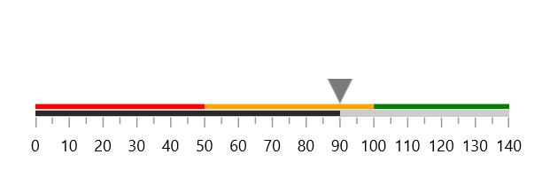

# Getting Started with WinUI Linear Gauge

This section explains the steps required to add the Linear Gauge control and its elements such as axis, range, and pointer. This section covers only basic features needed to get started with Syncfusion Linear Gauge control.

## Creating an application with WinUI Linear Gauge

1. Create a [WinUI 3 desktop app for C# and .NET 5](https://docs.microsoft.com/en-us/windows/apps/winui/winui3/get-started-winui3-for-desktop) or [WinUI 3 app in UWP for C#](https://docs.microsoft.com/en-us/windows/apps/winui/winui3/get-started-winui3-for-uwp).

2. Add reference to [Syncfusion.Gauge.WinUI](https://www.nuget.org/packages/Syncfusion.Gauge.WinUI) NuGet.

3. Import the control namespace `Syncfusion.UI.Xaml.Gauges` in XAML or C# code.

4. Initialize the [`SfLinearGauge`](https://help.syncfusion.com/cr/winui/Syncfusion.UI.Xaml.Gauges.SfLinearGauge.html) control.





<gauge:SfLinearGauge />





SfLinearGauge sfLinearGauge = new SfLinearGauge();
this.Content = sfLinearGauge;





N> Default axis will be added when initializing the Linear Gauge control.

## Add axis to the linear gauge

You can set a linear axis for the gauge using the [`Axis`](https://help.syncfusion.com/cr/winui/Syncfusion.UI.Xaml.Gauges.SfLinearGauge.html#Syncfusion_UI_Xaml_Gauges_SfLinearGauge_Axis) property of [`SfLinearGauge`](https://help.syncfusion.com/cr/winui/Syncfusion.UI.Xaml.Gauges.SfLinearGauge.html) and also you can specify the minimum and maximum values of axis using the [`Minimum`](https://help.syncfusion.com/cr/winui/Syncfusion.UI.Xaml.Gauges.LinearAxis.html?tabs=tabid-1#Syncfusion_UI_Xaml_Gauges_LinearAxis_Minimum) and [`Maximum`](https://help.syncfusion.com/cr/winui/Syncfusion.UI.Xaml.Gauges.LinearAxis.html#Syncfusion_UI_Xaml_Gauges_LinearAxis_Maximum) properties as demonstrated in the following code sample.





<gauge:SfLinearGauge>
    <gauge:SfLinearGauge.Axis>
        <gauge:LinearAxis Minimum="0"
                          Maximum="140" />
    </gauge:SfLinearGauge.Axis>
</gauge:SfLinearGauge>





SfLinearGauge sfLinearGauge = new SfLinearGauge();
LinearAxis linearAxis = new LinearAxis();
linearAxis.Minimum = 0;
linearAxis.Maximum = 140;
sfLinearGauge.Axis = linearAxis;
this.Content = sfLinearGauge;





## Add range to the linear gauge

Ranges contains a list of range elements, where you can add any number of ranges inside the axis. You can specify the start value, mid value, end value, and background color for the range using the [`StartValue`](https://help.syncfusion.com/cr/winui/Syncfusion.UI.Xaml.Gauges.LinearGaugeRange.html#Syncfusion_UI_Xaml_Gauges_LinearGaugeRange_StartValue), [`EndValue`](https://help.syncfusion.com/cr/winui/Syncfusion.UI.Xaml.Gauges.LinearGaugeRange.html#Syncfusion_UI_Xaml_Gauges_LinearGaugeRange_EndValue) and `Background` properties as demonstrated in the following code sample.





<gauge:SfLinearGauge>
    <gauge:SfLinearGauge.Axis>
        <gauge:LinearAxis Maximum="140"
                          Interval="10">
            <gauge:LinearAxis.Ranges>
                <gauge:LinearGaugeRange StartValue="0"
                                        EndValue="50"
                                        Background="Red" />
                <gauge:LinearGaugeRange StartValue="50"
                                        EndValue="100"
                                        Background="Orange" />
                <gauge:LinearGaugeRange StartValue="100"
                                        EndValue="140"
                                        Background="Green" />
            </gauge:LinearAxis.Ranges>
        </gauge:LinearAxis>
    </gauge:SfLinearGauge.Axis>
</gauge:SfLinearGauge>





SfLinearGauge sfLinearGauge = new SfLinearGauge();
sfLinearGauge.Axis.Maximum = 140;
sfLinearGauge.Axis.Interval = 10;

LinearGaugeRange gaugeRange1 = new LinearGaugeRange();
gaugeRange1.StartValue = 0;
gaugeRange1.EndValue = 50;
gaugeRange1.Background = new SolidColorBrush(Colors.Red);
sfLinearGauge.Axis.Ranges.Add(gaugeRange1);

LinearGaugeRange gaugeRange2 = new LinearGaugeRange();
gaugeRange2.StartValue = 50;
gaugeRange2.EndValue = 100;
gaugeRange2.Background = new SolidColorBrush(Colors.Orange);
sfLinearGauge.Axis.Ranges.Add(gaugeRange2);

LinearGaugeRange gaugeRange3 = new LinearGaugeRange();
gaugeRange3.StartValue = 100;
gaugeRange3.EndValue = 150;
gaugeRange3.Background = new SolidColorBrush(Colors.Green);
sfLinearGauge.Axis.Ranges.Add(gaugeRange3);

this.Content = sfLinearGauge;





## Add bar pointer to the linear gauge

Bar pointers contains a list of bar pointer elements, where you can add any number of bar pointers inside the axis to indicate the value.





<gauge:SfLinearGauge>
    <gauge:SfLinearGauge.Axis>
        <gauge:LinearAxis Maximum="140"
                          Interval="10">
            ...
            <gauge:LinearAxis.BarPointers>
                <gauge:BarPointer Value="90" />
            </gauge:LinearAxis.BarPointers>
        </gauge:LinearAxis>
    </gauge:SfLinearGauge.Axis>
</gauge:SfLinearGauge>





SfLinearGauge sfLinearGauge = new SfLinearGauge();
sfLinearGauge.Axis.Maximum = 140;
sfLinearGauge.Axis.Interval = 10;
...
BarPointer barPointer1 = new BarPointer();
barPointer1.Value = 90;
sfLinearGauge.Axis.BarPointers.Add(barPointer1);

this.Content = sfLinearGauge;





## Add marker pointer to the linear gauge

MarkerPointers contains a list of pointer elements, where you can add any number of gauge pointers such as [`ShapePointer`](https://help.syncfusion.com/cr/winui/Syncfusion.UI.Xaml.Gauges.ShapePointer.html), and [`ContentPointer`](https://help.syncfusion.com/cr/winui/Syncfusion.UI.Xaml.Gauges.ContentPointer.html), inside the axis to indicate the value.

**Add shape pointer to the linear gauge**

Shape pointer is to highlight current values by using the different types of shape pointers.





<gauge:SfLinearGauge>
    <gauge:SfLinearGauge.Axis>
        <gauge:LinearAxis Maximum="140"
                          Interval="10">
            ...
            <gauge:LinearAxis.MarkerPointers>
                <gauge:ShapePointer Value="90"
                                    VerticalAnchor="End"
                                    OffsetPoint="0,-8" />
            </gauge:LinearAxis.MarkerPointers>
        </gauge:LinearAxis>
    </gauge:SfLinearGauge.Axis>
</gauge:SfLinearGauge>





SfLinearGauge sfLinearGauge = new SfLinearGauge();
sfLinearGauge.Axis.Maximum = 140;
sfLinearGauge.Axis.Interval = 10;
...
ShapePointer shapePointer1 = new ShapePointer();
shapePointer1.Value = 90;
shapePointer1.VerticalAnchor = GaugeAnchor.End;
shapePointer1.OffsetPoint = new Point(0, -8);
sfLinearGauge.Axis.MarkerPointers.Add(shapePointer1);

this.Content = sfLinearGauge;





**Add content pointer to the linear gauge**

Content pointer is used to highlight values using an image, icon, text, or any other custom view.





<gauge:SfLinearGauge>
    <gauge:SfLinearGauge.Axis>
        <gauge:LinearAxis Maximum="140"
                          Interval="10">
            ...
            <gauge:ContentPointer Value="90"
                      VerticalAnchor="End"
                      OffsetPoint="0,-28">
                <gauge:ContentPointer.Content>
                    <TextBlock Text="90%" />
                </gauge:ContentPointer.Content>
            </gauge:ContentPointer>
        </gauge:LinearAxis>
    </gauge:SfLinearGauge.Axis>
</gauge:SfLinearGauge>





SfLinearGauge sfLinearGauge = new SfLinearGauge();
sfLinearGauge.Axis.Maximum = 140;
sfLinearGauge.Axis.Interval = 10;
...
ContentPointer contentPointer1 = new ContentPointer();
contentPointer1.Value = 90;
contentPointer1.VerticalAnchor = GaugeAnchor.End;
contentPointer1.OffsetPoint = new Point(0, -28);
contentPointer1.Content = new TextBlock { Text = "90%" };
sfLinearGauge.Axis.MarkerPointers.Add(contentPointer1);

this.Content = sfLinearGauge;





The following code example gives you the complete code of above configurations.





<gauge:SfLinearGauge>
    <gauge:SfLinearGauge.Axis>
        <gauge:LinearAxis Maximum="140"
                          Interval="10">
            <gauge:LinearAxis.Ranges>
                <gauge:LinearGaugeRange StartValue="0"
                                        EndValue="50"
                                        Background="Red" />
                <gauge:LinearGaugeRange StartValue="50"
                                        EndValue="100"
                                        Background="Orange" />
                <gauge:LinearGaugeRange StartValue="100"
                                        EndValue="140"
                                        Background="Green" />
            </gauge:LinearAxis.Ranges>

            <gauge:LinearAxis.BarPointers>
                <gauge:BarPointer Value="90" />
            </gauge:LinearAxis.BarPointers>

            <gauge:LinearAxis.MarkerPointers>
                <gauge:ShapePointer Value="90"
                                    VerticalAnchor="End"
                                    OffsetPoint="0,-8" />

                <gauge:ContentPointer Value="90"
                                      VerticalAnchor="End"
                                      OffsetPoint="0,-28">
                    <gauge:ContentPointer.Content>
                        <TextBlock Text="90%" />
                    </gauge:ContentPointer.Content>
                </gauge:ContentPointer>

            </gauge:LinearAxis.MarkerPointers>
        </gauge:LinearAxis>
    </gauge:SfLinearGauge.Axis>
</gauge:SfLinearGauge>





SfLinearGauge sfLinearGauge = new SfLinearGauge();
sfLinearGauge.Axis.Maximum = 140;
sfLinearGauge.Axis.Interval = 10;

LinearGaugeRange gaugeRange1 = new LinearGaugeRange();
gaugeRange1.StartValue = 0;
gaugeRange1.EndValue = 50;
gaugeRange1.Background = new SolidColorBrush(Colors.Red);
sfLinearGauge.Axis.Ranges.Add(gaugeRange1);

LinearGaugeRange gaugeRange2 = new LinearGaugeRange();
gaugeRange2.StartValue = 50;
gaugeRange2.EndValue = 100;
gaugeRange2.Background = new SolidColorBrush(Colors.Orange);
sfLinearGauge.Axis.Ranges.Add(gaugeRange2);

LinearGaugeRange gaugeRange3 = new LinearGaugeRange();
gaugeRange3.StartValue = 100;
gaugeRange3.EndValue = 150;
gaugeRange3.Background = new SolidColorBrush(Colors.Green);
sfLinearGauge.Axis.Ranges.Add(gaugeRange3);

BarPointer barPointer1 = new BarPointer();
barPointer1.Value = 90;
sfLinearGauge.Axis.BarPointers.Add(barPointer1);

ShapePointer shapePointer1 = new ShapePointer();
shapePointer1.Value = 90;
shapePointer1.VerticalAnchor = GaugeAnchor.End;
shapePointer1.OffsetPoint = new Point(0, -8);
sfLinearGauge.Axis.MarkerPointers.Add(shapePointer1);

ContentPointer contentPointer1 = new ContentPointer();
contentPointer1.Value = 90;
contentPointer1.VerticalAnchor = GaugeAnchor.End;
contentPointer1.OffsetPoint = new Point(0, -28);
contentPointer1.Content = new TextBlock { Text = "90%" };
sfLinearGauge.Axis.MarkerPointers.Add(contentPointer1);

this.Content = sfLinearGauge;





N> Download demo application from [GitHub](https://github.com/SyncfusionExamples/WinUI-Linear-Gauge-Getting-Started-)