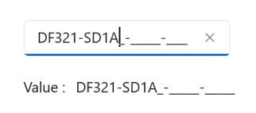

# Formatting value in WinUI Masked TextBox

The `Masked TextBox` control allows you to format input values with prompt and literal characters which are defined in the mask expression by setting the [ValueMaskFormat](https://help.syncfusion.com/cr/winui/Syncfusion.UI.Xaml.Editors.SfMaskedTextBox.html#Syncfusion_UI_Xaml_Editors_SfMaskedTextBox_ValueMaskFormat) property. By default, the [Value](https://help.syncfusion.com/cr/winui/Syncfusion.UI.Xaml.Editors.SfMaskedTextBox.html#Syncfusion_UI_Xaml_Editors_SfMaskedTextBox_Value) property of the control includes the characters typed by the user, as well as any prompt or literal characters in the input. The control provides several formatting options, which are listed below.

1. ExcludePromptAndLiterals
2. IncludePrompt
3. IncludeLiterals
4. IncludePromptAndLiterals

## Exclude prompts and literals

Set up the MaskedTextBox to exclude prompt and literal characters, preserving only the typed characters.




<syncfusion:SfMaskedTextBox Width="200"
                            MaskType="Simple"
                            Mask=">AAAAA-AAAAA-AAAAA-AAAAA"
                            Value="DF321SD1A"
                            ValueMaskFormat="ExcludePromptAndLiterals"/>




SfMaskedTextBox maskedTextBox = new SfMaskedTextBox();
maskedTextBox.Width = "200";
maskedTextBox.MaskType = MaskedTextBoxMaskType.Simple;
maskedTextBox.Mask = ">AAAAA-AAAAA-AAAAA-AAAAA";
maskedTextBox.Value = "DF321SD1A";
maskedTextBox.ValueMaskFormat = MaskedTextBoxMaskFormat.ExcludePromptAndLiterals;




## Include prompts

Set up the MaskedTextBox to preserve typed and prompt characters, excluding literals.




<syncfusion:SfMaskedTextBox Width="200"
                            MaskType="Simple"
                            Mask=">AAAAA-AAAAA-AAAAA-AAAAA"
                            Value="DF321SD1A"
                            ValueMaskFormat="IncludePrompt"/>




SfMaskedTextBox maskedTextBox = new SfMaskedTextBox();
maskedTextBox.Width = "200";
maskedTextBox.MaskType = MaskedTextBoxMaskType.Simple;
maskedTextBox.Mask = ">AAAAA-AAAAA-AAAAA-AAAAA";
maskedTextBox.Value = "DF321SD1A";
maskedTextBox.ValueMaskFormat = MaskedTextBoxMaskFormat.IncludePrompt;




## Include literals

Keep typed and literal characters in the input but exclude prompt characters.




<syncfusion:SfMaskedTextBox Width="200"
                            MaskType="Simple"
                            Mask=">AAAAA-AAAAA-AAAAA-AAAAA"
                            Value="DF321SD1A"
                            ValueMaskFormat="IncludeLiterals"/>




SfMaskedTextBox maskedTextBox = new SfMaskedTextBox();
maskedTextBox.Width = "200";
maskedTextBox.MaskType = MaskedTextBoxMaskType.Simple;
maskedTextBox.Mask = ">AAAAA-AAAAA-AAAAA-AAAAA";
maskedTextBox.Value = "DF321SD1A";
maskedTextBox.ValueMaskFormat = MaskedTextBoxMaskFormat.IncludeLiterals;




## Include prompts and literals

Maintain typed, prompt, and literal characters in the input.




<syncfusion:SfMaskedTextBox Width="200"
                            MaskType="Simple"
                            Mask=">AAAAA-AAAAA-AAAAA-AAAAA"
                            Value="DF321SD1A"
                            ValueMaskFormat="IncludePromptAndLiterals"/>




SfMaskedTextBox maskedTextBox = new SfMaskedTextBox();
maskedTextBox.Width = "200";
maskedTextBox.MaskType = MaskedTextBoxMaskType.Simple;
maskedTextBox.Mask = ">AAAAA-AAAAA-AAAAA-AAAAA";
maskedTextBox.Value = "DF321SD1A";
maskedTextBox.ValueMaskFormat = MaskedTextBoxMaskFormat.IncludePromptAndLiterals;




